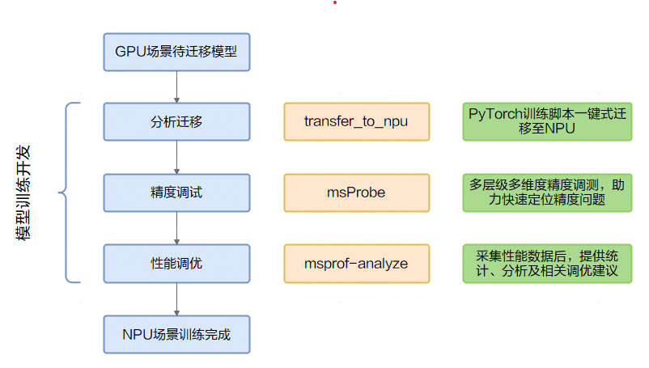

<h1 align="center">MindStudio Training Tools</h1>

<div align="center">
<h2>昇腾 AI 训练开发工具链</h2>

 [](https://www.hiascend.com/developer/software/mindstudio) 
 [](./LICENSE)

</div>

## ✨ 最新消息

[2026.3.28]：[mstt 仓库精度调试模块（debug 目录）日落下线通知](https://gitcode.com/Ascend/mstt/discussions/2)

[2026.2.25]：Tinker并行策略自动寻优系统正式开源，具体请参见[Tinker](https://gitcode.com/Ascend/mstt/tree/master/profiler/tinker)。

[2026.1.12]：[mstt 仓库License变更通知](https://gitcode.com/Ascend/mstt/discussions/1)

[2025.12.31]：MindStudio昇腾平台训练工具链全面开源，涉及如下代码仓。

- [MindStudio-Profiler](https://gitcode.com/Ascend/msprof)

  构建昇腾全场景性能调优基础能力，支持采集CANN和NPU性能数据，提升昇腾设备性能调优效率。

- [MindStudio-Profiler-Analyze](https://gitcode.com/Ascend/msprof-analyze)

  昇腾性能分析工具，基于采集的性能数据进行分析，提供昇腾设备性能瓶颈快速识别能力。

- [MindStudio-MemScope](https://gitcode.com/Ascend/msmemscope)

  针对昇腾显存调试调优场景的专用工具，提供整网级多维度显存数据采集、自动诊断、优化分析能力。

- [MindStudio-Probe](https://gitcode.com/Ascend/msprobe)

  模型开发精度调试环节使用的工具包，是针对昇腾提供的全场景精度工具链，帮助用户提高模型精度定位效率。

  如果安装的是8.x版本及之前的MindStudio-Probe，请参考[MindStudio-Probe-8.x](debug/accuracy_tools/msprobe/README.md)

- [MindStudio-Monitor](https://gitcode.com/Ascend/msmonitor)

  一站式在线监控工具，支持落盘和在线性能数据采集，提供集群场景性能监测及定位能力。

- [MindStudio-Profilier-Tools-Interface](https://gitcode.com/Ascend/mspti)

  MindStudio针对Ascend设备提出的一套Profiling API，用户可以通过msPTI构建针对NPU应用程序的工具，用于分析应用程序的性能。
  
- [MindStudio-Insight](https://gitcode.com/Ascend/msinsight)

  MindStudio Insight可视化工具，支持系统级、算子级、服务化等多场景多维度性能分析，深度剖析性能数据，帮助开发者完成性能诊断。

## ℹ️ 简介

MindStudio Training Tools（MindStudio训练工具链，msTT）聚焦您在模型迁移、模型开发中遇到的痛点问题，提供全流程的工具链，通过提供分析迁移工具、精度调试工具、性能调优工具三大主力工具包，帮助您解决开发过程中迁移困难、Loss跑飞、性能不达标或劣化等问题，让您轻松解决精度和性能问题，开启乐趣十足的极简开发之旅。

**模型训练开发全流程**



## 🔍 目录结构

关键目录如下。

```txt
├── docs              // 文档目录
├── msfmktransplt     // MindStudio分析迁移工具源码目录
├── scripts           // 存放安装卸载升级脚本
├── msinsight         // MindStudio可视化调优工具源码目录
├── msmemscope        // MindStudio内存检测工具源码目录
├── msmoniter         // MindStudio一站式在线监控工具源码目录
├── msprobe           // MindStudio精度调试工具源码目录
├── msprof            // MindStudio模型调优工具源码目录
├── msprof-analyze    // MindStudio性能分析工具源码目录
├── mspti             // MindStudio Profiling Tools Interface工具源码目录
└── README.md         // 整体仓代码说明
```

## ⚙️ 功能介绍

### 分析迁移工具

[MindStudio Analysis and Migration Tool（MindStudio分析迁移工具，msfmktransplt）](./msfmktransplt/docs/zh/msfmktransplt_instruct.md)

PyTorch训练脚本一键式迁移至昇腾NPU的功能，开发者可做到少量代码修改或零代码完成迁移。

### 精度调试工具

- [MindStudio Probe（MindStudio精度调试工具，msProbe）](https://gitcode.com/Ascend/msprobe)

  模型开发精度调试环节使用的工具包，是针对昇腾提供的全场景精度工具链，帮助用户提高模型精度定位效率。

  如果安装的是8.x版本及之前的MindStudio-Probe，请参考[MindStudio-Probe-8.x](debug/accuracy_tools/msprobe/README.md)

- [Tensorboard](https://gitcode.com/Ascend/msprobe/tree/master/plugins/tb_graph_ascend)

  Tensorboard支持模型结构进行分级可视化展示的插件tb-graph-ascend

  可将模型的层级关系、精度数据进行可视化，并支持将调试模型和标杆模型进行分视图展示和关联比对，方便用户快速定位精度问题。

  **注：MindStudio昇腾平台训练工具链现已全面开源，模型分级可视化插件已经并入MindStudio Probe仓库，此仓库相关内容后续不再维护演进，建议使用最新版本，请参考**[tb_graph_ascend](https://gitcode.com/Ascend/msprobe/blob/master/docs/zh/accuracy_compare/pytorch_visualization_instruct.md)；如果安装的是8.x版本及之前的MindStudio-Probe，请参考[tb_graph_ascend-8.x](plugins/tensorboard-plugins/tb_graph_ascend)。

### 性能调优工具

- [MindStudio Profiler（MindStudio模型调优工具，msProf）](https://gitcode.com/Ascend/msprof)

  构建昇腾全场景性能调优基础能力，支持采集CANN和NPU性能数据，提升昇腾设备性能调优效率。

- [MindStudio Profiler Analyze（MindStudio性能分析工具，msprof-analyze）](https://gitcode.com/Ascend/msprof-analyze)

  昇腾性能分析工具，基于采集的性能数据进行分析，提供昇腾设备性能瓶颈快速识别能力。

- [msMemScope（MindStudio内存检测工具）](https://gitcode.com/Ascend/msmemscope)

  针对昇腾显存调试调优场景的专用工具，提供整网级多维度显存数据采集、自动诊断、优化分析能力。

- [MindStudio Monitor（MindStudio一站式在线监控工具，msMonitor）](https://gitcode.com/Ascend/msmonitor)

  一站式在线监控工具，支持落盘和在线性能数据采集，提供集群场景性能监测及定位能力。
  
- [MindStudio Profiling Tools Interface（msPTI）](https://gitcode.com/Ascend/mspti)

  MindStudio针对Ascend设备提出的一套Profiling API，用户可以通过msPTI构建针对NPU应用程序的工具，用于分析应用程序的性能。
  
- [MindStudio Insight（MindStudio可视化调优工具，msInsight）](https://gitcode.com/Ascend/msinsight)

  MindStudio Insight可视化工具，支持系统级、算子级、服务化等多场景多维度性能分析，深度剖析性能数据，帮助开发者完成性能诊断。
  
- [bind_core](https://gitcode.com/Ascend/mstt/tree/master/profiler/affinity_cpu_bind)

  绑核脚本，支持非侵入修改工程代码，实现一键式绑核功能。
- [Tinker](https://gitcode.com/Ascend/mstt/tree/master/profiler/tinker)

  Tinker大模型并行策略自动寻优系统，根据提供的训练脚本，进行单节点NPU性能测量，推荐高性能并行策略训练脚本。

## 🚀 快速入门

msTT工具快速入门当前提供在PyTorch和MindSpore训练场景中，通过一个可执行样例，串联使用分析迁移、精度调试和性能调优流程对应的工具，帮助用户快速上手。

具体参见《[PyTorch场景msTT工具快速入门](docs/zh/pytorch_mstt_quick_start.md)》和《[MindSpore场景msTT工具快速入门](docs/zh/mindspore_mstt_quick_start.md)》。

## 📘 使用指南

各工具的详细使用说明请参阅其源码仓库中的 README 文件。

## ⚖️ 相关说明

* [《版本说明》](./docs/zh/release_notes.md)
* [《贡献声明》](./docs/zh/contributing/contributing_statement.md)
* [《License声明》](./docs/zh/legal/license_notice.md) 
* [《安全声明》](./docs/zh/security_statement.md) 
* [《免责声明》](./docs/zh/legal/disclaimer.md)

## 🤝 建议与交流

欢迎大家为社区做贡献。如果有任何疑问或建议，请提交[Issues](https://gitcode.com/Ascend/mstt/issues)，我们会尽快回复。感谢您的支持。

- 联系我们

<div style="display: flex; align-items: center; gap: 10px;">
    <span>MindStuido公众号：</span>
    
    <span style="margin-left: 20px;">昇腾小助手：</span>
    <a href="https://gitcode.com/Ascend/mstt/blob/master/docs/zh/figures/readme/xiaozhushou.png">
        
    </a>
    <span style="margin-left: 20px;">昇腾论坛：</span>
    <a href="https://www.hiascend.com/forum/" rel="nofollow">
        
    </a>
</div>

在公众号中私信【交流群】，可以获取技术交流群二维码。

## 🙏 致谢

msTT由华为公司的下列部门联合贡献：

- 昇腾计算MindStudio开发部
- 分布式并行计算实验室
- 华为云昇腾云服务
- 昇腾计算生态使能部
- 2012网络实验室

感谢来自社区的每一个PR，欢迎贡献msTT！
