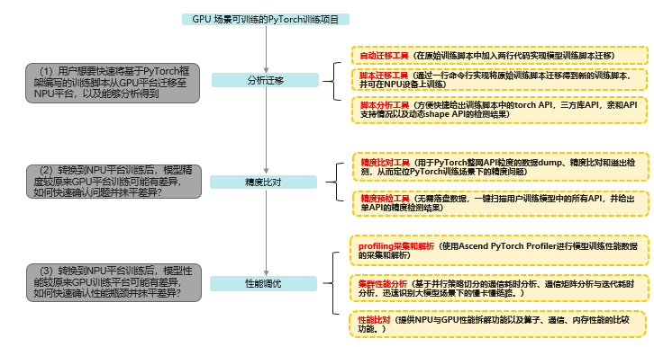

# 变更通知

原Ascend Training Tools工具更名为MindStudio Training Tools，MindStudio训练工具链。变更计划如下：

1. 2024.06.25本代码仓名称变更为mstt。
2. 2024.07.04 URL变更为[https://gitee.com/ascend/mstt](https://gitee.com/ascend/mstt)，原始URL仍然可用，但建议使用新URL。

# MindStudio Training Tools

MindStudio Training Tools，MindStudio训练工具链。针对训练&大模型场景，提供端到端命令行&可视化调试调优工具，帮助用户快速提高模型开发效率。

## 模型训练迁移全流程

## 使用说明

### [分析迁移工具](https://gitee.com/ascend/mstt/wikis/工具介绍/分析迁移工具/分析迁移工具介绍)

1. [脚本分析工具](https://gitee.com/ascend/mstt/wikis/%E5%B7%A5%E5%85%B7%E4%BB%8B%E7%BB%8D/%E5%88%86%E6%9E%90%E8%BF%81%E7%A7%BB%E5%B7%A5%E5%85%B7/%E5%88%86%E6%9E%90%E5%B7%A5%E5%85%B7%E4%BD%BF%E7%94%A8%E6%8C%87%E5%AF%BC)

   脚本分析工具提供分析脚本，帮助用户在执行迁移操作前，分析基于GPU平台的PyTorch训练脚本中算子、三方库套件、亲和API分析以及动态shape的支持情况。

2. [（推荐）自动迁移工具](https://gitee.com/ascend/mstt/wikis/%E5%B7%A5%E5%85%B7%E4%BB%8B%E7%BB%8D/%E5%88%86%E6%9E%90%E8%BF%81%E7%A7%BB%E5%B7%A5%E5%85%B7/%E8%87%AA%E5%8A%A8%E8%BF%81%E7%A7%BB%E5%B7%A5%E5%85%B7%E4%BD%BF%E7%94%A8%E6%8C%87%E5%AF%BC)

   自动迁移只需在训练脚本中导入库代码即可完成模型脚本迁移，使用方式较简单，且修改内容最少。

3. [脚本迁移工具](https://gitee.com/ascend/mstt/wikis/%E5%B7%A5%E5%85%B7%E4%BB%8B%E7%BB%8D/%E5%88%86%E6%9E%90%E8%BF%81%E7%A7%BB%E5%B7%A5%E5%85%B7/%E8%84%9A%E6%9C%AC%E8%BF%81%E7%A7%BB%E5%B7%A5%E5%85%B7%E4%BD%BF%E7%94%A8%E6%8C%87%E5%AF%BC)

   脚本迁移工具提供后端命令行用于将GPU上训练的PyTorch脚本迁移至NPU上，得到新的训练脚本用于训练。

4. [训推一体权重转换工具](https://gitee.com/Ascend/mstt/wikis/%E5%B7%A5%E5%85%B7%E4%BB%8B%E7%BB%8D/%E5%88%86%E6%9E%90%E8%BF%81%E7%A7%BB%E5%B7%A5%E5%85%B7/%E8%AE%AD%E6%8E%A8%E4%B8%80%E4%BD%93%E6%9D%83%E9%87%8D%E8%BD%AC%E6%8D%A2%E5%B7%A5%E5%85%B7%E4%BD%BF%E7%94%A8%E6%8C%87%E5%AF%BC)

    训推一体权重转换工具，支持在GPU和NPU上训练好的模型转成加速推理支持的格式。

### [精度工具](https://gitee.com/ascend/mstt/tree/master/debug/accuracy_tools)

1. [MindStudio Probe（ MindStudio精度调试工具）](https://gitee.com/ascend/mstt/tree/master/debug/accuracy_tools/msprobe)。

   MindStudio Training Tools工具链下精度调试部分的工具包，主要包括精度预检和精度比对等子工具。

2. [api_accuracy_checker（Ascend模型精度预检工具）](https://gitee.com/ascend/mstt/tree/master/debug/accuracy_tools/api_accuracy_checker)

   2024.09.30下线

   在昇腾NPU上扫描用户训练模型中所有API，进行API复现，给出精度情况的诊断和分析。

3. [ptdbg_ascend（PyTorch精度工具）](https://gitee.com/ascend/mstt/tree/master/debug/accuracy_tools/ptdbg_ascend)

   2024.09.30下线

   进行PyTorch整网API粒度的数据dump、精度比对和溢出检测，从而定位PyTorch训练场景下的精度问题。

### [性能工具](https://gitee.com/ascend/mstt/tree/master/profiler)

1. [compare_tools（性能比对工具）](https://gitee.com/ascend/mstt/tree/master/profiler/compare_tools)

   提供NPU与GPU性能拆解功能以及算子、通信、内存性能的比对功能。

2. [cluster_analyse（集群分析工具）](https://gitee.com/ascend/mstt/tree/master/profiler/cluster_analyse)

   提供多机多卡的集群分析能力（基于通信域的通信分析和迭代耗时分析）, 当前需要配合MindStudio Insight的集群分析功能使用。

3. [affinity_cpu_bind (亲和性cpu绑核工具) ](https://gitee.com/ascend/mstt/tree/master/profiler/affinity_cpu_bind)

   提供亲和性CPU绑核能力，改善host_bound调度问题。

### [Tensorboard](https://gitee.com/ascend/mstt/tree/master/plugins/tensorboard-plugins/tb_plugin)

Tensorboard支持NPU性能数据可视化插件PyTorch Profiler TensorBoard NPU Plugin。

支持将Ascend平台采集、解析的Pytorch Profiling数据可视化呈现，也兼容GPU数据采集、解析可视化。

## 分支维护策略

MindStudio Training Tools工具版本分支的维护阶段如下：

| **状态**            | **时间** | **说明**                                         |
| ------------------- | -------- | ------------------------------------------------ |
| 计划                | 1—3 个月 | 计划特性                                         |
| 开发                | 3个月    | 开发特性                                         |
| 维护                | 6—12个月 | 合入所有已解决的问题并发布版本                   |
| 无维护              | 0—3 个月 | 合入所有已解决的问题，无专职维护人员，无版本发布 |
| 生命周期终止（EOL） | N/A      | 分支不再接受任何修改                             |

## 现有分支的维护状态

MindStudio Training Tools分支版本号命名规则如下：

mstt仓每年发布4个版本，每个版本都将对应一个分支；以v6.0为例，其将对应v6.0.RC1、v6.0.RC2、v6.0.RC3以及v6.0.0四个版本，在仓库中将存在与之对应的分支。

| **分支**      | **状态** | **发布日期** | **后续状态**               | **EOL日期** |
| ------------- | -------- | ------------ | ------------------------ | ----------- |
| **v6.0.0** | 维护     | 2023/12/12   | 预计2024/12/12起无维护    |             |

##  参与贡献

1. Fork 本仓库
2. 新建 xxx 分支
3. 提交代码
4. 新建 Pull Request

##  版本过渡提示

当前版本预检和ptdbg维护到2024/09/30，准备于2024/09/30下线，相关目录mstt/debug/accuracy_tools/api_accuracy_checker和mstt/debug/accuracy_tools/ptdbg_ascend将于2024/09/30删除。新版本的预检和ptdbg已经合到mstt/debug/accuracy_tools/atat目录下。
