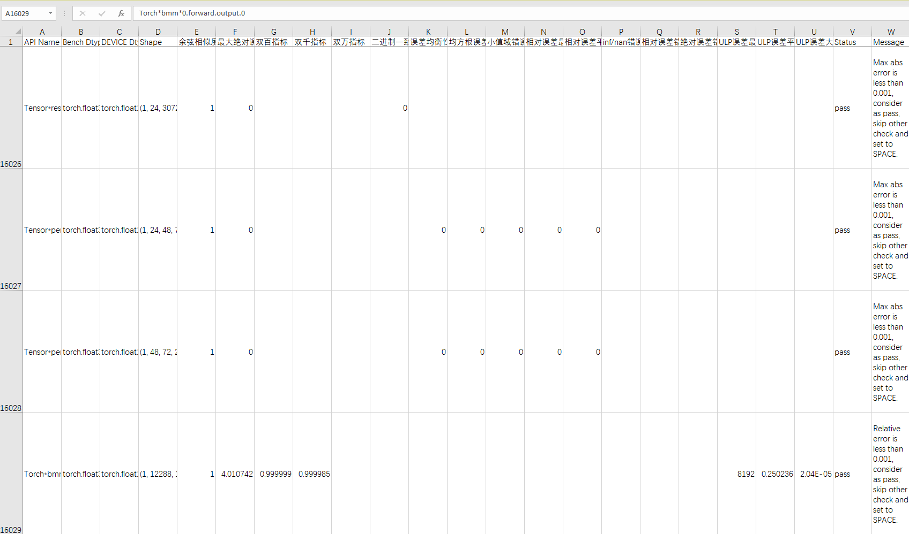
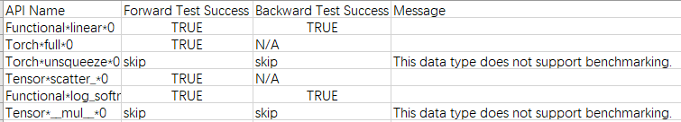
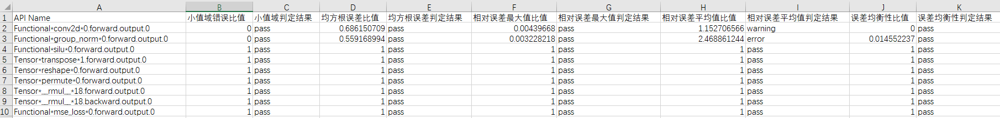

# Ascend模型精度预检工具

Ascend模型精度预检工具能在昇腾NPU上扫描用户训练模型中所有API，输出精度情况的诊断和分析。工具会提取模型中所有的API前反向信息，构造相应的API单元测试，将NPU输出与标杆（CPU高精度）比对，从而检测出精度有问题的API；另外工具还可以通过标杆比对法，获取NPU与GPU之间的精度差。

**标杆比对法**：真实数据模式下，将NPU vs CPU高精度（标杆）的预检比对结果和GPU vs CPU高精度（标杆）的预检比对结果进行比对汇总，最终给出判定结果的精度预检方法。当前仅支持torch.float16、torch.bfloat16、torch.float32数据类型的API进行比对。

**真实数据模式**：精度预检工具支持随机生成模式和真实数据模式，即在预检dump时可以选择由工具构造随机数进行输入获得dump数据或选择获取真实输入数据进行预检dump操作；随机生成模式执行效率高，可以快速获得结果，但数据精度低，只能大致判断精度问题；真实数据模式执行效率略低于随机生成模式，但是数据精度高，可以准确判断精度问题。

工具支持PyTorch版本：1.8.1/1.11.0/2.0/2.1。

## 工具特性

1. 落盘数据小。
2. 不依赖标杆侧GPU训练资源，本地即可完成预检（标杆比对法除外）。
3. 支持随机生成模式和真实数据模式。
4. 单API测试，排除整网中的累计误差问题。

## 预检流程

精度预检可以分为：标准模式（直接进行NPU vs CPU高精度的预检比对操作）和标杆比对法（将NPU vs CPU高精度的预检比对结果和GPU vs CPU高精度的预检比对结果进行比对汇总），两种模式操作流程如下。

### 标准模式

1. 在NPU环境下安装预检工具。详见“**工具安装**”。
2. 在NPU环境下dump预检数据。详见“**预检数据dump**”。
3. NPU环境下执行run_ut。详见“**执行预检**”。
4. 查看“**预检结果**”。

### 标杆比对法

1. 在NPU和GPU环境下分别安装预检工具。详见“**工具安装**”。
2. 在NPU环境下dump预检数据（使用msCheckerConfig.update_config开启真实数据模式）。详见“**预检数据dump**”。
3. 将NPU环境下dump的预检数据拷贝至GPU环境。
4. 在NPU和GPU环境下分别执行run_ut。详见“**执行预检**”。
5. 将NPU和GPU执行run_ut生成的`accuracy_checking_details_{timestamp}.csv`结果文件拷贝至同一环境下。
6. 运行compare_benchmark,py。详见“**预检结果比对**”。

## 工具安装

1. 将att仓代码下载到本地，并配置环境变量。假设下载后att仓路径为 $ATT_HOME，环境变量应配置为：

   ```bash
   export PYTHONPATH=$PYTHONPATH:$ATT_HOME/debug/accuracy_tools/
   ```

2. 安装依赖tqdm、rich、pyyaml

   ```bash
   pip3 install tqdm rich pyyaml pandas
   ```

## 预检操作

### 预检数据dump

在训练脚本（如main.py）中加入以下代码导入工具dump模块，启动训练即可自动抓取网络所有API信息。

- 如果训练脚本是通过torch.utils.data.dataloader方式加载数据，就可以在训练脚本中加入以下代码导入工具dump模块，启动训练即可自动抓取网络所有API信息。

   ```python
   import api_accuracy_checker.dump
   ```

   工具默认抓取训练的**第二个迭代**并且在第二个迭代后会报错退出训练进程，可通过target_iter参数配置。

   **报错信息如下，这个报错仅用于停止训练，属于正常现象**：

   ```bash
   Exception: Model pretest: exit after iteration 1.
   ```

   若报错信息不一致，可能是由于服务器的其他错误信息覆盖导致，可以尝试查找报错信息中的Exception。

- 若训练脚本中的代码不是通过torch.utils.data.dataloader来加载数据或在部分流水并行、张量并行场景下，工具的开关无法在每张卡上自动打开，导致多卡训练dump结果只有一组json，那么需要在训练代码中添加打开工具开关的调用。

   首先，需要关闭torch.utils.data.dataloader加载数据，操作如下：
   
   ```bash
   cd att/debug/accuracy_tools/api_accuracy_checker
   vi config.yaml
   # 修改enable_dataloader参数值为False
   ```
   
   其次，在训练代码中添加数据dump操作如下：
   
   ```Python
   import api_accuracy_checker.dump as DP
   
   # 需要先修改enable_dataloader参数值为False
   # 关闭torch.utils.data.dataloader加载数据时，下列代码须在训练step代码内添加
   DP.dump.start()    # 开启工具dump模块
   
   ...
   
   DP.dump.stop()    # 控制dump结束
   DP.dump.step()    # 在DP.dump.stop()后加入DP.dump.step()即可指定需要dump的step
   ```
   
   上述代码要添加在迭代前向的代码段中，或者说是遍历数据集循环的代码段中。如对于GPT-3可以添加在pretrain_gpt.py 的forward_step函数中。之后工具会适配这个场景开关的自动打开。
   

dump信息默认会存盘到“./step1”路径下（相对于启动训练的路径），包括：

- forward_info_{pid}.json：前向API信息文件。
- backward_info_{pid}.json：反向API信息文件。
- stack_info_{pid}.json：调用栈信息文件。

forward_info与stack_info中的key值一一对应，用户可根据forward_info中API的key在stack_info中查询到其调用栈及代码行位置。

若有需要，用户可以通过msCheckerConfig.update_config来配置dump路径以及开启**真实数据模式**、指定dump某个step或配置API dump白名单，详见“**msCheckerConfig.update_config**”。

### 执行预检

1. 将API信息输入给run_ut模块运行精度检测并比对，运行如下命令： 

   大模型场景下，为提高预检效率，请使用multi_run_ut工具进行多线程预检，详见“**multi_run_ut多线程预检**”。

   ```bash
   cd $ATT_HOME/debug/accuracy_tools/api_accuracy_checker/run_ut
   python run_ut.py -forward ./forward_info_0.json -backward ./backward_info_0.json
   ```

   某些场景下（如推理），可以不指定backward_info_0.json，不影响预检功能。

   | 参数名称                         | 说明                                                         | 是否必选                           |
   | -------------------------------- | ------------------------------------------------------------ | ---------------------------------- |
   | -forward或--forward_input_file   | 指定前向API信息文件forward_info_{pid}.json。                 | 是                                 |
   | -backward或--backward_input_file | 指定反向API信息文件backward_info_{pid}.json。                | 否                                 |
   | -save_error_data                 | 保存精度未达标的API输入输出数据。                            | 否                                 |
   | -o或--out_path                   | 指指定run_ut执行结果存盘路径，默认“./”（相对于run_ut的路径）。 | 否                                 |
   | -j或--jit_compile                | 开启jit编译。                                                | 否                                 |
   | -d或--device                     | 指定Device ID，选择UT代码运行所在的卡，默认值为0。           | 否                                 |
   | -csv_path或--result_csv_path     | 指定本次运行中断时生成的`accuracy_checking_result_{timestamp}.csv`文件路径，执行run_ut中断时，若想从中断处继续执行，配置此参数即可。需要指定为上次中断的`accuracy_checking_result_{timestamp}.csv`文件。详见“**断点续检**”。 | run_ut操作中断后继续执行场景下必选 |
   | -real_data_path                  | 指定run_ut操作的真实数据路径。真实数据dump模式通过**msCheckerConfig.update_config**接口的real_data参数开启。指定绝对路径为forward_real_data和backward_real_data目录的父目录。 | dump的数据为真实数据下必选         |

   run_ut执行结果包括`accuracy_checking_result_{timestamp}.csv`和`accuracy_checking_details_{timestamp}.csv`两个文件。`accuracy_checking_result_{timestamp}.csv`是API粒度的，标明每个API是否通过测试。建议用户先查看`accuracy_checking_result_{timestamp}.csv`文件，对于其中没有通过测试的或者特定感兴趣的API，根据其API name字段在`accuracy_checking_details_{timestamp}.csv`中查询其各个输出的达标情况以及比较指标。详细介绍请参见“**预检结果**”。

2. （可选）如果需要保存比对不达标的输入和输出数据，可以在run_ut执行命令结尾添加-save_error_data，例如：

   ```bash
   python run_ut.py -forward ./forward_info_0.json -backward ./backward_info_0.json -save_error_data
   ```

   数据默认会存盘到'./ut_error_data{timestamp}'路径下（相对于启动run_ut的路径），有需要的话，用户可以通过修改att/debug/accuracy_tools/api_accuracy_checker目录下，config.yaml文件的error_data_path参数来配置保存路径。

3. （可选）如果dump的数据为真实数据，那么需要指定真实数据路径，例如：

   ```bash
   python run_ut.py -forward ./forward_info_0.json -backward ./backward_info_0.json -real_data_path /home/xxx/ut/real_data
   ```

### msCheckerConfig.update_config

**功能说明**

配置精度预检dump时的属性。

可选配置。

**函数原型**

```python
msCheckerConfig.update_config(dump_path="./", real_data=False, target_iter=[1], white_list=[])
```

**参数说明**

| 参数名称    | 说明                                                         | 是否必选 |
| ----------- | ------------------------------------------------------------ | -------- |
| dump_path   | 设置dump路径，须为已存在目录，默认为当前目录。               | 否       |
| real_data   | 真实数据模式，可取值True或False，默认为False，表示随机数据模式，配置为True后开启真实数据模式，dump信息增加forward_real_data和backward_real_data目录，目录下保存每个API输入的具体数值。 | 否       |
| target_iter | 指定dump某个step的数据，默认为[1]，须指定为训练脚本中存在的step。target_iter为list格式，可配置逐个step，例如：target_iter=[0,1,2]；也可以配置step范围，例如：target_iter=list(range(0,9))，表示dump第0到第8个step。 | 否       |
| white_list  | API dump白名单，指定dump具体API数据，也可以直接配置预检的API白名单，详细请参见“**API预检白名单**”。参数示例：white_list=["conv1d", "conv2d"]。默认未配置白名单，即dump全量API数据。 | 否       |

**函数示例**

- 示例1：配置dump路径以及开启真实数据模式

  ```python
  from api_accuracy_checker.dump import msCheckerConfig
  msCheckerConfig.update_config(dump_path="my/dump/path", real_data=True)
  ```

- 示例2：指定dump某个step

  ```python
  from api_accuracy_checker.dump import msCheckerConfig
  msCheckerConfig.update_config(target_iter=[0,1,2])
  ```

### API预检白名单

精度预检工具可以对指定API进行预检操作，可以使用如下方式：

- 方式一：

  修改att/debug/accuracy_tools/api_accuracy_checker目录下config.yaml文件的white_list参数，配置需要预检的API名称。

- 方式二：

  在dump时的训练脚本中直接添加白名单参数，只dump指定的API数据，示例代码如下：

  ```python
  from api_accuracy_checker.dump import msCheckerConfig
  msCheckerConfig.update_config(white_list=["conv1d", "conv2d"])
  ```

说明：

- 配置的API名称须存在于att\debug\accuracy_tools\api_accuracy_checker\hook_module目录下的support_wrap_ops.yaml文件下。
- 方式一和方式二都可以在dump时设置并控制dump对应的API，默认情况下没有配置白名单，dump所有API数据，若在dump操作时没有配置白名单，那么可以在执行run_ut模块前使用方式一配置白名单。

### multi_run_ut多线程预检

大模型场景下，为提高预检效率，请使用本进行多线程预检。

multi_run_ut为multi_run_ut.py脚本，可以并行执行多个run_ut操作，从而降低预检耗时。

命令示例如下：

```bash
cd $ATT_HOME/debug/accuracy_tools/api_accuracy_checker/run_ut
python multi_run_ut.py -forward ./forward_info_0.json -backward ./backward_info_0.json -n 32 -d 0 1 2 3
```

某些场景下（如推理），可以不指定backward_info_0.json，不影响预检功能。

| 参数名称                         | 说明                                                         | 是否必选                           |
| -------------------------------- | ------------------------------------------------------------ | ---------------------------------- |
| -forward或--forward_input_file   | 指定前向API信息文件forward_info_{pid}.json。                 | 是                                 |
| -backward或--backward_input_file | 指定反向API信息文件backward_info_{pid}.json。                | 否                                 |
| -save_error_data                 | 保存精度未达标的API输入输出数据。                            | 否                                 |
| -o或--out_path                   | 指定run_ut执行结果存盘路径，默认“./”（相对于run_ut的路径）。 | 否                                 |
| -j或--jit_compile                | 开启jit编译。                                                | 否                                 |
| -n                               | 同时执行run_ut线程的数量，默认为8，最大支持64，但每个Device最大支持8个线程，当指定多个线程和多个Device时，则线程数在每张卡上均分。 | 否                                 |
| -d或--device                     | 指定Device ID，选择UT代码运行所在的卡，默认值为0，支持同时指定0~7，共8个Device。 | 否                                 |
| -csv_path或--result_csv_path     | 指定本次运行中断时生成的`accuracy_checking_result_{timestamp}.csv`文件路径，执行run_ut中断时，若想从中断处继续执行，配置此参数即可。需要指定为上次中断的`accuracy_checking_result_{timestamp}.csv`文件。详见“**断点续检**”。 | run_ut操作中断后继续执行场景下必选 |
| -real_data_path                  | 指定run_ut操作的真实数据路径。真实数据dump模式通过**msCheckerConfig.update_config**接口的real_data参数开启。指定绝对路径为forward_real_data和backward_real_data目录的父目录。 | dump的数据为真实数据下必选         |

### 断点续检

精度预检run_ut过程中，若因环境、数据量过大等原因导致预检进程中断，那么当用户解决这些问题后，重新执行run_ut操作，可以通过断点续检操作继续前面未完成的预检，会在-csv_path指定的`accuracy_checking_result_{timestamp}.csv`文件以及对应的`accuracy_checking_details_{timestamp}.csv`文件中继续写入后续的结果，不会重新创建结果文件。

须指定为上次预检中断的`accuracy_checking_result_{timestamp}.csv`文件。请勿修改`accuracy_checking_result_{timestamp}.csv`和`accuracy_checking_details_{timestamp}.csv`文件名，包括时间戳，否则断点续检会因无法识别到文件名而失败。

断点续检操作通过如下命令执行：

```bash
python run_ut.py -forward ./forward_info_0.json -backward ./backward_info_0.json -csv_path /home/xxx/ut/accuracy_checking_result_{timestamp}.csv
```

## 预检结果

精度预检生成的`accuracy_checking_result_{timestamp}.csv`和`accuracy_checking_details_{timestamp}.csv`文件示例如下：

可以通过先查看`accuracy_checking_result_{timestamp}.csv`文件的Forward Test Success和Backward Test Success，判断是否存在未通过测试的API，再查看`accuracy_checking_details_{timestamp}.csv`文件的API详细达标情况，API达标情况介绍请参见“**API预检指标**”。

`accuracy_checking_result_{timestamp}.csv`


| 字段                  | 含义                                                         |
| --------------------- | ------------------------------------------------------------ |
| API name              | API名称。                                                    |
| Forward Test Success  | 前向API是否通过测试，TRUE为通过，FALSE为不通过。             |
| Backward Test Success | 反向API是否通过测试，TRUE为通过，FALSE为不通过，N/A表示该API没有反向。 |
| Message               | 提示信息。                                                   |

Forward Test Success和Backward Test Success是否通过测试是由`accuracy_checking_details_{timestamp}.csv`中的余弦相似度、最大绝对误差、双百双千双万指标判定结果决定的。

`accuracy_checking_details_{timestamp}.csv`



| 字段           | 含义                                                         |
| -------------- | ------------------------------------------------------------ |
| API name       | NPU或GPU下的API名称。                                        |
| Bench Dtype    | 标杆数据的API数据类型。                                      |
| Device Dtype   | NPU或GPU数据的API数据类型。                                  |
| Shape          | API的Shape信息。                                             |
| 余弦相似度     | NPU或GPU数据与标杆数据的余弦相似度。                         |
| 最大绝对误差   | NPU或GPU数据与标杆数据的最大绝对误差。                       |
| 双百指标       | 双百精度指标。是指NPU或GPU的Tensor中的元素逐个与对应的标杆数据对比，相对误差小于百分之一的比例占总元素个数的比例。测试通过标准为相对误差大于百分之一的比例占总元素个数的比例小于百分之一。 |
| 双千指标       | 双千精度指标。是指NPU或GPU的Tensor中的元素逐个与对应的标杆数据对比，相对误差小于千分之一的比例占总元素个数的比例。测试通过标准为相对误差大于千分之一的比例占总元素个数的比例小于千分之一。 |
| 双万指标       | 双万精度指标。是指NPU或GPU的Tensor中的元素逐个与对应的标杆数据对比，相对误差小于万分之一的比例占总元素个数的比例。测试通过标准为相对误差大于万分之一的比例占总元素个数的比例小于万分之一。 |
| 错误率         | NPU或GPU数据中每个Tensor精度不一致的数值的数量与Tensor中数值数量的比值。只有数据是builtin类型（bool、int、float、str）才会展示。 |
| 误差均衡性     | NPU或GPU数据与标杆数据精度差的的上下浮动情况。               |
| 均方根误差     | NPU或GPU数据与标杆数据的均方根误差。                         |
| 小值域错误占比 | NPU或GPU Tensor中与标杆的绝对误差大于错误阈值的小值在小值域（小值的总数量）中的占比。 |
| 相对误差最大值 | NPU或GPU数据与标杆数据相对误差的最大值。                     |
| 相对误差平均值 | NPU或GPU数据与标杆数据相对误差的平均值。                     |
| Status         | API预检通过状态，pass表示通过测试，error表示未通过，warning表示测试未通过双千或双万精度指标。 |
| message        | 提示信息。                                                   |

### API预检指标

API预检指标是通过对`accuracy_checking_details_{timestamp}.csv`中的余弦相似度、最大绝对误差双百、双千、双万精度指标的数值进行判断，得出该API是否符合精度标准的参考指标。

API预检通过测试，则在`accuracy_checking_details_{timestamp}.csv`文件中的“Status”列标记“pass”，否则标记“error”或“warning”，详细规则如下：

1. 余弦相似度 > 0.99：≤ 0.99为不达标，标记“error”，> 0.99达标，进行下一步；
2. 最大绝对误差 ＜ 0.001：＜ 0.001达标，标记“pass”，≥ 0.001为不达标，进行下一步；
3. 双百、双千、双万精度指标：
   - 对于float16和bfloat16数据：双百指标不通过，标记“error”；双百指标通过，双千指标不通过，标记“warning”；双百、双千指标均通过，标记“pass”。
   - 对于float32和float64数据：双千指标不通过，标记“error”；双千指标通过，双万指标不通过，标记“warning”；双千、双万指标均通过，标记“pass”。

4. 在`accuracy_checking_result_{timestamp}.csv`中以“Forward Test Success”和“Backward Test Success”字段统计该算子前向反向输出的测试结果，对于标记“pass”的算子，则在`accuracy_checking_result_{timestamp}.csv`中标记“TRUE”表示测试通过，对于标记“error”或“warning”的算子，则在`accuracy_checking_result_{timestamp}.csv`中标记“FALSE”表示测试不通过。由于一个算子可能有多个前向或反向的输入或输出，那么该类算子的输入或输出中必须全为“pass”，才能在`accuracy_checking_result_{timestamp}.csv`中标记“TRUE”，只要有一个输入或输出标记“error”或“warning”，那么在`accuracy_checking_result_{timestamp}.csv`中标记“FALSE”。

## 预检结果比对

该步骤仅标杆比对法需要执行，需要同时获取NPU和GPU环境下run_ut操作的预检结果`accuracy_checking_details_{timestamp}.csv`文件。执行如下命令进行NPU和GPU预检结果的比对：

```bash
cd $ATT_HOME/debug/accuracy_tools/api_accuracy_checker/compare
python benchmark_compare.py -npu /home/xxx/npu/accuracy_checking_details_{timestamp}.csv -gpu /home/xxx/gpu/accuracy_checking_details_{timestamp}.csv -o /home/xxx/
```

| 参数名称             | 说明                                                         | 是否必选 |
| -------------------- | ------------------------------------------------------------ | -------- |
| -npu或--npu_csv_path | NPU预检结果`accuracy_checking_details_{timestamp}.csv`文件路径。默认从当前目录下识别该文件。 | 否       |
| -gpu或--gpu_csv_path | GPU预检结果`accuracy_checking_details_{timestamp}.csv`文件路径。默认从当前目录下识别该文件。 | 否       |
| -o或--out_path       | 指定benchmark_compare.py执行结果存盘路径，默认为当前目录。   | 否       |

执行完成后输出`benchmark_compare_result_{timestamp}.csv`和`benchmark_compare_details_{timestamp}.csv`文件。文件示例如下：

可以通过先查看`benchmark_compare_result_{timestamp}.csv`文件的Forward Test Success和Backward Test Success，判断是否存在未通过测试的API，再查看`benchmark_compare_details_{timestamp}.csv`文件的API详细达标情况。

`benchmark_compare_result_{timestamp}.csv`



| 字段                  | 含义                                                         |
| --------------------- | ------------------------------------------------------------ |
| API name              | API名称。                                                    |
| Forward Test Success  | 前向API是否通过测试，TRUE为通过，FALSE为不通过，WARING表示该API中存在NPU的指标低于GPU1~2倍之间，但不超过2倍。 |
| Backward Test Success | 反向API是否通过测试，TRUE为通过，FALSE为不通过，WARING表示该API中存在NPU的指标低于GPU1~2倍之间，但不超过2倍，N/A表示该API没有反向。 |
| Message               | 提示信息。                                                   |

Forward Test Success和Backward Test Success是否通过测试是由`benchmark_compare_details_{timestamp}.csv`中的各个指标判定结果决定的。需要注意的是`benchmark_compare_details_{timestamp}.csv`中可能存在一个算子执行多次，那么每一次执行记录一行，而在`benchmark_compare_result_{timestamp}.csv`中的结果需要该算子的所有结果均为pass才能标记为TRUE，否则标记FALSE或WARING。

`benchmark_compare_details_{timestamp}.csv`



| 字段                   | 含义                                                         |
| ---------------------- | ------------------------------------------------------------ |
| API name               | NPU或GPU下的API名称。                                        |
| 小值域错误比值         | NPU与GPU的小值域错误比值。                                   |
| 小值域错误判定结果     | 小值域错误比值小于等于1标记为pass，1~2之间标记为waring，大于2标记为error。 |
| 均方根误差比值         | NPU与GPU的均方根误差比值。                                   |
| 均方根误差判定结果     | 均方根误差比值小于等于1标记为pass，1~2之间标记为waring，大于2标记为error。 |
| 相对误差最大值比值     | NPU与GPU的相对误差最大值比值。                               |
| 相对误差最大值判定结果 | 相对误差最大值比值小于等于1标记为pass，1~10之间标记为waring，大于10标记为error。 |
| 相对误差均值比值       | NPU与GPU的相对误差的平均值比值。                             |
| 相对误差均值判定结果   | 相对误差均值比值小于等于1标记为pass，1~2之间标记为waring，大于2标记为error。 |
| 误差均衡性比值         | NPU与GPU的误差均衡性比值。                                   |
| 误差均衡性判定结果     | 误差均衡性比值小于等于1标记为pass，1~2之间标记为waring，大于2标记为error。该字段暂不参与benchmark_compare_result的结果判定。 |

# 溢出解析工具

针对训练过程中的溢出检测场景（参见[ptdbg_ascend精度工具功能说明](https://gitee.com/ascend/att/tree/master/debug/accuracy_tools/ptdbg_ascend/doc)中的"溢出检测场景"进行溢出检测dump），对于输入正常但输出存在溢出的API，会在训练执行目录下将溢出的API信息按照前向和反向分类，dump并保存为`forward_info_{pid}.json`，前向过程溢出的API可通过该工具对`forward_info_{pid}.json`进行解析，输出溢出API为正常溢出还是非正常溢出，从而帮助用户快速判断。

工具支持PyTorch版本：1.8.1/1.11.0/2.0/2.1。

若溢出检测场景dump结果生成`forward_info_{pid}.json`文件，则使用本工具进行解析。操作步骤如下：

1. 安装预检工具

   将att仓代码下载到本地，并配置环境变量。假设下载后att仓路径为 $ATT_HOME，环境变量应配置为

   ```bash
   export PYTHONPATH=$PYTHONPATH:$ATT_HOME/debug/accuracy_tools/
   ```

   安装依赖tqdm、rich、pyyaml

   ```bash
   pip3 install tqdm rich pyyaml
   ```

2. 执行溢出API解析操作

   **forward_info_0.json为[ptdbg_ascend精度工具功能说明](https://gitee.com/ascend/att/tree/master/debug/accuracy_tools/ptdbg_ascend/doc)中的"溢出检测场景"执行溢出检测dump时生成，而不是精度预检工具生成。**

   ```bash
   cd $ATT_HOME/debug/accuracy_tools/api_accuracy_checker/run_ut
   python run_overflow_check.py -forward ./forward_info_0.json
   ```

   | 参数名称                       | 说明                                               | 是否必选 |
   | ------------------------------ | -------------------------------------------------- | -------- |
   | -forward或--forward_input_file | 指定前向API信息文件forward_info_{pid}.json。       | 是       |
   | -j或--jit_compile              | 开启jit编译。                                      | 否       |
   | -d或--device                   | 指定Device ID，选择UT代码运行所在的卡，默认值为0。 | 否       |

   反向过程溢出的API暂不支持该功能。


具体参数解释请参见“Ascend模型精度预检工具”。

# FAQ 

1. 预检工具在dump和run_ut的过程中，是否需要同时开启或关闭jit编译（jit_compile）？

   答：是。

2. 预检工具对于type_as这类涉及数据类型转换操作的API，是否具有参考性？

   由于这类API在CPU侧存在精度先提升后下降的操作，因此这类API的有效性的参考价值有限。

3. run ut过程中出现报错：ERROR:Got unsupported ScalarType BFloat16

   答：请使用最新版本的工具。

4. Dropout算子，CPU和NPU的随机应该不一样，为什么结果比对是一致的？

   答：这个结果是正常的，工具对该算子有特殊处理，只判定位置为0的位置比例大约和设定p值相当。

5. 为什么浮点型数据bench和CPU的dtype不一致？

   答：对于fp16的数据，CPU会上升一个精度fp32去计算，这是和算子那边对齐的精度结论，CPU用更高精度去计算会更接近真实值。

6. Tensor 魔法函数具体对应什么操作？

   答：

   | Tensor魔法函数  | 具体操作         |
   | --------------- | ---------------- |
   | `__add__`       | +                |
   | `__and__`       | &                |
   | `__bool__`      | 返回Tensor布尔值 |
   | `__div__`       | /                |
   | `__eq__`        | ==               |
   | `__ge__`        | >=               |
   | `__gt__`        | >                |
   | `__iadd__`      | +=               |
   | `__iand__`      | &=               |
   | `__idiv__`      | /=               |
   | `__ifloordiv__` | //=              |
   | `__ilshift__`   | <<=              |
   | `__imod__`      | %=               |
   | `__imul__`      | *=               |
   | `__ior__`       | \|=              |
   | `__irshift__`   | >>=              |
   | `__isub__`      | -=               |
   | `__ixor__`      | ^=               |
   | `__lshift__`    | <<               |
   | `__matmul__`    | 矩阵乘法         |
   | `__mod__`       | %                |
   | `__mul__`       | *                |
   | `__nonzero__`   | 同`__bool__`     |
   | `__or__`        | \|               |
   | `__radd__`      | +（反向）        |
   | `__rmul__`      | *（反向）        |
   | `__rshift__`    | >>               |
   | `__sub__`       | -                |
   | `__truediv__`   | 同`__div__`      |
   | `__xor__`       | ^                |

