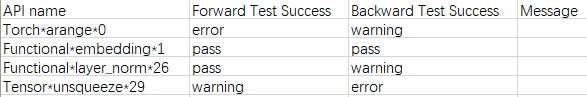
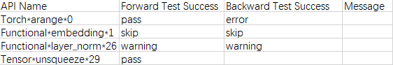
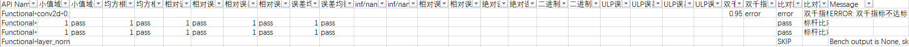

# **精度预检工具**

## 简介

精度预检工具通过扫描昇腾NPU上用户训练模型中所有API，输出精度情况的诊断和分析。工具通过dump模型中所有的API前反向信息；构造相应的API单元测试，将NPU输出与标杆（CPU高精度）比对，从而计算对应的精度指标，该过程称为run_ut；将NPU环境下dump的预检数据拷贝至GPU环境，同样执行run_ut；最后通过**新精度标准比对法**将NPU和GPU的预检结果进行比对，从而找出NPU中存在精度问题的API。

**新精度标准比对法**：依据新精度标准，对不同的API采取不同的比对算法进行比对（包括绝对阈值法，标杆比对法、二进制一致法、ULP误差比对法和双千指标法），最终给定预检判定结果。

**真实数据模式**：精度预检工具支持随机生成模式和真实数据模式，即在预检dump时可以选择由工具构造随机数进行输入获得dump数据或选择获取真实输入数据进行预检dump操作；随机生成模式执行效率高，可以快速获得结果，但数据精度低，只能大致判断精度问题；真实数据模式执行效率略低于随机生成模式，但是数据精度高，可以准确判断精度问题。

**工具支持PyTorch版本**：1.11.0/2.0/2.1/2.2。

**工具特性**

- 落盘数据小。
- 支持随机生成模式和真实数据模式。
- 单API测试，排除整网中的累计误差问题。

## 预检流程

精度预检操作流程如下：

1. 在NPU和GPU环境下分别安装msad工具。详见《[MindStudio精度调试工具](../../README.md)》的“工具安装”章节。
2. 在NPU训练脚本内添加msad工具dump接口PrecisionDebugger采集待预检数据。详见《[精度数据采集](./dump.md)》。
3. 将NPU环境下dump的预检数据拷贝至GPU环境。
4. 在NPU和GPU环境下分别执行run_ut，生成结果用于最终api_precision_compare操作的输入。详见“**run_ut预检操作**”。
5. 将NPU和GPU执行run_ut生成的`accuracy_checking_details_{timestamp}.csv`结果文件拷贝至同一环境下。
6. 运行api_precision_compare.py，输出结果为预检操作的最终结果。详见“**预检结果比对**”。

## 预检操作

### run_ut预检操作

完成待预检数据采集后，仅仅获取了API的输入数据，为了得到NPU vs CPU高精度（标杆）的预检比对结果和GPU vs CPU高精度（标杆）的预检比对结果，还需要进行run_ut操作。

run_ut预检操作包括如下场景：

- 使用run_ut.py执行预检：run_ut.py适用于数据量较小的单卡场景。
- 使用multi_run_ut.py执行多线程预检：multi_run_ut.py适用于数据量较大的大模型场景。

#### 使用run_ut.py执行预检

1. 将API信息输入给run_ut模块运行精度检测并比对，运行如下命令： 

   ```bash
   atat -f pytorch run_ut -api_info ./dump.json
   ```

   某些场景下（如推理），可以不指定backward_info_0.json，不影响预检功能。

   | 参数名称                     | 说明                                                         | 是否必选                           |
   | ---------------------------- | ------------------------------------------------------------ | ---------------------------------- |
   | -api_info或--api_info_file   | 指定API信息文件dump.json。                                   | 是                                 |
   | -save_error_data             | 保存精度未达标的API输入输出数据。                            | 否                                 |
   | -o或--out_path               | 指定run_ut执行结果存盘路径，默认“./”（相对于run_ut的路径）。 | 否                                 |
   | -j或--jit_compile            | 开启jit编译。                                                | 否                                 |
   | -d或--device                 | 指定Device ID，选择UT代码运行所在的卡，默认值为0。           | 否                                 |
   | -csv_path或--result_csv_path | 指定本次运行中断时生成的`accuracy_checking_result_{timestamp}.csv`文件路径，执行run_ut中断时，若想从中断处继续执行，配置此参数即可。需要指定为上次中断的`accuracy_checking_result_{timestamp}.csv`文件。详见“**断点续检**”。 | run_ut操作中断后继续执行场景下必选 |
   | -f或--filter_api             | 过滤模型中除最大值和最小值以外其他参数和结构相同的API。适用于模型较大且重复API较多的场景。 | 否                                 |
   
   run_ut执行结果包括`accuracy_checking_result_{timestamp}.csv`和`accuracy_checking_details_{timestamp}.csv`两个文件。`accuracy_checking_result_{timestamp}.csv`是API粒度的，标明每个API是否通过测试。建议用户先查看`accuracy_checking_result_{timestamp}.csv`文件，对于其中没有通过测试的或者特定感兴趣的API，根据其API name字段在`accuracy_checking_details_{timestamp}.csv`中查询其各个输出的达标情况以及比较指标。详细介绍请参见“**预检结果**”。
   
2. （可选）如果需要保存比对不达标的输入和输出数据，可以在run_ut执行命令结尾添加-save_error_data，例如：

   ```bash
   atat -f pytorch run_ut -api_info ./dump.json -save_error_data
   ```

   数据默认会存盘到'./ut_error_data{timestamp}'路径下（相对于启动run_ut的路径），有需要的话，用户可以通过修改att/debug/accuracy_tools/api_accuracy_checker目录下，config.yaml文件的error_data_path参数来配置保存路径，详见“config.yaml文件说明”。

#### 使用multi_run_ut.py执行多线程预检

multi_run_ut.py脚本，可以并行执行多个run_ut操作，从而降低预检耗时。

命令示例如下：

```bash
atat -f pytorch multi_run-ut -api_info ./dump.json -n 32 -d 0 1 2 3
```

某些场景下（如推理），可以不指定backward_info_0.json，不影响预检功能。

| 参数名称                     | 说明                                                         | 是否必选                           |
| ---------------------------- | ------------------------------------------------------------ | ---------------------------------- |
| -api_info或--api_info_file   | 指定API信息文件dump.json。                                   | 是                                 |
| -save_error_data             | 保存精度未达标的API输入输出数据。                            | 否                                 |
| -o或--out_path               | 指定run_ut执行结果存盘路径，默认“./”（相对于run_ut的路径）。 | 否                                 |
| -j或--jit_compile            | 开启jit编译。                                                | 否                                 |
| -n                           | 同时执行run_ut线程的数量，默认为8，最大支持64，但每个Device最大支持8个线程，当指定多个线程和多个Device时，则线程数在每张卡上均分。 | 否                                 |
| -d或--device                 | 指定Device ID，选择UT代码运行所在的卡，默认值为0，支持同时指定0~7，共8个Device。 | 否                                 |
| -csv_path或--result_csv_path | 指定本次运行中断时生成的`accuracy_checking_result_{timestamp}.csv`文件路径，执行run_ut中断时，若想从中断处继续执行，配置此参数即可。需要指定为上次中断的`accuracy_checking_result_{timestamp}.csv`文件。详见“**断点续检**”。 | run_ut操作中断后继续执行场景下必选 |
| -f或--filter_api             | 过滤模型中除最大值和最小值以外其他参数和结构相同的API。适用于模型较大且重复API较多的场景。 | 否                                 |

#### 断点续检

精度预检run_ut过程中，若因环境、数据量过大等原因导致预检进程中断，那么当用户解决这些问题后，重新执行run_ut操作，可以通过断点续检操作继续前面未完成的预检，会在-csv_path指定的`accuracy_checking_result_{timestamp}.csv`文件以及对应的`accuracy_checking_details_{timestamp}.csv`文件中继续写入后续的结果，不会重新创建结果文件。

须指定为上次预检中断的`accuracy_checking_result_{timestamp}.csv`文件。请勿修改`accuracy_checking_result_{timestamp}.csv`和`accuracy_checking_details_{timestamp}.csv`文件名，包括时间戳，否则断点续检会因无法识别到文件名而失败。

断点续检操作通过如下命令执行：

```bash
atat -f pytorch run_ut -api_info ./dump.json -csv_path /home/xxx/ut/accuracy_checking_result_{timestamp}.csv
```

#### API预检白名单

run_ut过程支持API预检白名单，操作方式如下：

修改att/debug/accuracy_tools/api_accuracy_checker目录下config.yaml文件的white_list参数，配置需要预检的API名称，详见“config.yaml文件说明”。

### config.yaml文件说明

config.yaml文件可以通过配置参数来控制dump和run_ut操作的真实数据模式以及白名单等功能。

文件路径为：att/debug/accuracy_tools/atat/pytorch/api_accuracy_checker/config.yaml 

| 参数名称          | 说明                                                         | 是否必选 |
| ----------------- | ------------------------------------------------------------ | -------- |
| dump_path         | 设置dump路径，默认为当前目录。若指定目录不存在，则自动创建。 | 否       |
| real_data         | 真实数据模式，可取值True或False，默认为False，表示随机数据模式，配置为True后开启真实数据模式，dump信息增加forward_real_data和backward_real_data目录，目录下保存每个API输入的具体数值。 | 否       |
| enable_dataloader | 自动dump数据开关，可取值True（开启）、False（关闭），默认关闭。 | 否       |
| target_iter       | 指定dump某个step的数据，默认为[1]，须指定为训练脚本中存在的step。target_iter为list格式，可配置逐个step，例如：target_iter=[0,1,2]；也可以配置step范围，例如：target_iter=list(range(0,9))，表示dump第0到第8个step。 | 否       |
| white_list        | API dump白名单，指定dump具体API数据，也可以直接配置预检的API白名单，详细请参见“**API预检白名单**”。参数示例：white_list=["conv1d", "conv2d"]。默认未配置白名单，即dump全量API数据。 | 否       |
| error_data_path   | 配置保存精度未达标的API输入输出数据路径。                    | 否       |
| jit_compile       | 开启jit编译。                                                | 否       |
| precision         | 浮点数表示位数，默认取小数点后14位。                         | 否       |

## 预检结果

精度预检生成的`accuracy_checking_result_{timestamp}.csv`和`accuracy_checking_details_{timestamp}.csv`文件示例如下：

可以通过先查看`accuracy_checking_result_{timestamp}.csv`文件的Forward Test Success和Backward Test Success，判断是否存在未通过测试的API，再查看`accuracy_checking_details_{timestamp}.csv`文件的API详细达标情况，API达标情况介绍请参见“**API预检指标**”。

`accuracy_checking_result_{timestamp}.csv`



| 字段                  | 含义                                                         |
| --------------------- | ------------------------------------------------------------ |
| API name              | API名称。                                                    |
| Forward Test Success  | 前向API是否通过测试，pass为通过，warning为待观察，error为错误。 |
| Backward Test Success | 反向API是否通过测试，pass为通过，warning为待观察，error为错误，如果是空白的话代表该API没有反向输出。 |
| Message               | 提示信息。                                                   |

该结果为中间结果，仅作为参考，建议完成“**预检结果比对**”后查看比对结果。该结果后续将会删除。

Forward Test Success和Backward Test Success是否通过测试是由`accuracy_checking_details_{timestamp}.csv`中的余弦相似度、最大绝对误差、双百双千双万指标判定结果决定的。

需要注意的是`accuracy_checking_details_{timestamp}.csv`中可能存在一个API的前向（反向）有多个输出，那么每个输出记录一行，而在`accuracy_checking_result_{timestamp}.csv`中的结果需要该API的所有结果均为pass才能标记为pass，只要存在一个error则标记error，仅存在waring和pass且不存在error标记waring。

`accuracy_checking_details_{timestamp}.csv`


| 字段                | 含义                                                         |
| ------------------- | ------------------------------------------------------------ |
| API name            | NPU或GPU下的API名称。                                        |
| Bench Dtype         | 标杆数据的API数据类型。                                      |
| DEVICE Dtype        | NPU或GPU数据的API数据类型。                                  |
| Shape               | API的Shape信息。                                             |
| 余弦相似度          | NPU或GPU数据与标杆数据的余弦相似度。                         |
| 最大绝对误差        | NPU或GPU数据与标杆数据的最大绝对误差。                       |
| 双百指标            | 双百精度指标。是指NPU或GPU的Tensor中的元素逐个与对应的标杆数据对比，相对误差小于百分之一的个数占总元素个数的比例。测试通过标准为相对误差大于百分之一的个数占总元素个数的比例小于百分之一。 |
| 双千指标            | 双千精度指标。是指NPU或GPU的Tensor中的元素逐个与对应的标杆数据对比，相对误差小于千分之一的个数占总元素个数的比例。测试通过标准为相对误差大于千分之一的个数占总元素个数的比例小于千分之一。 |
| 双万指标            | 双万精度指标。是指NPU或GPU的Tensor中的元素逐个与对应的标杆数据对比，相对误差小于万分之一的个数占总元素个数的比例。测试通过标准为相对误差大于万分之一的个数占总元素个数的比例小于万分之一。 |
| 二进制一致错误率    | NPU或GPU数据中每个Tensor精度不一致的数值的数量与Tensor中数值数量的比值。只有数据是builtin类型（bool、int、float、str）、torch.bool和torch的int类型或者在新精度标准中使用二进制一致算法进行比对的API才会展示。 |
| 误差均衡性          | NPU或GPU数据与标杆数据精度差的上下浮动情况。                 |
| 均方根误差          | NPU或GPU数据与标杆数据的均方根误差。                         |
| 小值域错误占比      | NPU或GPU Tensor中与标杆的绝对误差大于错误阈值的小值在小值域（小值的总数量）中的占比。判断为小值以及绝对误差的错误阈值见“**小值域阈值**”。 |
| 相对误差最大值      | NPU或GPU数据与标杆数据相对误差的最大值。                     |
| 相对误差平均值      | NPU或GPU数据与标杆数据相对误差的平均值。                     |
| inf/nan错误率       | NPU与标杆inf/nan计算不一致的元素个数占总元素的个数比例。     |
| 相对误差错误率      | NPU与标杆的正常值计算相对误差，其大于错误阈值的元素个数占正常值元素个数的比例。 |
| 绝对误差错误率      | NPU与标杆的小值计算绝对误差，其大于错误阈值的元素个数占小值元素个数的比例。 |
| ULP误差最大值       | NPU或GPU数据与标杆数据ULP误差的最大值（取绝对值后）。        |
| ULP误差平均值       | NPU或GPU数据与标杆数据ULP误差的平均值（取绝对值后）。        |
| ULP误差大于阈值占比 | NPU或GPU数据与标杆数据的ULP误差（取绝对值后）大于阈值（当NPU或GPU数据类型为float16或bfloat16时，阈值为1；当NPU或GPU数据类型为float32时，阈值为32）的元素个数占总元素的个数比例。 |
| Status              | API预检通过状态，pass表示通过测试，error表示未通过，warning表示测试未通过双千或双万精度指标，SKIP表示该API的某个参数的反向不要计算梯度，所以没有任何计算过程，其他信息均为空。 |
| message             | 提示信息。                                                   |

### 小值域阈值

判定为小值的阈值为：

- torch.float32：e-6
- torch.float16：e-3
- torch.bfloat16：e-3

小值域的绝对误差阈值为：

- torch.float32：e-9
- torch.float16：e-5
- torch.bfloat16：e-5

### API预检指标

API预检指标是通过对`accuracy_checking_details_{timestamp}.csv`中的余弦相似度、最大绝对误差双百、双千、双万精度指标的数值进行判断，得出该API是否符合精度标准的参考指标。

API预检通过测试，则在`accuracy_checking_details_{timestamp}.csv`文件中的“Status”列标记“pass”，否则标记“error”或“warning”，详细规则如下：

1. 余弦相似度 > 0.99：≤ 0.99为不达标，标记“error”，> 0.99达标，进行下一步；
2. 最大绝对误差 ＜ 0.001：＜ 0.001达标，标记“pass”，≥ 0.001为不达标，进行下一步；
3. 双百、双千、双万精度指标：
   - 对于float16和bfloat16数据：双百指标不通过，标记“error”；双百指标通过，双千指标不通过，标记“warning”；双百、双千指标均通过，标记“pass”。
   - 对于float32和float64数据：双千指标不通过，标记“error”；双千指标通过，双万指标不通过，标记“warning”；双千、双万指标均通过，标记“pass”。

4. 在`accuracy_checking_result_{timestamp}.csv`中以“Forward Test Success”和“Backward Test Success”字段统计该算子前向反向输出的测试结果，对于标记“pass”的算子，则在`accuracy_checking_result_{timestamp}.csv`中标记“TRUE”表示测试通过，对于标记“error”或“warning”的算子，则在`accuracy_checking_result_{timestamp}.csv`中标记“FALSE”表示测试不通过。由于一个算子可能有多个前向或反向的输入或输出，那么该类算子的输入或输出中必须全为“pass”，才能在`accuracy_checking_result_{timestamp}.csv`中标记“TRUE”，只要有一个输入或输出标记“error”或“warning”，那么在`accuracy_checking_result_{timestamp}.csv`中标记“FALSE”。

## 预检结果比对

需要同时获取NPU和GPU环境下run_ut操作的预检结果`accuracy_checking_details_{timestamp}.csv`文件。执行如下命令进行NPU和GPU预检结果的比对：

```bash
atat -f pytorch api_precision_compare -npu /home/xxx/npu/accuracy_checking_details_{timestamp}.csv -gpu /home/xxx/gpu/accuracy_checking_details_{timestamp}.csv -o /home/xxx/
```

| 参数名称             | 说明                                                         | 是否必选 |
| -------------------- | ------------------------------------------------------------ | -------- |
| -npu或--npu_csv_path | NPU预检结果`accuracy_checking_details_{timestamp}.csv`文件路径。默认从当前目录下识别该文件。 | 否       |
| -gpu或--gpu_csv_path | GPU预检结果`accuracy_checking_details_{timestamp}.csv`文件路径。默认从当前目录下识别该文件。 | 否       |
| -o或--out_path       | 指定api_precision_compare.py执行结果存盘路径，默认为当前目录。 | 否       |

执行完成后输出`api_precision_compare_result_{timestamp}.csv`和`api_precision_compare_details_{timestamp}.csv`文件。文件示例如下：

可以通过先查看`api_precision_compare_result_{timestamp}.csv`文件的Forward Test Success和Backward Test Success，判断是否存在未通过测试的API，再查看`api_precision_compare_details_{timestamp}.csv`文件的API详细达标情况。

`api_precision_compare_result_{timestamp}.csv`



| 字段                  | 含义                                                         |
| --------------------- | ------------------------------------------------------------ |
| API name              | API名称。                                                    |
| Forward Test Success  | 前向API是否通过测试，pass为通过，warning为待观察，error为错误，skip表示该API的数据类型不支持使用新精度标准进行比对，如float64。 |
| Backward Test Success | 反向API是否通过测试，pass为通过，warning为待观察，error为错误，如果是空白的话代表该API没有反向输出，skip表示该API的数据类型不支持使用新精度标准进行比对，如float64。 |
| Message               | 提示信息。                                                   |

Forward Test Success和Backward Test Success是否通过测试是由`api_precision_compare_details_{timestamp}.csv`中的各个指标判定结果决定的。需要注意的是`api_precision_compare_details_{timestamp}.csv`中可能存在一个API的前向（反向）有多个输出，那么每个输出记录一行，而在`api_precision_compare_result_{timestamp}.csv`中的结果需要该API的所有结果均为pass才能标记为pass，只要存在一个error则标记error，仅存在warning和pass且不存在error标记warning。

`api_precision_compare_details_{timestamp}.csv`



| 字段                     | 含义                                                         |
| ------------------------ | ------------------------------------------------------------ |
| API name                 | NPU或GPU下的API名称。                                        |
| 小值域错误比值           | NPU与CPU的小值域的错误比率/GPU与CPU的小值域的错误比率。标杆比对法指标。 |
| 小值域错误判定结果       | 小值域错误比值小于等于1标记为pass，1~2之间标记为waring，大于2标记为error。 |
| 均方根误差比值           | NPU与CPU的均方根误差/GPU与CPU的均方根误差。标杆比对法指标。  |
| 均方根误差判定结果       | 均方根误差比值小于等于1标记为pass，1~2之间标记为waring，大于2标记为error。 |
| 相对误差最大值比值       | NPU与CPU的相对误差最大值/GPU与CPU的相对误差最大值。标杆比对法指标。 |
| 相对误差最大值判定结果   | 相对误差最大值比值小于等于1标记为pass，1~10之间标记为waring，大于10标记为error。 |
| 相对误差平均值比值       | NPU与CPU的相对误差的平均值/GPU与CPU的相对误差的平均值。标杆比对法指标。 |
| 相对误差平均值判定结果   | 相对误差平均值比值小于等于1标记为pass，1~2之间标记为waring，大于2标记为error。 |
| 误差均衡性比值           | NPU与CPU的误差均衡性/GPU与CPU的误差均衡性。标杆比对法指标。  |
| 误差均衡性判定结果       | 误差均衡性比值小于等于1标记为pass，1~2之间标记为waring，大于2标记为error。该字段暂不参与api_precision_compare_result的结果判定。 |
| inf/nan错误率            | NPU与标杆inf/nan计算不一致的元素个数占总元素的个数比例。绝对阈值法指标。 |
| inf/nan判定结果          | inf/nan错误率判定结果，等于0标记为pass，其余情况标记为error。 |
| 相对误差错误率           | NPU与标杆的正常值计算相对误差，其大于错误阈值的元素个数占正常值元素个数的比例。绝对阈值法指标。 |
| 相对误差判定结果         | 相对误差错误率判定结果，等于0标记为pass，其余情况标记为error。 |
| 绝对误差错误率           | NPU与标杆的小值计算绝对误差，其大于错误阈值的元素个数占小值元素个数的比例。绝对阈值法指标。 |
| 绝对误差判定结果         | 绝对误差错误率判定结果，等于0标记为pass，其余情况标记为error。 |
| 二进制一致错误率         | NPU或GPU数据中每个Tensor精度不一致的数值的数量与Tensor中数值数量的比值。只有数据是builtin类型（bool、int、float、str）、torch.bool和torch的int类型或者在新精度标准中使用二进制一致算法进行比对的API才会展示。二进制一致法指标。 |
| 二进制一致错误率判定结果 | 二进制一致错误率判定结果，等于0标记为pass，其余情况标记为error。 |
| ULP误差平均值            | NPU数据与标杆数据ULP误差的平均值（取绝对值后）。ULP误差比对法指标。 |
| ULP误差大于阈值占比      | NPU数据与标杆数据的ULP误差（取绝对值后）大于阈值（当NPU数据类型为float16或bfloat16时，阈值为1；当NPU数据类型为float32时，阈值为32）的元素个数占总元素的个数比例。ULP误差比对法指标。 |
| ULP误差大于阈值占比比值  | NPU与CPU的ULP误差大于阈值占比/GPU与CPU的ULP误差大于阈值占比。ULP误差比对法指标。 |
| ULP误差判定结果          | ULP误差判定结果。<br/>     当NPU或GPU数据类型是float16或bfloat16时，以下两条标准满足其一标记为pass，否则标记为error：<br>          NPU ULP误差大于阈值占比小于0.001；<br/>          NPU ULP误差大于阈值占比小于GPU ULP误差大于阈值占比。<br/>     当NPU或GPU数据类型是float32时，以下三条标准满足其一标记为pass，否则标记为error：<br/>          NPU ULP误差平均值小于64；<br/>          NPU ULP误差大于阈值占比小于0.05；<br/>          NPU ULP误差大于阈值占比小于GPU ULP误差大于阈值占比。 |
| 双千指标                 | 双千精度指标。是指NPU的Tensor中的元素逐个与对应的标杆数据对比，相对误差小于千分之一的个数占总元素个数的比例。测试通过标准为相对误差大于千分之一的个数占总元素个数的比例小于千分之一。仅conv1d和conv2d使用该指标。双千指标法指标。 |
| 双千指标判定结果         | 双千指标判定结果。双千指标大于0.999标记为pass，否则标记为error。 |
| 比对结果                 | 综合所有指标的最终结果。如果比对指标中有error，则标记为error；有warning，则标记为warning；否则标记为pass。 |
| 比对算法                 | API使用的比对算法，为标杆比对法、二进制一致法、绝对阈值法和ULP误差比对法中的一种。 |
| Message                  | 提示信息。当前提示该API比对结果为error或warning时对应不符合标准的指标。 |

# FAQ

[FAQ](./FAQ.md)
