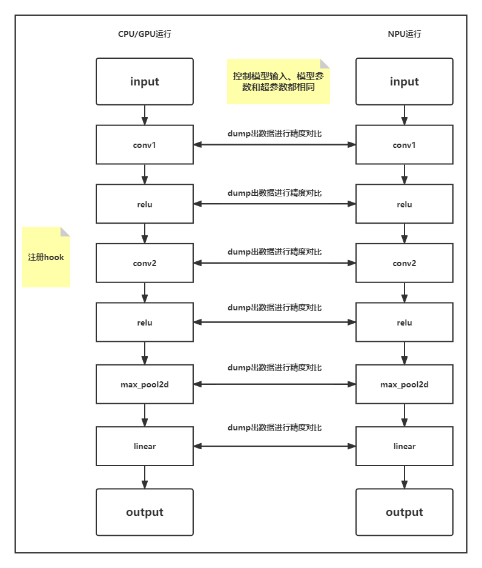

# **精度比对工具**

## 简介

在PyTorch训练网络，对同一模型或API调试过程中，遇到API相关的计算精度问题，定位时费时费力。

msad的精度比对工具，用来进行PyTorch整网API粒度的数据dump、精度比对和溢出检测，从而定位PyTorch训练场景下的精度问题。

**使用场景**

主要的使用场景包括：

- 同一模型，从CPU或GPU移植到NPU中存在精度下降问题，对比NPU芯片中的API计算数值与CPU或GPU芯片中的API计算数值，进行问题定位。
- 同一模型，进行迭代（模型、框架版本升级或设备硬件升级）时存在的精度下降问题，对比相同模型在迭代前后版本的API计算数值，进行问题定位。

## 原理介绍

精度对比工具，通过在PyTorch模型中注册hook，跟踪计算图中API的前向传播与反向传播时的输入与输出，排查存在计算精度误差，进行问题的精准定位。

**精度比对流程**

1. 当模型在CPU或GPU上进行正向和反向传播时，分别dump每一层的数值输入与输出。

2. 当模型在NPU中进行计算时，采用相同的方式dump下相应的数据。

3. 通过对比dump出的数值，计算余弦相似度和最大绝对误差的方式，定位和排查NPU API存在的计算精度问题。如下图所示。

   精度比对逻辑图

   

**API匹配条件**

进行精度比对时，需要判断CPU或GPU的API与NPU的API是否相同可比对，须满足以下匹配条件：

- 两个API的名称相同，API命名规则：`{api_type}.{api_name}.{api调用次数}.{正反向}.{输入输出}.index`，如：Functional.conv2d.1.backward.input.0。
- 两个API的输入输出Tensor数量和各个Tensor的Shape相同。

通常满足以上两个条件，工具就认为是同一个API，成功进行API的匹配，后续进行相应的计算精度比对。

## 精度比对总体流程

1. 准备CPU或GPU训练工程。

2. 在环境下安装atat工具。详见《[MindStudio精度调试工具](../../README.md)》的“工具安装”章节。

3. 在训练脚本内添加atat工具dump接口PrecisionDebugger采集标杆数据。详见《[精度数据采集](./dump.md)》。

4. 执行训练dump数据。

5. 将CPU或GPU训练工程迁移为NPU训练工程。详见《[PyTorch模型迁移调优指南](https://www.hiascend.com/document/detail/zh/Pytorch/60RC1/ptmoddevg/trainingmigrguide/PT_LMTMOG_0003.html)》。

6. 在NPU环境下安装atat工具。详见《[MindStudio精度调试工具](../../README.md)》的“工具安装”章节。

7. 在NPU训练脚本内添加atat工具dump接口PrecisionDebugger采集标杆数据。详见《[精度数据采集](./dump.md)》。

8. NPU环境下执行训练dump数据。

9. 执行精度比对。

   1. 创建并配置精度比对脚本，例如compare.py。

   2. 执行CPU或GPU dump与NPU dump数据的精度比对。

   3. 比对结果分析。

      详见《[CPU或GPU与NPU精度数据比对](./ptdbg_ascend_compare.md)》。

