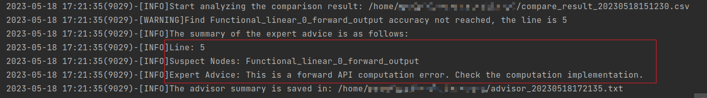

# **精度比对工具**

本文主要介绍atat的精度比对工具的快速入门和场景化示例。

本文介绍的操作需要安装atat工具，详见《[MindStudio精度调试工具](../README_msad.md)》的“工具安装”章节。

本文介绍的操作主要是精度数据dump和精度比对，详细操作指导可参考《[精度数据采集](./dump.md)》和《[CPU或GPU与NPU精度数据比对](./ptdbg_ascend.md)》。

## 快速入门

### 单卡场景精度比对

**精度分析建议**

PyTorch训练场景的精度问题分析建议参考以下思路进行精度比对和比对结果分析：

1. 整网比对：dump整网数据并进行精度比对，初步定位异常范围。

   对于模型数据庞大（比如达到T级别）的场景，不推荐直接dump整网比对，整网dump可能导致磁盘不足，需要预留足够的存储空间或者分多次dump。

2. 缩小范围：根据Accuracy Reached or Not找出不符合精度标准的API。

3. 范围比对：对不符合精度标准的API重新dump详细信息。

4. 分析原因并优化：分析API精度不符合标准的原因并进行优化调整。

5. 整网比对：重新进行整网比对，判断优化后的API是否已符合精度标准以及是否出现新的精度问题。

6. 重复1~5步，直到不存在精度问题为止。

**精度分析示例**

1. 修改dump配置文件config.json。

   ```json
   {
       "task": "tensor",
       "dump_path": "./npu_dump",
       "rank": [],
       "step": [],
       "level": "L1",
       "seed": 1234,
       "is_deterministic": false,
   
       "tensor": {
           "scope": [], 
           "list": [],
           "data_mode": ["all"],
           "summary_mode": "statistics"
       }
   }
   ```

2. 在训练脚本内添加atat工具，dump整网数据。

   分别dump CPU或GPU以及NPU数据，在PyTorch训练脚本插入dump接口，示例代码如下（下面以NPU为例，CPU或GPU dump基本相同）：

   ```python
   from atat.pytorch import PrecisionDebugger
   debugger = PrecisionDebugger(config_path="./config.json", dump_path="./npu_dump")
   # 请勿将以上初始化流程插入到循环代码中
   
   # 模型初始化
   # 下面代码也可以用PrecisionDebugger.start()和PrecisionDebugger.stop()
   debugger.start()
   
   # 需要dump的代码片段1
   
   debugger.stop()
   debugger.start()
   
   # 需要dump的代码片段2
   
   debugger.stop()
   debugger.step()
   ```

3. 比对整网数据。

   第1步中的NPU dump数据目录为npu_dump，假设GPU dump数据目录为gpu_dump；dump将生成dump.json、stack.json、construct.json文件以及dump数据目录。

   创建并配置精度比对脚本，以创建compare.py为例，示例代码如下：

   ```python
   from atat.pytorch import compare
   dump_result_param={
   "npu_json_path": "./npu_dump/dump.json",
   "bench_json_path": "./gpu_dump/dump.json",
   "stack_json_path": "./npu_dump/stack.json",
   "npu_dump_data_dir": "./npu_dump/dump",
   "npu_dump_data_dir": "./gpu_dump/dump",
   "is_print_compare_log": True
   }
   compare(dump_result_param, output_path="./output", stack_mode=True)
   ```

   执行比对：

   ```bash
   python3 compare.py
   ```

   在output目录下生成结果文件，包括：`compare_result_{timestamp}.csv`和`advisor_{timestamp}.txt`

4. 找出存在问题的API。

   1. 根据`advisor_{timestamp}.txt`或打屏信息的提示，可找到存在精度问题的算子（Suspect Nodes）和专家建议（Expert Advice)。

      

   2. 根据第2步结果文件`compare_result_{timestamp}.csv`中的Accuracy Reached or No字段显示为NO的API，针对该API执行后续比对操作，分析该API存在的精度问题。

5. （可选）重新比对。

   根据第3步的dump数据重新配置compare.py并执行比对，可以对单API模型进行问题复现。

**注意**：部分API存在调用嵌套关系，比如functional.batch_norm实际调用torch.batch_norm，该场景会影响kernel init初始化多次，导致功能异常。

### 溢出检测场景

溢出检测是针对NPU的PyTorch API，检测是否存在溢出的情况。当前仅支持识别aicore浮点溢出。

溢出检测原理：针对溢出阶段，开启acl dump模式，重新对溢出阶段执行，落盘数据。

建议按照如下步骤操作：

1. 修改dump配置文件config.json。

   ```json
   {
       "task": "overflow_check",
       "dump_path": "./npu_dump",
       "rank": [],
       "step": [],
       "level": "L1",
       "seed": 1234,
       "is_deterministic": false,
   
       "overflow_check": {
           "overflow_nums": 3
       }
   }
   ```
   
2. 在NPU训练脚本内添加atat工具，执行溢出检测dump。

   ```python
   from atat.pytorch import PrecisionDebugger
   debugger = PrecisionDebugger(config_path="./config.json", dump_path="./npu_dump")
   # 请勿将以上初始化流程插入到循环代码中
   
   # 模型初始化
   # 下面代码也可以用PrecisionDebugger.start()和PrecisionDebugger.stop()
   debugger.start()
   
   # 需要dump的代码片段1
   
   debugger.stop()
   debugger.start()
   
   # 需要dump的代码片段2
   
   debugger.stop()
   debugger.step()
   ```
   
   多卡使用时各卡单独计算溢出次数。
   
3. NPU环境下执行训练dump溢出数据。

   针对输入正常但输出存在溢出的API，会在训练执行目录下将溢出的API信息dump并保存为`dump.json`通过《[溢出解析工具](./run_overflow_check.md)对json文件进行解析，输出溢出API为正常溢出还是非正常溢出，从而帮助用户快速判断。

   溢出解析工具执行命令如下：

   ```bash
   atat -f pytorch run_overflow_check -api_info ./dump.json
   ```
   
   反向过程溢出的API暂不支持精度预检功能。
   

当重复执行溢出检测dump操作时，需要删除上一次dump目录下的溢出检测dump数据，否则将因重名而报错。

**注意事项**

* （暂不支持）level为L2场景下，会增加npu的内存消耗，请谨慎开启。
* （暂不支持）l部分API存在调用嵌套关系，比如functional.batch_norm实际调用torch.batch_norm，该场景会影响acl init初始化多次，导致level为L2功能异常。
* 混合精度动态loss scale场景下，正常训练会有"Gradient overflow. SKipping step"日志，添加溢出检测后日志消失，可以通过设置环境变量export OVERFLOW_DEBUG_MODE_ENABLE=1，并将register_hook位置调整amp.initialize之前解决。此功能需要cann包配套支持，不支持版本执行报错EZ3003。

## 场景化示例

### 多卡场景精度比对

精度工具支持多卡场景的精度比对，多卡场景的dump步骤与单卡场景完全一致，请参见“**单卡场景精度比对**”章节，不同的是多卡数据精度比对时需要使用“compare_distributed”函数进行比对。

如下示例：

说明：多机多卡场景需要每个节点单独执行比对操作。

假设NPU dump 数据目录为npu_dump，GPU dump数据目录为gpu_dump。

1. 创建比对脚本，例如compare_distributed.py，拷贝如下代码。

   ```python
   from atat.pytorch import compare
   compare_distributed('./npu_dump/step0', './gpu_dump/step0', './output')
   ```

   dump数据目录须指定到step级。

2. 执行比对：

   ```bash
   python3 compare_distributed.py
   ```

两次运行须用相同数量的卡，传入`compare_distributed`的两个文件夹下须有相同个数的rank文件夹，且不包含其他无关文件，否则将无法比对。

**多卡set_dump_path注意事项**

多卡一般为多进程，须保证每个进程都正确调用PrecisionDebugger，或把PrecisionDebugger插入到import语句后，如：

```python
from atat.pytorch import PrecisionDebugger
debugger = PrecisionDebugger(config_path="./config.json", dump_path="./npu_dump")
```

如此可保证set_dump_path在每个进程都被调用。

### NPU vs NPU精度比对

对于NPU vs NPU场景，是针对同一模型，进行迭代（模型、API版本升级或设备硬件升级）时存在的精度下降问题，对比相同模型在迭代前后版本的API计算数值，进行问题定位。

一般情况下迭代涉及NPU自定义算子，因此，可以仅dump NPU自定义算子进行比对。比对精度问题分析请参见“**单卡场景精度比对**”章节。

工具当前支持dump NPU自定义算子如下：

| 序号 | NPU自定义算子                                   |
| :--- | ----------------------------------------------- |
| 1    | torch_npu.one_                                  |
| 2    | torch_npu.npu_sort_v2                           |
| 3    | torch_npu.npu_transpose                         |
| 4    | torch_npu.npu_broadcast                         |
| 5    | torch_npu.npu_dtype_cast                        |
| 6    | torch_npu.empty_with_format                     |
| 7    | torch_npu.npu_one_hot                           |
| 8    | torch_npu.npu_stride_add                        |
| 9    | torch_npu.npu_ps_roi_pooling                    |
| 10   | torch_npu.npu_roi_align                         |
| 11   | torch_npu.npu_nms_v4                            |
| 12   | torch_npu.npu_iou                               |
| 13   | torch_npu.npu_nms_with_mask                     |
| 14   | torch_npu.npu_pad                               |
| 15   | torch_npu.npu_bounding_box_encode               |
| 16   | torch_npu.npu_bounding_box_decode               |
| 17   | torch_npu.npu_batch_nms                         |
| 18   | torch_npu.npu_slice                             |
| 19   | torch_npu._npu_dropout                          |
| 20   | torch_npu.npu_indexing                          |
| 21   | torch_npu.npu_ifmr                              |
| 22   | torch_npu.npu_max                               |
| 23   | torch_npu.npu_scatter                           |
| 24   | torch_npu.npu_layer_norm_eval                   |
| 25   | torch_npu.npu_alloc_float_status                |
| 26   | torch_npu.npu_confusion_transpose               |
| 27   | torch_npu.npu_bmmV2                             |
| 28   | torch_npu.fast_gelu                             |
| 29   | torch_npu.npu_sub_sample                        |
| 30   | torch_npu.npu_deformable_conv2d                 |
| 31   | torch_npu.npu_mish                              |
| 32   | torch_npu.npu_anchor_response_flags             |
| 33   | torch_npu.npu_yolo_boxes_encode                 |
| 34   | torch_npu.npu_grid_assign_positive              |
| 35   | torch_npu.npu_normalize_batch                   |
| 36   | torch_npu.npu_masked_fill_range                 |
| 37   | torch_npu.npu_linear                            |
| 38   | torch_npu.npu_bert_apply_adam                   |
| 39   | torch_npu.npu_giou                              |
| 40   | torch_npu.npu_ciou                              |
| 41   | torch_npu.npu_diou                              |
| 42   | torch_npu.npu_sign_bits_pack                    |
| 43   | torch_npu.npu_sign_bits_unpack                  |
| 44   | torch_npu.npu_flash_attention                   |
| 45   | torch_npu.npu_scaled_masked_softmax             |
| 46   | torch_npu.npu_rotary_mul                        |
| 47   | torch_npu.npu_roi_align                         |
| 48   | torch_npu.npu_roi_alignbk                       |
| 49   | torch_npu.npu_ptiou                             |
| 50   | torch_npu.npu_fusion_attention                  |
| 51   | torch_npu.npu_dropout_with_add_softmax          |
| 52   | torch_npu.npu_random_choice_with_mask           |
| 53   | torch_npu.npu_rotated_iou                       |
| 54   | torch_npu.npu_conv2d                            |
| 55   | torch_npu.npu_conv3d                            |
| 56   | torch_npu.npu_softmax_cross_entropy_with_logits |
| 57   | torch_npu.npu_all_gather_base_mm                |
| 58   | torch_npu.npu_swiglu                            |
| 59   | torch_npu.npu_rms_norm                          |
| 60   | torch_npu.npu_mm_reduce_scatter_base            |
| 61   | torch_npu.npu_mm_all_reduce_base                |
| 62   | torch_npu.npu_conv_transpose2d                  |
| 63   | torch_npu.npu_convolution                       |
| 64   | torch_npu.npu_convolution_transpose             |
| 65   | torch_npu.npu_min                               |
| 66   | torch_npu.npu_nms_rotated                       |
| 67   | torch_npu.npu_reshape                           |
| 68   | torch_npu.npu_rotated_box_decode                |
| 69   | torch_npu.npu_rotated_box_encode                |
| 70   | torch_npu.npu_rotated_overlaps                  |
| 71   | torch_npu.npu_silu                              |
| 72   | torch_npu.npu_fused_attention_score             |
| 73   | torch_npu.npu_multi_head_attention              |
| 74   | torch_npu.npu_gru                               |
| 75   | torch_npu.npu_incre_flash_attention             |
| 76   | torch_npu.npu_prompt_flash_attention            |
| 77   | torch_npu.npu_lstm                              |
| 78   | torch_npu.npu_apply_adam                        |

### 通信API的数据dump

通信类API数据可以使用全量dump方式获取，若只dump通信类API数据，可以使用如下示例：

1. 修改dump配置文件config.json。

   ```json
   {
       "task": "tensor",
       "dump_path": "./npu_dump",
       "rank": [],
       "step": [],
       "level": "L1",
       "seed": 1234,
       "is_deterministic": false,
   
       "tensor": {
           "scope": [], 
           "list": ["distributed"],
           "data_mode": ["all"],
           "summary_mode": "statistics"
       }
   }
   ```

2. 在训练脚本内添加atat工具，dump整网数据。

   ```python
   from atat.pytorch import PrecisionDebugger
   debugger = PrecisionDebugger(config_path="./config.json", dump_path="./npu_dump")
   # 请勿将以上初始化流程插入到循环代码中
   
   # 模型初始化
   # 下面代码也可以用PrecisionDebugger.start()和PrecisionDebugger.stop()
   debugger.start()
   
   # 需要dump的代码片段1
   
   debugger.stop()
   debugger.start()
   
   # 需要dump的代码片段2
   
   debugger.stop()
   debugger.step()
   ```

通信类API支持列表：

| 序号 | Distributed          |
| :--- | -------------------- |
| 1    | send                 |
| 2    | recv                 |
| 3    | broadcast            |
| 4    | all_reduce           |
| 5    | reduce               |
| 6    | all_gather           |
| 7    | gather               |
| 8    | isend                |
| 9    | irecv                |
| 10   | scatter              |
| 11   | reduce_scatter       |
| 12   | _reduce_scatter_base |
| 13   | _all_gather_base     |

