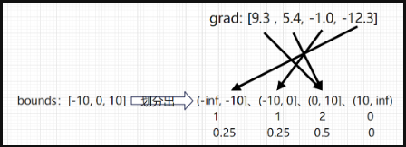
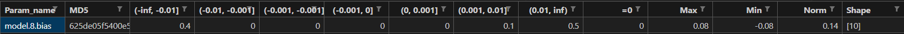
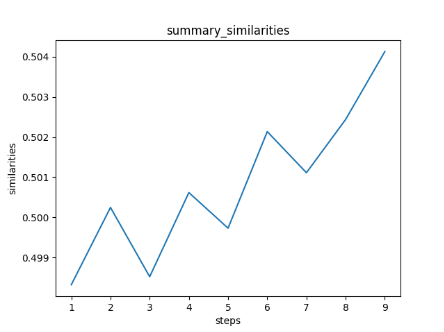
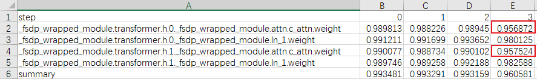
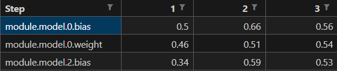

# Ascend模型梯度状态监测工具

梯度状态监测工具提供了两种能力：

- 将模型权重的梯度数据导出。这种功能可以将模型权重的梯度值以统计量的形式采集出来，用以分析问题。
- 将两份梯度数据进行相似度对比。在有标杆问题中，可以确认训练过程中精度问题出现的step，以及抓取反向过程中的问题。

工具支持PyTorch版本：2.0/2.1/2.2；支持MindSpore版本：r2.3。

## 工具特性

- 使用便捷，修改处少
- 梯度是一步训练过程中差异最大的地方，精度差异体现到梯度差异上比loss差异更明显

## 工具安装

1. 将mstt仓代码下载到本地，并配置环境变量。假设下载路径为$MSTT_HOME，环境变量应配置为：

   ```bash
   export PYTHONPATH=$PYTHONPATH:$MSTT_HOME/debug/accuracy_tools/
   ```

2. 使用pip命令安装matplotlib、mindspore、numpy、pandas、PyYAML、torch、tqdm依赖。

   若环境中已安装部分依赖，不需要重复安装。

## 使用方式

### 梯度数据导出

1. 创建配置文件config.yaml，样例如下：

   ```python
   level: L1
   param_list: 
   rank: [0, 1, 2, 3]
   step: [0, 1, 2, 3]
   bounds: 
   output_path: your_output_dir
   ```
   > step指的是优化器被调用的次数（并非模型跑的step，某些step，例如loss为nan时，不会调用优化器）

   **参数说明**

   | 参数                       | 说明                          | 输入类型                     | 是否必选 |
   |--------------------------------|-----------------------------------|-----------------|----------|
   | level                  | 输出级别。决定导出数据的详细程度，级别越大导出数据越详细。可取值：L0, L1, L2|str  | 是     |
   | param_list             | 权重名称列表，表示需要监控的权重。不指定或列表为空就表示监控所有权重。 | List[str] | 否       |
   | rank                   | rank id列表，在多卡场景下，表示需要导出梯度数据的进程的rank id。不指定或列表为空就表示导出所有rank的数据。单卡场景无需关注该参数。 （MindSpore Pynative模式下，当前暂不支持指定rank功能） | List[int] | 否       |
   | step                   | step列表，表示需要导出数据的step列表。不指定或列表为空就表示导出所有step的数据。（MindSpore Pynative模式下，当前暂不支持指定step功能） | List[int] | 否 |
   | bounds                 | 区间列表，用来划分区间以统计数值的分布。需要保证由数据小到大排列。不指定则使用默认值[-10, -1, -0.1, -0.01, -0.001, 0, 0.001, 0.01, 0.1, 1, 10] | List[float] | 否  |
   | output_path            | 输出目录。如果不存在就会创建一个新目录。 |  str | 是 |

   **不同级别的level的导出数据**


   | 级别 | 特征数据表头                                                 | 是否有方向数据 |
   | ---- | ------------------------------------------------------------ | -------------- |
   | L0   | ("param_name", "MD5", "max", "min", "norm", "shape")         | 否             |
   | L1   | ("param_name", "max", "min", "norm", "shape")         | 是             |
   | L2   | ("param_name", *intervals, "=0", "max", "min", "norm", "shape") | 是             |
   
   intervals就是根据值分布bounds划分出的区间。
   MindSpore Pynative模式下，L0级别中暂不支持"MD5"
   
   **方向数据解释**
   
   因为模型的参数往往非常大，所以存储真实数据是不可接受的，这里折衷一下，只存储梯度数据的正负号（一个布尔值），也就是方向。
   
   **bounds和值分布解释**
   
   + 值分布：梯度数据落在各个区间的元素个数占总元素个数的比例。
   + bounds：一个列表，用来划分出区间以统计值分布。例如传入bounds = [-10, 0, 10]，此时有一个 grad_value: Tensor = [9.3 , 5.4, -1.0, -12.3]，依据 bounds 划分出 (-inf, -10]、(-10, 0]、(0, 10]、(10, inf) 四个区间，然后统计grad_value里的数据落在每个区间内的个数，得到 1、1、2、0。如下图所示：   
   

2. 插入代码。示例代码如下：

- PyTorch框架：模型构造完成时，传入config.yaml的路径实例化一个GradientMonitor对象，然后调用gm.monitor并将模型作为参数传入。
```python
from grad_tool.grad_monitor import GradientMonitor
gm = GradientMonitor("config_path")
gm.monitor(model)
```
- MindSpore框架：在训练开始前，传入config.yaml的路径实例化一个GradientMonitor对象，然后调用gm.monitor并将优化器作为参数传入。
```python
from grad_tool.grad_monitor import GradientMonitor
gm = GradientMonitor("config_path", framework="MindSpore")
gm.monitor(optimizer)
```

3. 结束监控（MindSpore Pynative模式下需要）

   在训练结束之后，调用stop接口

```python
gm.stop()
```

### 输出结果
**输出目录结构**（以level配置L2为例）

```bash
{output_path}
      ├── rank_{rank_id}
      │        ├── grad_summary_{step}.csv
      │        ├── step_{step}
      │        │        ├── {param_name}.pt(npy)
```
+ {timestamp}：梯度工具导出数据的时候会在output_path下生成一个时间戳目录，然后在这个时间戳目录下输出结果。
+ rank_{rank_id}：在分布式场景下，会记录卡的rank_id。非分布式场景下，如果是CPU则记录进程号，如果是CPU或GPU则记录卡号
+ grad_summary_{step}.csv：会分step记录每一步的梯度数据统计值。
+ step_{step}：这个目录下会存放该step的梯度的方向数据。
+ {param_name}.pt(npy)：模型参数的梯度方向数据，PyTorch保存的是pt文件，MindSpore是npy文件。

**grad_summary_{step}.csv**

样例如下：



| 字段                  | 含义                                                         |
| --------------------- | ------------------------------------------------------------|
| Param_name            | 模型参数名称。                                                |
| MD5                   | 梯度数据的MD5值。                                            |
| (-inf, -0.01]...[0.01, inf) | 梯度值落在区间内的元素个数占总元素的比例。               |
| =0                    | 梯度为0的元素个数占总元素的比例。                             |
| Max                   | 最大值。                                                      |
| Min                   | 最小值。                                                      |
| Norm                  | L2norm值。                                                    |
| Shape                 | 形状。                                                        |

### 梯度相似度比对

会根据所导出的权重，分step比对梯度相似度，输出每个权重的梯度相似度和总的梯度相似度。单个权重的梯度相似度为两份方向数据的重合度，总的梯度相似度为每个权重的梯度相似度按元素个数加权。

#### 前提条件

- 需要两份以相同配置导出的梯度数据。
- 两份数据导出时都需要将config.yaml的level设置为L2或者L3，因为比对功能需要方向数据。

#### 使用方式

   - 单卡比对

      新建Python脚本，调用grad_tool.grad_comparator的GradComparator.compare函数，传入的前两个参数分别为梯度数据的rank层目录，第三个参数为输出目录。如下所示：

```python
from grad_tool.grad_comparator import GradComparator
# 默认framework为PyTorch，MindSpore比对时framework设置为MindSpore
GradComparator.compare("需要对比的rank_id级目录",
                        "需要对比的rank_id级目录",
                        "比对结果输出目录",
                        framework="PyTorch")
```

   - 多卡比对

      新建Python脚本，调用grad_tool.grad_comparator的GradComparator.compare_distributed函数，传入的前两个参数分别为梯度数据的rank层目录，第三个参数为输出目录。如下所示：

```python
from grad_tool.grad_comparator import GradComparator
# 默认framework为PyTorch，MindSpore比对时framework设置为MindSpore
GradComparator.compare_distributed("配置文件里写的输出目录",
                                    "配置文件里写的输出目录",
                                    "比对结果输出目录",
                                    framework="PyTorch")
```

### 比对结果

**输出目录结构**

如下为多卡比对结果，单卡则没有rank_{rank_id}这一级目录。

```bash
比对结果输出目录
      ├── rank_{rank_id}
      │         ├── similarities.csv
      │         └── similarities_picture
      │                     ├── {param_name}.png
      │                     └── summary_similarities.png
```

**问题界定**

原则：对于任意权重，第0步的梯度相似度低于0.97，或者某一步的梯度相似度下降超过0.03，认为这一步存在精度问题。例子如下：

- 第0步相似度低于0.97



- 第3步相似度下降超过0.03



- 正常情况



这个原则是一个经验性的指标，并不是严格的标注，还需要结合实际情况具体分析。

## 公开接口

**接口说明**

```python
GradientMonitor.monitor(module)
```

| 参数  | 说明                 | 是否必选 |
| ----- | -------------------- | -------- |
| module |Pytorch框架下传入模型，必须是torch.nn.Module；MindSpore框架下传入优化器。 | 是       |

**接口说明**

```python
GradientMonitor.__init__(config_path)
```

| 参数    | 说明                                                         | 是否必选 |
| ----------- | ------------------------------------------------------------ | -------- |
| config_path | 配置文件路径，需要以.yaml结尾。                                 | 是      |

**接口说明**

```python
GradComparator.compare(rank_dir_path1,
                       rank_dir_path2,
                       output_path,
                       framework="PyTorch")
```

| 参数  | 说明                 | 是否必选 |
| ----- | -------------------- | -------- |
| rank_dir_path1 |需要比对的其中一个rank_id级目录。 | 是       |
| rank_dir_path2 |需要比对的其中一个rank_id级目录，与rank_dir_path1可以互换。 | 是       |
| output_path |输出结果目录，不存在会新建。 | 是       |
| framework |传入框架名字，可选Pytorch或者MindSpore。 | 是       |

**接口说明**

```python
GradComparator.compare_distributed(grad_output_path1,
                                   grad_output_path2,
                                   output_path,
                                   framework="PyTorch")
```

| 参数  | 说明                 | 是否必选 |
| ----- | -------------------- | -------- |
| grad_output_path1 |需要比对的其中一个dump目录，也就是配置文件里写的output_path。 | 是       |
| grad_output_path2 |需要比对的其中一个dump目录，也就是配置文件里写的output_path，与grad_output_path1可以互换。 | 是       |
| output_path |输出结果目录，不存在会新建。 | 是       |
| framework |传入框架名字，可选Pytorch或者MindSpore。 | 是       |

# FAQ 

**比对时报错：TypeError: can't convert xla:0 device type tensor to numpy. Use Tensor.cpu() to copy the tensor to host memory first.**

表示torch.load的map_location参数没生效，tensor没被加载到cpu上，可能由torch和cann包不匹配导致