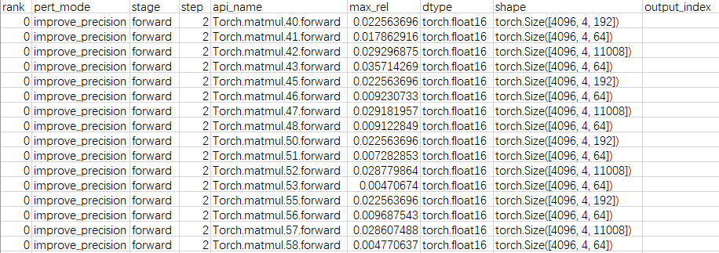

# 配置文件说明

当前配置文件主要为PrecisionDebugger接口执行dump或无标杆比对操作时调用的配置，当PrecisionDebugger接口未指定该配置文件时，使用该文件的默认配置。配置文件详见[config.json](./config.json)。

当在环境上安装msprobe工具后，config.json文件位置可通过如下方式查找：

查找msprobe工具安装路径。

```
pip show mindstudio-probe
```

输出结果如下示例：

```
Name: mindstudio-probe
Version: 1.0
Summary: This is a pytorch precision comparison tools
Home-page:
Author:
Author-email:
License:
Location: /home/xx/anaconda3/envs/pt21py38/lib/python3.8/site-packages
Requires: numpy, openpyxl, pandas, pyyaml, rich, tqdm, wheel
Required-by:
```

Location字段为msprobe工具的安装路径，那么config.json文件位置为/home/xx/anaconda3/envs/pt21py38/lib/python3.8/site-packages/msprobe/config

## 参数说明

### **通用配置参数**

| 参数名            | 说明                                                         | 是否必选 |
| ----------------- | ------------------------------------------------------------ | -------- |
| task              | dump的任务类型，str类型。可取值：<br/>        "free_benchmark"（无标杆比对）。<br/>        "statistics"（仅dump张量的统计信息，默认值）。<br/>        "tensor"（dump张量的统计信息和完整张量数据，MindSpore静态图场景仅dump完整张量数据）。<br/>        "overflow_check"（溢出检测）。<br/>        "run_ut"（精度预检配置）。<br/>配置示例："task": "tensor"。<br/>根据task参数取值的不同，可以配置不同场景参数，详见：“**task配置为free_benchmark**”，“**task配置为statistics**”，“**task配置为tensor**”，“**task配置为overflow_check**”，“**task配置为run_ut**”。 | 否       |
| dump_path         | 设置dump数据目录路径，str类型。配置示例："dump_path": "./dump_path"。MindSpore静态图场景仅支持绝对路径。 | 是       |
| rank              | 指定对某张卡上的数据进行dump，list[int]类型，默认未配置（表示dump所有卡的数据），应配置为大于等于0的整数，且须配置实际可用的Rank ID。配置示例："rank": [1]。<br>        对于PyTorch场景，Rank ID从0开始计数，最大取值为所有节点可用卡总数-1，若所配置的值大于实际训练所运行的卡的Rank ID，则dump数据为空，比如当前环境Rank ID为0到7，实际训练运行0到3卡，此时若配置Rank ID为4或不存在的10等其他值，此时dump数据为空。<br/>        对于MindSpore场景，所有节点的Rank ID均从0开始计数，最大取值为每个节点可用卡总数-1，config.json配置一次rank参数对所有节点同时生效。 | 否       |
| step              | 指定dump某个step的数据，list[int]类型。默认未配置，表示dump所有step数据。dump特定step时，须指定为训练脚本中存在的step。step为list格式，可配置逐个step，例如："step": [0,1,2]。 | 否       |
| level             | dump级别，str类型，根据不同级别dump不同数据。可取值：<br>        "L0"（dump module模块级精度数据，仅PyTorch场景支持，使用背景详见“**模块级精度数据dump说明**”）。<br/>        "L1"（dump API级精度数据，默认值，仅MindSpore动态图和PyTorch场景支持）。<br/>        "L2"（dump kernel级精度数据，仅MindSpore静态图和PyTorch场景支持，且PyTorch场景须配置acl_config参数）。<br/>        "mix"（dump module模块级和API级精度数据，即"L0"+"L1"，仅PyTorch场景支持）。<br/>配置示例："level": "L1"。MindSpore动态图场景仅支持"L1"。 | 否       |
| acl_config        | kernel dump的配置文件，str类型。level取"L2"时，该参数必选；level为其他值时，该参数不选。参数示例：acl_config='./acl_config.json'。acl_config.json配置文件详细介绍请参见“**acl_config.json配置文件说明**”。 | 否       |
| seed              | 随机种子数，int类型，默认值为：1234，仅PyTorch场景支持。通过固定随机数保证模型的输入或输出一致，可固定的随机数详见“**固定随机数范围**”。配置示例："seed": 1234。 | 否       |
| is_deterministic  | 确定性计算模式，bool类型，仅PyTorch场景支持。可取值true（开启）或false（关闭），默认关闭。配置示例："is_deterministic": true。<br/>即使在相同的硬件和输入下，API多次执行的结果也可能不同，开启确定性计算是为了保证在相同的硬件和输入下，API多次执行的结果相同。<br/>确定性计算会导致API执行性能降低，建议在发现模型多次执行结果不同的情况下开启。<br/>rnn类算子、ReduceSum、ReduceMean等算子可能与确定性计算存在冲突，若开启确定性计算后多次执行的结果不相同，则考虑存在这些算子。 | 否       |
| enable_dataloader | 自动控制开关，bool类型，仅PyTorch场景支持。可取值true（开启）或false（关闭），默认为false。配置为True后自动识别step参数指定的迭代，并在该迭代执行完成后退出训练，此时start、stop和step函数可不配置，开启该开关要求训练脚本是通过torch.utils.data.dataloader方式加载数据。仅支持PyTorch单卡训练使用，分布式训练场景下存在数据dump不全问题，**下个版本即将废弃该功能**。 | 否       |

### task配置为free_benchmark

仅PyTorch场景支持。

task配置为free_benchmark时，开启**无标杆比对**，在NPU环境下通过对当前模型API的输入添加扰动因子，二次执行，将得到的输出与未添加扰动因子前的输出进行比对，从而**得出该模型中可能因迁移等变化导致精度降低的API**。

无标杆比对优势在于省去了从GPU环境获取dump数据并执行的步骤，也省去了在NPU环境执行dump的操作，降低了精度比对的操作难度。

建议配置白名单（配置scope或list）控制少量API进行无标杆比对，一次对过多API执行无标杆比对可能导致显存溢出或性能膨胀。

| 参数名       | 说明                                                         | 是否必选 |
| ------------ | ------------------------------------------------------------ | -------- |
| scope        | PyTorch场景dump范围，list[str]类型，默认未配置（list也未配置时表示dump所有API的数据）。需要在[]内配置两个模块名或API名，用于锁定区间，dump该范围内的数据。配置示例："scope": ["MyModuleOP1", "MyModuleOP2"]。与level参数取值相关，level为L0和mix级别时，可配置模块名；level为L1级别时，可配置API名。与list参数不能同时配置。 | 否       |
| list         | 自定义dump范围，list[str]类型，默认未配置（scope也未配置时表示dump所有API的数据）。包含如下配置方法：<br>        PyTorch场景配置具体的API全称，dump该API数据。配置示例："list": ["Tensor.permute.1.forward", "Tensor.transpose.2.forward", "Torch.relu.3.backward"]。<br/>        PyTorch场景指定某一类API，dump某一类的API级别输入输出数据。配置示例："list": ["relu"]。<br/>        PyTorch场景配置kernel_api，dump前向和反向API的kernel_api级别数据，其中dump反向API时需要配置**backward_input**参数。前向API配置示例："list": ["Tensor.permute.1.forward"]；反向API配置示例："list": ["Tensor.permute.1.forward"], "backward.input": "./npu_dump/step0/rank0/Functional.conv2d.1.backward.input.0.pt"]。<br/>与scope参数不能同时配置。 | 否       |
| fuzz_device  | 标杆设备，str类型。可取值：<br/>        "npu"：无标杆，通过添加扰动因子进行比对，默认值。<br/>        "cpu"：以CPU为标杆，pert_mode须配置为"to_cpu"。<br/>配置示例："fuzz_device": "cpu"。 | 否       |
| pert_mode    | 无标杆扰动因子，str类型。可取值：<br/>        "improve_precision"：对输入做升精度，默认值。<br/>        "add_noise"：对输入增加噪声。<br/>        "no_change"：不加扰动直接二次执行。<br/>        "bit_noise"：输入的末位比特翻转。<br/>        "change_value"：输入的张量首尾值调换。<br/>        "to_cpu"：在CPU等价执行。<br/>配置示例："pert_mode": "to_cpu"。 | 否       |
| handler_type | 处理类型，可取值："check"（进行无标杆比对检查，默认值）、"fix"（将扰动后的API输出结果覆盖原始API输出结果，尝试将Loss曲线恢复正常，该模式下不支持预热if_preheat）。配置示例："handler_type": "fix"。 | 否       |
| fuzz_level   | 无标杆数据dump级别，即选择比对结果文件应输出的表头属性，当前仅支持取值为："L1"。输出结果详见“**无标杆比对数据存盘格式**”。 | 否       |
| fuzz_stage   | 前反向，选择对API前向或反向进行无标杆比对，可取值："forward"（前向，默认值）、"backward"（反向）。配置示例："fuzz_stage": "backward"。 | 否       |
| if_preheat   | 预热功能，开启功能后工具可以根据每次迭代的输出调整精度算法的阈值，从而更准确找出存在精度问题的API，bool类型。可取值true（开启）或false（关闭），默认关闭。配置示例："if_preheat": "true"。"handler_type": "fix"不支持预热。 | 否       |
| preheat_step | 开启预热的迭代数量，int类型，默认值为15。须配置"if_preheat": "true"。 | 否       |
| max_sample   | 每个算子预热的采样次数的最大阈值，int类型，默认值为20。须配置"if_preheat": "true"。 | 否       |

#### 无标杆比对数据存盘格式

无标杆比对在dump_path目录下输出结果文件free_benchmark.csv，如下示例：



| 字段         | 说明                                                         |
| ------------ | ------------------------------------------------------------ |
| rank         | Rank ID，int类型。                                           |
| pert_mode    | 扰动因子的类型，string类型。                                 |
| stage        | 前向或反向，string类型。                                     |
| step         | 迭代数，int类型。                                            |
| api_name     | API名称，string类型。                                        |
| max_rel      | 输出对比最大相对误差，float类型。                            |
| dtype        | 输入的dtype，string类型。                                    |
| shape        | 输入的shape，tuple类型。                                     |
| Output_index | 如果输出为列表或元组，其中一个元素检测不一致，则会有该元素的index，否则为空，int类型。 |

### task配置为statistics

| 参数名       | 说明                                                         | 是否必选 |
| ------------ | ------------------------------------------------------------ | -------- |
| scope        | PyTorch和MindSpore动态图场景dump范围，list[str]类型，默认未配置（list也未配置时表示dump所有API的数据）。需要在[]内配置两个模块名或API名，用于锁定区间，dump该范围内的数据。配置示例："scope": ["MyModuleOP1", "MyModuleOP2"]。与level参数取值相关，level为L0和mix级别时，可配置模块名；level为L1级别时，可配置API名。MindSpore动态图场景当前仅支持配置为API名。 | 否       |
| list         | 自定义dump范围，list[str]类型，默认未配置（scope也未配置时表示dump所有API的数据）。包含如下配置方法：<br>        PyTorch和MindSpore动态图场景配置具体的API全称，dump该API数据。配置示例："list": ["Tensor.permute.1.forward", "Tensor.transpose.2.forward", "Torch.relu.3.backward"]。<br/>        PyTorch和MindSpore动态图场景指定某一类API，dump某一类的API级别输入输出数据。配置示例："list": ["relu"]。<br/>        MindSpore静态图场景配置kernel_name，可以是算子的名称列表，也可以指定算子类型（"level": "L2"时不支持），还可以配置算子名称的正则表达式（当字符串符合”name-regex(xxx)”格式时，后台则会将其作为正则表达式。例如，”name-regex(Default/.+)”可匹配算子名称以”Default/”开头的所有算子）。 | 否       |
| data_mode    | dump数据过滤，str类型。可取值"all"、"forward"、"backward"、"input"和"output"，表示仅保存dump的数据中文件名包含"forward"、"backward"、"input"和"output"的前向、反向、输入或输出的dump文件。配置示例"data_mode": ["backward"]或"data_mode": ["forward", "backward"]。默认为["all"]，即保存所有dump的数据。除了all参数只能单独配置外，其他参数可以自由组合。<br/>MindSpore静态图场景仅支持"all"、"input"和"output"参数，且各参数只能单独配置，不支持自由组合。 | 否       |
| summary_mode | 控制dump文件输出的模式，str类型，仅PyTorch和MindSpore动态图场景支持，可取值md5（dump输出包含md5值以及API统计信息的dump.json文件，用于验证数据的完整性）、statistics（dump仅输出包含API统计信息的dump.json文件，默认值）。配置示例："summary_mode": "md5"。 | 否       |

### task配置为tensor

MindSpore静态图场景仅dump完整张量数据。

| 参数名         | 说明                                                         | 是否必选 |
| -------------- | ------------------------------------------------------------ | -------- |
| scope          | PyTorch和MindSpore动态图场景dump范围，list[str]类型，默认未配置（list也未配置时表示dump所有API的数据）。需要在[]内配置两个模块名或API名，用于锁定区间，dump该范围内的数据。配置示例："scope": ["MyModuleOP1", "MyModuleOP2"]。与level参数取值相关，level为L0和mix级别时，可配置模块名；level为L1级别时，可配置API名。 | 否       |
| list           | 自定义dump范围，list[str]类型，默认未配置（scope也未配置时表示dump所有API的数据）。包含如下配置方法：<br>        PyTorch和MindSpore动态图场景配置具体的API全称，dump该API数据。配置示例："list": ["Tensor.permute.1.forward", "Tensor.transpose.2.forward", "Torch.relu.3.backward"]。<br/>        PyTorch和MindSpore动态图场景指定某一类API，dump某一类的API级别输入输出数据。配置示例："list": ["relu"]。<br/>        PyTorch和MindSpore动态图场景配置kernel_api，dump前向和反向API的kernel_api级别数据，其中dump反向API时需要配置**backward_input**参数。前向API配置示例："list": ["Tensor.permute.1.forward"]；反API配置示例："list": ["Tensor.permute.1.forward"], "backward.input": "./npu_dump/step0/rank0/Functional.conv2d.1.backward.input.0.pt"]。<br/>        MindSpore静态图场景配置kernel_name，可以是算子的名称列表，也可以指定算子类型（"level": "L2"时不支持），还可以配置算子名称的正则表达式（当字符串符合”name-regex(xxx)”格式时，后台则会将其作为正则表达式。例如，”name-regex(Default/.+)”可匹配算子名称以”Default/”开头的所有算子）。 | 否       |
| backward_input | 该输入文件为首次运行训练dump得到反向API输入的dump文件，str类型，仅PyTorch场景支持，默认未配置。例如若需要dump Functional.conv2d.1 API的反向过程的输入输出，则需要在dump目录下查找命名包含Functional.conv2d.1、backward和input字段的dump文件。配置示例："backward_input": "./npu_dump/step0/rank0/Functional.conv2d.1.backward.input.0.pt"] | 否       |
| data_mode      | dump数据过滤，str类型。可取值"all"、"forward"、"backward"、"input"和"output"，表示仅保存dump的数据中文件名包含"forward"、"backward"、"input"和"output"的前向、反向、输入或输出的dump文件。配置示例"data_mode": ["backward"]或"data_mode": ["forward", "backward"]。默认为["all"]，即保存所有dump的数据。除了all参数只能单独配置外，其他参数可以自由组合。<br/>MindSpore静态图场景仅支持"all"、"input"和"output"参数，且各参数只能单独配置，不支持自由组合。 | 否       |
| file_format    | MindSpore静态图场景真实tensor数据的保存格式，str类型，可取值"bin"（dump的tensor文件为二进制格式，"level": "L1"时不支持）、"npy"（dump的tensor文件后缀为.npy，默认值）。 | 否       |
| online_run_ut  | 在线预检模式开关，bool类型，可取值true（开启）、false（关闭），默认未配置，表示关闭。配置为true表示开启在线预检。 | 否       |
| nfs_path       | 在线预检模式共享存储目录路径，str类型，用于GPU设备和NPU设备间进行通信。仅在online_run_ut字段配置为true时生效，未配置该参数后host和port不生效。 | 否       |
| host           | 在线预检模式局域网场景信息接收端IP，str类型，用于GPU设备和NPU设备间进行通信，NPU侧须配置为GPU侧的局域网IP地址。仅在online_run_ut字段配置为true时生效，局域网场景时，不能配置nfs_path参数，否则局域网场景不生效。 | 否       |
| port           | 在线预检模式局域网场景信息接收端端口号，int类型，用于GPU设备和NPU设备间进行通信，NPU侧须配置为GPU侧的端口号。仅在online_run_ut字段配置为true时生效，局域网场景时，不能配置nfs_path参数，否则局域网场景不生效。 | 否       |

说明： online_run_ut、nfs_path、host、port参数仅在线预检场景NPU环境生效，详细说明请参见[《在线精度预检》](../pytorch/doc/api_accuracy_checker_online.md)。

### task配置为overflow_check

MindSpore静态图场景的jit_level为O0/O1时，不支持该功能，须配置jit_level为O2。请参见[mindspore.set_context](https://www.mindspore.cn/docs/zh-CN/r2.3.0/api_python/mindspore/mindspore.JitConfig.html#mindspore-jitconfig)配置jit_config。

| 参数名        | 说明                                                         | 是否必选 |
| ------------- | ------------------------------------------------------------ | -------- |
| overflow_nums | 控制溢出次数，int类型，仅MindSpore动态图和PyTorch场景支持，表示第N次溢出时，停止训练，过程中检测到溢出API对应kernel数据均dump。配置示例："overflow_nums": 3。默认为1，即检测到1次溢出，训练停止，配置为-1时，表示持续检测溢出直到训练结束。 | 否       |
| check_mode    | MindSpore静态图场景kernel级别的溢出检测，str类型，可取值"aicore"（开启AI Core的溢出检测）、"atomic"（开启Atomic的溢出检测）、"all"（开启AI Core和Atomic的溢出检测，默认值）。配置示例"check_mode": "aicore"。 | 否       |

### task配置为run_ut

仅PyTorch场景支持。

| 参数名称            | 说明                                                                                                                                            | 是否必选 |
|-----------------|-----------------------------------------------------------------------------------------------------------------------------------------------|------|
| white_list      | API dump白名单，仅对指定的API进行dump。配置示例："white_list": ["conv1d", "conv2d"]。默认未配置白名单，即dump全量API数据。                                                     | 否    |
| black_list      | API dump黑名单，被指定的API不进行dump。配置示例："black_list": ["conv1d", "conv2d"]。默认未配置黑名单，即dump全量API数据。                                                     | 否    |
| error_data_path | 配置保存精度未达标的API输入输出数据路径，默认为当前路径。配置示例"error_data_path": "./"。                                                                                    | 否    |
| is_online       | 在线预检模式开关，bool类型，可取值true（开启）、false（关闭），默认关闭。                                                                                                   | 否    |
| nfs_path        | 在线预检模式共享存储目录路径，str类型，用于GPU设备和NPU设备间进行通信。配置该参数后host和port不生效，仅在is_online字段配置为true时生效。                                                           | 否    |
| host            | 在线预检模式局域网场景信息接收端IP，str类型，用于GPU设备和NPU设备间进行通信，GPU侧配置为本机地址127.0.0.1或本机局域网IP。局域网场景时，不能配置nfs_path参数，否则局域网场景不生效。仅在is_online字段配置为true时生效。            | 否    |
| port            | 在线预检模式局域网场景信息接收端端口号，int类型，用于GPU设备和NPU设备间进行通信，GPU侧配置为本机可用端口。局域网场景时，不能配置nfs_path参数，否则局域网场景不生效。仅在is_online字段配置为true时生效。                          | 否    |
| rank_list       | 指定在线预检的Rank ID，默认值为[0]，list[int]类型，应配置为大于等于0的整数，且须根据实际卡的Rank ID配置，若所配置的值大于实际训练所运行的卡的Rank ID，则在线预检输出数据为空。GPU和NPU须配置一致。仅在is_online字段配置为true时生效。 | 否    |

说明： 
<br>（1）white_list和black_list同时配置时，二者配置的API名单若无交集，则白名单生效，若API名单存在交集，则白名单排除的部分以及交集的API不进行dump。
<br>（2）is_online、nfs_path、host、port、rank_list等字段仅在线预检场景GPU机器生效，详细说明见[《在线精度预检》](../pytorch/doc/api_accuracy_checker_online.md)

## 配置示例

以下示例包含当前支持的所有场景可配置的完整参数。

### PyTorch场景task配置为free_benchmark

```json
{
    "task": "free_benchmark",
    "dump_path": "/home/data_dump",
    "rank": [],
    "step": [],
    "level": "L1",
    "seed": 1234,
    "is_deterministic": false,
    "enable_dataloader": false,

    "free_benchmark": {
        "scope": [], 
        "list": ["conv2d"],
        "fuzz_device": "npu",
        "pert_mode": "improve_precision",
        "handler_type": "check",
        "fuzz_level": "L1",
        "fuzz_stage": "forward",
        "if_preheat": false,
        "preheat_step": 15,
        "max_sample": 20
    }
}
```

### PyTorch场景task配置为statistics

```json
{
    "task": "statistics",
    "dump_path": "/home/data_dump",
    "rank": [],
    "step": [],
    "level": "L1",
    "seed": 1234,
    "is_deterministic": false,
    "enable_dataloader": false,

    "statistics": {
        "scope": [], 
        "list": [],
        "data_mode": ["all"],
        "summary_mode": "statistics"
    }
}
```

### PyTorch场景task配置为tensor

```json
{
    "task": "tensor",
    "dump_path": "/home/data_dump",
    "rank": [],
    "step": [],
    "level": "L1",
    "seed": 1234,
    "is_deterministic": false,
    "enable_dataloader": false,

    "tensor": {
        "scope": [],
        "list":[],
        "data_mode": ["all"],
        "backward_input": ""
    }
}
```

### PyTorch场景task配置为overflow_check

```json
{
    "task": "overflow_check",
    "dump_path": "/home/data_dump",
    "rank": [],
    "step": [],
    "level": "L1",
    "seed": 1234,
    "is_deterministic": false,
    "enable_dataloader": false,

    "overflow_check": {
        "overflow_nums": 1
    }
}
```

###  PyTorch场景task配置为run_ut

```json
{
    "task": "run_ut",
    "dump_path": "/home/data_dump",
    "rank": [],
    "step": [],
    "level": "L1",
    "seed": 1234,
    "is_deterministic": false,
    "enable_dataloader": false,

    "run_ut": {
        "white_list": [],
        "black_list": [],
        "error_data_path": "./"
    }
}
```

### MindSpore静态图场景task配置为statistics

```json
{
    "task": "statistics",
    "dump_path": "/home/data_dump",
    "rank": [],
    "step": [],
    "level": "L2",

    "statistics": {
        "list": [],
        "data_mode": ["all"],
        "summary_mode": "statistics"
    }
}
```

### MindSpore静态图场景task配置为tensor

```json
{
    "task": "tensor",
    "dump_path": "/home/data_dump",
    "rank": [],
    "step": [],
    "level": "L2",

    "tensor": {
        "list":[],
        "data_mode": ["all"],
        "backward_input": ""
    }
}
```

### MindSpore静态图场景task配置为overflow_check

```json
{
    "task": "overflow_check",
    "dump_path": "/home/data_dump",
    "rank": [],
    "step": [],
    "level": "L2",

    "overflow_check": {
        "check_mode": "all"
    }
}
```

### MindSpore动态图场景task配置为statistics

```json
{
    "task": "statistics",
    "dump_path": "/home/data_dump",
    "rank": [],
    "step": [],
    "level": "L1",

    "statistics": {
        "scope": [], 
        "list": [],
        "data_mode": ["all"],
        "summary_mode": "statistics"
    }
}
```

### MindSpore动态图场景task配置为tensor

```json
{
    "task": "tensor",
    "dump_path": "/home/data_dump",
    "rank": [],
    "step": [],
    "level": "L1",

    "tensor": {
        "scope": [],
        "list":[],
        "data_mode": ["all"],
    }
}
```

### MindSpore动态图场景task配置为overflow_check

```json
{
    "task": "overflow_check",
    "dump_path": "/home/data_dump",
    "rank": [],
    "step": [],
    "level": "L1",

    "overflow_check": {
        "overflow_nums": 1
    }
}
```

## 附录

### 模块级精度数据dump说明

仅PyTorch场景支持。

大模型场景下，通常不是简单的利用自动迁移能力实现GPU到NPU的训练脚本迁移，而是会对NPU网络进行一系列针对性的适配，因此，常常会造成迁移后的NPU模型存在部分子结构不能与GPU原始模型完全对应。模型结构不一致导致API调用类型及数量不一致，若直接按照API粒度进行精度数据dump和比对，则无法完全比对所有的API。

本节介绍的功能是对模型中的大粒度模块进行数据dump，使其比对时，对于无法以API粒度比对的模块可以直接以模块粒度进行比对。

模块指的是继承自nn.Module类模块，通常情况下这类模块就是一个小模型，可以被视为一个整体，dump数据时以模块为粒度进行dump。

### acl_config.json配置文件说明

#### [config.json](./config.json)配置示例

当PyTorch场景level取"L2"时，须配置acl_config参数，并指定acl_config.json文件（用于指定L2 kernel级dump的配置），此时config.json文件配置示例如下：

- 前向kernel dump配置示例：

  "scope"配置为前向API名称，仅支持配置一个API。

  ```json
  {
  	"task": "tensor",
  	"dump_path": "/home/data_dump",
  	"level": "L2",
  	"rank": [0],
  	"step": [0],
  	"is_deterministic": false,
  	"tensor": {
  		"scope": ["Tensor.__mul__.10.forward"],
  		"list":[],
  		"data_mode": ["all"],
  		"backward_input": [""],
  		"file_format": "npy"
  	},
  	"acl_config": "acl_config.json"
  }
  ```

- 反向kernel dump配置示例：

  执行反向kernel dump前需要先使用工具dump该API的反向输入，保存pt文件，在"backward_input"参数中传入该pt文件路径。

  "scope"配置为反向API名称，仅支持配置一个API。

  ```json
  {
  	"task": "tensor",
  	"dump_path": "/home/data_dump",
  	"level": "L2",
  	"rank": [0],
  	"step": [0],
  	"is_deterministic": false,
  	"tensor": {
  		"scope": ["Tensor.__mul__.10.backward"],
  		"list":[],
  		"data_mode": ["all"],
  		"backward_input": ["Tensor.__mul__.10.backward.input.0.pt"],
  		"file_format": "npy"
  	},
  	"acl_config": "acl_config.json"
  }
  ```

#### acl_config.json配置示例

acl_config.json文件须自行创建，配置示例如下：

```
{
 "dump":
 {
         "dump_list":[],
         "dump_path":"./dump/output",
         "dump_mode":"all",
         "dump_op_switch":"on"
 }
}
```

**acl_config.json参数说明**

| 字段名         | 说明                                                         |
| -------------- | ------------------------------------------------------------ |
| dump_list      | 待dump数据的API模型。为空，无需配置。                        |
| dump_path      | dump数据文件存储到运行环境的目录，主要配置的是kernel级数据的存放路径。支持配置绝对路径或相对路径。dump_path须为已存在目录。 |
| dump_mode      | dump数据模式，配置如下： output：dump API的输出数据。默认值。 input：dump API的输入数据。 all：dump API的输入、输出数据。 |
| dump_op_switch | 单API模型dump数据开关，配置如下：<br>        off：关闭单API模型dump，默认值。<br>        on：开启单API模型dump。 |

**dump目录说明**

配置acl_config.json后，采集的kernel级数据会在{dump_path}/{time}/{deviceid}/{model_id}目录下生成，例如“/home/HwHiAiUser/output/20200808163566/0/0”

```
├── 20230131172437
│   └── 1
│       ├── 0
│       │   ├── Add.Add.45.0.1675157077183551
│       │   ├── Cast.trans_Cast_0.31.0.1675157077159449
│       │   ├── Cast.trans_Cast_5.43.0.1675157077180129
│       │   ├── MatMul.MatMul.39.0.1675157077172961
│       │   ├── Mul.Mul.29.0.1675157077155731
│       │   ├── NPUAllocFloatStatus.NPUAllocFloatStatus.24.0.1675157077145262
│       │   ├── TransData.trans_TransData_1.33.0.1675157077162791
│       │   └── TransData.trans_TransData_4.41.0.1675157077176648
│       ├── 1701737061
│       │   └── Cast.trans_Cast_2.35.0.1675157077166214
│       ├── 25
│       │   └── NPUClearFloatStatus.NPUClearFloatStatus.26.0.1675157077150342
│       └── 68
│           └── TransData.trans_TransData_3.37.0.1675157077169473
```

### 固定随机数范围

仅PyTorch场景支持。

seed_all函数可固定随机数的范围如下表。

| API                                      | 固定随机数                  |
| ---------------------------------------- | --------------------------- |
| os.environ['PYTHONHASHSEED'] = str(seed) | 禁止Python中的hash随机化    |
| random.seed(seed)                        | 设置random随机生成器的种子  |
| np.random.seed(seed)                     | 设置numpy中随机生成器的种子 |
| torch.manual_seed(seed)                  | 设置当前CPU的随机种子       |
| torch.cuda.manual_seed(seed)             | 设置当前GPU的随机种子       |
| torch.cuda.manual_seed_all(seed)         | 设置所有GPU的随机种子       |
| torch_npu.npu.manual_seed(seed)          | 设置当前NPU的随机种子       |
| torch_npu.npu.manual_seed_all(seed)      | 设置所有NPU的随机种子       |
| torch.backends.cudnn.enable=False        | 关闭cuDNN                   |
| torch.backends.cudnn.benchmark=False     | cuDNN确定性地选择算法       |
| torch.backends.cudnn.deterministic=True  | cuDNN仅使用确定性的卷积算法 |

需要保证CPU或GPU以及NPU的模型输入完全一致，dump数据的比对才有意义，seed_all并不能保证模型输入完全一致，如下表所示场景需要保证输入的一致性。

| 场景            | 固定方法      |
| --------------- | ------------- |
| 数据集的shuffle | 关闭shuffle。 |
| dropout         | 关闭dropout。 |

关闭shuffle示例：

```Python
train_loader = torch.utils.data.DataLoader(
	train_dataset,
	batch_size = batch_size,
	shuffle = False,
	num_workers = num_workers
)
```

关闭dropout：

在使用from msprobe.pytorch import PrecisionDebugger后，工具会自动将torch.nn.functional.dropout、torch.nn.functional.dropout2d、torch.nn.functional.dropout3d、torch.nn.Dropout、torch.nn.Dropout2d、torch.nn.Dropout3d的接口参数p置为0。
