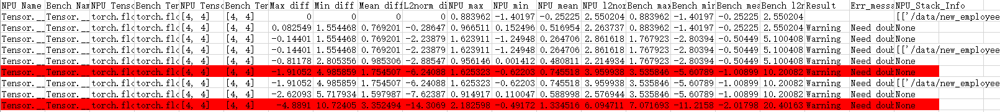

# PyTorch 场景的精度比对

## 1 简介

- 本节主要介绍通过命令行和比对函数的方式进行 CPU 或 GPU 与 NPU 的精度数据比对，执行精度比对操作前需要先完成 CPU 或 GPU 与 NPU 的精度数据 dump，参见 [PyTorch 场景下的数据采集](./05.data_dump_PyTorch.md)章节。

- msprobe 使用子命令 compare 进行比对，可支持单卡和多卡场景的精度数据比对。

- 比对函数均通过单独创建精度比对脚本执行，可支持单卡和多卡场景的精度数据比对。

- 工具性能：比对数据量较小时（单份文件小于 10 GB），比对速度 0.1 GB/s；比对数据量较大时，比对速度 0.3 GB/s。 推荐环境配置：独占环境，CPU 核心数 192，固态硬盘（IO 速度参考：固态硬盘 > 500 MB/s，机械硬盘 60 ~ 170 MB/s）。用户环境性能弱于标准约束或非独占使用的比对速度酌情向下浮动。比对速度的计算方式：两份比对文件大小/比对耗时。

**使用场景**：

- 同一模型，从 CPU 或 GPU 移植到 NPU 中存在精度下降问题，对比 NPU 芯片中的 API 计算数值与 CPU 或 GPU 芯片中的 API 计算数值，进行问题定位。
- 同一模型，进行迭代（模型、框架版本升级或设备硬件升级）时存在的精度下降问题，对比相同模型在迭代前后版本的 API 计算数值，进行问题定位。

**注意事项**：

- NPU 自研 API，在 CPU 或 GPU 侧若没有对应的 API，该 API 的 dump 数据不比对。
- NPU 与 CPU 或 GPU 的计算结果误差可能会随着模型的执行不断累积，最终会出现同一个 API 因为输入的数据差异较大而无法比对的情况。
- CPU 或 GPU 与 NPU 中两个相同的 API 会因为调用次数不同导致无法比对或比对到错误的 API，不影响整体运行，该 API 忽略。

**API匹配条件**：

进行精度比对时，需要判断CPU或GPU的API与NPU的API是否相同可比对，须满足以下匹配条件：

- 两个API的名称相同，API命名规则：`{api_type}.{api_name}.{api调用次数}.{正反向}.{输入输出}.index`，如：Functional.conv2d.1.backward.input.0。
- 两个API的输入输出Tensor数量和各个Tensor的Shape相同。

通常满足以上两个条件，工具就认为是同一个API，成功进行API的匹配，后续进行相应的计算精度比对。

## 2 精度比对操作指导

### 2.1 命令行方式

将 CPU 或 GPU 与 NPU 的 dump 文件进行比对，支持单卡和多卡，可同时比对多卡的 dump 数据。多机场景需要每个设备单独执行比对操作。

请先参见 [PyTorch 场景下的数据采集](./05.data_dump_PyTorch.md)章节完成 CPU 或 GPU 与 NPU 的精度数据 dump。

**操作步骤**：

1. 创建[比对文件](#211-比对文件)。

2. 运行命令：

   ```shell
   msprobe -f pytorch compare -i ./compare.json -o ./output -s
   ```

   **参数说明**：

   | 参数名               | 说明     | 是否必选 |
   |-------------------|----------------------------------------------------------------------------------------------------------------------------------------------------------------------------------------------------| -------- |
   | -i 或 --input_path   | 指定[比对文件](#211-比对文件)。             | 是       |
   | -o 或 --output_path  | 配置比对结果文件存盘目录。文件名称基于时间戳自动生成，格式为：`compare_result_{timestamp}.xlsx`。     | 是       |
   | -s 或 --stack_mode   | 配置 stack_mode 的开关。仅当[比对文件](#211-比对文件)配置 stack_path 需要开启。通过直接配置该参数开启，默认未配置，表示关闭。   | 否       |
   | -c 或 --compare_only | 仅比对开关。未配置默认关闭仅比对，使用自动精度分析，工具自动针对比对结果进行分析，识别到第一个精度不达标节点（在比对结果文件中的 Accuracy Reached or Not 列显示为 No），并给出问题可能产生的原因（打屏展示并生成 `advisor_{timestamp}.txt` 文件）。该参数默认未配置，使用自动精度分析，通过配置该参数开启仅比对，关闭自动精度分析，仅输出比对结果表格。 | 否       |
   | -f 或 --fuzzy_match  | 模糊匹配。开启后，对于网络中同一层级且命名仅调用次数不同的 API，可匹配并进行比对。通过直接配置该参数开启，默认未配置，表示关闭。   | 否       |

3. 查看比对结果，请参见 [3 精度比对结果分析](#3-精度比对结果分析)。

#### 2.1.1 比对文件

   以在当前目录创建 ./compare.json 为例。

   - 单卡场景示例：

     ```json
     {
     "npu_path": "./npu_dump/dump.json",
     "bench_path": "./bench_dump/dump.json",
     "stack_path": "./npu_dump/stack.json",
     "is_print_compare_log": true
     }
     ```

   - 多卡场景示例：

     ```json
     {
     "npu_path": "./npu_dump/step0",
     "bench_path": "./bench_dump/step0",
     "is_print_compare_log": true
     }
     ```

   **参数说明**：

   | 参数名               | 说明                                                         | 是否必选           |
   | -------------------- | ------------------------------------------------------------ | ------------------ |
   | npu_path             | 配置 NPU 环境下的 dump.json 文件（单卡场景）或真实数据目录（多卡场景）。数据类型：str。 | 是                 |
   | bench_path           | 配置 CPU、GPU 或 NPU 环境下的 dump.json 文件（单卡场景）或真实数据目录（多卡场景）。数据类型：str。 | 是                 |
   | stack_path           | 配置 NPU dump 目录下的 stack.json 文件。数据类型：str。          | 单卡必选，多卡不选 |
   | is_print_compare_log | 配置是否开启日志打屏。可取值 True 或 False。数据类型：bool      | 否                 |

### 2.2 比对函数方式

#### 2.2.1 compare_distributed 函数

此函数将 CPU 或 GPU 与 NPU 的 dump 文件进行比对，支持单卡和多卡，可同时比对多卡的 dump 数据。多机场景需要每个设备单独执行比对操作。可自动检索和匹配对应卡和进程所 dump 的数据文件，再调用 compare 进行比对。单机单卡时与 compare 函数二选一。

**函数原型**：

```Python
compare_distributed(npu_dump_dir, bench_dump_dir, output_path, **kwargs)
```

**参数说明**：

| 参数名         | 说明                                                         | 是否必选 |
| -------------- | ------------------------------------------------------------ | -------- |
| npu_dump_dir   | 配置 NPU 环境下的 dump 目录。str 类型。dump 数据目录须指定到 step 级。<br/>**配置示例**：'./npu_dump/step0'。 | 是       |
| bench_dump_dir | 配置 CPU、GPU 或 NPU 环境下的 dump 目录。str 类型。<br/>**配置示例**：'./gpu_dump/step0'。 | 是       |
| output_path    | 配置比对结果文件存盘目录。需要预先创建 output_path 目录。str 类型。<br/>**配置示例**：'./output'。文件名称基于时间戳自动生成，格式为：`compare_result_rank{npu_ID}-rank{cpu/gpu/npu_ID}_{timestamp}.xlsx`。 | 是       |
| **kwargs       | 支持 compare 的所有可选参数。                                  | 否       |

**函数示例**：

```Python
from msprobe.pytorch import *
compare_distributed('./npu_dump/step0', './gpu_dump/step0', './output')
```

#### 2.2.2 compare 函数

此函数将 CPU 或 GPU 与 NPU 的 dump 文件进行比对，仅支持单机单卡。

**函数原型**：

```Python
compare(input_param, output_path, stack_mode=False, auto_analyze=True, fuzzy_match=False)
```

**参数说明**：

| 参数名       | 说明                                                         | 是否必选 |
| ------------ | ------------------------------------------------------------ | -------- |
| input_param  | 配置 dump 数据文件及目录，dict 类型。配置参数包括：<br>        "npu_json_path"：指定 NPU dump 目录下的 dump.json 文件。<br/>**配置示例**："npu_json_path": "./npu_dump/dump.json"。<br/>        "bench_json_path"：指定 CPU、GPU 或 NPU dump 目录下的 dump.json 文件。<br/>**配置示例**："bench_json_path": "./bench_dump/dump.json"。<br/>        "stack_json_path"：指定 NPU dump 目录下的 stack.json 文件。<br/>**配置示例**："stack_json_path": "./npu_dump/stack.json"。<br/>        "is_print_compare_log"：配置是否开启日志打屏。<br/>**配置示例**：True 或 False。 | 是       |
| output_path  | 配置比对结果文件存盘目录，str 类型。<br/>**配置示例**：'./output'。文件名称基于时间戳自动生成，格式为：`compare_result_{timestamp}.xlsx`。 | 是       |
| stack_mode   | 配置 stack_mode 的开关，bool 类型。仅当配置 stack_json_path 时需要开启。<br/>**配置示例**：stack_mode=True，默认为 False。 | 否       |
| auto_analyze | 自动精度分析，bool 类型。开启后工具自动针对比对结果进行分析，识别到第一个精度不达标节点（在比对结果文件中的 Accuracy Reached or Not 列显示为 No），并给出问题可能产生的原因（打屏展示并生成 advisor_{timestamp}.txt 文件）。<br/>**配置示例**：auto_analyze=False，默认为 True。 | 否       |
| fuzzy_match  | 模糊匹配，bool 类型。开启后，对于网络中同一层级且命名仅调用次数不同的 API，可匹配并进行比对。<br/>**配置示例**：fuzzy_match=True，默认为 False。 | 否       |

**函数示例**：

单机单卡场景下创建比对脚本，例如 compare.py，拷贝如下代码，具体参数请根据实际环境修改。

```Python
from msprobe.pytorch import compare
input_param={
"npu_json_path": "./npu_dump/dump.json",
"bench_json_path": "./bench_dump/dump.json",
"stack_json_path": "./npu_dump/stack.json",
"is_print_compare_log": True
}
compare(input_param, output_path="./output", stack_mode=True)
```

#### 2.2.3 统计量比对

在使用 **compare** 或 **compare_distributed** 函数创建的比对脚本且在 [config.json](../config.json) 文件中配置 `"task": "statistics"` 时，可以进行统计量比对，此时比对 dump.json 文件中的统计信息，开启后的比对结果生成 Max diff、Min diff、Mean diff 和 L2norm diff，表示 NPU dump 数据中 API 的输入或输出与标杆数据输入或输出的最大值、最小值、平均值以及 L2 范数的差。可以通过该值判断 API 是否存在精度问题：当某个 API 的输入和输出的 Max diff、Min diff、Mean diff 和 L2norm diff 均为 0 或无限趋于 0，那么可以判断该 API 无精度问题，反之则可能存在精度问题。

**比对脚本示例**：

以 compare.py 为例：

```Python
from msprobe.pytorch import compare
input_param={
"npu_json_path": "./npu_dump/dump.json",
"bench_json_path": "./bench_dump/dump.json",
"stack_json_path": "./npu_dump/stack.json",
"is_print_compare_log": True
}
compare(input_param, output_path="./output", stack_mode=True)
```

**统计量比对结果说明**：

数据量比对同样生成 `compare_result_{timestamp}.xlsx` 和 `advisor_{timestamp}.txt` 文件。其中 `advisor_{timestamp}.txt` 主要对 `compare_result_{timestamp}.xlsx` 中可能存在精度问题（Result 为 Waring）的 API 提出定位建议；`compare_result_{timestamp}.xlsx` 主要有如下两种情况：

- "summary_mode": "statistics" 时比对 dump.json 文件：

  

  上图是对 dump.json 文件中 NPU 及标杆 API 的统计信息进行比对，判断可能存在精度问题的 API，文件中记录 NPU 及标杆 API 的基本信息和统计信息，其中需要关注 Result 列，包含结果：Waring（NPU 与标杆统计信息的比对中存在相对误差大于 0.5，则需要重点检查该 API）；为空（相对误差小于等于 0.5，可以不需要重点关注，但不代表不存在精度问题）；Nan（表示统计信息数据没有匹配上）。

- "summary_mode": "md5" 时比对 dump.json 文件：

  

  上图是对 dump.json 文件中 NPU 及标杆 API 的 MD5 信息进行比对，判断 API 数据的完整性，文件中记录 NPU 及标杆 API 的基本信息和 MD5 信息，其中需要关注 Result 列，包含结果：Pass（表示 NPU 与标杆的 MD5 值一致，即 API 数据完整）；Different（表示 NPU 与标杆的 MD5 值不一致，即 API 数据不完全一致，可以通过 NPU_Stack_Info 列 API 调用栈查询该 API 的详细信息）；Nan（表示 MD5 信息数据没有匹配上）。

## 3 精度比对结果分析

PyTorch 精度比对是以 CPU 或 GPU 的计算结果为标杆，通过计算精度评价指标判断 API 在运行时是否存在精度问题。

- `advisor_{timestamp}.txt` 文件中给出了可能存在精度问题的 API 的专家建议，可直接打开查看。

- `compare_result_{timestamp}.xlsx` 文件列出了所有执行精度比对的 API 详细信息和比对结果，示例如下：

  

  可以从该结果文件中进行[判断计算精度达标情况](#31-判断计算精度达标情况)、[计算精度评价指标分析](#32-计算精度评价指标分析)以及[异常信息识别](#33-异常信息识别)等分析动作。

### 3.1 判断计算精度达标情况

精度比对结果 `compare_result_{timestamp}.xlsx` 文件中只需要通过 Accuracy Reached or Not 来判断计算精度是否达标，判断标准如下：

1. Cosine < 0.99 且 MaxAbsError > 0.001 时，精度不达标，标记为 No。
2. Cosine < 0.9，精度不达标，标记为 No。
3. MaxAbsError > 1，精度不达标，标记为 No。
4. 其余情况下记为精度达标，标记为 Yes。

### 3.2 计算精度评价指标分析

1. Cosine：通过计算两个向量的余弦值来判断其相似度，数值越接近于 1 说明计算出的两个张量越相似，实际可接受阈值为大于 0.99。在计算中可能会存在 nan，主要由于可能会出现其中一个向量为 0。

2. MaxAbsErr：当最大绝对误差越接近 0 表示其计算的误差越小，实际可接受阈值为小于 0.001。

3. MaxRelativeErr：当最大相对误差越接近 0 表示其计算的误差越小。

   当 dump 数据中存在 0 或 Nan 时，比对结果中最大相对误差则出现 inf 或 Nan 的情况，属于正常现象。

4. One Thousandth Err Ratio（双千分之一）、Five Thousandths Err Ratio（双千分之五）精度指标：是指 NPU 的 Tensor 中的元素逐个与对应的标杆数据对比，相对误差大于千分之一、千分之五的比例占总元素个数的比例小于千分之一、千分之五。该数据仅作为精度下降趋势的参考，并不参与计算精度是否通过的判定。

### 3.3 异常信息识别

精度比对结果 `compare_result_{timestamp}.xlsx` 文件中对于存在异常信息的API会进行高亮处理：

- 红色可能出现的情况有：
  - NPU max 或 NPU min 信息中存在 nan/inf；
  - Max diff存在大于1e+10的值；
  - 统计数据中output的Max diff除以max(0.01, Bench max) > 0.5；
  - 真实数据中One Thousandth Err Ratio的input > 0.9同时output < 0.6。
- 黄色可能出现的情况有：
  - Max diff的input与output都大于1，同时output比input大一个数量级以上；
  - 统计数据Max diff除以max(0.01, Bench max)的output > 0.1同时input < 0.01；
  - 真实数据One Thousandth Err Ratio的input - output > 0.1；
  - 真实数据Cosine的input - output > 0.1。

Shape为 [ ] 时，统计量列说明：

当 NPU Tensor Shape 列为 [ ] 时，表示标量或 0 维张量，统计量列（NPU max、NPU min、NPU mean、NPU l2norm）展示相同的唯一元素。Bench 同理。
