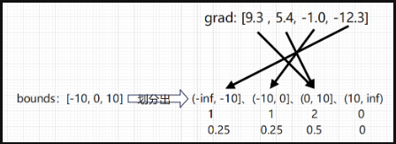
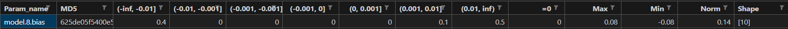

# Ascend模型梯度状态监测工具

梯度状态监测工具提供了两种能力：

- 将模型权重的梯度数据导出。这种功能可以将模型权重的梯度值以统计量的形式采集出来，用以分析问题。
- 将两份梯度数据进行相似度对比。在有标杆问题中，可以确认训练过程中精度问题出现的step，以及抓取反向过程中的问题。

工具支持PyTorch版本：2.0/2.1/2.2；支持MindSpore版本：r2.3。暂不支持deepspeed的ZeRO-1、ZeRO-2、ZeRO-3。

## 工具特性

- 使用便捷，仅需在训练流程里插入少量代码
- 可以精准定位问题出现的step

## 使用方式

### 梯度数据导出

1. 创建配置文件config.json，样例如下：

   ```json
   {
    "task": "grad_probe",
    "dump_path": "./dump_path",
    "rank": [],
    "step": [],
    "grad_probe": {
        "grad_level": "L1",
        "param_list": [],
        "bounds": [-1, 0, 1]
    }
   }
   ```
   > step指的是优化器被调用的次数（并非模型跑的step，某些step，例如loss为nan时，不会调用优化器）

   **参数说明**

   | 参数                       | 说明                          | 输入类型                     | 是否必选 |
   |--------------------------------|-----------------------------------|-----------------|----------|
   | task            | 填为"grad_probe"。 |  str | 是 |
   | dump_path            | 输出目录。如果不存在就会创建一个新目录。 |  str | 是 |
   | rank                   | rank id列表，在多卡场景下，表示需要导出梯度数据的进程的rank id。列表为空就表示导出所有rank的数据。默认为空。采集特定 rank 时，须指定为训练脚本中存在的 rank_id，可逐个配置，也可以指定范围。<br/>  **配置示例**："rank": [0, 1 , 2, "4-6"]。（MindSpore静态图模式下，当前暂不支持指定rank功能） | list[Union[int, str]] | 否       |
   | step                   | step列表，表示需要导出数据的step列表。列表为空就表示导出所有step的数据。默认为空。采集特定 step 时，须指定为训练脚本中存在的 step，可逐个配置，也可以指定范围。<br/>  **配置示例**："step": [0, 1 , 2, "4-6"]。（MindSpore静态图模式下，当前暂不支持指定step功能） | list[Union[int, str]] | 否 |
   | grad_level                  | 输出级别。决定导出数据的详细程度，级别越大导出数据越详细。可取值：L0, L1, L2。默认L1。|str  | 否     |
   | param_list             | 权重名称列表，表示需要监控的权重。列表为空就表示监控所有权重。默认为空。 | List[str] | 否       |
   | bounds                 | 区间列表，用来划分区间以统计数值的分布。需要保证由数据小到大排列，并且列表中的元素需要在int64取值范围内。可以使用默认值[-1, 0, 1]。 | List[float, int] | 否  |

   **不同级别的level的导出数据**


   | 级别 | 特征数据表头                                                 | 是否有方向数据 |
   | ---- | ------------------------------------------------------------ | -------------- |
   | L0   | ("param_name", "MD5", "max", "min", "norm", "shape")         | 否             |
   | L1   | ("param_name", "max", "min", "norm", "shape")         | 是             |
   | L2   | ("param_name", *intervals, "=0", "max", "min", "norm", "shape") | 是             |

   intervals就是根据值分布bounds划分出的区间。
   MindSpore静态图模式下，L0级别中暂不支持"MD5"

   **方向数据解释**

   因为模型的参数往往非常大，所以存储真实数据是不可接受的，这里折衷一下，只存储梯度数据的正负号（一个布尔值），也就是方向。

   **bounds和值分布解释**

   + 值分布：梯度数据落在各个区间的元素个数占总元素个数的比例。
   + bounds：一个列表，用来划分出区间以统计值分布。例如传入bounds = [-10, 0, 10]，此时有一个 grad_value: Tensor = [9.3 , 5.4, -1.0, -12.3]，依据 bounds 划分出 (-inf, -10]、(-10, 0]、(0, 10]、(10, inf) 四个区间，然后统计grad_value里的数据落在每个区间内的个数，得到 1、1、2、0。如下图所示：

   

2. 插入代码。示例代码如下：

- PyTorch框架：模型构造完成后，传入config.json的路径实例化一个PrecisionDebugger对象，然后调用debugger.monitor并将`模型`作为参数传入。
```python
from msprobe.pytorch import PrecisionDebugger
debugger = PrecisionDebugger("config_json_path")
debugger.monitor(model)
```
- MindSpore框架：优化器构造完成后，传入config.json的路径实例化一个PrecisionDebugger对象，然后调用debugger.monitor并将`优化器`作为参数传入。
```python
from msprobe.mindspore import PrecisionDebugger
debugger = PrecisionDebugger("config_json_path")
debugger.monitor(optimizer)
```

3. 结束监控（MindSpore静态图模式下需要）

   在训练结束之后，调用stop接口

```python
debugger.stop()
```

### 输出结果
**输出目录结构**（以level配置L2为例）

```bash
{dump_path}
      ├── rank{rank_id}
      │        ├── grad_summary_{step}.csv
      │        ├── step{step}
      │        │        ├── {param_name}.npy
```
+ rank_{rank_id}：在分布式场景下，会记录卡的rank_id。非分布式场景下，如果是CPU则记录进程号，如果是CPU或GPU则记录卡号
+ grad_summary_{step}.csv：会分step记录每一步的梯度数据统计值。
+ step_{step}：这个目录下会存放该step的梯度的方向数据。
+ {param_name}.npy：模型参数的梯度方向数据。

**grad_summary_{step}.csv**

样例如下：



| 字段                  | 含义                                                         |
| --------------------- | ------------------------------------------------------------|
| Param_name            | 模型参数名称。                                                |
| MD5                   | 梯度数据的MD5值。                                            |
| (-inf, -0.01]...[0.01, inf) | 梯度值落在区间内的元素个数占总元素的比例。               |
| =0                    | 梯度为0的元素个数占总元素的比例。                             |
| Max                   | 最大值。                                                      |
| Min                   | 最小值。                                                      |
| Norm                  | L2norm值。                                                    |
| Shape                 | 形状。                                                        |

### 梯度相似度比对

会根据所导出的权重，分step比对梯度相似度，输出每个权重的梯度相似度和总的梯度相似度。单个权重的梯度相似度为两份方向数据的重合度，总的梯度相似度为每个权重的梯度相似度按元素个数加权。

#### 前提条件

- 相同配置下，以Level为L1或L2分别采集npu和gpu环境下的梯度数据。
- 将两份梯度数据传到同一环境下。

#### 使用方式


新建如下Python脚本，传入npu和gpu的dump_path以及输出目录，比对结果输出目录不存在的话会新建：

```python
from msprobe import *
GradComparator.compare_distributed("配置文件里写的dump_path",
                                    "配置文件里写的dump_path",
                                    "比对结果输出目录")
```


### 比对结果

**输出目录结构**

如下为多卡比对结果，单卡则没有rank_{rank_id}这一级目录。

```bash
比对结果输出目录
      ├── rank{rank_id}
      │         ├── similarities.csv
      │         └── similarities_picture
      │                     ├── {param_name}.png
      │                     └── summary_similarities.png
```

**问题界定**

原则：对于任意权重，第0步的梯度相似度低于0.97，或者某一步的梯度相似度下降超过0.03，认为这一步存在精度问题。例子如下：

- 第0步相似度低于0.97


- 第3步相似度下降超过0.03


- 正常情况


这个原则是一个经验性的指标，并不是严格的标注，还需要结合实际情况具体分析。

## 公开接口

**接口说明**

```python
PrecisionDebugger.monitor(module)
```

| 参数  | 说明                 | 是否必选 |
| ----- | -------------------- | -------- |
| module |Pytorch框架下传入模型，必须是torch.nn.Module；MindSpore框架下传入优化器。 | 是       |

Pytorch场景，传入的模型不能被torch.jit.trace修饰。MindSpore动态图场景，传入的优化器不能被mindspore.jit修饰。

**接口说明**

```python
GradComparator.compare_distributed(dump_path1, dump_path2, output_path)
```

| 参数  | 说明                 | 数据类型 | 是否必选 |
| ----- | -------------------- | -------- | ----- |
| dump_path1 |需要比对的其中一个dump目录，也就是配置文件里写的dump_path。 | str | 是       |
| dump_path2 |需要比对的其中一个dump目录，也就是配置文件里写的dump_path，与dump_path1可以互换。 | str | 是       |
| output_path |输出结果目录，不存在会新建。 | str | 是       |
