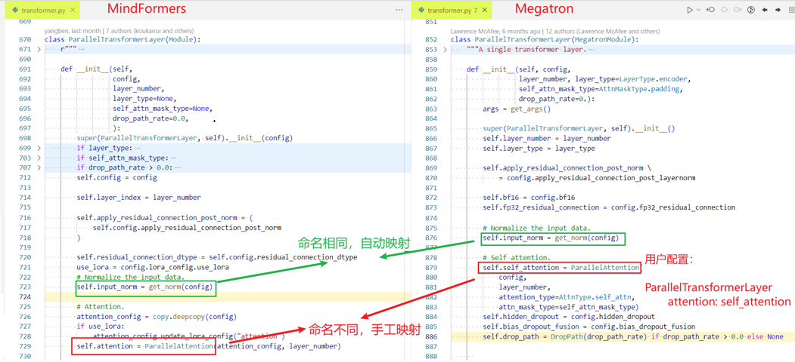

# PyTorch 场景的分级可视化构图比对

分级可视化工具将msprobe工具dump的精度数据进行解析，还原模型图结构，实现模型各个层级的精度数据比对，方便用户理解模型结构、分析精度问题。

工具支持PyTorch版本：2.1/2.2

## 1.依赖安装

分级可视化工具依赖**msprobe工具**和**tensorboard。**

### 1.1 安装msprobe工具

[msprobe工具安装](https://gitee.com/ascend/mstt/blob/master/debug/accuracy_tools/msprobe/docs/01.installation.md)

### 1.2 安装tensorboard

**注意，一定要安装本说明提供的tensorboard，如果您的环境已经安装tensorboard，请重新安装，否则无法解析构图结果。**

[tensorboard下载](https://mindstudio-sample.obs.cn-north-4.myhuaweicloud.com/tbgraph/tensorboard-2.15.1-py3-none-any.whl)

``pip3 install``即可。

## 2.模型结构数据采集
[PyTorch场景的数据采集](https://gitee.com/ascend/mstt/blob/master/debug/accuracy_tools/msprobe/docs/05.data_dump_PyTorch.md)

**需要选择level为L0（module信息）或者mix（module信息+api信息），才能采集到模型结构数据，即采集结果件construct.json内容不为空**。

## 3.生成图结构文件

### 3.1 构图命令行说明

**命令示例如下**：
```
msprobe -f pytorch graph -i ./compare.json -o ./output
```
**命令行参数说明**：

| 参数名                  | 说明                                                                                                                                                                                              | 是否必选 |
|----------------------|-------------------------------------------------------------------------------------------------------------------------------------------------------------------------------------------------|------|
| -i 或 --input_path    | 指定比对文件，str 类型。                                                                                                                                                                                  | 是    |
| -o 或 --output_path   | 配置比对结果文件存盘目录，str 类型。文件名称基于时间戳自动生成，格式为：`compare_{timestamp}.vis`。                                                                                                                                | 是    |
| -lm 或 --layer_mapping| 跨套件比对，例如同一个模型分别使用了DeepSpeed和Megatron套件的比对场景。配置该参数时表示开启跨套件Layer层的比对功能，指定模型代码中的Layer层后，可以识别对应dump数据中的模块或API。需要指定自定义映射文件*.yaml。自定义映射文件的格式请参见[自定义映射文件（Layer）](#71-自定义映射文件layer)。 | 否    |

**比对文件说明**：
以在当前目录创建 ./compare.json 为例。
```
{
"npu_path": "./npu_dump",
"bench_path": "./bench_dump",
"is_print_compare_log": true
}
```
**比对文件参数说明**：

| 参数名               | 说明                                                                                                     | 是否必选 |
|-------------------|--------------------------------------------------------------------------------------------------------|------|
| npu_path   | 指定待调试侧比对路径，str类型，路径下必须包含construct.json、dump.json和stack.json文件，注意construct.json内容不能为空，否则无法构图            | 是    |
| bench_path  | 指定标杆侧比对路径，str类型，路径下必须包含construct.json、dump.json和stack.json文件，注意construct.json内容不能为空，否则无法构图。单图构建场景可以不配置 | 否    |
| is_print_compare_log  | 配置是否开启单个算子的日志打屏。可取值 true 或 false，默认为 true。关闭后则只输出常规日志，bool 类型。                                         | 否    |


### 3.2 图构建和比对

**如果只是想查看一个模型的结构，请选择单图构建**；
**如果想比较两个模型的结构差异和精度数据差异，请选择双图比对**。

#### 3.2.1 单图构建

展示模型结构和精度数据。

**1. 准备比对文件**：

以在当前目录创建 ./compare.json 为例。
```
{
"npu_path": "./npu_dump",
"is_print_compare_log": true
}
```
**2. 执行命令**：
```
msprobe -f pytorch graph -i ./compare.json -o ./output
```
#### 3.2.2 双图比对

展示模型结构、结构差异、精度数据和精度比对指标、精度是否疑似有问题（精度比对指标差异越大颜色越深）。

当前比对支持三种类型的dump数据，分级可视化工具比对时会自动判断：

1.统计信息：仅dump了API和Module的输入输出数据统计信息，占用磁盘空间小；

2.真实数据：不仅dump了API和Module的输入输出数据统计信息，还将tensor进行存盘，占用磁盘空间大，但比对更加准确；

3.md5：dump了API和Module的输入输出数据统计信息和md5信息。

dump类型如何配置见[数据采集配置文件介绍](https://gitee.com/ascend/mstt/blob/master/debug/accuracy_tools/msprobe/docs/02.config_introduction.md)

**1. 准备比对文件**：

以在当前目录创建 ./compare.json 为例。
```
{
"npu_path": "./npu_dump",
"bench_path": "./bench_dump",
"is_print_compare_log": true
}
```
**2. 执行命令**：
```
msprobe -f pytorch graph -i ./compare.json -o ./output
```

比对完成后将在**output**下生成一个**vis后缀文件**。

## 4.启动tensorboard

将生成vis文件的路径**out_path**传入--logdir

```
tensorboard --logdir out_path --bind_all --port [可选，端口号]
```

启动后会打印日志。
``TensorBoard 2.15.1 at http://localhost.localdomain:6008/ (Press CTRL+C to quit)``
localhost.localdomain是机器地址，6008是端口号。

**如果链接打不开，可以尝试使用vscode连接服务器，在vscode终端输入：**

```
tensorboard --logdir out_path
```

CTRL+C点击链接即可

## 5.浏览器查看

推荐使用谷歌浏览器，在浏览器中输入机器地址+端口号回车，出现TensorBoard页面，右上方选择GRAPHS即可展示模型结构图。

节点需要双击打开。

键盘WS可放大缩小，AD可左右移动，鼠标滚轮可上下移动。

## 6.图比对说明

### 颜色

颜色越深，精度比对差异越大，越可疑，具体信息可见浏览器页面左下角颜色图例。

### 疑似有精度问题判定

#### 真实数据模式
节点中所有输入的最小双千指标和所有输出的最小双千分之一指标的差值，反映了双千指标的下降情况，**值越大精度差距越大，颜色标记越深**。

``One Thousandth Err Ratio（双千分之一）精度指标：Tensor中的元素逐个与对应的标杆数据对比，相对误差小于千分之一的比例占总元素个数的比例，比例越接近1越好``

#### 统计信息模式
节点中输出的统计量相对误差，**值越大精度差距越大，颜色标记越深**。

``相对误差：abs（(npu统计值 - bench统计值) / bench统计值)``

其中小值不使用相对误差来判断精度差异，而是使用**绝对误差**来判断精度差异

**判定为小值的阈值：**

   - torch.float32：e-6
   - torch.float16：e-3
   - torch.bfloat16：e-3

**小值域的绝对误差阈值：**

   - torch.float32：e-6
   - torch.float16：e-3
   - torch.bfloat16：e-3

#### md5模式
节点中任意输入输出的md5值不同。

## 7.附录
### 7.1 自定义映射文件（Layer）

文件名格式：\*.yaml，*为文件名，可自定义。

文件内容示例：

```yaml
PanGuVLMModel:                                    # Layer层名称
  vision_model: language_model.vision_encoder     # 模型代码中嵌套的Layer层名称
  vision_projection: language_model.projection

RadioViTModel:
  input_conditioner: radio_model.input_conditioner
  patch_generator: radio_model.patch_generator
  radio_model: radio_model.transformer

ParallelTransformerLayer:
  input_norm: input_layernorm
  post_attention_norm: post_attention_layernorm

GPTModel:
  decoder: encoder

SelfAttention:
  linear_qkv: query_key_value
  core_attention: core_attention_flash
  linear_proj: dense

MLP:
  linear_fc1: dense_h_to_4h
  linear_fc2: dense_4h_to_h
```

Layer层名称需要从模型代码中获取。

yaml文件中只需配置待调试侧与标杆侧模型代码中功能一致但名称不同的Layer层，名称相同的Layer层会被自动识别并映射。

模型代码示例：


