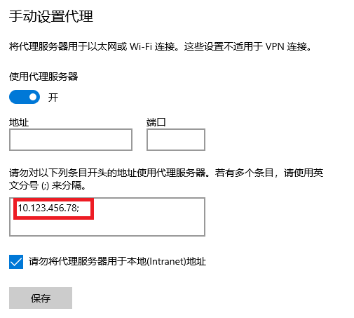
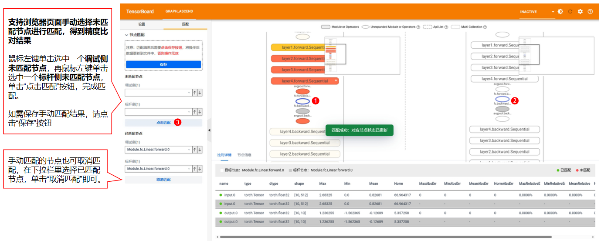

# MindSpore 场景的分级可视化构图比对

分级可视化工具将msprobe工具dump的精度数据进行解析，还原模型图结构，实现模型各个层级的精度数据比对，方便用户理解模型结构、分析精度问题。

工具支持MindSpore版本：>=2.4.0

## 工具特性

- 支持重建模型的层级结构；
- 支持两个模型的结构差异比对；
- 支持两个模型的精度数据比对；
- 支持模型数据的溢出检测；
- 支持多卡场景的批量构图，能够关联各卡的通信节点，分析各卡之间的数据传递；
- 支持节点名称搜索，按精度比对结果筛选节点，按溢出检测结果筛选节点，支持自动跳转展开节点所在的层级；
- 支持跨套件、跨框架的模型比对。
- 支持不同切分策略下两个模型的精度数据比对：[不同切分策略下的图合并](#325-不同切分策略下的图合并)。


## 1.依赖安装

### 1.1 安装msprobe工具

[msprobe工具安装](./01.installation.md)

### 1.2 安装tb_graph_ascend

**请安装tb_graph_ascend，否则无法解析构图结果。**

[tb_graph_ascend安装](../../../../plugins/tensorboard-plugins/tb_graph_ascend#2-安装方式)

## 2.模型结构数据采集
[PyTorch场景的数据采集](./06.data_dump_MindSpore.md)

**仅支持动态图场景，需要选择level为L0（cell信息）或者mix（cell信息+api信息），才能采集到模型结构数据，即采集结果件construct.json内容不为空**。

## 3.生成图结构文件

### 3.1 构图命令行说明
  
**命令示例如下**：
```
msprobe -f mindspore graph -i ./compare.json -o ./output
```
**命令行参数说明**：

| 参数名               | 说明                                                                                                                                                                                                                                                                                                                                                                    | 是否必选 |
|-------------------|-----------------------------------------------------------------------------------------------------------------------------------------------------------------------------------------------------------------------------------------------------------------------------------------------------------------------------------------------------------------------| -------- |
| -f 或 --framework    | 指定训练框架。mindspore。                                                                                                                                                                                                                                                                                                                                                     | 是                                 |
| -i 或 --input_path   | 指定比对文件，参考[比对文件说明](#313-比对文件说明)                                                                                                                                                                                                                                                                                                                                        | 是       |
| -o 或 --output_path  | 配置比对结果文件存盘目录，str 类型。文件名称基于时间戳自动生成，格式为：`compare_{timestamp}.vis.db或build_{timestamp}.vis.db`。                                                                                                                                                                                                                                                                          | 是       |
| -lm 或 --layer_mapping| 跨框架比对，MindSpore和PyTorch的比对场景。配置该参数时表示开启跨框架Layer层的比对功能，指定模型代码中的Layer层后，可以识别对应dump数据中的模块或API。需要指定自定义映射文件*.yaml。自定义映射文件的格式请参见[自定义映射文件（Layer）](#71-自定义映射文件layer), 如何配置自定义映射文件请参考[模型分级可视化如何配置layer mapping映射文件](./visualization/layer_mapping_example.md)。配置该参数后，将仅按节点名称进行比对，忽略节点的 type 和 shape。如果调试侧和标杆侧有名称不同的节点，则需要配置自定义映射文件，-lm参数传入自定义映射文件路径；如果调试侧和标杆侧节点名称相同，则仅指定-lm即可。 | 否    |
| -oc 或 --overflow_check | 是否开启溢出检测模式，开启后会在输出db文件中（`compare_{timestamp}.vis.db或build_{timestamp}.vis.db`）对每个溢出节点进行标记溢出等级，溢出等级说明参考[溢出等级说明](#312-溢出等级说明)                                                                                                                                                                                                                                           | 否    |
| -f 或 --fuzzy_match     | 是否开启模糊匹配，bool类型。模糊匹配说明参考[匹配说明](#311-匹配说明)                                                                                                                                                                                                                                                                                                                             | 否    |

#### 3.1.1 匹配说明

**注：dump名称 = 名称 + 调用次数**，例如Functional.matmul.2.forward，matmul是名称，2是调用次数

1.默认匹配
- 所有节点dump名称一致
- 节点输入输出参数数量一致，参数type、shape一致
- 节点的层级一致（父节点们一致）

2.模糊匹配
- Cell节点dump名称一致，两个匹配上的Cell节点，忽略各自节点下所有api的dump调用次数，按照名称一致+Cell节点内的调用顺序进行匹配
- 
- 参数shape一致

#### 3.1.2 溢出等级说明
- medium：输入异常，输出正常场景
- high：输入异常，输出异常；输出norm值相较于输入存在异常增大情况
- critical：输入正常，输出异常场景

#### 3.1.3 比对文件说明

以在当前目录创建 ./compare.json 为例。
```
{
"npu_path": "./npu_dump",
"bench_path": "./bench_dump",
"is_print_compare_log": true
}
```
**比对文件参数说明**：

| 参数名               | 说明                                                                         | 是否必选 |
|-------------------|----------------------------------------------------------------------------|------|
| npu_path   | 指定待调试侧比对路径，str类型。工具根据路径格式自动进行单rank比对、多rank批量比对或多step批量比对，具体格式参考3.2 图构建和比对。 | 是    |
| bench_path  | 指定标杆侧比对路径，str类型。单图构建场景可以不配置。                                               | 否    |
| is_print_compare_log  | 配置是否开启单个算子的日志打屏。可取值 true 或 false，默认为 true。关闭后则只输出常规日志，bool 类型。             | 否    |
| parallel_merge  | 配置是否开启不同切分策略下的图合并，dict类型。rank_size、tp、pp参数按实际情况进行配置。比对时配置npu、bench，只构图配置npu。 配置示例见[3.2.5 不同切分策略下的图合并](#325-不同切分策略下的图合并)。 | 否    |

### 3.2 图构建和比对

**如果只是想查看一个模型的结构，请选择单图构建**；
**如果想比较两个模型的结构差异和精度数据差异，请选择双图比对**。

#### 3.2.1 单图构建

展示模型结构、精度数据、堆栈信息。

**1. 准备比对文件**：

以在当前目录创建 ./compare.json 为例。
```
{
"npu_path": "./npu_dump",
"is_print_compare_log": true
}
```
npu_path格式：必须包含dump.json、stack.json和construct.json，且construct.json不能为空。如果construct.json为空，请检查dump的level参数是否没有选择L0或者mix。
```
├── npu_path
│   ├── dump_tensor_data（配置dump的task参数选择tensor时存在）
|   |    ├── MintFunctional.relu.0.backward.input.0.npy
|   |    ├── Mint.abs.0.forward.input.0.npy
|   |    ...
|   |    └── Cell.relu.ReLU.forward.0.input.0.npy
|   ├── dump.json         # 数据信息
|   ├── stack.json        # 调用栈信息
|   └── construct.json    # 分层分级结构，level为L1时，construct.json内容为空
```
**2. 执行命令**：
```
msprobe -f mindspore graph -i ./compare.json -o ./output
```
#### 3.2.2 双图比对

展示模型结构、结构差异、精度数据和精度比对指标、精度是否疑似有问题（精度比对指标差异越大颜色越深）。

当前比对支持三种类型的dump数据，分级可视化工具比对时会自动判断：

1.统计信息：仅dump了API和Module的输入输出数据统计信息，占用磁盘空间小；

2.真实数据：不仅dump了API和Module的输入输出数据统计信息，还将tensor进行存盘，占用磁盘空间大，但比对更加准确；

3.md5：dump了API和Module的输入输出数据统计信息和md5信息。

dump类型如何配置见[数据采集配置文件介绍](https://gitcode.com/Ascend/mstt/blob/master/debug/accuracy_tools/msprobe/docs/02.config_introduction.md)

**1. 准备比对文件**：

以在当前目录创建 ./compare.json 为例。
```
{
"npu_path": "./npu_dump",
"bench_path": "./bench_dump",
"is_print_compare_log": true
}
```
npu_path或bench_path格式：必须包含dump.json、stack.json和construct.json，且construct.json不能为空。如果construct.json为空，请检查dump的level参数是否没有选择L0或者mix。
```
├── npu_path或bench_path
│   ├── dump_tensor_data（配置dump的task参数选择tensor时存在）
|   |    ├── MintFunctional.relu.0.backward.input.0.npy
|   |    ├── Mint.abs.0.forward.input.0.npy
|   |    ...
|   |    └── Cell.relu.ReLU.forward.0.input.0.npy
|   ├── dump.json         # 数据信息
|   ├── stack.json        # 调用栈信息
|   └── construct.json    # 分层分级结构，level为L1时，construct.json内容为空
```
**2. 执行命令**：
```
msprobe -f mindspore graph -i ./compare.json -o ./output
```

比对完成后将在**output**下生成一个**vis后缀文件**。

#### 3.2.3 批量构建或比对
##### 3.2.3.1 多rank批量构建或比对
批量构建或比对一个step下的所有rank的数据

**1. 准备比对文件**：

以在当前目录创建 ./compare.json 为例。
```
{
"npu_path": "./npu_dump",
"bench_path": "./bench_dump", # 只进行图构建可不配置
"is_print_compare_log": true
}
```
npu_path或bench_path格式：必须只包含rank+数字格式的文件夹，且每个rank文件夹中必须包含dump.json、stack.json和construct.json，且construct.json不能为空。如果construct.json为空，请检查dump的level参数是否没有选择L0或者mix。

进行批量图比对时，npu_path和bench_path中包含的rank+数字格式的文件夹必须数量一致且能够一一对应。
```
├── npu_path或bench_path
|   ├── rank0
|   │   ├── dump_tensor_data（仅配置dump的task参数选择tensor时存在）
|   |   |    ├── MintFunctional.relu.0.backward.input.0.npy
|   |   |    ├── Mint.abs.0.forward.input.0.npy
|   |   |    ...
|   |   |    └── Cell.relu.ReLU.forward.0.input.0.npy
|   |   ├── dump.json         # 数据信息
|   |   ├── stack.json        # 算子调用栈信息
|   |   └── construct.json    # 分层分级结构，level为L1时，construct.json内容为空
|   ├── rank1
|   |   ├── dump_tensor_data
|   |   |   └── ...
|   |   ├── dump.json
|   |   ├── stack.json
|   |   └── construct.json
|   ├── ...
|   |
|   └── rankn
```
**2. 执行命令**：
```
msprobe -f mindspore graph -i ./compare.json -o ./output
```
比对完成后将在**output**下生成1个**vis.db后缀文件**。

图构建：
```
├── build_{timestamp}.vis.db
```
图比对：
```
├── compare_{timestamp}.vis.db
```
##### 3.2.3.2 多step批量构建或比对
批量构建或比对多个step下的所有rank的数据

**1. 准备比对文件**：

以在当前目录创建 ./compare.json 为例。
```
{
"npu_path": "./npu_dump",
"bench_path": "./bench_dump", # 只进行图构建可不配置
"is_print_compare_log": true
}
```
npu_path或bench_path格式：必须只包含step+数字格式的文件夹，且每个step文件夹中必须只包含rank+数字格式的文件夹，每个rank文件夹中必须包含dump.json、stack.json和construct.json，且construct.json不能为空。如果construct.json为空，请检查dump的level参数是否没有选择L0或者mix。

进行批量图比对时，npu_path和bench_path中包含的step+数字格式的文件夹必须数量一致且能够一一对应，每个step文件夹中包含的rank+数字格式的文件夹必须数量一致且能够一一对应。
```
├── npu_path或bench_path
│   ├── step0
│   |   ├── rank0
│   |   │   ├── dump_tensor_data（仅配置dump的task参数选择tensor时存在）
|   |   |   |    ├── MintFunctional.relu.0.backward.input.0.npy
|   |   |   |    ├── Mint.abs.0.forward.input.0.npy  
|   |   |   |    ...
|   |   |   |    └── Cell.relu.ReLU.forward.0.input.0.npy
│   |   |   ├── dump.json             # 数据信息
│   |   |   ├── stack.json            # 调用栈信息
│   |   |   └── construct.json        # 分层分级结构，level为L1时，construct.json内容为空
│   |   ├── rank1
|   |   |   ├── dump_tensor_data
|   |   |   |   └── ...
│   |   |   ├── dump.json
│   |   |   ├── stack.json
|   |   |   └── construct.json
│   |   ├── ...
│   |   |
|   |   └── rankn
│   ├── step1
│   |   ├── ...
│   ├── step2
```
**2. 执行命令**：
```
msprobe -f mindspore graph -i ./compare.json -o ./output
```
比对完成后将在**output**下生成1个**vis.db后缀文件**。

图构建：
```
├── build_{timestamp}.vis.db
```
图比对：
```
├── compare_{timestamp}.vis.db
```

#### 3.2.4 仅模型结构比对

适用场景：**主要关注模型结构而非训练过程数据**。例如，在模型迁移过程中，确保迁移前后模型结构的一致性，或在排查精度差异时，判断是否由模型结构差异所引起。

使用msprobe工具对模型数据进行采集时，**可选择仅采集模型结构（task配置为structure）**，此配置将避免采集模型训练过程的数据，从而显著减少采集所需的时间。

dump配置请参考[dump配置示例](./03.config_examples.md#35-task-配置为-structure)

得到dump数据后，若需比较特定两个rank之间的数据，请参考[3.2.2 双图比对](#322-双图比对)；若需进行多个rank或多个step的数据批量比对，请参考[3.2.3 批量构建或比对](#323-批量构建或比对)。

#### 3.2.5 不同切分策略下的图合并

适用场景：不同模型并行切分策略下，两个模型产生了精度差异，需要进行整网数据比对，但被切分的数据或模型结构分布于多rank中无法进行比对，需要将分布在各个rank的数据或模型结构合并后再进行比对。

使用限制：

- 当前支持的模型并行切分策略：Tensor Parallelism（TP）、Pipeline Parallelism（PP）、Virtual Pipeline Parallelism（VPP），暂不支持Context Parallelism（CP）和Expert Parallelism（EP）。
- 当前支持基于Megatron、MindSpeed-LLM套件的模型进行图合并，其他套件的模型图合并效果有待验证；
- 当前仅支持msprobe工具dump的statistics数据, level需指定L0或者mix；
- 图合并比对时要确保Data Parallelism（DP）切分一致，例如rank=8 tp=1 pp=8的配置，dp=1，图合并将得到一张图，rank=8 tp=1 pp=4的配置，dp=2，图合并将得到两张图，暂不支持数量不一致的图进行比对。

使能方式：

在compare.json里增加parallel_merge配置项， rank_size、tp、pp和vpp参数按实际情况进行配置。

参数说明：

所需tp、pp和vpp参数来自于Megatron、MindSpeed-LLM套件中的训练脚本实际配置。

| 参数名       | 说明                                                                                                                       | 是否必填 |
|-----------|--------------------------------------------------------------------------------------------------------------------------|------|
| rank_size | 模型实际训练所用加速卡的数量，int类型。`rank_size=tp*pp*cp*dp`，由于暂不支持CP合并，图合并功能中默认cp=1。                                                    | 是    |
| tp        | 张量并行大小，int类型。实际训练脚本中需指定`--tensor-model-parallel-size T`，其中`T`表示张量模型并行大小，即**图合并所需的参数tp**, `tp=T`。                           | 是    |
| pp        | 流水线并行的阶段数，int类型。实际训练脚本中需指定`--pipeline-model-parallel-size P`，其中`P`表示流水线并行的阶段数，即**图合并所需的参数pp**, `pp=P`。                     | 是    |
| vpp       | 虚拟流水线并行阶段数，int类型。虚拟流水线并行依赖流水线并行，实际训练脚本中需指定`--num-layers-per-virtual-pipeline-stage V`，其中`V`表示每个虚拟流水线阶段的层数；指定`--num-layers L`，其中`L`表示模型总层数，**图合并所需的参数vpp**=`L/V/P`。vpp参数可以不配置，默认vpp=1代表未开启虚拟流水线并行。 | 否    |
| order     | 模型并行维度的排序顺序，str类型。Megatron默认为`tp-cp-ep-dp-pp`。 如果使用msprobe工具dump数据指定level为L0并且实际训练脚本中的order非默认值（例如实际训练脚本中指定`--use-tp-pp-dp-mapping`），请传入修改后的order。dump数据指定level为mix则无需修改。                         | 否    |

npu_path、bench_path的配置以及执行命令请参考[3.2.3 批量构建或比对](#323-批量构建或比对)

如果只进行图构建，"bench_path"和"parallel_merge"中的"bench"参数可不配置。

```
{
  "npu_path": "./npu_dump",
  "bench_path": "./bench_dump",
  "is_print_compare_log": true,
  "parallel_merge": {
    "npu": {"rank_size": 8, "tp": 8, "pp": 1},
    "bench": {"rank_size": 8, "tp": 1, "pp": 8}
  }
}
```

## 4.启动TensorBoard

### 4.1 可直连的服务器

将生成vis文件的路径**out_path**传入--logdir

```
tensorboard --logdir out_path --bind_all --port [可选，端口号]
```
启动后会打印日志:


ubuntu是机器地址，6008是端口号。

**注意，ubuntu需要替换为真实的服务器地址，例如真实的服务器地址为10.123.456.78，则需要在浏览器窗口输入 http://10.123.456.78:6008**

### 4.2 不可直连的服务器
**如果链接打不开（服务器无法直连需要挂vpn才能连接等场景），可以尝试以下方法，选择其一即可：**

1.本地电脑网络手动设置代理，例如Windows10系统，在【手动设置代理】中添加服务器地址（例如10.123.456.78）



然后，在服务器中输入：
```
tensorboard --logdir out_path --bind_all --port 6008[可选，端口号]
```

最后，在浏览器窗口输入 http://10.123.456.78:6008

**注意，如果当前服务器开启了防火墙，则此方法无效，需要关闭防火墙，或者尝试后续方法**

2.或者使用vscode连接服务器，在vscode终端输入：
```
tensorboard --logdir out_path
```


按住CTRL点击链接即可

3.或者将构图结果件vis文件从服务器传输至本地电脑，在本地电脑中安装tb_graph_ascend插件查看构图结果

电脑终端输入：
```
tensorboard --logdir out_path
```
按住CTRL点击链接即可

## 5.浏览器查看

### 5.1 浏览器打开图
推荐使用谷歌浏览器，在浏览器中输入机器地址+端口号回车，出现TensorBoard页面，其中/#graph_ascend会自动拼接。


如果您切换了TensorBoard的其他功能，此时想回到模型分级可视化页面，可以点击左上方的**GRAPH_ASCEND**


### 5.2 查看图


MicroStep是指在一次完整的权重更新前执行的多次前向和反向传播过程，一次完整的训练迭代（step）可以进一步细分为多个更小的步骤（micro step）。其中分级可视化工具通过识别模型首层结构中一次完整的前反向作为一次micro step。

### 5.3 名称搜索


### 5.4 精度筛选


### 5.5 未匹配节点筛选

参考[匹配说明](#311-匹配说明) ，不符合匹配规则的节点为无匹配节点，颜色标灰。适用于排查两个模型结构差异的场景。


### 5.6 手动选择节点匹配

可通过浏览器界面，通过鼠标选择两个待匹配的灰色节点进行匹配。当前暂不支持真实数据模式。



## 6.图比对说明

### 6.1 颜色

颜色越深，精度比对差异越大，越可疑，具体信息可见浏览器页面左下角颜色图例。

#### 6.1.1 真实数据模式
节点中所有输入的最小双千指标和所有输出的最小双千分之一指标的差值，反映了双千指标的下降情况，**该数值越大，表明两组模型的精度差异越大，在图中标注的对应颜色会更深**。

``One Thousandth Err Ratio（双千分之一）精度指标：Tensor中的元素逐个与对应的标杆数据对比，相对误差小于千分之一的比例占总元素个数的比例，比例越接近1越好``

如果调试侧（NPU）节点的output指标中的最大值（MAX）或最小值（MIN）中存在 nan/inf/-inf，直接标记为最深颜色。

#### 6.1.2 统计信息模式
节点中输出的统计量相对误差，**该数值越大，表明两组模型的精度差异越大，在图中标注的对应颜色会更深**。

``相对误差：abs((npu统计值 - bench统计值) / bench统计值)``

如果调试侧（NPU）节点的output指标中的最大值（MAX）或最小值（MIN）中存在 nan/inf/-inf，直接标记为最深颜色。

#### 6.1.3 md5模式
节点中任意输入输出的md5值不同。

### 6.2 指标说明

精度比对从三个层面评估 API 的精度，依次是：真实数据模式、统计数据模式和 MD5 模式。比对结果分别有不同的指标。

**公共指标**：
- name: 参数名称，例如input.0
- type: 类型，例如mindspore.Tensor
- dtype: 数据类型，例如BFloat32
- shape: 张量形状，例如[32, 1, 32]
- Max: 最大值
- Min: 最小值
- Mean: 平均值
- Norm: L2-范数

**真实数据模式指标**：
- Cosine: tensor 余弦相似度
- EucDist: tensor 欧式距离
- MaxAbsErr: tensor 最大绝对误差
- MaxRelativeErr: tensor 最大相对误差
- One Thousandth Err Ratio: tensor 相对误差小于千分之一的比例（双千分之一）
- Five Thousandth Err Ratio: tensor 相对误差小于千分之五的比例（双千分之五）

**统计数据模式指标**
- (Max, Min, Mean, Norm) diff: 统计量绝对误差
- (Max, Min, Mean, Norm) RelativeErr: 统计量相对误差

**MD5模式指标**
- md5: CRC-32 值

## 7.附录
### 7.1 自定义映射文件（Layer）

文件名格式：\*.yaml，*为文件名，可自定义。

文件内容示例：

```yaml
ParallelAttention:                 # Layer层名称
  qkv_proj: query_key_value        # 冒号左侧为MindSpore框架模型代码中嵌套的Layer层名称，冒号右侧为PyTorch框架模型代码中嵌套的Layer层名称
  out_proj: dense

ParallelTransformerLayer:
  attention: self_attention

Embedding:
  dropout: embedding_dropout

ParallelMLP:
  mapping: dense_h_to_4h
  projection: dense_4h_to_h

PipelineCell:
  model: module

Cell:
  network_with_loss: module
```

Layer层名称需要从模型代码中获取。

yaml文件中只需配置MindSpore与PyTorch模型代码中功能一致但名称不同的Layer层，名称相同的Layer层会被自动识别并映射。

模型代码示例：


# FAQ
1. 图比对场景，节点呈现灰色，且没有精度比对数据，怎么处理？

节点呈现灰色，代表左边待调试侧节点与右边标杆侧节点没有匹配上，可能有以下几点原因：

- **标杆侧确实没有能与待调试侧匹配上的节点**，属于代码实现上的差异，请确认此差异是否正常，是否会影响到整网精度。
- **节点名称一致，但节点的输入或输出type、shape不一致，参数个数不一致，节点所在层级的父层级不一致，导致节点无法匹配**
  - 具体匹配规则见[匹配说明](#311-匹配说明)，可尝试使用模糊匹配功能，如何使用此功能请参考[构图命令行说明](#31-构图命令行说明)；
  - 如果是参数shape不一致，即使是模糊匹配功能也无法让节点匹配上，请检查参数shape不一致是否合理。
- **节点名称不一致**，导致节点无法匹配，目前提供两种方法，选其一即可
  - 可使用layer mapping功能，如何使用此功能请参考[构图命令行说明](#31-构图命令行说明)，如何自定义映射文件请参考[模型分级可视化如何配置layer mapping映射文件](./visualization/layer_mapping_example.md)；
  - 可通过浏览器页面手动选择未匹配节点进行匹配，请参考[手动选择节点匹配](#56-手动选择节点匹配)。
