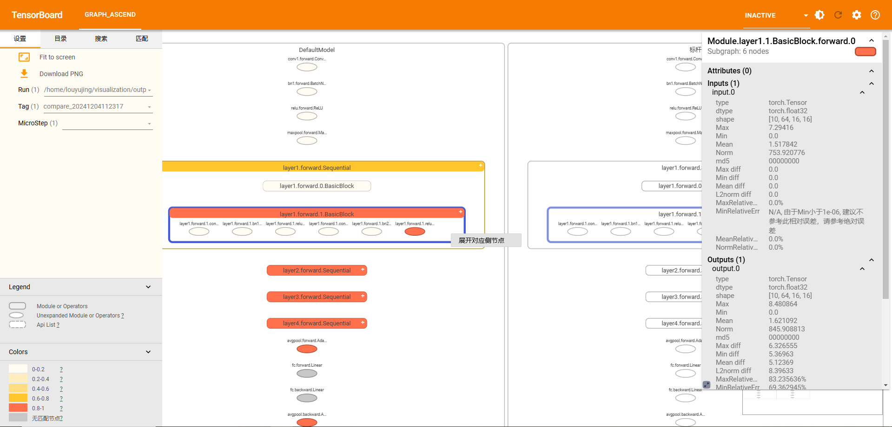
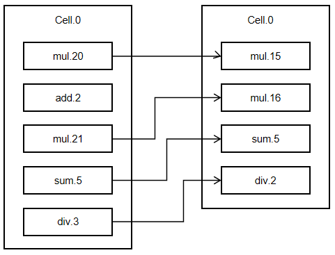
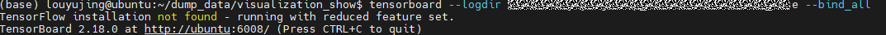
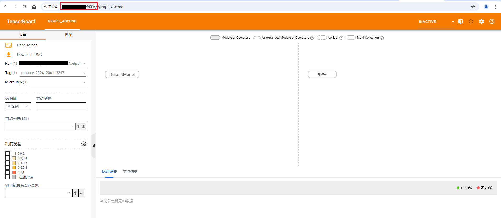
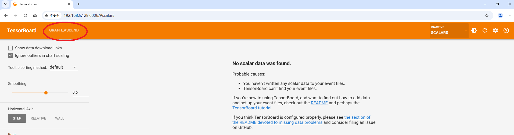
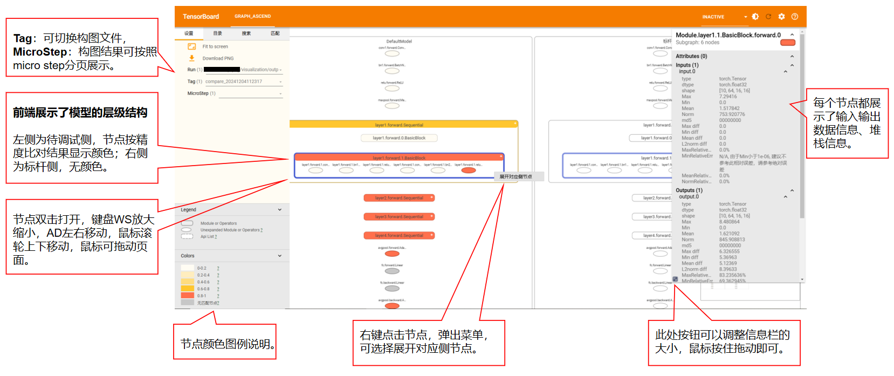
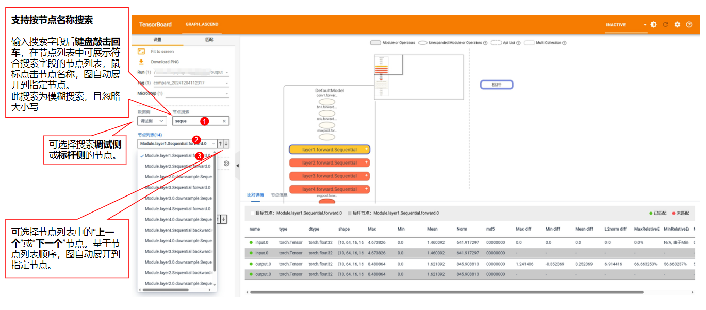
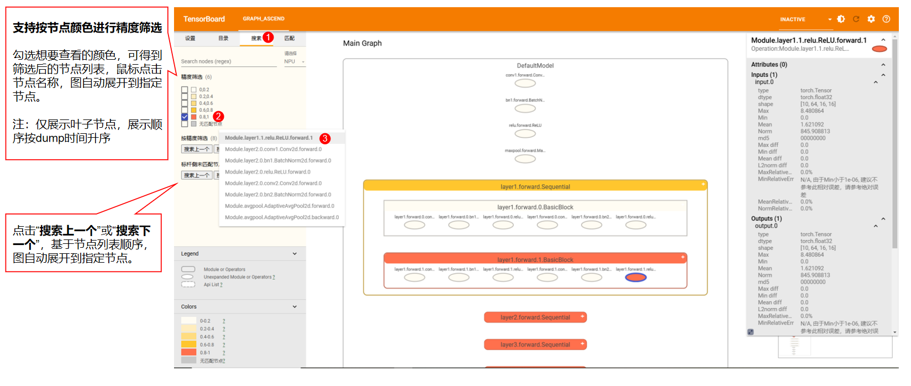
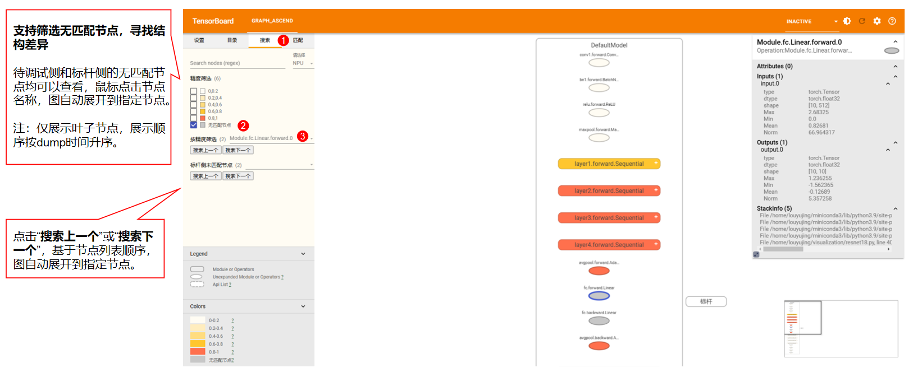

# MindSpore 场景的分级可视化构图比对

分级可视化工具将msprobe工具dump的精度数据进行解析，还原模型图结构，实现模型各个层级的精度数据比对，方便用户理解模型结构、分析精度问题。

工具支持MindSpore版本：2.4.0

## 展示示例

支持重建模型的层级结构；

支持两个模型的结构差异比对；

支持两个模型的精度数据比对，支持疑似有精度问题节点的快速搜索，自动跳转展开节点所在的层级。



## 1.依赖安装

分级可视化工具依赖**msprobe工具**和**tensorboard。**

### 1.1 安装msprobe工具

[msprobe工具安装](https://gitee.com/ascend/mstt/blob/master/debug/accuracy_tools/msprobe/docs/01.installation.md)

### 1.2 安装tb_graph_ascend

**请安装tb_graph_ascend，否则无法解析构图结果。**

``pip3 install tb-graph-ascend``即可。

## 2.模型结构数据采集
[MindSpore场景的精度数据采集](https://gitee.com/ascend/mstt/blob/master/debug/accuracy_tools/msprobe/docs/06.data_dump_MindSpore.md)

**仅支持动态图场景，需要选择level为L0（cell信息）或者mix（cell信息+api信息），才能采集到模型结构数据，即采集结果件construct.json内容不为空**。

## 3.生成图结构文件

### 3.1 构图命令行说明

**命令示例如下**：
```
msprobe -f mindspore graph -i ./compare.json -o ./output
```
**命令行参数说明**：

| 参数名               | 说明                                                                                                                                                            | 是否必选 |
|-------------------|---------------------------------------------------------------------------------------------------------------------------------------------------------------| -------- |
| -i 或 --input_path   | 指定比对文件，str 类型。                                                                                                                                                | 是       |
| -o 或 --output_path  | 配置比对结果文件存盘目录，str 类型。文件名称基于时间戳自动生成，格式为：`compare_{timestamp}.vis`。                                                                                              | 是       |
| -lm 或 --layer_mapping| 跨框架比对，MindSpore和PyTorch的比对场景。配置该参数时表示开启跨框架Layer层的比对功能，指定模型代码中的Layer层后，可以识别对应dump数据中的模块或API。需要指定自定义映射文件*.yaml。自定义映射文件的格式请参见[自定义映射文件（Layer）](#71-自定义映射文件layer)。 | 否    |
| -f 或 --fuzzy_match  | 是否开启模糊匹配，bool类型。模糊匹配说明参考如下。                                                                                                                                                  | 否    |

**匹配说明**

**注：dump名称 = 名称 + 调用次数**，例如Functional.matmul.2.forward，matmul是名称，2是调用次数

1.默认匹配
- 所有节点dump名称一致
- 节点输入输出参数数量一致，参数type、shape一致
- 节点的层级一致（父节点们一致）

2.模糊匹配
- Cell节点dump名称一致，两个匹配上的Cell节点, 忽略各自节点下所有api的dump调用次数，按照名称一致+Cell节点内的调用顺序进行匹配
- 
- 参数shape一致

**比对文件说明**：

以在当前目录创建 ./compare.json 为例。
```
{
"npu_path": "./npu_dump",
"bench_path": "./bench_dump",
"is_print_compare_log": true
}
```
**比对文件参数说明**：

| 参数名               | 说明                                                                                                    | 是否必选 |
|-------------------|-------------------------------------------------------------------------------------------------------|------|
| npu_path   | 指定待调试侧比对路径，str类型。工具根据路径格式自动进行单rank比对、多rank批量比对或多step批量比对，具体格式参考3.2 图构建和比对。           | 是    |
| bench_path  | 指定标杆侧比对路径，str类型。单图构建场景可以不配置 | 否    |
| is_print_compare_log  | 配置是否开启单个算子的日志打屏。可取值 true 或 false，默认为 true。关闭后则只输出常规日志，bool 类型。                                        | 否    |


### 3.2 图构建和比对

**如果只是想查看一个模型的结构，请选择单图构建**；
**如果想比较两个模型的结构差异和精度数据差异，请选择双图比对**。

#### 3.2.1 单图构建

展示模型结构、精度数据、堆栈信息。

**1. 准备比对文件**：

以在当前目录创建 ./compare.json 为例。
```
{
"npu_path": "./npu_dump",
"is_print_compare_log": true
}
```
npu_path格式：必须包含dump.json、stack.json和construct.json，且construct.json不能为空。如果construct.json为空，请检查dump的level参数是否没有选择L0或者mix。
```
├── npu_path
│   ├── dump_tensor_data（配置dump的task参数选择tensor时存在）
|   |    ├── MintFunctional.relu.0.backward.input.0.npy
|   |    ├── Mint.abs.0.forward.input.0.npy
|   |    ...
|   |    └── Cell.relu.ReLU.forward.0.input.0.npy
|   ├── dump.json         # 数据信息
|   ├── stack.json        # 调用栈信息
|   └── construct.json    # 分层分级结构，level为L1时，construct.json内容为空
```
**2. 执行命令**：
```
msprobe -f mindspore graph -i ./compare.json -o ./output
```
#### 3.2.2 双图比对

展示模型结构、结构差异、精度数据和精度比对指标、精度是否疑似有问题（精度比对指标差异越大颜色越深）。

当前比对支持三种类型的dump数据，分级可视化工具比对时会自动判断：

1.统计信息：仅dump了API和Module的输入输出数据统计信息，占用磁盘空间小；

2.真实数据：不仅dump了API和Module的输入输出数据统计信息，还将tensor进行存盘，占用磁盘空间大，但比对更加准确；

3.md5：dump了API和Module的输入输出数据统计信息和md5信息。

dump类型如何配置见[数据采集配置文件介绍](https://gitee.com/ascend/mstt/blob/master/debug/accuracy_tools/msprobe/docs/02.config_introduction.md)

**1. 准备比对文件**：

以在当前目录创建 ./compare.json 为例。
```
{
"npu_path": "./npu_dump",
"bench_path": "./bench_dump",
"is_print_compare_log": true
}
```
npu_path或bench_path格式：必须包含dump.json、stack.json和construct.json，且construct.json不能为空。如果construct.json为空，请检查dump的level参数是否没有选择L0或者mix。
```
├── npu_path或bench_path
│   ├── dump_tensor_data（配置dump的task参数选择tensor时存在）
|   |    ├── MintFunctional.relu.0.backward.input.0.npy
|   |    ├── Mint.abs.0.forward.input.0.npy
|   |    ...
|   |    └── Cell.relu.ReLU.forward.0.input.0.npy
|   ├── dump.json         # 数据信息
|   ├── stack.json        # 调用栈信息
|   └── construct.json    # 分层分级结构，level为L1时，construct.json内容为空
```
**2. 执行命令**：
```
msprobe -f mindspore graph -i ./compare.json -o ./output
```

比对完成后将在**output**下生成一个**vis后缀文件**。

#### 3.2.3 批量构建或比对
##### 3.2.3.1 多rank批量构建或比对
批量构建或比对一个step下的所有rank的数据

**1. 准备比对文件**：

以在当前目录创建 ./compare.json 为例。
```
{
"npu_path": "./npu_dump",
"bench_path": "./bench_dump", # 只进行图构建可不配置
"is_print_compare_log": true
}
```
npu_path或bench_path格式：必须只包含rank+数字格式的文件夹，且每个rank文件夹中必须包含dump.json、stack.json和construct.json，且construct.json不能为空。如果construct.json为空，请检查dump的level参数是否没有选择L0或者mix。

进行批量图比对时，npu_path和bench_path中包含的rank+数字格式的文件夹必须数量一致且能够一一对应。
```
├── npu_path或bench_path
|   ├── rank0
|   │   ├── dump_tensor_data（仅配置dump的task参数选择tensor时存在）
|   |   |    ├── MintFunctional.relu.0.backward.input.0.npy
|   |   |    ├── Mint.abs.0.forward.input.0.npy
|   |   |    ...
|   |   |    └── Cell.relu.ReLU.forward.0.input.0.npy
|   |   ├── dump.json         # 数据信息
|   |   ├── stack.json        # 算子调用栈信息
|   |   └── construct.json    # 分层分级结构，level为L1时，construct.json内容为空
|   ├── rank1
|   |   ├── dump_tensor_data
|   |   |   └── ...
|   |   ├── dump.json
|   |   ├── stack.json
|   |   └── construct.json
|   ├── ...
|   |
|   └── rankn
```
**2. 执行命令**：
```
msprobe -f mindspore graph -i ./compare.json -o ./output
```
比对完成后将在**output**下生成n个**vis后缀文件**。

图构建：
```
├── build_rank0_{timestamp}.vis
├── build_rank1_{timestamp}.vis
├── build_rank2_{timestamp}.vis
├── build_rank3_{timestamp}.vis
├── ...
├── build_rankn_{timestamp}.vis
```
图比对：
```
├── compare_rank0_{timestamp}.vis
├── compare_rank1_{timestamp}.vis
├── compare_rank2_{timestamp}.vis
├── compare_rank3_{timestamp}.vis
├── ...
├── compare_rankn_{timestamp}.vis
```
##### 3.2.3.2 多step批量构建或比对
批量构建或比对多个step下的所有rank的数据

**1. 准备比对文件**：

以在当前目录创建 ./compare.json 为例。
```
{
"npu_path": "./npu_dump",
"bench_path": "./bench_dump", # 只进行图构建可不配置
"is_print_compare_log": true
}
```
npu_path或bench_path格式：必须只包含step+数字格式的文件夹，且每个step文件夹中必须只包含rank+数字格式的文件夹，每个rank文件夹中必须包含dump.json、stack.json和construct.json，且construct.json不能为空。如果construct.json为空，请检查dump的level参数是否没有选择L0或者mix。

进行批量图比对时，npu_path和bench_path中包含的step+数字格式的文件夹必须数量一致且能够一一对应，每个step文件夹中包含的rank+数字格式的文件夹必须数量一致且能够一一对应。
```
├── npu_path或bench_path
│   ├── step0
│   |   ├── rank0
│   |   │   ├── dump_tensor_data（仅配置dump的task参数选择tensor时存在）
|   |   |   |    ├── MintFunctional.relu.0.backward.input.0.npy
|   |   |   |    ├── Mint.abs.0.forward.input.0.npy  
|   |   |   |    ...
|   |   |   |    └── Cell.relu.ReLU.forward.0.input.0.npy
│   |   |   ├── dump.json             # 数据信息
│   |   |   ├── stack.json            # 调用栈信息
│   |   |   └── construct.json        # 分层分级结构，level为L1时，construct.json内容为空
│   |   ├── rank1
|   |   |   ├── dump_tensor_data
|   |   |   |   └── ...
│   |   |   ├── dump.json
│   |   |   ├── stack.json
|   |   |   └── construct.json
│   |   ├── ...
│   |   |
|   |   └── rankn
│   ├── step1
│   |   ├── ...
│   ├── step2
```
**2. 执行命令**：
```
msprobe -f mindspore graph -i ./compare.json -o ./output
```
比对完成后将在**output**下生成若干个**vis后缀文件**。

图构建：
```
├── build_step0_rank0_{timestamp}.vis
├── build_step0_rank1_{timestamp}.vis
├── build_step0_rank2_{timestamp}.vis
├── build_step0_rank3_{timestamp}.vis
├── build_step1_rank0_{timestamp}.vis
├── build_step1_rank1_{timestamp}.vis
├── build_step1_rank2_{timestamp}.vis
├── build_step1_rank3_{timestamp}.vis
├── ...
├── build_stepn_rankn_{timestamp}.vis
```
图比对：
```
├── compare_step0_rank0_{timestamp}.vis
├── compare_step0_rank1_{timestamp}.vis
├── compare_step0_rank2_{timestamp}.vis
├── compare_step0_rank3_{timestamp}.vis
├── compare_step1_rank0_{timestamp}.vis
├── compare_step1_rank1_{timestamp}.vis
├── compare_step1_rank2_{timestamp}.vis
├── compare_step1_rank3_{timestamp}.vis
├── ...
├── compare_stepn_rankn_{timestamp}.vis
```

## 4.启动tensorboard

### 4.1 可直连的服务器

将生成vis文件的路径**out_path**传入--logdir

```
tensorboard --logdir out_path --bind_all --port [可选，端口号]
```
启动后会打印日志:



ubuntu是机器地址，6008是端口号。

**注意，ubuntu需要替换为真实的服务器地址，例如真实的服务器地址为10.123.456.78，则需要在浏览器窗口输入http://10.123.456.78:6008**

### 4.2 不可直连的服务器
**如果链接打不开（服务器无法直连需要挂vpn才能连接等场景），可以尝试使用vscode连接服务器，在vscode终端输入：**

```
tensorboard --logdir out_path
```


按住CTRL点击链接即可

## 5.浏览器查看

### 5.1 浏览器打开图
推荐使用谷歌浏览器，在浏览器中输入机器地址+端口号回车，出现TensorBoard页面，其中/#graph_ascend会自动拼接。

如果您切换了TensorBoard的其他功能，此时想回到模型分级可视化页面，可以点击左上方的**GRAPH_ASCEND**


### 5.2 查看图


### 5.3 名称搜索


### 5.4 精度筛选


### 5.5 未匹配节点筛选
节点匹配规则：

1.名称一致

2.节点输入输出参数数量一致，参数type、shape一致

3.节点的层级一致（父节点们一致）



## 6.图比对说明

### 颜色

颜色越深，精度比对差异越大，越可疑，具体信息可见浏览器页面左下角颜色图例。

### 疑似有精度问题判定

#### 真实数据模式
节点中所有输入的最小双千指标和所有输出的最小双千分之一指标的差值，反映了双千指标的下降情况，**值越大精度差距越大，颜色标记越深**。

``One Thousandth Err Ratio（双千分之一）精度指标：Tensor中的元素逐个与对应的标杆数据对比，相对误差小于千分之一的比例占总元素个数的比例，比例越接近1越好``

#### 统计信息模式
节点中输出的统计量相对误差，**值越大精度差距越大，颜色标记越深**。

``相对误差：abs（(npu统计值 - bench统计值) / bench统计值)``

#### md5模式
节点中任意输入输出的md5值不同。

## 7.附录
### 7.1 自定义映射文件（Layer）

文件名格式：\*.yaml，*为文件名，可自定义。

文件内容示例：

```yaml
ParallelAttention:                 # Layer层名称
  qkv_proj: query_key_value        # 冒号左侧为MindSpore框架模型代码中嵌套的Layer层名称，冒号右侧为PyTorch框架模型代码中嵌套的Layer层名称
  out_proj: dense

ParallelTransformerLayer:
  attention: self_attention

Embedding:
  dropout: embedding_dropout

ParallelMLP:
  mapping: dense_h_to_4h
  projection: dense_4h_to_h

PipelineCell:
  model: module

Cell:
  network_with_loss: module
```

Layer层名称需要从模型代码中获取。

yaml文件中只需配置MindSpore与PyTorch模型代码中功能一致但名称不同的Layer层，名称相同的Layer层会被自动识别并映射。

模型代码示例：


