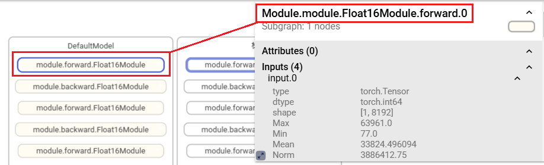
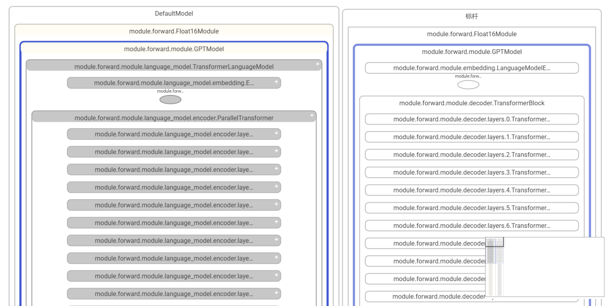
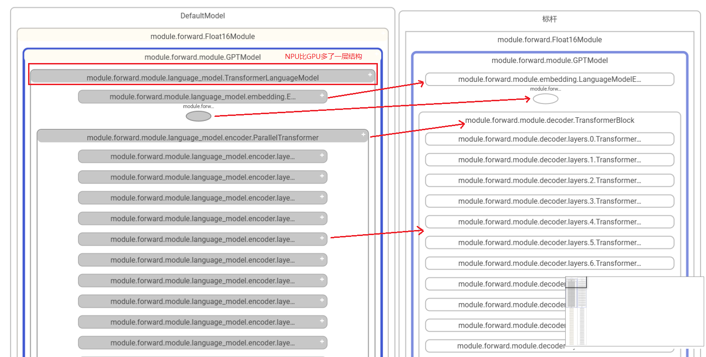
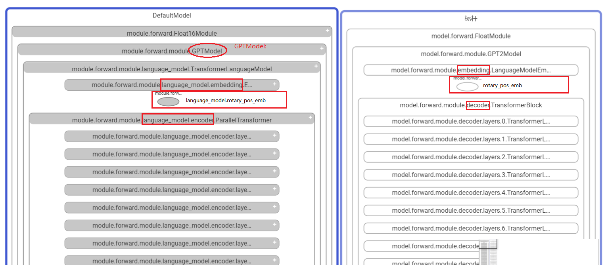
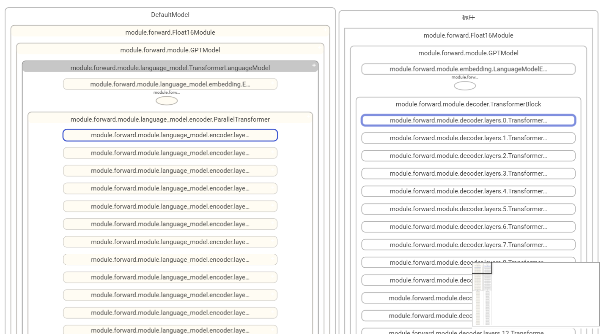
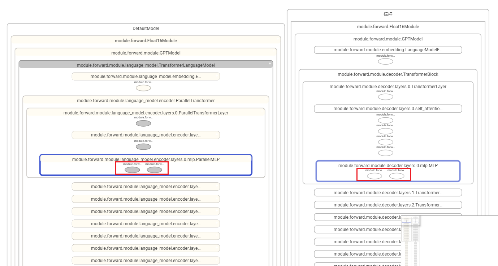
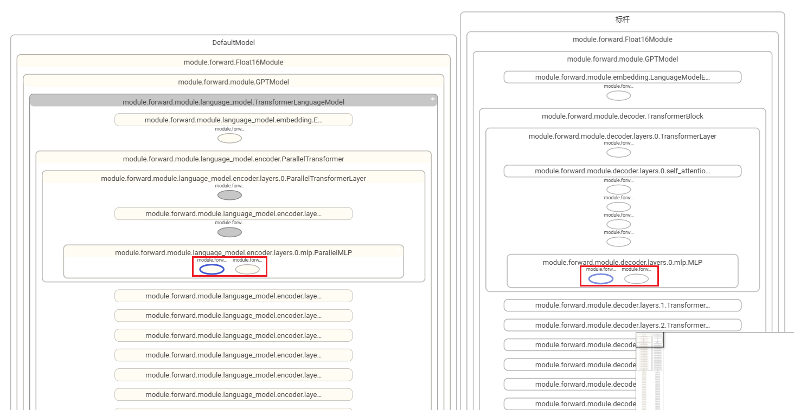

# 模型分级可视化如何配置layer mapping映射文件

## 1.使用场景
同框架跨套件比对（例如PyTorch DeepSpeed vs Megatron），或者跨框架比对（例如PyTorch vs MindSpore），**由于代码实现的差异，导致一些模型层级和层级命名有所不同无法进行匹配**，需要进行layer层名称映射，才能够比对。

## 2.模块命名说明

由于有些节点的名称比较长，例如Module.module.module.language_model.embedding.Embedding.forward.0，在图节点上由于字符串过长无法完整显示，forward或backward信息被省略，**因此节点中显示的名称字符串去掉了Module前缀，并将forward或backward信息提取到名称字符串的第二位展示**。




### 2.1 命名格式

**{Module}.{module_name}.{class_name}.{forward/backward}.{调用次数}**

**layer mapping主要是针对module_name的映射**

#### 2.1.1 命名示例

- **Module.module.Float16Module.forward.0** -----> Module{**Module**}.module{**module_name**}.Float16Module{**class_name**}.forward.0{**调用次数**}
- **Module.module.module.GPTModel.forward.0** -----> Module{**Module**}.module.module{**module_name**}.GPTModel{**class_name**}.forward.0{**调用次数**}
- **Module.module.module.language_model.TransformerLanguageModel.forward.0** -----> Module{**Module**}.module.module.language_model{**module_name**}.TransformerLanguageModel{**class_name**}.forward.0{**调用次数**}
- **Module.module.module.language_model.embedding.Embedding.forward.0** -----> Module{**Module**}.module.module.language_model.embedding{**module_name**}.Embedding{**class_name**}.forward.0{**调用次数**}

可以看到，module_name随着模型层级的深入在变长，**embedding层module_name拼接了它的上层language_model、上上层module和顶层module**。

## 3.示例

如图所示，左边为NPU模型，右边为GPU模型，由于代码实现上的差异，导致模型层级和层级命名有所不同，导致节点无法匹配，**图上节点显示为灰色，表示节点未匹配**。



### 3.1 看图分析

同一模型使用了不同套件或者框架，虽然两个模型的层级关系和层级命名可能有所不同，但也可以从图上的**节点名称**看出一些匹配关系，例如同是embedding层，代码里也是会命名为xxx_embedding，不会命名为xxx_norm，体现在节点名称上也是带有embedding的信息，并且层级关系也是大致相同的。



分析可知，节点匹配关系如下：

**注意，仅需关注module_name的差异**

| NPU节点名称           | GPU节点名称                                                        | module_name差异                        |
|-------------------|----------------------------------------------------------------|---------------------------|
| Module.module.Float16Module.forward.0 | Module.model.FloatModule.forward.0                                 | NPU为module，GPU为model      |
| Module.module.module.GPTModel.forward.0 | Module.model.module.GPT2Model.forward.0                            | NPU为module，GPU为module，无差异 |
| Module.module.module.language_model.TransformerLanguageModel.forward.0 | 无                                                              | NPU多了一层                   |
| Module.module.module.language_model.embedding.Embedding.forward.0 | Module.module.module.embedding.LanguageModelEmbedding.forward.0  | NPU为language_model.embedding，GPU为embedding           |
| Module.module.module.language_model.rotary_pos_emb.RotaryEmbedding.forward.0 | Module.module.module.rotary_pos_emb.RotaryEmbedding.forward.0    | NPU为language_model.rotary_pos_emb，GPU为rotary_pos_emb |
| Module.module.module.language_model.encoder.ParallelTransformer.forward.0 | Module.module.module.decoder.TransformerBlock.forward.0          | NPU为language_model.encoder，GPU为decoder               |
| Module.module.module.language_model.encoder.layers.0.ParallelTransformerLayer.forward.0 | Module.module.module.decoder.layers.0.TransformerLayer.forward.0 | 父层级有差异，本层级NPU和GPU都叫layers，无差异                        |

### 3.2 构建layer_mapping配置文件
准备一个命名为mapping.yaml文件，建立**module_name**的映射关系

#### 3.2.1 顶层模块映射
NPU和GPU侧的模块Module.module.Float16Module.forward.0和Module.model.FloatModule.forward.0处于图的顶层，需要进行如下配置：


```yaml
TopLayer:
  module: model
```

#### 3.2.2 其他模块映射
配置module下的子模块，虽然两边的class_name不同（NPU侧为GPTModel，GPU侧为GPT2Model），**但是仅需取NPU侧也就是左边图的class_name进行配置，无需关心右边图的class_name叫什么**。

**这里涉及到跨层级的配置，NPU多了一层language_model层**，将language_model作为embedding层、rotary_pos_emb层和encoder层的前缀，进行如下配置：



```yaml
GPTModel:
    language_model.embedding: embedding
    language_model.rotary_pos_emb: rotary_pos_emb
    language_model.encoder: decoder
```
然后看Module.module.module.language_model.encoder.ParallelTransformer.forward.0层下的子模块：

此层下的若干个层，NPU和GPU的层名都叫layers，**当前层名称相同，则不用进行配置**。

### 3.3 查看效果

执行命令，指定-lm：
```
msprobe -f pytorch graph -i ./compare.json -o ./output -lm ./mapping.yaml
```
或
```
msprobe -f mindspore graph -i ./compare.json -o ./output -lm ./mapping.yaml
```
可以看到，除了language_model层（NPU多的一层，GPU没有层与其匹配），其余在mapping.yaml文件配置的层均匹配上了。



### 3.4 继续配置

展开节点过程中，如果发现还有未匹配节点，则继续配置mapping.yaml



按前一章过程进行分析配置，分析可知，节点匹配关系如下：

| NPU节点名称           | GPU节点名称                                                          | 差异                                          |
|-------------------|------------------------------------------------------------------|---------------------------------------------|
| Module.module.module.language_model.encoder.layers.0.mlp.dense_h_to_4h.ColumnParallelLinear.forward.0 | Module.module.module.decoder.layers.0.mlp.linear_fc1.TELayerNormColumnParallelLinear.forward.0      | NPU为dense_h_to_4h，GPU为linear_fc1            |
| Module.module.module.language_model.encoder.layers.0.mlp.dense_4h_to_h.RowParallelLinear.forward.0 | Module.module.module.decoder.layers.0.mlp.linear_fc2.TERowParallelLinear.forward.0  | NPU为dense_4h_to_h，GPU为linear_fc2 |


追加mapping.yaml配置：

```yaml
TopLayer:
  module: model

GPTModel:
    language_model.embedding: embedding
    language_model.rotary_pos_emb: rotary_pos_emb
    language_model.encoder: decoder

ParallelMLP:
    dense_h_to_4h: linear_fc1
    dense_4h_to_h: linear_fc2
```

执行命令，查看效果，可以看到节点已成功匹配上。


