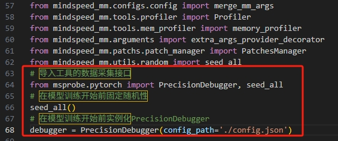
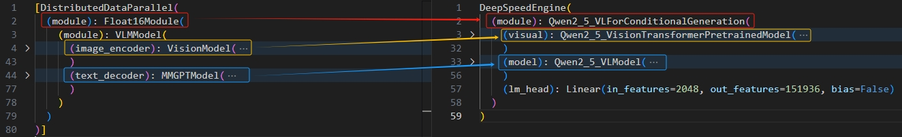
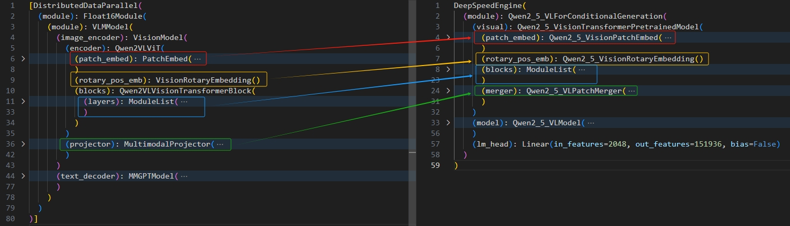
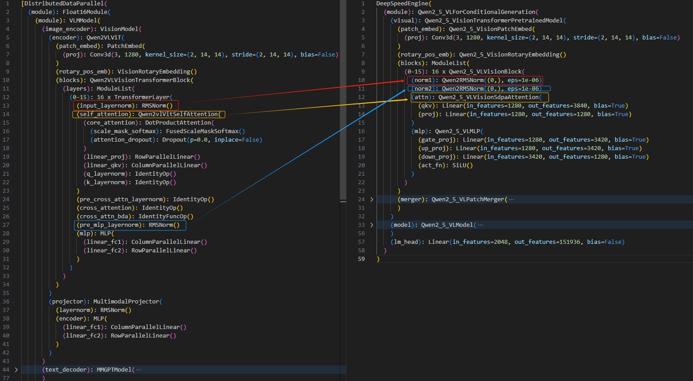
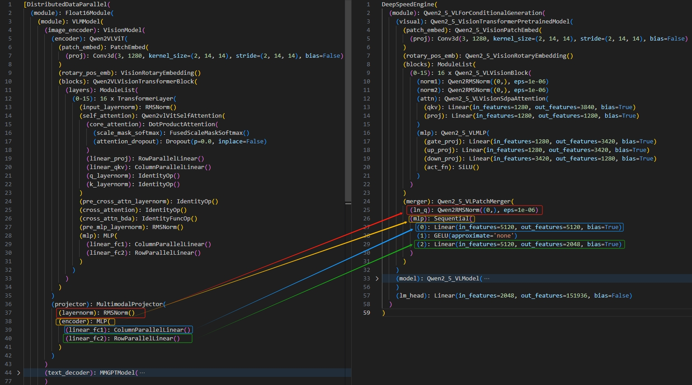
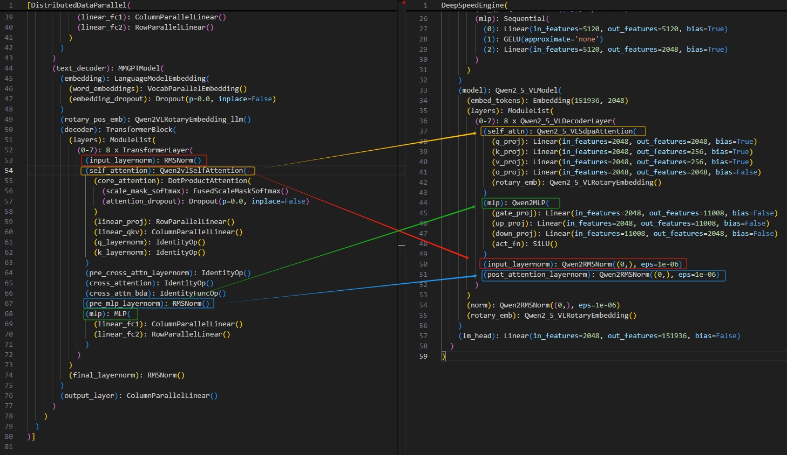

# MindSpeed&LLamaFactory数据采集和自动比对

## 0. 使用场景
基于MindSpeed和LLamaFactory框架实现的同一模型，在模型超参、环境变量、初始权重、训练数据等一致的前提下，训练过程中出现了精度差异，需要进行**整网比对**寻找精度差异点。

本文选取Qwen2.5vl和Qwen2.5模型，指导用户如何进行MindSpeed&LLamaFactory数据采集和自动比对。

## 1. 数据采集

### 1.1 准备数据采集配置文件

数据采集前需要准备一个json文件，本案例命名为config.json，其内容包含了数据采集的所需配置。

本案例使用的配置内容如下，更多配置请参考[config.json 配置示例](../03.config_examples.md)，配置详细介绍请参考[配置文件介绍](../02.config_introduction.md)。

```json
{
    "task": "statistics",
    "dump_path": "/home/data_dump",
    "rank": [],
    "step": [0],
    "level": "mix",
    "async_dump": false,

    "statistics": {
        "scope": [], 
        "list": [],
        "tensor_list": [],
        "data_mode": ["all"],
        "summary_mode": "statistics"
    }
}
```
请注意，在数据采集结束后将进行模型分级可视化比对，配置文件中的`level`需要配置为`L0`（模块数据）或`mix`（模块+API数据）。

### 1.2 添加msprobe工具采集接口

本案例使用的工具采集接口配置如下，更多配置和接口介绍请参考[PyTorch 场景的精度数据采集](../05.data_dump_PyTorch.md)。

#### 1.2.1 LLamaFactory数据采集

LLamaFactory依赖Transformers的底层能力，msprobe工具采集功能将添加在Transformers中。

以Transformers 4.49.0版本为例，通过`pip3 show Transformers`获取`Location路径`，打开`Location路径/transformers/trainer.py`文件。

1. 在trainer.py文件中添加工具接口，初始化数据采集配置以及固定随机数：

   

2. 在trainer.py文件**训练循环逻辑位置**添加工具接口，控制数据采集的启动、停止和step计数：

   

3. 配置完成，启动模型训练脚本，数据将自动采集，落盘数据格式请参考[PyTorch 场景的精度数据采集-dump-结果文件介绍](../05.data_dump_PyTorch.md#3-dump-结果文件介绍)。

#### 1.2.2 MindSpeed数据采集

打开training.py文件，MindSpeed-MM路径为`mindspeed_mm/training.py`，MindSpeed-LLM路径为`mindspeed_llm/training/training.py`。

1. 在training.py文件中添加工具接口，初始化数据采集配置以及固定随机数：

   

2. 在training.py文件**训练循环逻辑位置**添加工具接口，控制数据采集的启动、停止和step计数：

   

3. 配置完成，启动模型训练脚本，数据将自动采集，落盘数据格式请参考[PyTorch 场景的精度数据采集-dump-结果文件介绍](../05.data_dump_PyTorch.md#3-dump-结果文件介绍)。

## 2. 自动比对

### 2.1 模型分级可视化比对

该功能将msprobe工具dump的精度数据进行解析，还原模型图结构，实现模型各个层级的精度数据比对，方便用户理解模型结构、分析精度问题。

我们将使用以下命令行进行模型分级可视化比对：

```
msprobe -f pytorch graph -i ./compare.json -o ./output -lm ./layer_mapping.yaml
```
具体的参数说明请点击查看[分级可视化构图比对-构图命令行说明](../21.visualization_PyTorch.md#31-构图命令行说明)。

在基于MindSpeed和LLamaFactory框架的模型比对场景中，**-lm参数是必填的**，-lm参数所需的layer_mapping.yaml如何配置将在下面的章节进行介绍。

模型分级可视化比对完成后，可通过tensorboard（需安装[tb_graph_ascend插件](../21.visualization_PyTorch.md#1依赖安装)）启动端口，在浏览器页面查看模型结构和精度比对结果，请参考[分级可视化构图比对-启动tensorboard](../21.visualization_PyTorch.md#4启动tensorboard)和[分级可视化构图比对-浏览器查看](../21.visualization_PyTorch.md#5浏览器查看)。

### 2.2 layer_mapping映射文件配置
msprobe工具的比对功能会将比对双方dump名称一致的数据进行比对。由于MindSpeed和LLamaFactory框架代码实现的差异，一些模型层级和层级名称有所不同导致无法进行匹配，需要进行layer层名称映射，才能够比对。

#### 2.2.1 layer_mapping映射文件模板

此处提供了Qwen2.5vl和Qwen2.5模型的layer_mapping映射文件模板，可直接使用。**如果您使用其他模型，或对MindSpeed和LLamaFactory框架进行过定制开发修改过框架源码，此layer_mapping映射文件模板可能会失效，请按照后续步骤修改layer_mapping映射文件模板**。

每个模型有两个layer_mapping映射文件模板，分别是NPU侧为Mindspeed Bench侧为LLamaFactory，以及NPU侧为LLamaFactory Bench侧为Mindspeed，映射内容有所不同。

文件名格式：\*.yaml，*为文件名，可自定义。本文命名为layer_mapping.yaml。

**Qwen2.5vl**

```yaml
# NPU侧为Mindspeed-MM, Bench侧为LLamaFactory
TopLayer:
  0.module: module

Float16Module:
  module.image_encoder: visual
  module.text_decoder: model

VisionModel:
  encoder.patch_embed: patch_embed
  encoder.rotary_pos_emb: rotary_pos_emb
  encoder.blocks.layers: blocks
  projector: merger

TransformerLayer:
  input_layernorm: norm1
  self_attention: attn
  pre_mlp_layernorm: norm2

Qwen2vlVitSelfAttention:
  linear_qkv: qkv
  linear_proj: proj

MLP:
  linear_fc1: up_proj
  linear_fc2: down_proj

MultimodalProjector:
  layernorm: ln_q
  encoder: mlp
  encoder.linear_fc1: mlp.0
  encoder.linear_fc2: mlp.2

MMGPTModel:
  embedding.word_embeddings: embed_tokens
  rotary_pos_emb: rotary_emb
  decoder.layers: layers
  decoder.final_layernorm: norm
  output_layer: lm_head
```
```yaml
# NPU侧为LLamaFactory, Bench侧为Mindspeed-MM
TopLayer:
  module: 0.module

Qwen2_5_VLForConditionalGeneration:
  visual: module.image_encoder
  model: module.text_decoder
  lm_head: module.text_decoder.output_layer

Qwen2_5_VisionTransformerPretrainedModel:
  patch_embed: encoder.patch_embed
  rotary_pos_emb: encoder.rotary_pos_emb
  blocks: encoder.blocks.layers
  merger: projector

Qwen2_5_VLVisionBlock:
  norm1: input_layernorm
  attn: self_attention
  norm2: pre_mlp_layernorm

Qwen2_5_VLVisionSdpaAttention:
  qkv: linear_qkv
  proj: linear_proj

Qwen2_5_VLMLP:
  up_proj: linear_fc1
  down_proj: linear_fc2

Qwen2_5_VLPatchMerger:
  ln_q: layernorm
  mlp: encoder
  mlp.0: encoder.linear_fc1
  mlp.2: encoder.linear_fc2

Qwen2_5_VLModel:
  embed_tokens: embedding.word_embeddings
  rotary_emb: rotary_pos_emb
  layers: decoder.layers
  norm: decoder.final_layernorm

Qwen2_5_VLDecoderLayer:
  self_attn: self_attention
  self_attn.o_proj: self_attention.linear_proj
  post_attention_layernorm: pre_mlp_layernorm
```

**Qwen2.5**

```yaml
# NPU侧为Mindspeed-LLM, Bench侧为LLamaFactory
TopLayer:
  0.module: module

Float16Module:
  module: model
  module.output_layer: lm_head

GPTModel:
  embedding.word_embeddings: embed_tokens
  decoder.layers: layers
  decoder.final_layernorm: norm

TransformerLayer:
  self_attention: self_attn
  pre_mlp_layernorm: post_attention_layernorm

SelfAttention:
  linear_proj: o_proj

MLP:
  linear_fc1: up_proj
  linear_fc2: down_proj
```
```yaml
# NPU侧为LLamaFactory, Bench侧为Mindspeed-LLM
TopLayer:
  module: 0.module

Qwen2ForCausalLM:
  model: module
  lm_head: module.output_layer

Qwen2Model:
  embed_tokens: embedding.word_embeddings
  layers: decoder.layers
  norm: decoder.final_layernorm

Qwen2DecoderLayer:
  self_attn: self_attention
  post_attention_layernorm: pre_mlp_layernorm

Qwen2Attention:
  o_proj: linear_proj

Qwen2MLP:
  up_proj: linear_fc1
  down_proj: linear_fc2
```

#### 2.2.2 layer_mapping映射文件配置过程
以Qwen2.5vl模型，NPU侧MindSpeed，Bench侧LLamaFactory为例。

1. 模型结构打印

   参考[添加msprobe工具采集接口](#12-添加msprobe工具采集接口)章节，配置过程中会在模型文件中添加`debugger.start(model=model)`，针对`start接口`中的`model`进行`print(model)`即可打印模型结构。

   打印的模型结构：[mindspeed-mm-qwen25vl.txt](./mindspeed_llamafactoary_img/mindspeed-mm-qwen25vl.txt)，[llamafactory-qwen25vl.txt](./mindspeed_llamafactoary_img/llamafactory-qwen25vl.txt)

2. 基于模型结构由外到内进行layer mapping配置

- 结构1

   
   
   ```yaml
   TopLayer: # 代表模型最顶层
     0.module: module # MindSpeed的model类型是list，msprobe采集会对其添加数字前缀，代表当前模型在list中的索引，因此要做0.module -> module的映射
   
   Float16Module: # MindSpeed的Float16Module与LLamaFactory的Qwen2_5_VLForConditionalGeneration同级，对它们的子层进行映射
     module.image_encoder: visual # MindSpeed的Float16Module多了一个子层module，跨层级用"."分隔，配置为module.image_encoder
     module.text_decoder: model
   ```
- 结构2

   
   
   ```yaml
   VisionModel: # MindSpeed的VisionModel与LLamaFactory的Qwen2_5_VisionPatchEmbed同级，对它们的子层进行映射
     encoder.patch_embed: patch_embed
     encoder.rotary_pos_emb: rotary_pos_emb
     encoder.blocks.layers: blocks
     projector: merger
   ```
- 结构3

   
   
   ```yaml
   TransformerLayer: # MindSpeed的TransformerLayer与LLamaFactory的Qwen2_5_VLVisionBlock同级，对它们的子层进行映射
     input_layernorm: norm1
     self_attention: attn
     pre_mlp_layernorm: norm2
   ```
- 结构4

   
   
   ```yaml
   Qwen2vlVitSelfAttention: # MindSpeed的Qwen2vlVitSelfAttention与LLamaFactory的Qwen2_5_VLVisionSdpaAttention同级，对它们的子层进行映射
     linear_qkv: qkv
     linear_proj: proj
   
   MLP: # MindSpeed的MLP与LLamaFactory的Qwen2_5_VLMLP同级，对它们的子层进行映射
     linear_fc1: up_proj
     linear_fc2: down_proj
   ```
- 结构5

   
   
   ```yaml
   MultimodalProjector: # MindSpeed的MultimodalProjector与LLamaFactory的Qwen2_5_VLPatchMerger同级，对它们的子层进行映射
     layernorm: ln_q
     encoder: mlp
     encoder.linear_fc1: mlp.0
     encoder.linear_fc2: mlp.2
   ```
- 结构6

   
   
   ```yaml
   MMGPTModel: # MindSpeed的MMGPTModel与LLamaFactory的Qwen2_5_VLModel同级，对它们的子层进行映射
     embedding.word_embeddings: embed_tokens
     rotary_pos_emb: rotary_emb
     decoder.layers: layers
     decoder.final_layernorm: norm
     output_layer: lm_head
   ```
- 结构7

   
   
   由于TransformerLayer和MLP层已经配置过，无法再重复配置，此处的节点映射可通过[手动选择节点匹配](#23-手动选择节点匹配)完成。

### 2.3 手动选择节点匹配
如果通过layer_mapping映射配置后，还有节点未匹配上，可通过浏览器界面，使用鼠标选择两个待匹配的灰色节点进行匹配。

请参考[分级可视化构图比对-手动选择节点匹配](../21.visualization_PyTorch.md#56-手动选择节点匹配)。
