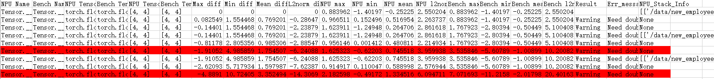
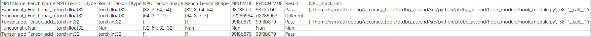

# **精度比对工具**

## 总体说明

- 本节主要介绍通过命令行方式和比对函数方式进行CPU或GPU与NPU的精度数据比对，执行精度比对操作前需要先完成CPU或GPU与NPU的精度数据dump，参见《[精度数据采集](./dump.md)》。

- 训练精度一体化工具msprobe，使用子命令compare进行比对，可支持单卡和多卡场景的精度数据比对。

- 比对函数均通过单独创建精度比对脚本执行，可支持单卡和多卡场景的精度数据比对。

- 工具性能：比对数据量较小时（参考值单份文件小于10GB），参考比对速度0.1GB/s；比对数据量较大时，参考比对速度0.3GB/s。 推荐环境配置：独占环境，CPU核心数192，固态硬盘（IO速度参考：固态硬盘 > 500MB/s，机械硬盘60 ~ 170MB/s）。

  用户环境性能弱于标准约束或非独占使用的比对速度酌情向下浮动。比对速度的计算方式：两份比对文件大小/比对耗时。

## 约束

- NPU自研API，在CPU或GPU若没有对应的API，该API的dump数据不比对。
- NPU与CPU或GPU的计算结果误差可能会随着模型的执行不断累积，最终会出现同一个API因为输入的数据差异较大而无法比对的情况。
- CPU或GPU与NPU中两个相同的API会因为调用次数不同导致无法比对或比对到错误的API，不影响整体运行，该API忽略。

## 命令行方式比对

将CPU或GPU与NPU的dump文件进行比对，支持单卡和多卡，可同时比对多卡的dump数据。多机场景需要每个设备单独执行比对操作。

请先参见《[精度数据采集](./dump.md)》完成CPU或GPU与NPU的精度数据dump。

**版本提示**：命令行方式从msprobe 1.0.2版本开始支持。

### 操作步骤

1. 创建比对文件，文件内容及示例请参见“**比对文件**”。

2. 执行如下示例命令进行比对：

   ```shell
   msprobe -f pytorch compare -i ./compare.json -o ./output -s
   ```

   **完整参数说明**

   | 参数名               | 说明                                                                                                                                                                                                 | 是否必选 |
   |-------------------|----------------------------------------------------------------------------------------------------------------------------------------------------------------------------------------------------| -------- |
   | -i或--input_path   | 指定比对文件路径。比对文件内容及示例请参见“**比对文件**”。                                                                                                                                                                   | 是       |
   | -o或--output_path  | 配置比对结果文件存盘目录。文件名称基于时间戳自动生成，格式为：`compare_result_{timestamp}.xlsx`。                                                                                                                                  | 是       |
   | -s或--stack_mode   | 配置stack_mode的开关。仅当**比对文件**配置"stack_path"需要开启。通过直接配置该参数开启，默认未配置，表示关闭。                                                                                                                               | 否       |
   | -c或--compare_only | 仅比对开关。未配置默认关闭仅比对，使用自动精度分析，工具自动针对比对结果进行分析，识别到第一个精度不达标节点（在比对结果文件中的“Accuracy Reached or Not”列显示为No），并给出问题可能产生的原因（打屏展示并生成advisor_{timestamp}.txt文件）。该参数默认未配置，使用自动精度分析，通过配置该参数开启仅比对，关闭自动精度分析，仅输出比对结果表格。 | 否       |
   | -f或--fuzzy_match  | 模糊匹配。开启后，对于网络中同一层级且命名仅调用次数不同的API，可匹配并进行比对。通过直接配置该参数开启，默认未配置，表示关闭。                                                                                                                                  | 否       |

3. 查看比对结果，请参见“**比对结果分析**”。

### 比对文件

以在当前目录创建./compare.json为例。

- 单卡场景示例

  ```json
  {
  "npu_path": "./npu_dump/dump.json",
  "bench_path": "./bench_dump/dump.json",
  "stack_path": "./npu_dump/stack.json",
  "is_print_compare_log": true
  }
  ```

- 多卡场景示例

  ```json
  {
  "npu_path": "./npu_dump/step0",
  "bench_path": "./bench_dump/step0",
  "is_print_compare_log": true
  }
  ```

**参数说明**

| 参数名               | 说明                                                         | 是否必选           |
| -------------------- | ------------------------------------------------------------ | ------------------ |
| npu_path             | 配置NPU环境下的dump.json文件（单卡场景）或真实数据目录（多卡场景）。数据类型：str。 | 是                 |
| bench_path           | 配置CPU、GPU或NPU环境下的dump.json文件（单卡场景）或真实数据目录（多卡场景）。数据类型：str。 | 是                 |
| stack_path           | 配置NPU dump目录下的stack.json文件。数据类型：str。          | 单卡必选，多卡不选 |
| is_print_compare_log | 配置是否开启日志打屏。可取值True或False。数据类型：bool      | 否                 |

## 比对函数方式比对

### compare_distributed

**功能说明**

将CPU或GPU与NPU的dump文件进行比对，支持单卡和多卡，可同时比对多卡的dump数据。多机场景需要每个设备单独执行比对操作。可自动检索和匹配对应卡和进程所dump的数据文件，再调用compare进行比对。单机单卡时与compare函数二选一。

**函数原型**

```Python
compare_distributed(npu_dump_dir, bench_dump_dir, output_path, **kwargs)
```

**参数说明**

| 参数名         | 说明                                                         | 是否必选 |
| -------------- | ------------------------------------------------------------ | -------- |
| npu_dump_dir   | 配置NPU环境下的dump目录。dump数据目录须指定到step级。参数示例：'./npu_dump/step0'。数据类型：str。 | 是       |
| bench_dump_dir | 配置CPU、GPU或NPU环境下的dump目录。参数示例：'./gpu_dump/step0'。数据类型：str。 | 是       |
| output_path    | 配置比对结果文件存盘目录。需要预先创建output_path目录。参数示例：'./output'。文件名称基于时间戳自动生成，格式为：`compare_result_rank{npu_ID}-rank{cpu/gpu/npu_ID}_{timestamp}.xlsx`。数据类型：str。 | 是       |
| **kwargs       | 支持compare的所有可选参数。                                  | 否       |

**函数示例**

创建比对脚本，例如compare_distributed.py，拷贝如下代码，具体参数请根据实际环境修改。

```Python
from msprobe.pytorch import *
compare_distributed('./npu_dump/step0', './gpu_dump/step0', './output')
```

dump数据目录须指定到step级。

### compare

**功能说明**

将CPU或GPU与NPU的dump文件进行比对，仅支持单机单卡。

**函数原型**

```Python
compare(input_param, output_path, stack_mode=False, auto_analyze=True, fuzzy_match=False)
```

**参数说明**

| 参数名       | 说明                                                         | 是否必选 |
| ------------ | ------------------------------------------------------------ | -------- |
| input_param  | 配置dump数据文件及目录。数据类型：dict。配置参数包括：<br>        "npu_json_path"：指定NPU dump目录下的dump.json文件。参数示例："npu_json_path": "./npu_dump/dump.json"。必选。<br/>        "bench_json_path"：指定CPU、GPU或NPU dump目录下的dump.json文件。参数示例："bench_json_path": "./bench_dump/dump.json"。必选。<br/>        "stack_json_path"：指定NPU dump目录下的stack.json文件。参数示例："stack_json_path": "./npu_dump/stack.json"。可选。<br/>        "is_print_compare_log"：配置是否开启日志打屏。可取值True或False。可选。 | 是       |
| output_path  | 配置比对结果文件存盘目录。参数示例：'./output'。文件名称基于时间戳自动生成，格式为：`compare_result_{timestamp}.xlsx`。数据类型：str。 | 是       |
| stack_mode   | 配置stack_mode的开关。仅当配置"stack_json_path"需要开启。可取值True或False，参数示例：stack_mode=True，默认为False。数据类型：bool。 | 否       |
| auto_analyze | 自动精度分析，开启后工具自动针对比对结果进行分析，识别到第一个精度不达标节点（在比对结果文件中的“Accuracy Reached or Not”列显示为No），并给出问题可能产生的原因（打屏展示并生成advisor_{timestamp}.txt文件）。可取值True或False，参数示例：auto_analyze=False，默认为True。数据类型：bool。 | 否       |
| fuzzy_match  | 模糊匹配。开启后，对于网络中同一层级且命名仅调用次数不同的API，可匹配并进行比对。可取值True或False，参数示例：fuzzy_match=True，默认为False。数据类型：bool。 | 否       |

**函数示例**

单机单卡场景下创建比对脚本，例如compare.py，拷贝如下代码，具体参数请根据实际环境修改。

```Python
from msprobe.pytorch import compare
input_param={
"npu_json_path": "./npu_dump/dump.json",
"bench_json_path": "./bench_dump/dump.json",
"stack_json_path": "./npu_dump/stack.json",
"is_print_compare_log": True
}
compare(input_param, output_path="./output", stack_mode=True)
```

### 统计量比对

若使用**compare**或**compare_distributed**函数创建的比对脚本中，在[config.json](../../config/config.json)文件中配置"task": "statistics"方式dump时，可以进行统计量比对，此时比对dump.json文件中的统计信息，开启后的比对结果文件生成Max diff、Min diff、Mean diff和L2norm diff，表示NPU dump数据中API的输入或输出与标杆数据输入或输出的最大值、最小值、平均值以及L2范数的差。可以通过该值判断API是否存在精度问题：当某个API的输入和输出的Max diff、Min diff、Mean diff和L2norm diff均为0或无限趋于0，那么可以判断该API无精度问题，反之则可能存在精度问题。

**比对脚本示例**

以compare.py为例。

```Python
from msprobe.pytorch import compare
input_param={
"npu_json_path": "./npu_dump/dump.json",
"bench_json_path": "./bench_dump/dump.json",
"stack_json_path": "./npu_dump/stack.json",
"is_print_compare_log": True
}
compare(input_param, output_path="./output", stack_mode=True)
```

**比对结果**

数据量比对同样生成`compare_result_{timestamp}.xlsx`和`advisor_{timestamp}.txt`文件。其中`advisor_{timestamp}.txt`主要对`compare_result_{timestamp}.xlsx`中可能存在精度问题（Result为Waring）的API提出定位建议；`compare_result_{timestamp}.xlsx`主要有如下两种情况：

- "summary_mode": "statistics"时比对dump.json文件：

  

  上图是对dump.json文件中NPU及标杆API的统计信息进行比对，判断可能存在精度问题的API，文件中记录NPU及标杆API的基本信息和统计信息，其中需要关注Result列，包含结果：Waring（NPU与标杆统计信息的比对中存在相对误差大于0.5，则需要重点检查该API）；为空（相对误差小于等于0.5，可以不需要重点关注，但不代表不存在精度问题）；Nan（表示统计信息数据没有匹配上）。

- "summary_mode": "md5"时比对dump.json文件：

  

  上图是对dump.json文件中NPU及标杆API的MD5信息进行比对，判断API数据的完整性，文件中记录NPU及标杆API的基本信息和MD5信息，其中需要关注Result列，包含结果：Pass（表示NPU与标杆的MD5值一致，即API数据完整）；Different（表示NPU与标杆的MD5值不一致，即API数据不完全一致，可以通过NPU_Stack_Info列API调用栈查询该API的详细信息）；Nan（表示MD5信息数据没有匹配上）。

## 比对结果分析

PyTorch精度比对是以CPU或GPU的计算结果为标杆，通过计算精度评价指标判断API在运行时是否存在精度问题。

- `advisor_{timestamp}.txt`文件中给出了可能存在精度问题的API的专家建议，可直接打开查看。

- `compare_result_{timestamp}.xlsx`文件列出了所有执行精度比对的API详细信息和比对结果，如下示例：

  

  可以从该结果文件中进行“**判断计算精度达标情况**”、“**计算精度评价指标分析**”以及“**异常信息识别**”等分析动作。

### **判断计算精度达标情况**

精度比对结果`compare_result_{timestamp}.xlsx`文件中只需要通过Accuracy Reached or Not来判断计算精度是否达标，判断标准如下：

1. Cosine < 0.99 且 MaxAbsError > 0.001时，精度不达标，标记为“No”。
2. Cosine < 0.9，精度不达标，标记为“No”。
3. MaxAbsError > 1，精度不达标，标记为“No”。
4. 其余情况下记为精度达标，标记为“Yes”。

### **计算精度评价指标分析**

1. Cosine：通过计算两个向量的余弦值来判断其相似度，数值越接近于1说明计算出的两个张量越相似，实际可接受阈值为大于0.99。在计算中可能会存在nan，主要由于可能会出现其中一个向量为0。

2. MaxAbsErr：当最大绝对误差越接近0表示其计算的误差越小，实际可接受阈值为小于0.001。

3. MaxRelativeErr：当最大相对误差越接近0表示其计算的误差越小。

   当dump数据中存在0或Nan时，比对结果中最大相对误差则出现inf或Nan的情况，属于正常现象。

4. One Thousandth Err Ratio（双千分之一）、Five Thousandths Err Ratio（双千分之五）精度指标：是指NPU的Tensor中的元素逐个与对应的标杆数据对比，相对误差大于千分之一、千分之五的比例占总元素个数的比例小于千分之一、千分之五。该数据仅作为精度下降趋势的参考，并不参与计算精度是否通过的判定。

### **异常信息识别**

精度比对结果`compare_result_{timestamp}.xlsx`文件中对于存在异常信息的API会进行高亮处理：

- 红色可能出现的情况有：
  - NPU max或NPU min信息中存在nan/inf
  - Max diff存在大于1e+10的值
  - 统计数据中output的Max diff除以max(0.01, Bench max) > 0.5
  - 真实数据中One Thousandth Err Ratio的input > 0.9同时output < 0.6
- 黄色可能出现的情况有：
  - Max diff的input与output都大于1，同时output比input大一个数量级以上
  - 统计数据Max diff除以max(0.01, Bench max)的output > 0.1同时input < 0.01
  - 真实数据One Thousandth Err Ratio的input - output > 0.1
  - 真实数据Cosine的input - output > 0.1

### **Shape为[]时，统计量列说明**
当NPU Tensor Shape列为[]时，表示标量或0维张量，统计量列（NPU max、NPU min、NPU mean、NPU l2norm）展示相同的唯一元素。Bench同理。

# FAQ

[FAQ](./FAQ.md)

