# ptdbg_ascend精度工具标准性能基线报告

## 环境信息

NPU：Atlas A2 训练系列产品

CPU：

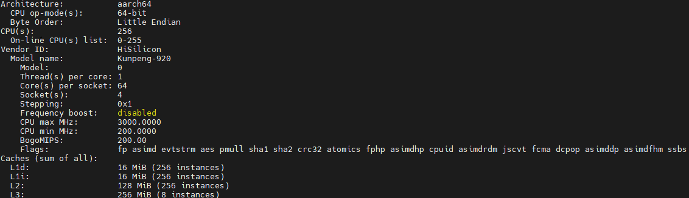

Torch：2.1.0

CANN：8.0.T2

除上述环境信息影响性能外，API的数量、种类以及Shape都会对性能产生影响，因此本次选取指定网络进行测试，为了避免算子编译耗时的影响，所有模型运行时都开启二进制，模型中添加torch.npu.set_compile_mode(jit_compile=False)，所有模型都dump第二个step的数据。

## 模型信息和性能基线

大模型在使用ptdbg_ascend工具时，建议先简化模型层数，减少dump数据量。

以下场景的性能基线测试数据均为多次测试后取平均值，因此实际运行时性能数据可能会根据环境状态稍有浮动。

### ptdbg_ascend工具配置信息

dump全部API级别输入输出数据以及相应堆栈信息，配置如下：

```python
debugger = PrecisionDebugger(dump_path="./dump_path", hook_name="dump")
debugger.configure_hook(mode="api_stack")
```

多卡指定rank0 dump，配置如下：

```python
debugger = PrecisionDebugger(dump_path="./dump_path", hook_name="dump",rank=0)
debugger.configure_hook(mode="api_stack")
```

dump保存API统计信息的pkl文件，配置如下：

```python
debugger = PrecisionDebugger(dump_path="./dump_path", hook_name="dump")
debugger.configure_hook(mode="api_stack", summary_only=True)
```

### YOLOV5s

单卡

主要数据类型：FLOAT32

启动命令参数：python3 train_ptdbg.py --data ./data/coco.yaml --cfg yolov5s.yaml --weights '' --epochs 1 --batch-size 8 --device 1

**dump保存API统计信息的pkl文件。**

耗时：**7s**

进行**单卡dump**全部API级别输入输出数据以及相应堆栈信息。

dump存盘的API numpy文件大小：13G

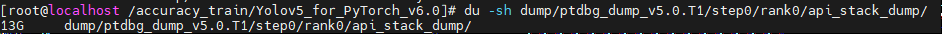

api numpy文件数量：3009个

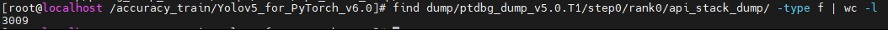

耗时：11s

### GPT-3

#### NUM_LAYER：1

8卡

主要数据类型：FLOAT16

启动命令参数：

```
python3 -m torch.distributed.launch $DISTRIBUTED_ARGS ../../pretrain_gpt_ptdbg.py --num-layers 1 --hidden-size 12288 --num-attention-heads 24 --micro-batch-size 2 --global-batch-size 2 --seq-length 1024 --max-position-embeddings 1024 --train-iters 10 --lr-decay-iters 320000 --save $CHECKPOINT_PATH --load $CHECKPOINT_PATH --data-path $DATA_PATH --tensor-model-parallel-size 8 --use-distributed-optimizer --pipeline-model-parallel-size 8 --vocab-file gpt2-vocab.json --merge-file gpt2-merges.txt --data-impl mmap --split 949,50,1 --distributed-backend nccl --lr 0.375e-5 --lr-decay-style cosine --min-lr 0.375e-6 --weight-decay 0.1 --clip-grad 1.0 --lr-warmup-fraction .01 --adam-beta1 0.9 --adam-beta2 0.95 --init-method-std 0.006
--recompute-granularity full --recompute-method uniform --no-gradient-accumulation-fusion --log-interval 1 --save-interval 10000 --eval-interval 1000 --eval-iters 10 --fp16
```

**dump保存API统计信息的pkl文件。**

耗时：3.3s

进**行8卡dump**全部API级别输入输出数据以及相应堆栈信息。

dump存盘的api numpy文件大小：145G

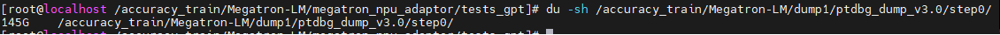

api numpy文件数量：5130个

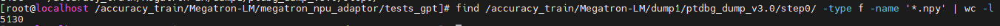

dump耗时：53s

**经测试8卡同时写入磁盘已达到磁盘I/O上限，工具的dump速度取决于磁盘性能，本机环境多进程写入磁盘上限为3GB/秒左右，理论上保存145GB的数据需要50秒左右，如果dump的数据中包含许多的小文件，那么耗时将会更久。**

**指定rank0 dump**。

dump存盘的api numpy文件大小：19G

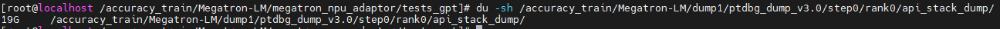

api numpy文件数量：643个

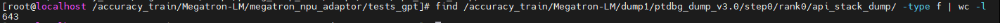

耗时：9s

#### NUM_LAYER：8

8卡

主要数据类型：FLOAT16

启动命令参数：

```
python3 -m torch.distributed.launch $DISTRIBUTED_ARGS ../../pretrain_gpt_ptdbg.py --num-layers 8 --hidden-size 12288 --num-attention-heads 24 --micro-batch-size 2 --global-batch-size 2 --seq-length 1024 --max-position-embeddings 1024 --train-iters 10 --lr-decay-iters 320000 --save $CHECKPOINT_PATH --load $CHECKPOINT_PATH --data-path $DATA_PATH --tensor-model-parallel-size 8 --use-distributed-optimizer --pipeline-model-parallel-size 8 --vocab-file gpt2-vocab.json --merge-file gpt2-merges.txt --data-impl mmap --split 949,50,1 --distributed-backend nccl --lr 0.375e-5 --lr-decay-style cosine --min-lr 0.375e-6 --weight-decay 0.1 --clip-grad 1.0 --lr-warmup-fraction .01 --adam-beta1 0.9 --adam-beta2 0.95 --init-method-std 0.006 --recompute-granularity full --recompute-method uniform --no-gradient-accumulation-fusion --log-interval 1 --save-interval 10000 --eval-interval 1000 --eval-iters 10 --fp16
```

**dump保存API统计信息的pkl文件。**

耗时：6.7s

进行**8卡dump**全部API级别输入输出数据以及相应堆栈信息。

dump存盘的API numpy文件大小：878G

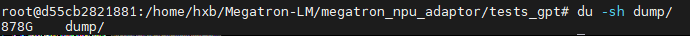

API numpy文件数量：24002个

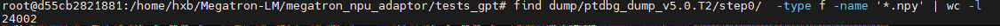

dump耗时：323s

指定rank0 dump

dump存盘的API numpy文件大小：110G

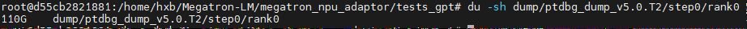

API numpy文件数量：3002个

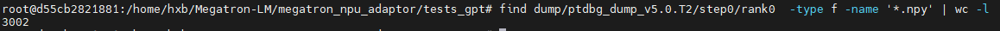

耗时：47s

### BLOOM-7B

8卡

NUM_LAYER：1

主要数据类型：BFLOAT16

启动命令参数：

```
python -m torch.distributed.launch $DISTRIBUTED_ARGS pretrain_llama.py --DDP-impl local --tensor-model-parallel-size 8 --pipeline-model-parallel-size 1 --sequence-parallel --num-layers 1 --hidden-size 12288 --position-embedding-type rope --normalization RMSNorm --ffn-hidden-size 11008 --num-attention-heads 24 --attention-dropout 0.0 --hidden-dropout 0.0 --init-method-std 0.01 --micro-batch-size 2 --global-batch-size 2 --seq-length 1024 --max-position-embeddings 1024 --data-path $DATA_PATH --tokenizer-name-or-path $TOKENIZER_PATH --tokenizer-not-use-fast --split 100,0,0 --distributed-backend nccl --lr 1.25e-5 --min-lr 1.25e-6 --lr-decay-style cosine --weight-decay 1e-1 --clip-grad 1.0 --initial-loss-scale 65536.0 --adam-beta1 0.9 --adam-beta2 0.95 --log-interval 1 --load ${LOAD_CHECKPOINT_PATH} --save ${SAVE_CHECKPOINT_PATH} --save-interval 10000 --eval-interval 10000 --eval-iters 0 --use-fused-rotary-pos-emb --no-masked-softmax-fusion --no-load-optim --no-load-rng --train-iters 20 --lr-warmup-fraction 0.01 --mlp-layer-fusion --use-flash-attn --use-fused-rmsnorm --bf16
```

**dump保存API统计信息的pkl文件。**

耗时：3s

进行**8卡dump**全部API级别输入输出数据以及相应堆栈信息。

dump存盘的API numpy文件大小：160G

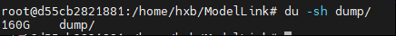

API numpy文件数量：4924个

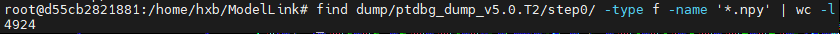

dump耗时：61s

指定rank0 dump。

dump存盘的API numpy文件大小：20G

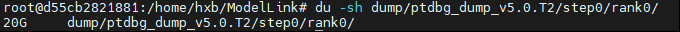

API numpy文件数量：633个

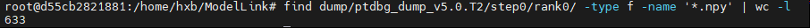

耗时：17s