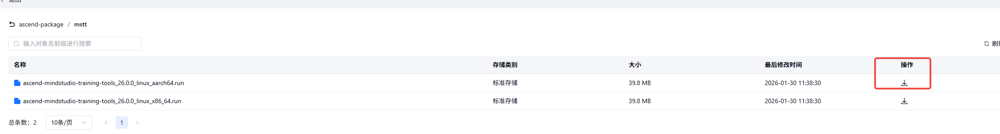

# msTT工具安装指南

## 安装说明

本文主要介绍msTT工具链的安装方法。

## 安装前准备

> [!Note] 说明 
> 使用root安装会引入提权风险，本指南建议以普通用户安装使用

**下载安装包**

1. 访问["OBS 制品仓"](https://www.openlibing.com/apps/obsArtifactRepository)，单击 "ascend-package" > "mstt"。

2. 单击“下载”，将软件包下载至本地

**安装 CANN（可选）**

msProf（MindStudio Profiler）、msProbe（MindStudio Probe）、msMemScope（MindStudio MemScope）工具依赖CANN生态才能运行，如果您想使用这些工具，需要在安装msTT之前先安装配套版本的CANN Toolkit开发套件包和算子包并配置环境变量，具体请参见《[CANN软件安装指南](https://www.hiascend.com/document/detail/zh/canncommercial/850/softwareinst/instg/instg_0000.html?Mode=PmIns&InstallType=netconda&OS=openEuler)》。

**PyPI 换源（可选）**

在安装MSTT的过程中可能会访问 PyPI 进行依赖包的下载和安装，您可以选择通过下列命令行进行 PyPI 换源。以下示例为华为云源，您可以替换为其他源：

```sh
pip3 config set global.index-url https://repo.huaweicloud.com/repository/pypi/simple/
pip3 config set global.trusted-host repo.huaweicloud.com
```

## 安装步骤

1. 安装前需给run包添加可执行权限。

    ```shell
    chmod +x ascend-mindstudio-training-tools_linux-<version>.run
    ```

2. 执行以下命令安装。

    ```shell
    ./ascend-mindstudio-training-tools_linux-<version>.run --install
    ```

> [!NOTE]  
> 对于 root 用户，msTT默认安装到 /usr/local/Ascend 目录下；如果使用普通用户进行安装，msTT会默认安装到 ${HOME}/Ascend 下。<br>
> 如果要指定路径安装，则需添加 `--install-path`，指定的安装路径必须为绝对路径，不支持相对路径，输入相对路径会出现安装报错，例如：`./ascend-mindstudio-training-tools_linux-*.run --install --install-path=/path/to/install`。

## 安装后配置

软件包安装成功后，工具会安装成功提示，为了确保工具正常运行，需设置环境变量。如下展示的成功安装示例，设置环境变量的方法为 `source /path/to/install/mstt/set_env.sh`。

```shell
===========
= Summary =
===========

Install success, installed in '/path/to/install/mstt'

Please make sure that the environment variables are correctly configured. To take effect for current terminal session, you need to execute the following command:
    source /path/to/install/mstt/set_env.sh

To uninstall the toolkit, please run the following command:
    bash /path/to/install/mstt/mstt_uninstall.sh
  
```

同时安装了CANN和msTT情况下，如果需要使用CANN中的组件，source CANN中的set_env.sh即可；如果需要使用msTT中的工具，需要先source CANN中的set_env.sh，再source msTT的set_env.sh才行；如果只source了msTT的set_env.sh，msTT中依赖CANN的工具会因为找不到CANN依赖而无法使用。

## 升级

如需使用run包替换运行环境中已安装的msTT包，执行如下升级操作：

```sh
./ascend-mindstudio-training-tools_linux-*.run --upgrade
```

> [!NOTE]  
> 对于 root 用户，msTT默认升级路径为 /usr/local/Ascend 目录；如果使用普通用户进行升级，msTT会默认升级 ${HOME}/Ascend 下的工具包。<br>
> 如果要指定升级路径，则需添加 `--install-path`，使用方式和安装时一样。

## 卸载

软件包安装成功后，会在安装目录下生成 `mstt_uninstall.sh` 文件，执行该文件即可进行卸载。如：

```sh
bash /usr/local/Ascend/mstt/mstt_uninstall.sh
```
