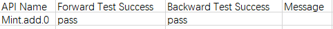
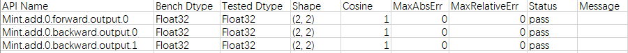
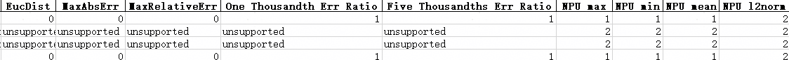
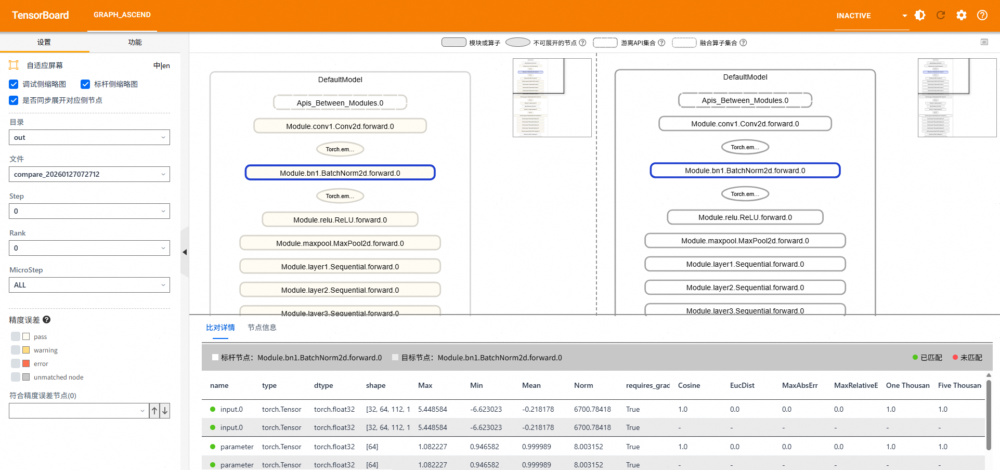
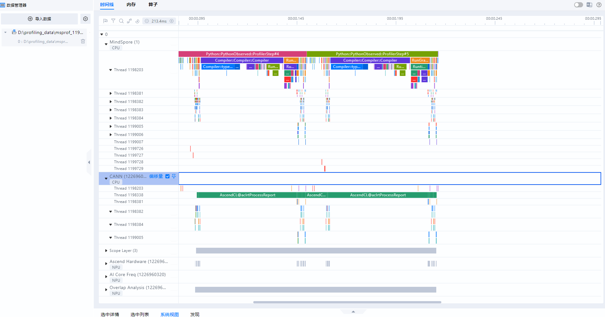

# MindSpore场景msTT工具快速入门

<br>

## 概述

本文介绍训练场景开发工具快速入门，主要针对训练开发流程中的模型开发&迁移、模型精度调试和模型性能调优环节分别使用的开发工具进行介绍。

主要工具介绍：

- msProbe工具：

  基于昇腾开发的大模型或者是从GPU迁移到昇腾NPU环境的大模型，在训练过程中可能出现精度溢出、loss曲线跑飞或不收敛等异常问题。由于训练loss等指标无法精确定位问题模块，本文提供了msProbe（MindStudio Probe，精度调试工具）进行快速定界。精度调试工具在下文均简称为msProbe。

  msProbe为msTT工具链的精度工具，通过分别对标杆环境（如已调试好的CPU、GPU或昇腾NPU等环境）和昇腾NPU环境下的训练精度数据进行采集和比对，从而找出差异点。

- MindSpore Profiler接口工具：MindSpore训练场景下的性能数据采集。

- msprof-analyze工具：统计、分析以及输出相关的调优建议。

- MindStudio Insight工具：对性能数据进行可视化展示。

**使用流程**

以下介绍训练开发的主要流程中使用到msTT以及相关工具的操作流程。

1. 模型开发&迁移

   MindSpore训练场景暂未提供迁移工具，本文以直接在昇腾NPU环境开发的训练脚本为例。

2. 模型精度调试

   使用msProbe工具在模型精度调试中主要执行如下操作：

   1. 训练前配置检查

      识别两个环境影响精度的配置差异。

   2. 训练状态监测

      监测训练过程中计算，通信，优化器等部分出现的异常情况。

   3. 精度数据采集

      采集训练过程中的API或Module层级前反向输入输出数据。

   4. 精度预检

      扫描API数据，找出存在精度问题的API。

   5. 精度比对

      对比NPU侧和标杆环境的API数据，快速定位精度问题。

3. 模型性能调优

   MindSpore训练场景在模型性能调优中主要执行如下操作：

   1. 性能数据采集：MindSpore Profiler接口工具。
   2. 性能数据分析：msprof-analyze工具。
   3. 性能数据可视化展示：MindStudio Insight工具。

**环境准备**<a name="环境准备"></a>

1. 准备一台基于昇腾NPU的训练服务器（如Atlas A2 训练系列产品），并安装NPU驱动和固件。

2. 安装配套版本的CANN Toolkit开发套件包和ops算子包并配置CANN环境变量，具体请参见[CANN快速安装](https://www.hiascend.com/cann/download)。

3. 安装框架。

   MindSpore训练场景以安装2.7.2和2.8.0版本为例，具体操作请参见《[MindSpore安装指南](https://www.mindspore.cn/install/)》。

## 模型开发&迁移

MindSpore训练场景暂未提供迁移工具，本文以直接在Ascend环境开发的训练脚本为例。

**前提条件**

1. 完成[环境准备](#环境准备)。
2. 以“mindspore_main.py”命名为例，创建训练脚本文件，脚本内容直接拷贝[MindSpore昇腾NPU环境训练脚本样例](#mindspore昇腾npu环境训练脚本样例)。
3. 将“mindspore_main.py”文件上传至训练服务器的任意目录下（需保证该目录下文件的读写权限）。

**执行训练**

直接执行训练。

```bash
python mindspore_main.py
```

如果训练正常进行，完成后打印如下日志。

```ColdFusion
train finish
```

## 模型精度调试

### 训练前配置检查

根据本手册的样例，需要将工具接口添加到训练脚本中进行配置检查。

> [!NOTE]
>
> 当前是以MindSpore不同版本在同一环境下进行精度比对的场景为例，因此两个场景检查出的结果只会有版本号的不同，所以可跳过此步骤。

**前提条件**

- 完成[环境准备](#环境准备)。
- 完成[模型开发&迁移](#模型开发迁移)，确保在所有示例的环境可正常完成训练任务。

**工具安装**

在昇腾NPU环境下安装msProbe工具，执行如下命令：

```bash
pip install mindstudio-probe --pre
```

**执行检查**

操作步骤如下：

1. 获取两个环境的zip包（包含影响训练精度的环境配置：环境变量、第三方库版本、权重、数据集、随机函数等）。

   分别以MindSpore 2.7.2和MindSpore 2.8.0环境执行以下操作。需要注意给予两个zip包不同的命名。

   > [!NOTE] 
   >
   > 可直接拷贝[MindSpore训练前配置检查代码样例](#mindspore训练前配置检查代码样例)中的完整代码执行，下列仅为说明工具接口在脚本中添加的位置。

   1. 在训练流程执行到的第一个Python脚本开始处插入如下代码。

      ```python
        1 from msprobe.core.config_check import ConfigChecker
        2 ConfigChecker.apply_patches(fmk)
      ```

      fmk：训练框架，string类型，可选"pytorch"和"mindspore"，这里配置为"mindspore"。

   2. 在模型初始化好之后插入如下代码。

      ```python
       49 from msprobe.core.config_check import ConfigChecker
       50 ConfigChecker(model=model, output_zip_path="", fmk="")
      ```

      - model：初始化好的模型，默认不会采集权重和数据集。
      - output_zip_path：输出zip包的路径，string类型，需要指定zip包的名称，默认为"./config_check_pack.zip"。
      - fmk：训练框架。可选"pytorch"和"mindspore"，这里配置为"mindspore"。
      
   3. 执行训练脚本命令。

      ```bash
      python mindspore_main.py
      ```

      采集完成后会得到一个zip包，里面包括各项影响精度的配置。分rank和step存储，其中step为micro_step。

2. 将两个zip包传到同一个环境下，使用如下命令进行比对。

   ```bash
   msprobe config_check -c bench_zip_path cmp_zip_path -o output_path 
   ```

   其中bench_zip_path为标杆侧采集到的zip包名称，cmp_zip_path为待对比侧采集到的zip包名称。

   output_path默认为"./config_check_result"。

   执行以上命令后，在output_path里会生成如下数据：

   - bench：bench_zip_path里打包的数据。
   - cmp：cmp_zip_path里打包的数据。
   - result.xlsx：比对结果。会有多个sheet页，其中summary总览通过情况，其余页是具体检查项的详情，其中step为micro_step。

3. 检查通过情况。

   须保证以下检查均一致则通过，若不一致则需要自行调整环境：

   - 环境变量
   - 第三方库版本
   - 数据集
   - 权重
   - 随机操作
   
   如下所示：
   
   ```ColdFusion
   filename        ass_check
   env             pass
   pip             error
   dataset         pass
   weights         pass
   random          pass
   ```
   
   此处MindSpore场景本身就是分别以MindSpore 2.7.2和MindSpore 2.8.0版本为例，所以这里的pip检查第三方库版本显示error。

### 训练状态监测

**前提条件**

- 完成[环境准备](#环境准备)。
- 完成[训练前配置检查](#训练前配置检查)。

**操作步骤**

1. 以执行权重梯度监测功能为例，创建配置文件。

   以在训练脚本所在目录创建monitor_v2_config.json配置文件为例，文件内容拷贝如下示例配置。

   ```json
   {
     "framework": "mindspore",
     "output_dir": "",
     "rank": [0],
     "start_step": 0,
     "step_interval": 1,
     "step_count_per_record": 1,
     "collect_times": 100,
     "format": "csv",
     "patch_optimizer_step": false,
     "monitors": {
       "weight_grad": {
         "enabled": true,
         "ops": ["min", "max", "mean", "norm", "nans"],
         "eps": 1e-8,
         "monitor_mbs_grad": false
       }
     }
   }
   ```

2. 在训练脚本中添加工具，如下所示。

   > [!NOTE]
   >
   > 可直接拷贝[MindSpore训练状态监测代码样例](#mindspore训练状态监测代码样例)中的完整代码执行，下列仅为说明脚本中需要添加的工具接口。

   ```python
   ...
     8 from msprobe.core.monitor_v2.trainer import TrainerMonitorV2    # 导入训练监测
     9 
   ...
   
    46 if __name__ == "__main__":
    47     mon = TrainerMonitorV2("./monitor_v2_config.json", fr="mindspore")    # 导入监测配置文件及指定框架
    48     mon.start(model=model, optimizer=optimizer)    # 启动训练监测
    49     step = 0
    50     # 训练模型
    51     for data, label in ds.GeneratorDataset(generator_net(), ["data", "label"]):
    52         train_step(data, label)
    53         print(f"train step {step}")
    54         step += 1
    55         mon.step()    # 每个训练step的结束后，保存当前step的监测数据并将step+1
    56     mon.stop()    # 结束训练监测
    57     print("train finish")
   ```

3. 执行训练脚本命令。

   ```bash
   python mindspore_main.py
   ```

4. 查看结果。

   训练执行完成后在当前路径生成rank_{rank_id}目录，目录下根据时间戳生成多份结果，查看最新目录下的文件，如下所示。

   **图1** 结果文件内容

   

   输出结果详细介绍请参见“[输出结果](https://gitcode.com/Ascend/msprobe/blob/master/docs/zh/monitor_v2_instruct.md#输出结果)”。

### 精度数据采集

**前提条件**

- 完成[环境准备](#环境准备)。
- 完成[训练前配置检查](#训练前配置检查)。

**执行采集**

1. 创建配置文件。

   以在训练脚本所在目录创建config.json配置文件为例，文件内容拷贝如下示例配置。

   ```json
   {
       "task": "tensor",
       "dump_path": "./dump_data",
       "rank": [],
       "step": [],
       "level": "L1",
   
       "tensor": {
           "scope": [], 
           "list": [],
           "data_mode": ["all"]
       }
   }
   ```

2. 分别以MindSpore 2.7.2和MindSpore 2.8.0环境下的训练脚本（mindspore_main.py文件）中添加工具，如下所示。

   > [!NOTE]
   >
   > 可直接拷贝[MindSpore精度数据采集代码样例](#mindspore精度数据采集代码样例)中的完整代码执行，下列仅为说明工具接口在脚本中添加的位置。

   ```python
   ...
     8 from msprobe.mindspore import PrecisionDebugger    # 导入工具数据采集接口
     9 debugger = PrecisionDebugger(config_path="./config.json")    # PrecisionDebugger实例化，加载dump配置文件
   ...
    47 if __name__ == "__main__":
    48     step = 0
    49     # 训练模型
    50     for data, label in ds.GeneratorDataset(generator_net(), ["data", "label"]):
    51         debugger.start(model)    # 开启数据dump
    52         train_step(data, label)
    53         print(f"train step {step}")
    54         step += 1
    55         debugger.stop()    # 关闭数据dump，可继续开启数据dump，采集数据会记录在同一个step中
    56         debugger.step()    # 结束数据dump，若继续开启数据dump，采集数据将记录在下一个step中
    57     print("train finish")
   ```

   > [!NOTE]
   >
   > 精度数据会占据一定的磁盘空间，可能存在磁盘写满导致服务器不可用的风险。精度数据所需空间跟模型的参数、采集开关配置、采集的迭代数量有较大关系，须用户自行保证落盘目录下的可用磁盘空间。

3. 执行训练脚本命令，工具会采集模型训练过程中的精度数据。

   ```python
   python mindspore_main.py
   ```

   日志打印出现如下示例信息表示数据采集成功，完成采集后即可查看数据。

   ```ColdFusion
   The api tensor hook function is successfully mounted to the model.
   msprobe: debugger.start() is set successfully
   Dump switch is turned on at step 0.
   Dump data will be saved in /home/user1/dump/dump_data/step0.
   ```

**结果查看**

dump_path参数指定的路径下会出现如下目录结构，可以根据需求选择合适的数据进行分析。

```ColdFusion
dump_data/
├── step0
    └── rank
        ├── construct.json           # 保存Module的层级关系信息，当前场景为空
        ├── dump.json                # 保存前反向API的输入输出的统计量信息和溢出信息等
        ├── dump_tensor_data         # 保存前反向API的输入输出tensor的真实数据信息等
        │   ├── Jit.Momentum.0.forward.input.1.0.npy
        │   ├── Primitive.matmul.MatMul.1.forward.input.1.npy
        │   ├── Mint.add.1.backward.input.0.npy
        │   ├── Primitive.matmul.MatMul.1.forward.output.0.npy
        ...
        └── stack.json               # 保存API的调用栈信息
├── step1
...
```

采集后的数据需要用[精度预检](#精度预检)和[精度比对](#精度比对)等工具进行进一步分析。

### 精度预检

**前提条件**

- 完成[环境准备](#环境准备)。
- 完成[精度数据采集](#精度数据采集)，得到MindSpore训练场景昇腾NPU环境的精度数据。

**执行预检**

直接在昇腾NPU环境下执行预检。

```bash
msprobe acc_check -api_info ./dump_data/step0/rank/dump.json -o ./checker_result
```

此时**-o**参数指定的路径下会生成两个csv文件，分别为accuracy_checking_details\_{timestamp}.csv和accuracy_checking_result_{timestamp}.csv。

accuracy_checking_result\_{timestamp}.csv标明每个API是否通过测试。对于其中没有通过测试的或者特定感兴趣的API，根据其API Name字段在accuracy_checking_details\_{timestamp}.csv中查询其各个输出的达标情况以及比较指标。

**图1** accuracy_checking_result



**图2** accuracy_checking_details



预检结果详细介绍请参见“[预检结果](https://gitcode.com/Ascend/msprobe/blob/master/docs/zh/accuracy_checker/mindspore_accuracy_checker_instruct.md#%E9%A2%84%E6%A3%80%E7%BB%93%E6%9E%9C)”。

### 精度比对

#### compare精度比对

**前提条件**

- 完成[环境准备](#环境准备)。
- 以MindSpore框架内，不同版本下的cell模块比对场景为例，参见[精度数据采集](#精度数据采集)，完成不同框架版本的cell模块dump，其中不同框架版本以MindSpore 2.7.2和MindSpore 2.8.0为例。

**执行比对**

1. 数据准备。

   根据**前提条件**获得两份精度数据目录，两份数据保存目录名称分别以dump_data_2.7.2和dump_data_2.8.0为例。

   dump_data_2.7.2目录下dump.json路径为`/home/dump/dump_data_2.7.2/step0/rank/dump.json`。

   dump_data_2.8.0目录下dump.json路径为`/home/dump/dump_data_2.8.0/step0/rank/dump.json`。

2. 执行比对。

   命令如下：

   ```bash
   msprobe compare -tp /home/dump/dump_data_2.8.0/step0/rank/dump.json -gp /home/dump/dump_data_2.7.2/step0/rank/dump.json -o ./compare_result/accuracy_compare
   ```

   出现如下打印说明比对成功：

   ```ColdFusion
   ...
   Compare result is /xxx/compare_result/accuracy_compare/compare_result_{timestamp}.xlsx
   ...
   ************************************************************************************
   *                        msprobe compare ends successfully.                        *
   ************************************************************************************
   ```
   
3. 比对结果文件分析。

   compare会在./compare_result/accuracy_compare生成如下文件。

   compare_result_{timestamp}.xlsx：文件列出了所有执行精度比对的API详细信息和比对结果，可通过比对结果（Result）、错误信息提示（Err_Message）定位可疑算子，但鉴于每种指标都有对应的判定标准，还需要结合实际情况进行判断。

   示例如下：

   **图1** compare_result_1

   

   **图2** compare_result_2

   

   **图2** compare_result_3
   
   
   
   更多比对结果分析请参见“[输出结果文件说明](https://gitcode.com/Ascend/msprobe/blob/master/docs/zh/accuracy_compare/pytorch_accuracy_compare_instruct.md#%E8%BE%93%E5%87%BA%E7%BB%93%E6%9E%9C%E6%96%87%E4%BB%B6%E8%AF%B4%E6%98%8E)”。

#### 分级可视化构图比对

**前提条件**

- 完成[环境准备](#环境准备)。

- 以MindSpore框架内，不同版本下的cell模块比对场景为例，参见[精度数据采集](#精度数据采集)，完成不同框架版本的cell模块dump，其中不同框架版本以MindSpore 2.7.2和MindSpore 2.8.0为例。

**执行比对**

1. 数据准备。

   根据**前提条件**获得两份精度数据目录，两份数据保存目录名称分别以dump_data_2.7.2和dump_data_2.8.0为例。

   dump_data_2.7.2目录路径为`/home/dump/dump_data_2.7.2`。

   dump_data_2.8.0目录路径为`/home/dump/dump_data_2.8.0`。

2. 执行图构建比对。

   ```bash
   msprobe graph_visualize -tp /home/dump/dump_data_2.8.0 -gp /home/dump/dump_data_2.7.2 -o /home/dump/output
   ```

   比对完成后在./output下生成vis后缀文件。

3. 启动TensorBoard。

   ```bash
   tensorboard --logdir ./output --bind_all
   ```

   --logdir指定的路径即为步骤2中的-o参数指定的路径。

   执行以上命令后打印如下日志。

   ```bash
   TensorBoard 2.19.0 at http://ubuntu:6008/ (Press CTRL+C to quit)
   ```

   需要在Windows环境下打开浏览器，访问地址`http://ubuntu:6008/`，其中ubuntu修改为服务器的IP地址，例如`http://192.168.1.10:6008/`。

   访问地址成功后页面显示TensorBoard界面，如下所示。

   **图1** 分级可视化构图比对

   

   由于本样例在dump数据时"level"配置为"L1"，故采集到模型结构数据为空，分级可视化构图时无数据，如上图为其他数据示例。

## 模型性能调优

### 性能数据采集

**前提条件**

- 完成[环境准备](#环境准备)。
- 根据[模型开发&迁移](#模型开发迁移)中的MindSpore部分，完成MindSpore场景的训练任务。

> [!NOTICE] 须知
>
> 在执行性能数据采集前请先将训练脚本（mindspore_main.py文件）中的[精度数据采集](#精度数据采集)相关接口删除，因为精度数据采集和性能数据采集不可同时执行。

**执行采集**

采集动作主要以MindSpore 2.8.0版本为例，若需要进行性能比对操作，也可以再采集MindSpore 2.7.2版本的性能数据。

1. 在昇腾NPU环境下的训练脚本（mindspore_main.py文件）中添加MindSpore Profiler接口工具，如下所示。

   > [!NOTE]
   >
   > 可直接拷贝[MindSpore Profiler接口采集性能数据代码样例](#mindspore-profiler接口采集性能数据代码样例)中的完整代码执行，下列仅为说明工具接口在脚本中添加的位置。

   ```python
    ...
     8 from mindspore.profiler import ProfilerLevel, ProfilerActivity, AicoreMetrics    # 导入mindspore.profiler
   ...
    46 if __name__ == "__main__":
    47     mindspore.set_context(mode=mindspore.PYNATIVE_MODE)
    48     mindspore.set_device("Ascend")
    49 
    50     # 添加Profiling采集扩展配置参数
    51     experimental_config = mindspore.profiler._ExperimentalConfig(
    52         profiler_level=ProfilerLevel.Level0,
    53         aic_metrics=AicoreMetrics.AiCoreNone,
    54         data_simplification=False
    55     )
    56 
    57     step = 0
    58     # 在训练模型之前添加Profiling采集基础配置参数
    59     with mindspore.profiler.profile(
    60             activities=[ProfilerActivity.CPU, ProfilerActivity.NPU],
    61             schedule=mindspore.profiler.schedule(
    62                 wait=0, warmup=0, active=1, repeat=1, skip_first=0
    63             ),
    64             on_trace_ready=mindspore.profiler.tensorboard_trace_handler("./profiling_data"),
    65             profile_memory=False,
    66             experimental_config=experimental_config,
    67     ) as prof:
    68         # 训练模型
    69         for data, label in ds.GeneratorDataset(generator_net(), ["data", "label"]):
    70             train_step(data, label)
    71             print(f"train step {step}")
    72             step += 1
    73             prof.step()
    74         print("train finish")
   ```

   > [!NOTE]
   >
   > - 以上仅提供简单示例，若需要配置更完整的采集参数以及对应接口详细介绍请参见《[mindspore.profiler.profile](https://www.mindspore.cn/docs/zh-CN/r2.8.0/api_python/mindspore/mindspore.profiler.profile.html)》。
   > - 性能数据会占据一定的磁盘空间，可能存在磁盘写满导致服务器不可用的风险。性能数据所需空间跟模型的参数、采集开关配置、采集的迭代数量有较大关系，须用户自行保证落盘目录下的可用磁盘空间。

2. 执行训练脚本命令，工具会采集模型训练过程中的性能数据。

   ```bash
   python mindspore_main.py
   ```

3. 查看采集到的MindSpore训练性能数据结果文件。

   训练结束后，在mindspore.profiler.tensorboard_trace_handler接口指定的目录下生成MindSpore Profiler接口的性能数据结果目录，如下示例。

   ```ColdFusion
   └── ubuntu_1198203_20260617064811905_ascend_ms
   ├── ASCEND_PROFILER_OUTPUT
   │   ├── api_statistic.csv
   │   ├── dataset.csv
   │   ├── kernel_details.csv
   │   ├── step_trace_time.csv
   │   └── trace_view.json
   ├── FRAMEWORK
   ├── logs
   ├── PROF_000001_20260617064812088_QGGJHHNAODRDOJFB
   │   ├── device_0
   │   │   ├── data
   ...
   │   ├── host
   │   │   ├── data
   ...
   │   ├── mindstudio_profiler_log
   ...
   │   └── mindstudio_profiler_output
   │       ├── api_statistic_20260202065550.csv
   │       ├── README.txt
   │       ├── op_summary_20260202065550.csv
   │       ├── task_time_20260202065550.csv
   │       ├── step_trace_20260202065550.csv
   │       ├── msprof_20260202065549.json
   │       └── step_trace_20260202065549.json
   └── profiler_info_0.json
   ```
   
   MindSpore Profiler接口采集的性能数据可以使用msTT的msprof-analyze工具进行辅助分析，也可以直接使用MindStudio Insight工具进行可视化分析，详细操作请参见[使用msprof-analyze工具分析性能数据](#使用msprof-analyze工具分析性能数据)和[使用MindStudio Insight工具可视化性能数据](#使用MindStudio Insight工具可视化性能数据)。

### 性能数据分析

#### 使用msprof-analyze工具分析性能数据

**前提条件**

1. 完成[环境准备](#环境准备)。

2. 完成[性能数据采集](#性能数据采集)，得到昇腾NPU环境的性能数据。

3. 安装msprof-analyze，命令如下：

   ```bash
   pip install msprof-analyze
   ```

   提示出现如下信息则表示安装成功。

   ```ColdFusion
   Successfully installed msprof-analyze-{version}
   ```

   msprof-analyze工具详细介绍请参见《[msprof-analyze](https://gitcode.com/Ascend/msprof-analyze/blob/master/docs/zh/getting_started/quick_start.md)》。

**执行msprof-analyze分析**<a name="执行msprof-analyze分析"></a>

> [!NOTE]
>
> 以下仅提供操作指导，无具体数据分析。

msprof-analyze主要对基于通信域的迭代内耗时分析、通信时间分析以及通信矩阵分析为主，从而定位慢卡、慢节点以及慢链路问题。

操作如下：

1. 数据准备。

   将所有Device下的性能数据拷贝到同一目录下。

2. 执行性能分析操作。

   ```bash
   msprof-analyze -m all -d $HOME/profiling_data/
   ```

   分析结果在-d参数指定目录下生成cluster_analysis_output文件夹并输出cluster_step_trace_time.csv、cluster_communication_matrix.json、cluster_communication.json文件。

   更多介绍请参见《[msprof-analyze](https://gitcode.com/Ascend/msprof-analyze/blob/master/docs/zh/getting_started/quick_start.md)》。

   集群分析工具的交付件通过MindStudio Insight工具展示，详细操作请参见[使用MindStudio Insight工具可视化性能数据](#使用MindStudio Insight工具可视化性能数据)。

**执行advisor分析**

msprof-analyze的advisor功能是将MindSpore Profiler采集并解析出的性能数据进行分析，并输出性能调优建议。

命令如下：

```bash
msprof-analyze advisor all -d $HOME/profiling_data/
```

分析结果输出相关简略建议到执行终端中，并在命令执行目录下生成“mstt_advisor\_{timestamp}.html”和“/log/mstt_advisor_{timestamp}.xlsx”文件供用户查看。

advisor工具的分析结果主要提供可能存在性能问题的专家建议。

详细结果介绍请参见《[advisor](https://gitcode.com/Ascend/msprof-analyze/blob/master/docs/zh/user_guide/advisor_instruct.md)》中的“[输出结果文件说明](https://gitcode.com/Ascend/msprof-analyze/blob/master/docs/zh/user_guide/advisor_instruct.md#%E8%BE%93%E5%87%BA%E7%BB%93%E6%9E%9C%E6%96%87%E4%BB%B6%E8%AF%B4%E6%98%8E)”。

**执行compare_tools性能比对**

compare_tools功能用于对比不同框架或其他软件版本下，采集同一训练工程昇腾NPU环境性能数据之间的差异。

命令如下：

```bash
msprof-analyze compare -d $HOME/2.8.0/profiling_data/*_ascend_ms -bp $HOME/2.7.2/profiling_data/*_ascend_ms --output_path ./compare_result/profiler_compare
```

分析结果输出到执行终端中，并在**--output_path**参数指定路径下生成“performance_comparison_result_{timestamp}.xlsx”文件供用户查看。

性能比对工具将总体性能拆解为训练耗时和内存占用，其中训练耗时可拆分为算子（包括nn.Module）、通信、调度三个维度，并打印输出总体指标，帮助用户定位劣化的方向。与此同时，工具还会在“performance_comparison_result_{timestamp}.xlsx”文件中展示每个算子在执行耗时、通信耗时、内存占用的优劣，可通过DIFF列大于0筛选出劣化算子。此处不提供示例，详细结果介绍请参见《[性能比对工具](https://gitcode.com/Ascend/msprof-analyze/blob/master/docs/zh/user_guide/compare_tool_instruct.md)》中的“[输出结果文件说明](https://gitcode.com/Ascend/msprof-analyze/blob/master/docs/zh/user_guide/compare_tool_instruct.md#%E8%BE%93%E5%87%BA%E7%BB%93%E6%9E%9C%E6%96%87%E4%BB%B6%E8%AF%B4%E6%98%8E)”。

#### 使用MindStudio Insight工具可视化性能数据

- [性能数据采集](#性能数据采集)生成的性能数据均可以使用MindStudio Insight工具将性能数据可视化。
- [执行msprof-analyze分析](#执行msprof-analyze分析)时，输出的交付件需要使用MindStudio Insight工具将数据可视化。

**前提条件**

完成[性能数据采集](#性能数据采集)或[执行msprof-analyze分析](#执行msprof-analyze分析)，获取对应交付件。

**操作步骤**

1. 安装MindStudio Insight。

   参见《[MindStudio Insight工具用户指南](https://gitcode.com/Ascend/msinsight/blob/master/docs/zh/user_guide/mindstudio_insight_install_guide.md)》下载并安装MindStudio Insight。

   MindStudio Insight可视化工具推荐在Windows环境使用。

2. 双击桌面的MindStudio Insight快捷方式图标，启动MindStudio Insight。

3. 导入性能数据。

   1. 将[性能数据采集](#性能数据采集)或[执行msprof-analyze分析](#执行msprof-analyze分析)的性能数据拷贝至Windows环境。

   2. 单击MindStudio Insight界面左上方“导入数据”，在弹框中选择性能数据文件或目录，然后单击“确认”进行导入，导入结果如下图所示。

      **图1** 展示性能数据

      

4. 分析性能数据。

   MindStudio Insight工具将性能数据可视化后可以更直观地分析性能瓶颈，详细分析方法请参见《[MindStudio Insight工具用户指南](https://gitcode.com/Ascend/msinsight/blob/master/README.md)》。

## 代码样例

### MindSpore昇腾NPU环境训练脚本样例

```python
import mindspore as ms
import numpy as np
import mindspore
mindspore.set_device("Ascend")
import mindspore.mint as mint   
import mindspore.dataset as ds
from mindspore import nn


class Net(nn.Cell):
    def __init__(self):
        super(Net, self).__init__()
        self.fc = nn.Dense(2, 2)

    def construct(self, x):
        # 先经过全连接
        y = self.fc(x)
        # 调用mint.add，计算y与其自身的和
        # 也可以根据需求改成 mint.add(x, x)或者mint.add(y, x)
        z = mint.add(y, y)
        return z


def generator_net():
    for _ in range(10):
        yield np.ones([2, 2]).astype(np.float32), np.ones([2]).astype(np.int32)

def forward_fn(data, label):
    logits = model(data)
    loss = loss_fn(logits, label)
    return loss, logits

model = Net()
optimizer = nn.Momentum(model.trainable_params(), 1, 0.9)
loss_fn = nn.SoftmaxCrossEntropyWithLogits(sparse=True)
grad_fn = mindspore.value_and_grad(forward_fn, None, optimizer.parameters, has_aux=True)

# 定义单步训练的功能
def train_step(data, label):
    (loss, _), grads = grad_fn(data, label)
    optimizer(grads)
    return loss


if __name__ == "__main__":
    step = 0
    # 训练模型
    for data, label in ds.GeneratorDataset(generator_net(), ["data", "label"]):
        train_step(data, label)
        print(f"train step {step}")
        step += 1
    print("train finish")
```

### MindSpore训练前配置检查代码样例

```python
from msprobe.core.config_check import ConfigChecker
ConfigChecker.apply_patches(fmk="mindspore")
import mindspore as ms
import numpy as np
import mindspore
mindspore.set_device("Ascend")
import mindspore.mint as mint   
import mindspore.dataset as ds
from mindspore import nn


class Net(nn.Cell):
    def __init__(self):
        super(Net, self).__init__()
        self.fc = nn.Dense(2, 2)

    def construct(self, x):
        # 先经过全连接
        y = self.fc(x)
        # 调用mint.add，计算y与其自身的和
        # 也可以根据需求改成 mint.add(x, x)或者mint.add(y, x)
        z = mint.add(y, y)
        return z


def generator_net():
    for _ in range(10):
        yield np.ones([2, 2]).astype(np.float32), np.ones([2]).astype(np.int32)

def forward_fn(data, label):
    logits = model(data)
    loss = loss_fn(logits, label)
    return loss, logits

model = Net()
optimizer = nn.Momentum(model.trainable_params(), 1, 0.9)
loss_fn = nn.SoftmaxCrossEntropyWithLogits(sparse=True)
grad_fn = mindspore.value_and_grad(forward_fn, None, optimizer.parameters, has_aux=True)

# 定义单步训练的功能
def train_step(data, label):
    (loss, _), grads = grad_fn(data, label)
    optimizer(grads)
    return loss


if __name__ == "__main__":
    step = 0
    from msprobe.core.config_check import ConfigChecker
    ConfigChecker(model=model, output_zip_path="./config_check_pack.zip", fmk="mindspore")
    # 训练模型
    for data, label in ds.GeneratorDataset(generator_net(), ["data", "label"]):
        train_step(data, label)
        print(f"train step {step}")
        step += 1
    print("train finish")
```

### MindSpore训练状态监测代码样例

```python
import mindspore as ms
import numpy as np
import mindspore
mindspore.set_device("Ascend")
import mindspore.mint as mint   
import mindspore.dataset as ds
from mindspore import nn
from msprobe.core.monitor_v2.trainer import TrainerMonitorV2    # 导入训练监测


class Net(nn.Cell):
    def __init__(self):
        super(Net, self).__init__()
        self.fc = nn.Dense(2, 2)

    def construct(self, x):
        # 先经过全连接
        y = self.fc(x)
        # 调用mint.add，计算y与其自身的和
        # 也可以根据需求改成 mint.add(x, x)或者mint.add(y, x)
        z = mint.add(y, y)
        return z


def generator_net():
    for _ in range(10):
        yield np.ones([2, 2]).astype(np.float32), np.ones([2]).astype(np.int32)

def forward_fn(data, label):
    logits = model(data)
    loss = loss_fn(logits, label)
    return loss, logits

model = Net()
optimizer = nn.Momentum(model.trainable_params(), 1, 0.9)
loss_fn = nn.SoftmaxCrossEntropyWithLogits(sparse=True)
grad_fn = mindspore.value_and_grad(forward_fn, None, optimizer.parameters, has_aux=True)

# 定义单步训练的功能
def train_step(data, label):
    (loss, _), grads = grad_fn(data, label)
    optimizer(grads)
    return loss


if __name__ == "__main__":
    mon = TrainerMonitorV2("./monitor_v2_config.json", fr="mindspore")    # 导入监测配置文件及指定框架
    mon.start(model=model, optimizer=optimizer)    # 启动训练监测
    step = 0
    # 训练模型
    for data, label in ds.GeneratorDataset(generator_net(), ["data", "label"]):
        train_step(data, label)
        print(f"train step {step}")
        step += 1
        mon.step()    # 每个训练step的结束后，保存当前step的监测数据并将step+1
    mon.stop()    # 结束训练监测
    print("train finish")
```

### MindSpore精度数据采集代码样例

```python
import mindspore as ms
import numpy as np
import mindspore
mindspore.set_device("Ascend")
import mindspore.mint as mint   
import mindspore.dataset as ds
from mindspore import nn
from msprobe.mindspore import PrecisionDebugger
debugger = PrecisionDebugger(config_path="./config.json")


class Net(nn.Cell):
    def __init__(self):
        super(Net, self).__init__()
        self.fc = nn.Dense(2, 2)

    def construct(self, x):
        # 先经过全连接
        y = self.fc(x)
        # 调用mint.add，计算y与其自身的和
        # 也可以根据需求改成 mint.add(x, x)或者mint.add(y, x)
        z = mint.add(y, y)
        return z


def generator_net():
    for _ in range(10):
        yield np.ones([2, 2]).astype(np.float32), np.ones([2]).astype(np.int32)

def forward_fn(data, label):
    logits = model(data)
    loss = loss_fn(logits, label)
    return loss, logits

model = Net()
optimizer = nn.Momentum(model.trainable_params(), 1, 0.9)
loss_fn = nn.SoftmaxCrossEntropyWithLogits(sparse=True)
grad_fn = mindspore.value_and_grad(forward_fn, None, optimizer.parameters, has_aux=True)

# 定义单步训练的功能
def train_step(data, label):
    (loss, _), grads = grad_fn(data, label)
    optimizer(grads)
    return loss


if __name__ == "__main__":
    step = 0
    # 训练模型
    for data, label in ds.GeneratorDataset(generator_net(), ["data", "label"]):
        debugger.start(model)
        train_step(data, label)
        print(f"train step {step}")
        step += 1
        debugger.stop()
        debugger.step()
    print("train finish")
```

### MindSpore Profiler接口采集性能数据代码样例

```python
import mindspore as ms
import numpy as np
import mindspore
mindspore.set_device("Ascend")
import mindspore.mint as mint   
import mindspore.dataset as ds
from mindspore import nn
from mindspore.profiler import ProfilerLevel, ProfilerActivity, AicoreMetrics    # 导入mindspore.profiler


class Net(nn.Cell):
    def __init__(self):
        super(Net, self).__init__()
        self.fc = nn.Dense(2, 2)

    def construct(self, x):
        # 先经过全连接
        y = self.fc(x)
        # 调用mint.add，计算y与其自身的和
        # 也可以根据需求改成 mint.add(x, x)或者mint.add(y, x)
        z = mint.add(y, y)
        return z


def generator_net():
    for _ in range(10):
        yield np.ones([2, 2]).astype(np.float32), np.ones([2]).astype(np.int32)

def forward_fn(data, label):
    logits = model(data)
    loss = loss_fn(logits, label)
    return loss, logits

model = Net()
optimizer = nn.Momentum(model.trainable_params(), 1, 0.9)
loss_fn = nn.SoftmaxCrossEntropyWithLogits(sparse=True)
grad_fn = mindspore.value_and_grad(forward_fn, None, optimizer.parameters, has_aux=True)

# 定义单步训练的功能
def train_step(data, label):
    (loss, _), grads = grad_fn(data, label)
    optimizer(grads)
    return loss


if __name__ == "__main__":
    mindspore.set_context(mode=mindspore.PYNATIVE_MODE)
    mindspore.set_device("Ascend")

    # 添加Profiling采集扩展配置参数
    experimental_config = mindspore.profiler._ExperimentalConfig(
        profiler_level=ProfilerLevel.Level0,
        aic_metrics=AicoreMetrics.AiCoreNone,
        data_simplification=False
    )

    step = 0
    # 在训练模型之前添加Profiling采集基础配置参数
    with mindspore.profiler.profile(
            activities=[ProfilerActivity.CPU, ProfilerActivity.NPU],
            schedule=mindspore.profiler.schedule(
                wait=0, warmup=0, active=1, repeat=1, skip_first=0
            ),
            on_trace_ready=mindspore.profiler.tensorboard_trace_handler("./profiling_data"),
            profile_memory=False,
            experimental_config=experimental_config,
    ) as prof:
        # 训练模型
        for data, label in ds.GeneratorDataset(generator_net(), ["data", "label"]):
            train_step(data, label)
            print(f"train step {step}")
            step += 1
            prof.step()
        print("train finish")
```
