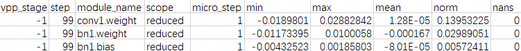
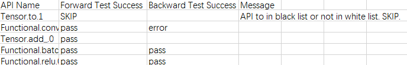
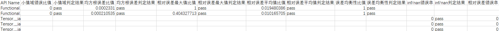
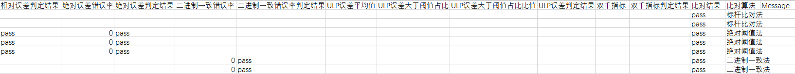
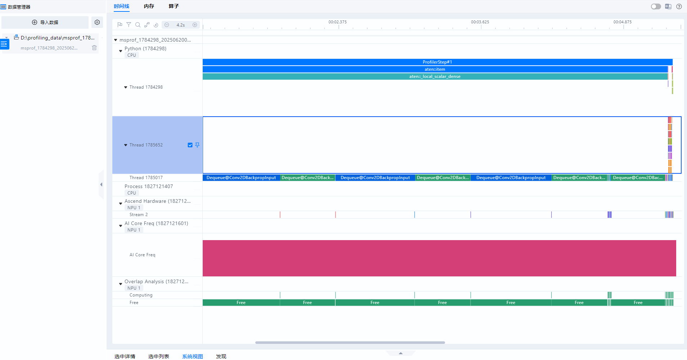

# PyTorch场景msTT工具快速入门

<br>

## 概述

本文介绍训练场景开发工具快速入门，主要针对训练开发流程中的模型开发&迁移、模型精度调试和模型性能调优环节分别使用的开发工具进行介绍。

主要工具介绍：

- msProbe工具：

  基于昇腾开发的大模型或者是从GPU迁移到昇腾NPU环境的大模型，在训练过程中可能出现精度溢出、loss曲线跑飞或不收敛等异常问题。由于训练loss等指标无法精确定位问题模块，本文提供了msProbe（MindStudio Probe，精度调试工具）进行快速定界。精度调试工具在下文均简称为msProbe。

  msProbe为msTT工具链的精度工具，通过分别对标杆环境（如已调试好的CPU、GPU或昇腾NPU等环境）和昇腾NPU环境下的训练精度数据进行采集和比对，从而找出差异点。

- Ascend PyTorch Profiler接口工具：PyTorch训练场景下的性能数据采集。

- msprof-analyze工具：统计、分析以及输出相关的调优建议。

- MindStudio Insight工具：对性能数据进行可视化展示。

**使用流程**

以下介绍训练开发的主要流程中使用到msTT以及相关工具的操作流程。

1. 模型开发&迁移

   PyTorch训练场景使用分析迁移工具进行GPU向昇腾NPU环境迁移。

2. 模型精度调试

   使用msProbe工具在模型精度调试中主要执行如下操作：

   1. 训练前配置检查

      识别两个环境影响精度的配置差异。

   2. 训练状态监测

      监测训练过程中计算，通信，优化器等部分出现的异常情况。

   3. 精度数据采集

      采集训练过程中的API或Module层级前反向输入输出数据。

   4. 精度预检

      扫描API数据，找出存在精度问题的API。

   5. 精度比对

      对比NPU侧和标杆环境的API数据，快速定位精度问题。

3. 模型性能调优

   PyTorch训练场景在模型性能调优中主要执行如下操作：

   1. 性能数据采集：Ascend PyTorch Profiler接口工具。
   2. 性能数据分析：msprof-analyze工具。
   3. 性能数据可视化展示：MindStudio Insight工具。

**环境准备**<a name="环境准备"></a>

1. 准备一台基于昇腾NPU的训练服务器（如Atlas A2 训练系列产品），并安装NPU驱动和固件。

2. 安装配套版本的CANN Toolkit开发套件包和ops算子包并配置CANN环境变量，以CANN 8.5.0版本为例，具体请参见[CANN快速安装](https://www.hiascend.com/cann/download)。

3. 安装框架。

   PyTorch训练场景以安装PyTorch 2.9.0、Python 3.12、系统架构AArch64、torchvision==0.24.0为例，具体操作请参见《[Ascend Extension for PyTorch 软件安装指南](https://www.hiascend.com/document/detail/zh/Pytorch/730/configandinstg/instg/insg_0001.html)》的“安装PyTorch > [方式一：二进制软件包安装](https://www.hiascend.com/document/detail/zh/Pytorch/730/configandinstg/instg/docs/zh/installation_guide/installation_via_binary_package.md)”章节。

## 模型开发&迁移

PyTorch训练场景使用分析迁移工具的自动迁移，将基于GPU的训练脚本迁移为支持昇腾NPU环境的脚本，大幅度提高脚本迁移速度，降低开发者的工作量。本样例可以让开发者快速体验分析迁移工具的迁移效率。原基于GPU的训练脚本迁移成功后可在昇腾NPU环境上运行。

分析迁移工具更多介绍请参见《[分析迁移工具用户指南](https://gitcode.com/Ascend/mstt/blob/master/msfmktransplt/README.md)》。

**前提条件**

1. 完成[环境准备](#环境准备)。
2. 本样例选用ResNet50模型，以“pytorch_main.py”命名为例，创建训练脚本文件，脚本内容直接拷贝[PyTorch GPU环境训练脚本样例](#pytorch-gpu环境训练脚本样例)，确保该脚本在GPU环境下正常运行。

**执行迁移**

需要先将基于GPU的训练脚本迁移为支持昇腾NPU环境的脚本，再执行训练。

1. 将“pytorch_main.py”文件上传至昇腾NPU训练服务器的任意目录下（需保证该目录下文件的读写权限）。

2. 在训练脚本中导入自动迁移的库代码。

   在[PyTorch GPU环境训练脚本样例](#pytorch-gpu环境训练脚本样例)中的24 25行添加自动迁移的库代码，即可在昇腾NPU环境下直接执行训练，如下所示。

   ```python
    23
    24 import torch_npu
    25 from torch_npu.contrib import transfer_to_npu
    26
   ```

   也可直接拷贝添加完成后的完整代码[PyTorch昇腾NPU环境训练脚本样例](#pytorch昇腾npu环境训练脚本样例)。

3. 迁移完成后的训练脚本可在昇腾NPU环境上运行，执行以下训练命令。

   ```bash
   python pytorch_main.py -a resnet50 -b 32 --gpu 1 --dummy
   ```

   如果训练正常进行，开始打印迭代日志，说明训练功能迁移成功，如下所示。

   ```ColdFusion
   Using device: npu
   => creating model 'resnet50'
   => Dummy data is used!
   Epoch: [0][    1/40037] Time  4.923 ( 4.923)    Data  0.502 ( 0.502)    Loss 7.0165e+00 (7.0165e+00)    Acc@1   0.00 (  0.00)   Acc@5   0.00 (  0.00)
   Epoch: [0][   11/40037] Time  0.061 ( 0.996)    Data  0.000 ( 0.541)    Loss 1.2860e+01 (1.9566e+01)    Acc@1   0.00 (  0.00)   Acc@5   0.00 (  0.85)
   Epoch: [0][   21/40037] Time  0.063 ( 0.551)    Data  0.000 ( 0.285)    Loss 9.5061e+00 (1.5033e+01)    Acc@1   0.00 (  0.00)   Acc@5   0.00 (  0.74)
   ```

4. 成功保存权重，说明保存权重功能迁移成功。

## 模型精度调试

### 训练前配置检查

根据本手册的样例，需要将工具接口添加到训练脚本中进行配置检查。

> [!NOTE]
>
> 需要在GPU和昇腾NPU环境上分别执行检查。

**前提条件**

- 完成[环境准备](#环境准备)。
- 完成[模型开发&迁移](#模型开发迁移)，确保在所有示例的环境可正常完成训练任务。

**工具安装**

在昇腾NPU环境下安装msProbe工具，执行如下命令：

```bash
pip install mindstudio-probe --pre
```

具体请参见《[msProbe工具安装指南](https://gitcode.com/Ascend/msprobe/blob/master/docs/zh/msprobe_install_guide.md)》。

**执行检查**

操作步骤如下：

1. 获取两个环境的zip包（包含影响训练精度的环境配置：环境变量、第三方库版本、权重、数据集、随机函数等）。

   分别在GPU和昇腾NPU环境下执行以下操作。需要注意给予两个zip包不同的命名。

   > [!NOTE]
   >
   > GPU和NPU环境可分别拷贝[PyTorch GPU训练前配置检查代码样例](#pytorch-gpu训练前配置检查代码样例)和[PyTorch昇腾NPU训练前配置检查代码样例](#pytorch昇腾npu训练前配置检查代码样例)中的完整代码执行。

   1. 在训练流程执行到的第一个Python脚本开始处插入如下代码（本样例即为pytorch_main.py文件）。

      ```python
        1 from msprobe.core.config_check import ConfigChecker
        2 ConfigChecker.apply_patches(fmk)
      ```

      fmk：训练框架，string类型，可选"pytorch"和"mindspore"，这里配置为"pytorch"。

   2. 在模型初始化好之后插入如下代码。

      ```python
       172 from msprobe.core.config_check import ConfigChecker
       173 ConfigChecker(model=model, output_zip_path="", fmk="")
      ```

      - model：初始化好的模型，默认不会采集权重和数据集。
      - output_zip_path：输出zip包的路径，string类型，需要指定zip包的名称，默认为"./config_check_pack.zip"。
      - fmk：训练框架。可选"pytorch"和"mindspore"，这里配置为"pytorch"。
      
   3. 执行训练脚本命令。
   
      ```bash
      python pytorch_main.py -a resnet50 -b 32 --gpu 1 --dummy
      ```
   
      采集完成后会得到一个zip包，里面包括各项影响精度的配置。分rank和step存储，其中step为micro_step。
   
2. 将两个zip包传到同一个环境下，使用如下命令进行比对。

   ```bash
   msprobe config_check -c bench_zip_path cmp_zip_path -o output_path
   ```

   其中bench_zip_path为标杆侧采集到的zip包名称，cmp_zip_path为待对比侧采集到的zip包名称。

   output_path默认为"./config_check_result"。

   执行以上命令后，在output_path里会生成如下数据：

   - bench：bench_zip_path里打包的数据。
   - cmp：cmp_zip_path里打包的数据。
   - result.xlsx：比对结果。会有多个sheet页，其中summary总览通过情况，其余页是具体检查项的详情，其中step为micro_step。

3. 检查通过情况。

   须保证以下检查均一致则通过，若不一致则需要自行调整环境：

   - 环境变量
   - 第三方库版本
   - 数据集
   - 权重
   - 随机操作
   
   如下所示：
   
   ```ColdFusion
   filename        ass_check
   env             pass
   pip             pass
   dataset         pass
   weights         pass
   random          pass
   ```

### 训练状态监测

**前提条件**

- 完成[环境准备](#环境准备)。
- 完成[训练前配置检查](#训练前配置检查)。

**操作步骤**

1. 以执行权重梯度监测功能为例，创建配置文件。

   以在训练脚本所在目录创建monitor_v2_config.json配置文件为例，文件内容拷贝如下示例配置。

   ```json
   {
     "framework": "pytorch",
     "output_dir": "",
     "rank": [0],
     "start_step": 0,
     "step_interval": 1,
     "step_count_per_record": 1,
     "collect_times": 100,
     "format": "csv",
     "monitors": {
       "weight_grad": {
         "enabled": true,
         "ops": ["min", "max", "mean", "norm", "nans"],
         "eps": 1e-8,
         "monitor_mbs_grad": false
       }
     }
   }
   ```

2. 在训练脚本中添加工具，如下所示。

   > [!NOTE]
   >
   > 可直接拷贝[PyTorch训练状态监测代码样例](#pytorch训练状态监测代码样例)中的完整代码执行，下列仅为说明脚本中需要添加的工具接口。

   ```python
    23
    24 import torch_npu
    25 from torch_npu.contrib import transfer_to_npu
    26
    ...
   317     from msprobe.core.monitor_v2.trainer import TrainerMonitorV2    # 导入训练监测
   318     mon = TrainerMonitorV2("./monitor_v2_config.json", fr="pytorch")    # 导入监测配置文件及指定框架
   319     mon.start(model=model, optimizer=optimizer)    # 启动训练监测
   320     # switch to train mode
   321     model.train()
   322 
   323     end = time.time()
   324     for i, (images, target) in enumerate(train_loader):
   ...
   342         # compute gradient and do SGD step
   343         optimizer.zero_grad()
   344         loss.backward()
   345         optimizer.step()
   346         mon.step()    # 每个训练step的结束后，保存当前step的监测数据并将step+1
   347         
   348         # measure elapsed time
   349         batch_time.update(time.time() - end)
   350         end = time.time()
   351
   352         if i % args.print_freq == 0:
   353             progress.display(i + 1)
   354     mon.stop()    # 结束训练监测
   355
   ...
   ```
   
3. 执行训练脚本命令。

   ```bash
   python pytorch_main.py -a resnet50 -b 32 --gpu 1 --dummy
   ```

4. 查看结果。

   训练执行完成后在当前路径生成rank_{rank_id}目录，目录下根据时间戳生成多份结果，查看最新目录下的文件，如下所示。

   **图1** 结果文件内容

   

   输出结果详细介绍请参见“[输出结果](https://gitcode.com/Ascend/msprobe/blob/master/docs/zh/monitor_v2_instruct.md#%E8%BE%93%E5%87%BA%E7%BB%93%E6%9E%9C)”。

### 精度数据采集

本样例选用ResNet50模型，采用虚拟数据训练，节省数据集下载时间。

**前提条件**

- 完成[环境准备](#环境准备)。
- 完成[训练前配置检查](#训练前配置检查)。

**执行采集**

1. 创建配置文件。

   以在训练脚本所在目录创建config.json配置文件为例，文件内容拷贝如下示例配置。

   ```json
   {
       "task": "statistics",
       "dump_path": "/home/dump",
       "rank": [],
       "step": [],
       "level": "L1",
       "async_dump": false,
   
       "statistics": {
           "scope": [], 
           "list": [],
           "tensor_list": [],
           "data_mode": ["all"],
           "summary_mode": "statistics"
       }
   }
   ```

2. 分别在GPU和昇腾NPU环境下的训练脚本（pytorch_main.py文件）中添加工具，如下所示。

   > [!NOTE]
   >
   > GPU和昇腾NPU环境可直接拷贝[PyTorch精度数据采集代码样例](#pytorch精度数据采集代码样例)中的完整代码执行，其中GPU环境下执行训练时，脚本中不需要添加如下24、25行。

   ```python
    23
    24 import torch_npu
    25 from torch_npu.contrib import transfer_to_npu
    
    26 # 导入工具数据采集接口，尽量在迭代训练文件导包后的位置执行seed_all和实例化PrecisionDebugger
    27 from msprobe.pytorch import PrecisionDebugger, seed_all
    28 seed_all(seed=1234, mode=True)    # 固定随机种子，开启确定性计算，保证每次模型执行数据均保持一致
   ...
   314 def train(train_loader, model, criterion, optimizer, epoch, device, args):
   ...
   331     end = time.time()
   
   332     debugger = PrecisionDebugger(config_path="./config.json")    # PrecisionDebugger实例化，加载dump配置文件
   
           # 数据集迭代的位置一般为模型训练开始的位置
   333     for i, (images, target) in enumerate(train_loader):
   334         debugger.start()  # 开启数据dump
   ...
   356
   357         # measure elapsed time
   358         batch_time.update(time.time() - end)
   359         end = time.time()
   360
   361         debugger.stop()    # 关闭数据dump，可继续开启数据dump，采集数据会记录在同一个step中
   362         debugger.step()    # 结束数据dump，若继续开启数据dump，采集数据将记录在下一个step中
   ```
   
   > [!NOTE]
   >
   > 精度数据会占据一定的磁盘空间，可能存在磁盘写满导致服务器不可用的风险。精度数据所需空间跟模型的参数、采集开关配置、采集的迭代数量有较大关系，须用户自行保证落盘目录下的可用磁盘空间。
   
3. 执行训练脚本命令，工具会采集模型训练过程中的精度数据。

   ```bash
   python pytorch_main.py -a resnet50 -b 32 --gpu 1 --dummy
   ```

   日志打印出现如下信息即可手动停止模型训练查看采集数据，节省时间。

   ```ColdFusion
   ****************************************************************************
   *                        msprobe ends successfully.                        *
   ****************************************************************************
   ```

**结果查看**

dump_path参数指定的路径下会出现如下目录结构，可以根据需求选择合适的数据进行分析。

```ColdFusion
/home/dump/
├── step0
    └── proc3209296
        ├── construct.json           # 保存Module的层级关系信息，当前场景为空
        ├── dump.json                # 保存前反向API的输入输出的统计量信息和溢出信息等
        └── stack.json               # 保存API的调用栈信息
├── step1
...
```

采集后的数据需要用[精度预检](#精度预检)和[精度比对](#精度比对)等工具进行进一步分析。

### 精度预检

**前提条件**

- 完成[环境准备](#环境准备)。
- 完成[精度数据采集](#精度数据采集)，得到PyTorch训练场景昇腾NPU环境的精度数据。

**执行预检**

1. 数据准备。

   将昇腾NPU环境下dump的精度数据拷贝至GPU环境。（用于保证预检执行的精度数据一致）

2. 启动预检。

   分别在GPU和昇腾NPU环境下使用**run_ut**命令执行预检操作。（预检场景GPU环境需要使用昇腾NPU环境拷贝的精度数据）

   ```bash
   msprobe acc_check -api_info /home/dump/step0/rank/dump.json -o /home/checker_result/gpu
   ```

   ```bash
   msprobe acc_check -api_info /home/dump/step0/rank/dump.json -o /home/checker_result/npu
   ```

   出现如下日志表示预检完成。

   ```ColdFusion
   Successfully completed acc_check/multi_acc_check
   ```

   此时**-o**参数指定的路径下会生成两个csv文件，分别为accuracy_checking_details\_{timestamp}.csv和accuracy_checking_result\_{timestamp}.csv。

   这两个文件是预检的中间结果，需要完成下一步，才能得到预检的最终结果。

3. 预检结果比对。

   将NPU和GPU的预检结果进行比对，查看NPU数据中是否存在精度问题的API。

   可以将GPU上的accuracy_checking_details_{timestamp}.csv文件传到昇腾NPU环境，执行如下命令。

   ```bash
   msprobe api_precision_compare -npu /home/checker_result/npu/accuracy_checking_details_{timestamp}.csv -gpu /home/checker_result/gpu/accuracy_checking_details_{timestamp}.csv -o /home/checker_result/compare_result
   ```

4. 预检结果分析。

   api_precision_compare会在/home/checker_result/compare_result目录下生成两个csv文件。

   - api_precision_compare_result_{timestamp}.csv文件会更详细的标明API在各种比对算法下的达标情况，示例如下。

     **图1** api_precision_compare_result_{timestamp}

     

   - api_precision_compare_details_{timestamp}.csv文件会标明每个API是否通过测试，示例如下。

     **图2** api_precision_compare_details_1

     

     **图3** api_precision_compare_details_2

     

     更多比对结果字段含义请参见“[预检结果比对](https://gitcode.com/Ascend/msprobe/blob/master/docs/zh/accuracy_checker/pytorch_accuracy_checker_instruct.md#%E9%A2%84%E6%A3%80%E7%BB%93%E6%9E%9C%E6%AF%94%E5%AF%B9)”。

### 精度比对

#### compare精度比对

**前提条件**

- 完成[环境准备](#环境准备)。
- 完成[精度数据采集](#精度数据采集)，得到GPU和昇腾NPU环境的精度数据。

**执行比对**

1. 数据准备。

   完成前提条件中GPU和昇腾NPU环境的数据dump后，将GPU环境下dump的精度数据拷贝至昇腾NPU环境。注意区分dump_path指定的目录名称，以dump_data_npu和dump_data_gpu为例。

   dump_data_gpu目录下dump.json路径为`/home/dump/dump_data_gpu/step0/rank/dump.json`。

   dump_data_npu目录下dump.json路径为`/home/dump/dump_data_npu/step0/rank/dump.json`。

2. 执行比对。

   命令如下：

   ```bash
   msprobe compare -tp /home/dump/dump_data_npu/step0/rank/dump.json -gp /home/dump/dump_data_gpu/step0/rank/dump.json -o /home/accuracy_compare
   ```

   出现如下打印说明比对成功：

   ```ColdFusion
   ...
   The result excel file path is: /home/accuracy_compare/compare_result_{timestamp}.xlsx
   ************************************************************************************
   *                        msprobe compare ends successfully.                        *
   ************************************************************************************
   ```
   
3. 比对结果文件分析。

   compare会在/home/accuracy_compare生成如下文件。

   compare_result_{timestamp}.xlsx：文件列出了所有执行精度比对的API详细信息和比对结果，可通过比对结果（Result）、错误信息提示（Err_Message）定位可疑算子，但鉴于每种指标都有对应的判定标准，还需要结合实际情况进行判断。

   示例如下：

   **图1** compare_result_1

   

   **图2** compare_result_2

   

   **图3** compare_result_3
   
   
   
   更多比对结果分析请参见“[精度比对结果分析](https://gitcode.com/Ascend/msprobe/blob/master/docs/zh/accuracy_compare/pytorch_accuracy_compare_instruct.md#%E7%B2%BE%E5%BA%A6%E6%AF%94%E5%AF%B9%E7%BB%93%E6%9E%9C%E5%88%86%E6%9E%90)”。

#### 分级可视化构图比对

**前提条件**

- 完成[环境准备](#环境准备)。

- 完成[精度数据采集](#精度数据采集)，得到GPU和昇腾NPU环境的精度数据。

  分级可视化构图要求dump数据时config.json配置文件的"level"参数配置为"L0"或"mix"，本样例以配置"mix"为例，重新采集精度数据。
  
**执行比对**

1. 数据准备。

   完成前提条件中GPU和昇腾NPU环境的数据dump后，将GPU环境下dump的精度数据拷贝至昇腾NPU环境。注意区分dump_path指定的目录名称，以dump_data_npu和dump_data_gpu为例。

   dump_data_gpu目录路径为`/home/dump/dump_data_gpu/step1`。

   dump_data_npu目录路径为`/home/dump/dump_data_npu/step1`。

2. 执行图构建比对。

   ```bash
   msprobe graph_visualize -tp /home/dump/dump_data_npu/step1 -gp /home/dump/dump_data_gpu/step1 -o /home/dump/output
   ```

   比对完成后在/home/dump/output下生成一个`.vis.db`后缀的文件。

3. 启动TensorBoard。

   ```bash
   tensorboard --logdir ./output --bind_all
   ```

   --logdir指定的路径即为步骤2中的/home/dump/output路径。

   执行以上命令后打印如下日志。

   ```ColdFusion
   TensorBoard 2.20.0 at http://ubuntu:6006/ (Press CTRL+C to quit)
   ```

   需要在Windows环境下打开浏览器，访问地址`http://ubuntu:6006/`，其中ubuntu修改为服务器的IP地址，例如`http://192.168.1.10:6008/`。

   访问地址成功后页面显示TensorBoard界面，如下所示。

   **图1** 分级可视化构图比对

   
   
   由于本样例在dump数据时"level"配置为"L1"，故采集到模型结构数据为空，分级可视化构图时无数据，如上图为其他数据示例。

## 模型性能调优

### 性能数据采集

**前提条件**

- 完成[环境准备](#环境准备)。
- 根据[模型开发&迁移](#模型开发迁移)中的PyTorch部分，得到可正常执行训练任务的GPU和昇腾NPU环境。

> [!NOTICE] 须知
>
> 在执行性能数据采集前请先将训练脚本（pytorch_main.py文件）中的[精度数据采集](#精度数据采集)相关接口删除，因为精度数据采集和性能数据采集不可同时执行。

**执行采集**

1. 在昇腾NPU环境下的训练脚本（pytorch_main.py文件）中添加Ascend PyTorch Profiler接口工具，如下所示。

   > [!NOTE]
   >
   > 可直接拷贝[Ascend PyTorch Profiler接口采集性能数据代码样例](#ascend-pytorch-profiler接口采集性能数据代码样例)中的完整代码执行，下列仅为说明脚本中需要添加的工具接口。

   ```python
    23
    24 import torch_npu
    25 from torch_npu.contrib import transfer_to_npu
    26
   ...
   318     model.train()
   
   320     end = time.time()
   321     experimental_config = torch_npu.profiler._ExperimentalConfig(    # 添加Profiling采集扩展配置参数
   322         profiler_level=torch_npu.profiler.ProfilerLevel.Level0,
   323         data_simplification=False)
   324     with torch_npu.profiler.profile(    # 添加Profiling采集基础配置参数
   325         activities=[
   326             torch_npu.profiler.ProfilerActivity.CPU,
   327             torch_npu.profiler.ProfilerActivity.NPU
   328             ],
   329         schedule=torch_npu.profiler.schedule(wait=0, warmup=0, active=1, repeat=1, skip_first=0),
   330         on_trace_ready=torch_npu.profiler.tensorboard_trace_handler("./profiling_data"),
   331         experimental_config=experimental_config) as prof:
   332         for i, (images, target) in enumerate(train_loader):    # 训练函数
   ...
   355             # measure elapsed time
   356             batch_time.update(time.time() - end)
   357             end = time.time()
   358
   359             prof.step()
   ...
   ```

   > [!NOTE]
   >
   > - 以上仅提供简单示例，若需要配置更完整的采集参数以及对应接口详细介绍请参见《[Ascend PyTorch调优工具](https://gitcode.com/Ascend/pytorch/blob/v2.7.1/docs/zh/ascend_pytorch_profiler/ascend_pytorch_profiler_user_guide.md)》。
   > - 性能数据会占据一定的磁盘空间，可能存在磁盘写满导致服务器不可用的风险。性能数据所需空间跟模型的参数、采集开关配置、采集的迭代数量有较大关系，须用户自行保证落盘目录下的可用磁盘空间。

2. 执行训练脚本命令，工具会采集模型训练过程中的性能数据。

   ```bash
   python pytorch_main.py -a resnet50 -b 32 --gpu 1 --dummy
   ```

3. 查看采集到的PyTorch训练性能数据结果文件。

   训练结束后，在**torch_npu.profiler.tensorboard_trace_handler**接口指定的目录下生成Ascend PyTorch Profiler接口的性能数据结果目录，如下示例。

   ```ColdFusion
   └── msprof_1784298_20260114085947065_ascend_pt
       ├── ASCEND_PROFILER_OUTPUT
       │   ├── analysis.db
       │   ├── ascend_pytorch_profiler.db
       │   ├── kernel_details.csv
       │   ├── operator_details.csv
       │   ├── step_trace_time.csv
       │   └── trace_view.json
       ├── FRAMEWORK
       ├── logs
       ├── PROF_000001_20260114085947066_FLRBJLNFMBIDRPMB
       │   ├── device_1
       │   │   ├── data
   ...
       │   ├── host
       │   │   ├── data
   ...
       │   ├── mindstudio_profiler_log
   ...
       │   └── mindstudio_profiler_output
       │       ├── api_statistic_20260114085954.csv
       │       ├── msprof_20260114085953.json
       │       ├── op_summary_20260114085954.csv
       │       ├── README.txt
       │       └── task_time_20260114085954.csv
       ├── profiler_info.json
       └── profiler_metadata.json
   ```
   
   Ascend PyTorch Profiler接口采集的性能数据可以使用msTT的msprof-analyze工具进行辅助分析，也可以直接使用MindStudio Insight工具进行可视化分析，详细操作请参见[使用msprof-analyze工具分析性能数据](#使用msprof-analyze工具分析性能数据)和[使用MindStudio Insight工具可视化性能数据](#使用MindStudio Insight工具可视化性能数据)。

### 性能数据分析

#### 使用msprof-analyze工具分析性能数据

**前提条件**

1. 完成[环境准备](#环境准备)。

2. 完成[性能数据采集](#性能数据采集)，得到昇腾NPU环境的性能数据。

3. 安装msprof-analyze，命令如下：

   ```bash
   pip install msprof-analyze
   ```

   提示出现如下信息则表示安装成功。

   ```ColdFusion
   Successfully installed msprof-analyze-{version}
   ```

   msprof-analyze工具详细介绍请参见《[msprof-analyze](https://gitcode.com/Ascend/msprof-analyze/blob/master/docs/zh/getting_started/quick_start.md)》。

**执行msprof-analyze分析**<a name="执行msprof-analyze分析"></a>

> [!NOTE]
>
> 以下仅提供操作指导，无具体数据分析。

msprof-analyze主要对基于通信域的迭代内耗时分析、通信时间分析以及通信矩阵分析为主，从而定位慢卡、慢节点以及慢链路问题。

操作如下：

1. 数据准备。

   将所有Device下的性能数据拷贝到同一目录下。

2. 执行性能分析操作。

   ```bash
   msprof-analyze -m all -d $HOME/profiling_data/
   ```

   分析结果在-d参数指定目录下生成cluster_analysis_output文件夹并输出cluster_step_trace_time.csv、cluster_communication_matrix.json、cluster_communication.json文件。

   更多介绍请参见《[msprof-analyze](https://gitcode.com/Ascend/msprof-analyze/blob/master/docs/zh/getting_started/quick_start.md)》。

   集群分析工具的交付件通过MindStudio Insight工具展示，详细操作请参见[使用MindStudio Insight工具可视化性能数据](#使用MindStudio Insight工具可视化性能数据)。

**执行advisor分析**

msprof-analyze的advisor功能是将MindSpore Profiler采集并解析出的性能数据进行分析，并输出性能调优建议。

命令如下：

```bash
msprof-analyze advisor all -d $HOME/profiling_data/
```

分析结果输出相关简略建议到执行终端中，并在命令执行目录下生成“mstt_advisor\_{timestamp}.html”和“/log/mstt_advisor_{timestamp}.xlsx”文件供用户查看。

advisor工具的分析结果主要提供可能存在性能问题的专家建议。

详细结果介绍请参见《[advisor](https://gitcode.com/Ascend/msprof-analyze/blob/master/docs/zh/user_guide/advisor_instruct.md)》中的“[输出结果文件说明](https://gitcode.com/Ascend/msprof-analyze/blob/master/docs/zh/user_guide/advisor_instruct.md#%E8%BE%93%E5%87%BA%E7%BB%93%E6%9E%9C%E6%96%87%E4%BB%B6%E8%AF%B4%E6%98%8E)”。

**执行compare_tools性能比对**

compare_tools功能用于对比不同框架或其他软件版本下，采集同一训练工程昇腾NPU环境性能数据之间的差异。

命令如下：

```bash
msprof-analyze compare -d $HOME/npu/profiling_data/*_ascend_pt -bp $HOME/gpu/profiling_data/*_ascend_pt --output_path ./compare_result/profiler_compare
```

分析结果输出到执行终端中，并在**--output_path**参数指定路径下生成“performance_comparison_result_{timestamp}.xlsx”文件供用户查看。

性能比对工具将总体性能拆解为训练耗时和内存占用，其中训练耗时可拆分为算子（包括nn.Module）、通信、调度三个维度，并打印输出总体指标，帮助用户定位劣化的方向。与此同时，工具还会在“performance_comparison_result_{timestamp}.xlsx”文件中展示每个算子在执行耗时、通信耗时、内存占用的优劣，可通过DIFF列大于0筛选出劣化算子。此处不提供示例，详细结果介绍请参见《[性能比对工具](https://gitcode.com/Ascend/msprof-analyze/blob/master/docs/zh/user_guide/compare_tool_instruct.md)》中的“[输出结果文件说明](https://gitcode.com/Ascend/msprof-analyze/blob/master/docs/zh/user_guide/compare_tool_instruct.md#%E8%BE%93%E5%87%BA%E7%BB%93%E6%9E%9C%E6%96%87%E4%BB%B6%E8%AF%B4%E6%98%8E)”。

#### 使用MindStudio Insight工具可视化性能数据

- [性能数据采集](#性能数据采集)生成的性能数据均可以使用MindStudio Insight工具将性能数据可视化。
- [执行msprof-analyze分析](#执行msprof-analyze分析)时，输出的交付件需要使用MindStudio Insight工具将数据可视化。

**前提条件**

完成[性能数据采集](#性能数据采集)或[执行msprof-analyze分析](#执行msprof-analyze分析)，获取对应交付件。

**操作步骤**

1. 安装MindStudio Insight。

   参见《[MindStudio Insight工具安装指南](https://gitcode.com/Ascend/msinsight/blob/master/docs/zh/user_guide/mindstudio_insight_install_guide.md)》下载并安装MindStudio Insight。

   MindStudio Insight可视化工具推荐在Windows环境使用。

2. 双击桌面的MindStudio Insight快捷方式图标，启动MindStudio Insight。

3. 导入性能数据。

   1. 将[性能数据采集](#性能数据采集)或[执行msprof-analyze分析](#执行msprof-analyze分析)的性能数据拷贝至Windows环境。

   2. 单击MindStudio Insight界面左上方“导入数据”，在弹框中选择性能数据文件或目录，然后单击“确认”进行导入，导入结果如下图所示。

      **图1** 展示性能数据

      

4. 分析性能数据。

   MindStudio Insight工具将性能数据可视化后可以更直观地分析性能瓶颈，详细分析方法请参见《[MindStudio Insight工具用户指南](https://gitcode.com/Ascend/msinsight/blob/master/docs/zh/user_guide/overview.md)》。

## 代码样例

### PyTorch GPU环境训练脚本样例

```python
import argparse
import os
import random
import shutil
import time
import warnings
from enum import Enum

import torch
import torch.backends.cudnn as cudnn
import torch.distributed as dist
import torch.multiprocessing as mp
import torch.nn as nn
import torch.nn.parallel
import torch.optim
import torch.utils.data
import torch.utils.data.distributed
import torchvision.datasets as datasets
import torchvision.models as models
import torchvision.transforms as transforms
from torch.optim.lr_scheduler import StepLR
from torch.utils.data import Subset


model_names = sorted(name for name in models.__dict__
    if name.islower() and not name.startswith("__")
    and callable(models.__dict__[name]))

parser = argparse.ArgumentParser(description='PyTorch ImageNet Training')
parser.add_argument('data', metavar='DIR', nargs='?', default='imagenet',
                    help='path to dataset (default: imagenet)')
parser.add_argument('-a', '--arch', metavar='ARCH', default='resnet18',
                    choices=model_names,
                    help='model architecture: ' +
                        ' | '.join(model_names) +
                        ' (default: resnet18)')
parser.add_argument('-j', '--workers', default=4, type=int, metavar='N',
                    help='number of data loading workers (default: 4)')
parser.add_argument('--epochs', default=90, type=int, metavar='N',
                    help='number of total epochs to run')
parser.add_argument('--start-epoch', default=0, type=int, metavar='N',
                    help='manual epoch number (useful on restarts)')
parser.add_argument('-b', '--batch-size', default=256, type=int,
                    metavar='N',
                    help='mini-batch size (default: 256), this is the total '
                         'batch size of all GPUs on the current node when '
                         'using Data Parallel or Distributed Data Parallel')
parser.add_argument('--lr', '--learning-rate', default=0.1, type=float,
                    metavar='LR', help='initial learning rate', dest='lr')
parser.add_argument('--momentum', default=0.9, type=float, metavar='M',
                    help='momentum')
parser.add_argument('--wd', '--weight-decay', default=1e-4, type=float,
                    metavar='W', help='weight decay (default: 1e-4)',
                    dest='weight_decay')
parser.add_argument('-p', '--print-freq', default=10, type=int,
                    metavar='N', help='print frequency (default: 10)')
parser.add_argument('--resume', default='', type=str, metavar='PATH',
                    help='path to latest checkpoint (default: none)')
parser.add_argument('-e', '--evaluate', dest='evaluate', action='store_true',
                    help='evaluate model on validation set')
parser.add_argument('--pretrained', dest='pretrained', action='store_true',
                    help='use pre-trained model')
parser.add_argument('--world-size', default=-1, type=int,
                    help='number of nodes for distributed training')
parser.add_argument('--rank', default=-1, type=int,
                    help='node rank for distributed training')
parser.add_argument('--dist-url', default='tcp://224.66.41.62:23456', type=str,
                    help='url used to set up distributed training')
parser.add_argument('--dist-backend', default='nccl', type=str,
                    help='distributed backend')
parser.add_argument('--seed', default=None, type=int,
                    help='seed for initializing training. ')
parser.add_argument('--gpu', default=None, type=int,
                    help='GPU id to use.')
parser.add_argument('--multiprocessing-distributed', action='store_true',
                    help='Use multi-processing distributed training to launch '
                         'N processes per node, which has N GPUs. This is the '
                         'fastest way to use PyTorch for either single node or '
                         'multi node data parallel training')
parser.add_argument('--dummy', action='store_true', help="use fake data to benchmark")

best_acc1 = 0


def main():
    args = parser.parse_args()

    if args.seed is not None:
        random.seed(args.seed)
        torch.manual_seed(args.seed)
        cudnn.deterministic = True
        cudnn.benchmark = False
        warnings.warn('You have chosen to seed training. '
                      'This will turn on the CUDNN deterministic setting, '
                      'which can slow down your training considerably! '
                      'You may see unexpected behavior when restarting '
                      'from checkpoints.')

    if args.gpu is not None:
        warnings.warn('You have chosen a specific GPU. This will completely '
                      'disable data parallelism.')

    if args.dist_url == "env://" and args.world_size == -1:
        args.world_size = int(os.environ["WORLD_SIZE"])

    args.distributed = args.world_size > 1 or args.multiprocessing_distributed

    if torch.cuda.is_available():
        ngpus_per_node = torch.cuda.device_count()
        if ngpus_per_node == 1 and args.dist_backend == "nccl":
            warnings.warn("nccl backend >=2.5 requires GPU count>1, see https://github.com/NVIDIA/nccl/issues/103 perhaps use 'gloo'")
    else:
        ngpus_per_node = 1

    if args.multiprocessing_distributed:
        # Since we have ngpus_per_node processes per node, the total world_size
        # needs to be adjusted accordingly
        args.world_size = ngpus_per_node * args.world_size
        # Use torch.multiprocessing.spawn to launch distributed processes: the
        # main_worker process function
        mp.spawn(main_worker, nprocs=ngpus_per_node, args=(ngpus_per_node, args))
    else:
        # Simply call main_worker function
        main_worker(args.gpu, ngpus_per_node, args)


def main_worker(gpu, ngpus_per_node, args):
    global best_acc1
    args.gpu = gpu

    if args.gpu is not None:
        print("Use GPU: {} for training".format(args.gpu))

    if args.distributed:
        if args.dist_url == "env://" and args.rank == -1:
            args.rank = int(os.environ["RANK"])
        if args.multiprocessing_distributed:
            # For multiprocessing distributed training, rank needs to be the
            # global rank among all the processes
            args.rank = args.rank * ngpus_per_node + gpu
        dist.init_process_group(backend=args.dist_backend, init_method=args.dist_url,
                                world_size=args.world_size, rank=args.rank)
    # create model
    if args.pretrained:
        print("=> using pre-trained model '{}'".format(args.arch))
        model = models.__dict__[args.arch](pretrained=True)
    else:
        print("=> creating model '{}'".format(args.arch))
        model = models.__dict__[args.arch]()
    if not torch.cuda.is_available() and not torch.backends.mps.is_available():
        print('using CPU, this will be slow')
    elif args.distributed:
        # For multiprocessing distributed, DistributedDataParallel constructor
        # should always set the single device scope, otherwise,
        # DistributedDataParallel will use all available devices.
        if torch.cuda.is_available():
            if args.gpu is not None:
                torch.cuda.set_device(args.gpu)
                model.cuda(args.gpu)
                # When using a single GPU per process and per
                # DistributedDataParallel, we need to divide the batch size
                # ourselves based on the total number of GPUs of the current node.
                args.batch_size = int(args.batch_size / ngpus_per_node)
                args.workers = int((args.workers + ngpus_per_node - 1) / ngpus_per_node)
                model = torch.nn.parallel.DistributedDataParallel(model, device_ids=[args.gpu])
            else:
                model.cuda()
                # DistributedDataParallel will divide and allocate batch_size to all
                # available GPUs if device_ids are not set
                model = torch.nn.parallel.DistributedDataParallel(model)
    elif args.gpu is not None and torch.cuda.is_available():
        torch.cuda.set_device(args.gpu)
        model = model.cuda(args.gpu)
    elif torch.backends.mps.is_available():
        device = torch.device("mps")
        model = model.to(device)
    else:
        # DataParallel will divide and allocate batch_size to all available GPUs
        if args.arch.startswith('alexnet') or args.arch.startswith('vgg'):
            model.features = torch.nn.DataParallel(model.features)
            model.cuda()
        else:
            model = torch.nn.DataParallel(model).cuda()

    if torch.cuda.is_available():
        if args.gpu:
            device = torch.device('cuda:{}'.format(args.gpu))
        else:
            device = torch.device("cuda")
    elif torch.backends.mps.is_available():
        device = torch.device("mps")
    else:
        device = torch.device("cpu")
    # define loss function (criterion), optimizer, and learning rate scheduler
    criterion = nn.CrossEntropyLoss().to(device)

    optimizer = torch.optim.SGD(model.parameters(), args.lr,
                                momentum=args.momentum,
                                weight_decay=args.weight_decay)

    """Sets the learning rate to the initial LR decayed by 10 every 30 epochs"""
    scheduler = StepLR(optimizer, step_size=30, gamma=0.1)

    # optionally resume from a checkpoint
    if args.resume:
        if os.path.isfile(args.resume):
            print("=> loading checkpoint '{}'".format(args.resume))
            if args.gpu is None:
                checkpoint = torch.load(args.resume)
            elif torch.cuda.is_available():
                # Map model to be loaded to specified single gpu.
                loc = 'cuda:{}'.format(args.gpu)
                checkpoint = torch.load(args.resume, map_location=loc)
            args.start_epoch = checkpoint['epoch']
            best_acc1 = checkpoint['best_acc1']
            if args.gpu is not None:
                # best_acc1 may be from a checkpoint from a different GPU
                best_acc1 = best_acc1.to(args.gpu)
            model.load_state_dict(checkpoint['state_dict'])
            optimizer.load_state_dict(checkpoint['optimizer'])
            scheduler.load_state_dict(checkpoint['scheduler'])
            print("=> loaded checkpoint '{}' (epoch {})"
                  .format(args.resume, checkpoint['epoch']))
        else:
            print("=> no checkpoint found at '{}'".format(args.resume))


    # Data loading code
    if args.dummy:
        print("=> Dummy data is used!")
        train_dataset = datasets.FakeData(1281167, (3, 224, 224), 1000, transforms.ToTensor())
        val_dataset = datasets.FakeData(50000, (3, 224, 224), 1000, transforms.ToTensor())
    else:
        traindir = os.path.join(args.data, 'train')
        valdir = os.path.join(args.data, 'val')
        normalize = transforms.Normalize(mean=[0.485, 0.456, 0.406],
                                     std=[0.229, 0.224, 0.225])

        train_dataset = datasets.ImageFolder(
            traindir,
            transforms.Compose([
                transforms.RandomResizedCrop(224),
                transforms.RandomHorizontalFlip(),
                transforms.ToTensor(),
                normalize,
            ]))

        val_dataset = datasets.ImageFolder(
            valdir,
            transforms.Compose([
                transforms.Resize(256),
                transforms.CenterCrop(224),
                transforms.ToTensor(),
                normalize,
            ]))

    if args.distributed:
        train_sampler = torch.utils.data.distributed.DistributedSampler(train_dataset)
        val_sampler = torch.utils.data.distributed.DistributedSampler(val_dataset, shuffle=False, drop_last=True)
    else:
        train_sampler = None
        val_sampler = None

    train_loader = torch.utils.data.DataLoader(
        train_dataset, batch_size=args.batch_size, shuffle=(train_sampler is None),
        num_workers=args.workers, pin_memory=True, sampler=train_sampler)

    val_loader = torch.utils.data.DataLoader(
        val_dataset, batch_size=args.batch_size, shuffle=False,
        num_workers=args.workers, pin_memory=True, sampler=val_sampler)

    if args.evaluate:
        validate(val_loader, model, criterion, args)
        return

    for epoch in range(args.start_epoch, args.epochs):
        if args.distributed:
            train_sampler.set_epoch(epoch)

        # train for one epoch
        train(train_loader, model, criterion, optimizer, epoch, device, args)

        # evaluate on validation set
        acc1 = validate(val_loader, model, criterion, args)

        scheduler.step()

        # remember best acc@1 and save checkpoint
        is_best = acc1 > best_acc1
        best_acc1 = max(acc1, best_acc1)

        if not args.multiprocessing_distributed or (args.multiprocessing_distributed
                and args.rank % ngpus_per_node == 0):
            save_checkpoint({
                'epoch': epoch + 1,
                'arch': args.arch,
                'state_dict': model.state_dict(),
                'best_acc1': best_acc1,
                'optimizer' : optimizer.state_dict(),
                'scheduler' : scheduler.state_dict()
            }, is_best)


def train(train_loader, model, criterion, optimizer, epoch, device, args):
    batch_time = AverageMeter('Time', ':6.3f')
    data_time = AverageMeter('Data', ':6.3f')
    losses = AverageMeter('Loss', ':.4e')
    top1 = AverageMeter('Acc@1', ':6.2f')
    top5 = AverageMeter('Acc@5', ':6.2f')
    progress = ProgressMeter(
        len(train_loader),
        [batch_time, data_time, losses, top1, top5],
        prefix="Epoch: [{}]".format(epoch))

    # switch to train mode
    model.train()

    end = time.time()
    for i, (images, target) in enumerate(train_loader):
        # measure data loading time
        data_time.update(time.time() - end)

        # move data to the same device as model
        images = images.to(device, non_blocking=True)
        target = target.to(device, non_blocking=True)

        # compute output
        output = model(images)
        loss = criterion(output, target)

        # measure accuracy and record loss
        acc1, acc5 = accuracy(output, target, topk=(1, 5))
        losses.update(loss.item(), images.size(0))
        top1.update(acc1[0], images.size(0))
        top5.update(acc5[0], images.size(0))

        # compute gradient and do SGD step
        optimizer.zero_grad()
        loss.backward()
        optimizer.step()

        # measure elapsed time
        batch_time.update(time.time() - end)
        end = time.time()

        if i % args.print_freq == 0:
            progress.display(i + 1)


def validate(val_loader, model, criterion, args):

    def run_validate(loader, base_progress=0):
        with torch.no_grad():
            end = time.time()
            for i, (images, target) in enumerate(loader):
                i = base_progress + i
                if args.gpu is not None and torch.cuda.is_available():
                    images = images.cuda(args.gpu, non_blocking=True)
                if torch.backends.mps.is_available():
                    images = images.to('mps')
                    target = target.to('mps')
                if torch.cuda.is_available():
                    target = target.cuda(args.gpu, non_blocking=True)

                # compute output
                output = model(images)
                loss = criterion(output, target)

                # measure accuracy and record loss
                acc1, acc5 = accuracy(output, target, topk=(1, 5))
                losses.update(loss.item(), images.size(0))
                top1.update(acc1[0], images.size(0))
                top5.update(acc5[0], images.size(0))

                # measure elapsed time
                batch_time.update(time.time() - end)
                end = time.time()

                if i % args.print_freq == 0:
                    progress.display(i + 1)

    batch_time = AverageMeter('Time', ':6.3f', Summary.NONE)
    losses = AverageMeter('Loss', ':.4e', Summary.NONE)
    top1 = AverageMeter('Acc@1', ':6.2f', Summary.AVERAGE)
    top5 = AverageMeter('Acc@5', ':6.2f', Summary.AVERAGE)
    progress = ProgressMeter(
        len(val_loader) + (args.distributed and (len(val_loader.sampler) * args.world_size < len(val_loader.dataset))),
        [batch_time, losses, top1, top5],
        prefix='Test: ')

    # switch to evaluate mode
    model.eval()

    run_validate(val_loader)
    if args.distributed:
        top1.all_reduce()
        top5.all_reduce()

    if args.distributed and (len(val_loader.sampler) * args.world_size < len(val_loader.dataset)):
        aux_val_dataset = Subset(val_loader.dataset,
                                 range(len(val_loader.sampler) * args.world_size, len(val_loader.dataset)))
        aux_val_loader = torch.utils.data.DataLoader(
            aux_val_dataset, batch_size=args.batch_size, shuffle=False,
            num_workers=args.workers, pin_memory=True)
        run_validate(aux_val_loader, len(val_loader))

    progress.display_summary()

    return top1.avg


def save_checkpoint(state, is_best, filename='checkpoint.pth.tar'):
    torch.save(state, filename)
    if is_best:
        shutil.copyfile(filename, 'model_best.pth.tar')

class Summary(Enum):
    NONE = 0
    AVERAGE = 1
    SUM = 2
    COUNT = 3

class AverageMeter(object):
    """Computes and stores the average and current value"""
    def __init__(self, name, fmt=':f', summary_type=Summary.AVERAGE):
        self.name = name
        self.fmt = fmt
        self.summary_type = summary_type
        self.reset()

    def reset(self):
        self.val = 0
        self.avg = 0
        self.sum = 0
        self.count = 0

    def update(self, val, n=1):
        self.val = val
        self.sum += val * n
        self.count += n
        self.avg = self.sum / self.count

    def all_reduce(self):
        if torch.cuda.is_available():
            device = torch.device("cuda")
        elif torch.backends.mps.is_available():
            device = torch.device("mps")
        else:
            device = torch.device("cpu")
        total = torch.tensor([self.sum, self.count], dtype=torch.float32, device=device)
        dist.all_reduce(total, dist.ReduceOp.SUM, async_op=False)
        self.sum, self.count = total.tolist()
        self.avg = self.sum / self.count

    def __str__(self):
        fmtstr = '{name} {val' + self.fmt + '} ({avg' + self.fmt + '})'
        return fmtstr.format(**self.__dict__)

    def summary(self):
        fmtstr = ''
        if self.summary_type is Summary.NONE:
            fmtstr = ''
        elif self.summary_type is Summary.AVERAGE:
            fmtstr = '{name} {avg:.3f}'
        elif self.summary_type is Summary.SUM:
            fmtstr = '{name} {sum:.3f}'
        elif self.summary_type is Summary.COUNT:
            fmtstr = '{name} {count:.3f}'
        else:
            raise ValueError('invalid summary type %r' % self.summary_type)

        return fmtstr.format(**self.__dict__)


class ProgressMeter(object):
    def __init__(self, num_batches, meters, prefix=""):
        self.batch_fmtstr = self._get_batch_fmtstr(num_batches)
        self.meters = meters
        self.prefix = prefix

    def display(self, batch):
        entries = [self.prefix + self.batch_fmtstr.format(batch)]
        entries += [str(meter) for meter in self.meters]
        print('\t'.join(entries))

    def display_summary(self):
        entries = [" *"]
        entries += [meter.summary() for meter in self.meters]
        print(' '.join(entries))

    def _get_batch_fmtstr(self, num_batches):
        num_digits = len(str(num_batches // 1))
        fmt = '{:' + str(num_digits) + 'd}'
        return '[' + fmt + '/' + fmt.format(num_batches) + ']'

def accuracy(output, target, topk=(1,)):
    """Computes the accuracy over the k top predictions for the specified values of k"""
    with torch.no_grad():
        maxk = max(topk)
        batch_size = target.size(0)

        _, pred = output.topk(maxk, 1, True, True)
        pred = pred.t()
        correct = pred.eq(target.view(1, -1).expand_as(pred))

        res = []
        for k in topk:
            correct_k = correct[:k].reshape(-1).float().sum(0, keepdim=True)
            res.append(correct_k.mul_(100.0 / batch_size))
        return res


if __name__ == '__main__':
    main()
```

### PyTorch昇腾NPU环境训练脚本样例

```python
import argparse
import os
import random
import shutil
import time
import warnings
from enum import Enum

import torch
import torch.backends.cudnn as cudnn
import torch.distributed as dist
import torch.multiprocessing as mp
import torch.nn as nn
import torch.nn.parallel
import torch.optim
import torch.utils.data
import torch.utils.data.distributed
import torchvision.datasets as datasets
import torchvision.models as models
import torchvision.transforms as transforms
from torch.optim.lr_scheduler import StepLR
from torch.utils.data import Subset

import torch_npu
from torch_npu.contrib import transfer_to_npu

model_names = sorted(name for name in models.__dict__
    if name.islower() and not name.startswith("__")
    and callable(models.__dict__[name]))

parser = argparse.ArgumentParser(description='PyTorch ImageNet Training')
parser.add_argument('data', metavar='DIR', nargs='?', default='imagenet',
                    help='path to dataset (default: imagenet)')
parser.add_argument('-a', '--arch', metavar='ARCH', default='resnet18',
                    choices=model_names,
                    help='model architecture: ' +
                        ' | '.join(model_names) +
                        ' (default: resnet18)')
parser.add_argument('-j', '--workers', default=4, type=int, metavar='N',
                    help='number of data loading workers (default: 4)')
parser.add_argument('--epochs', default=90, type=int, metavar='N',
                    help='number of total epochs to run')
parser.add_argument('--start-epoch', default=0, type=int, metavar='N',
                    help='manual epoch number (useful on restarts)')
parser.add_argument('-b', '--batch-size', default=256, type=int,
                    metavar='N',
                    help='mini-batch size (default: 256), this is the total '
                         'batch size of all GPUs on the current node when '
                         'using Data Parallel or Distributed Data Parallel')
parser.add_argument('--lr', '--learning-rate', default=0.1, type=float,
                    metavar='LR', help='initial learning rate', dest='lr')
parser.add_argument('--momentum', default=0.9, type=float, metavar='M',
                    help='momentum')
parser.add_argument('--wd', '--weight-decay', default=1e-4, type=float,
                    metavar='W', help='weight decay (default: 1e-4)',
                    dest='weight_decay')
parser.add_argument('-p', '--print-freq', default=10, type=int,
                    metavar='N', help='print frequency (default: 10)')
parser.add_argument('--resume', default='', type=str, metavar='PATH',
                    help='path to latest checkpoint (default: none)')
parser.add_argument('-e', '--evaluate', dest='evaluate', action='store_true',
                    help='evaluate model on validation set')
parser.add_argument('--pretrained', dest='pretrained', action='store_true',
                    help='use pre-trained model')
parser.add_argument('--world-size', default=-1, type=int,
                    help='number of nodes for distributed training')
parser.add_argument('--rank', default=-1, type=int,
                    help='node rank for distributed training')
parser.add_argument('--dist-url', default='tcp://224.66.41.62:23456', type=str,
                    help='url used to set up distributed training')
parser.add_argument('--dist-backend', default='nccl', type=str,
                    help='distributed backend')
parser.add_argument('--seed', default=None, type=int,
                    help='seed for initializing training. ')
parser.add_argument('--gpu', default=None, type=int,
                    help='GPU id to use.')
parser.add_argument('--multiprocessing-distributed', action='store_true',
                    help='Use multi-processing distributed training to launch '
                         'N processes per node, which has N GPUs. This is the '
                         'fastest way to use PyTorch for either single node or '
                         'multi node data parallel training')
parser.add_argument('--dummy', action='store_true', help="use fake data to benchmark")

best_acc1 = 0


def main():
    args = parser.parse_args()

    if args.seed is not None:
        random.seed(args.seed)
        torch.manual_seed(args.seed)
        cudnn.deterministic = True
        cudnn.benchmark = False
        warnings.warn('You have chosen to seed training. '
                      'This will turn on the CUDNN deterministic setting, '
                      'which can slow down your training considerably! '
                      'You may see unexpected behavior when restarting '
                      'from checkpoints.')

    if args.gpu is not None:
        warnings.warn('You have chosen a specific GPU. This will completely '
                      'disable data parallelism.')

    if args.dist_url == "env://" and args.world_size == -1:
        args.world_size = int(os.environ["WORLD_SIZE"])

    args.distributed = args.world_size > 1 or args.multiprocessing_distributed

    if torch.cuda.is_available():
        ngpus_per_node = torch.cuda.device_count()
        if ngpus_per_node == 1 and args.dist_backend == "nccl":
            warnings.warn("nccl backend >=2.5 requires GPU count>1, see https://github.com/NVIDIA/nccl/issues/103 perhaps use 'gloo'")
    else:
        ngpus_per_node = 1

    if args.multiprocessing_distributed:
        # Since we have ngpus_per_node processes per node, the total world_size
        # needs to be adjusted accordingly
        args.world_size = ngpus_per_node * args.world_size
        # Use torch.multiprocessing.spawn to launch distributed processes: the
        # main_worker process function
        mp.spawn(main_worker, nprocs=ngpus_per_node, args=(ngpus_per_node, args))
    else:
        # Simply call main_worker function
        main_worker(args.gpu, ngpus_per_node, args)


def main_worker(gpu, ngpus_per_node, args):
    global best_acc1
    args.gpu = gpu

    if args.gpu is not None:
        print("Use GPU: {} for training".format(args.gpu))

    if args.distributed:
        if args.dist_url == "env://" and args.rank == -1:
            args.rank = int(os.environ["RANK"])
        if args.multiprocessing_distributed:
            # For multiprocessing distributed training, rank needs to be the
            # global rank among all the processes
            args.rank = args.rank * ngpus_per_node + gpu
        dist.init_process_group(backend=args.dist_backend, init_method=args.dist_url,
                                world_size=args.world_size, rank=args.rank)
    # create model
    if args.pretrained:
        print("=> using pre-trained model '{}'".format(args.arch))
        model = models.__dict__[args.arch](pretrained=True)
    else:
        print("=> creating model '{}'".format(args.arch))
        model = models.__dict__[args.arch]()
    if not torch.cuda.is_available() and not torch.backends.mps.is_available():
        print('using CPU, this will be slow')
    elif args.distributed:
        # For multiprocessing distributed, DistributedDataParallel constructor
        # should always set the single device scope, otherwise,
        # DistributedDataParallel will use all available devices.
        if torch.cuda.is_available():
            if args.gpu is not None:
                torch.cuda.set_device(args.gpu)
                model.cuda(args.gpu)
                # When using a single GPU per process and per
                # DistributedDataParallel, we need to divide the batch size
                # ourselves based on the total number of GPUs of the current node.
                args.batch_size = int(args.batch_size / ngpus_per_node)
                args.workers = int((args.workers + ngpus_per_node - 1) / ngpus_per_node)
                model = torch.nn.parallel.DistributedDataParallel(model, device_ids=[args.gpu])
            else:
                model.cuda()
                # DistributedDataParallel will divide and allocate batch_size to all
                # available GPUs if device_ids are not set
                model = torch.nn.parallel.DistributedDataParallel(model)
    elif args.gpu is not None and torch.cuda.is_available():
        torch.cuda.set_device(args.gpu)
        model = model.cuda(args.gpu)
    elif torch.backends.mps.is_available():
        device = torch.device("mps")
        model = model.to(device)
    else:
        # DataParallel will divide and allocate batch_size to all available GPUs
        if args.arch.startswith('alexnet') or args.arch.startswith('vgg'):
            model.features = torch.nn.DataParallel(model.features)
            model.cuda()
        else:
            model = torch.nn.DataParallel(model).cuda()

    if torch.cuda.is_available():
        if args.gpu:
            device = torch.device('cuda:{}'.format(args.gpu))
        else:
            device = torch.device("cuda")
    elif torch.backends.mps.is_available():
        device = torch.device("mps")
    else:
        device = torch.device("cpu")
    # define loss function (criterion), optimizer, and learning rate scheduler
    criterion = nn.CrossEntropyLoss().to(device)

    optimizer = torch.optim.SGD(model.parameters(), args.lr,
                                momentum=args.momentum,
                                weight_decay=args.weight_decay)

    """Sets the learning rate to the initial LR decayed by 10 every 30 epochs"""
    scheduler = StepLR(optimizer, step_size=30, gamma=0.1)

    # optionally resume from a checkpoint
    if args.resume:
        if os.path.isfile(args.resume):
            print("=> loading checkpoint '{}'".format(args.resume))
            if args.gpu is None:
                checkpoint = torch.load(args.resume)
            elif torch.cuda.is_available():
                # Map model to be loaded to specified single gpu.
                loc = 'cuda:{}'.format(args.gpu)
                checkpoint = torch.load(args.resume, map_location=loc)
            args.start_epoch = checkpoint['epoch']
            best_acc1 = checkpoint['best_acc1']
            if args.gpu is not None:
                # best_acc1 may be from a checkpoint from a different GPU
                best_acc1 = best_acc1.to(args.gpu)
            model.load_state_dict(checkpoint['state_dict'])
            optimizer.load_state_dict(checkpoint['optimizer'])
            scheduler.load_state_dict(checkpoint['scheduler'])
            print("=> loaded checkpoint '{}' (epoch {})"
                  .format(args.resume, checkpoint['epoch']))
        else:
            print("=> no checkpoint found at '{}'".format(args.resume))


    # Data loading code
    if args.dummy:
        print("=> Dummy data is used!")
        train_dataset = datasets.FakeData(1281167, (3, 224, 224), 1000, transforms.ToTensor())
        val_dataset = datasets.FakeData(50000, (3, 224, 224), 1000, transforms.ToTensor())
    else:
        traindir = os.path.join(args.data, 'train')
        valdir = os.path.join(args.data, 'val')
        normalize = transforms.Normalize(mean=[0.485, 0.456, 0.406],
                                     std=[0.229, 0.224, 0.225])

        train_dataset = datasets.ImageFolder(
            traindir,
            transforms.Compose([
                transforms.RandomResizedCrop(224),
                transforms.RandomHorizontalFlip(),
                transforms.ToTensor(),
                normalize,
            ]))

        val_dataset = datasets.ImageFolder(
            valdir,
            transforms.Compose([
                transforms.Resize(256),
                transforms.CenterCrop(224),
                transforms.ToTensor(),
                normalize,
            ]))

    if args.distributed:
        train_sampler = torch.utils.data.distributed.DistributedSampler(train_dataset)
        val_sampler = torch.utils.data.distributed.DistributedSampler(val_dataset, shuffle=False, drop_last=True)
    else:
        train_sampler = None
        val_sampler = None

    train_loader = torch.utils.data.DataLoader(
        train_dataset, batch_size=args.batch_size, shuffle=(train_sampler is None),
        num_workers=args.workers, pin_memory=True, sampler=train_sampler)

    val_loader = torch.utils.data.DataLoader(
        val_dataset, batch_size=args.batch_size, shuffle=False,
        num_workers=args.workers, pin_memory=True, sampler=val_sampler)

    if args.evaluate:
        validate(val_loader, model, criterion, args)
        return

    for epoch in range(args.start_epoch, args.epochs):
        if args.distributed:
            train_sampler.set_epoch(epoch)

        # train for one epoch
        train(train_loader, model, criterion, optimizer, epoch, device, args)

        # evaluate on validation set
        acc1 = validate(val_loader, model, criterion, args)

        scheduler.step()

        # remember best acc@1 and save checkpoint
        is_best = acc1 > best_acc1
        best_acc1 = max(acc1, best_acc1)

        if not args.multiprocessing_distributed or (args.multiprocessing_distributed
                and args.rank % ngpus_per_node == 0):
            save_checkpoint({
                'epoch': epoch + 1,
                'arch': args.arch,
                'state_dict': model.state_dict(),
                'best_acc1': best_acc1,
                'optimizer' : optimizer.state_dict(),
                'scheduler' : scheduler.state_dict()
            }, is_best)


def train(train_loader, model, criterion, optimizer, epoch, device, args):
    batch_time = AverageMeter('Time', ':6.3f')
    data_time = AverageMeter('Data', ':6.3f')
    losses = AverageMeter('Loss', ':.4e')
    top1 = AverageMeter('Acc@1', ':6.2f')
    top5 = AverageMeter('Acc@5', ':6.2f')
    progress = ProgressMeter(
        len(train_loader),
        [batch_time, data_time, losses, top1, top5],
        prefix="Epoch: [{}]".format(epoch))

    # switch to train mode
    model.train()

    end = time.time()
    for i, (images, target) in enumerate(train_loader):
        # measure data loading time
        data_time.update(time.time() - end)

        # move data to the same device as model
        images = images.to(device, non_blocking=True)
        target = target.to(device, non_blocking=True)

        # compute output
        output = model(images)
        loss = criterion(output, target)

        # measure accuracy and record loss
        acc1, acc5 = accuracy(output, target, topk=(1, 5))
        losses.update(loss.item(), images.size(0))
        top1.update(acc1[0], images.size(0))
        top5.update(acc5[0], images.size(0))

        # compute gradient and do SGD step
        optimizer.zero_grad()
        loss.backward()
        optimizer.step()

        # measure elapsed time
        batch_time.update(time.time() - end)
        end = time.time()

        if i % args.print_freq == 0:
            progress.display(i + 1)


def validate(val_loader, model, criterion, args):

    def run_validate(loader, base_progress=0):
        with torch.no_grad():
            end = time.time()
            for i, (images, target) in enumerate(loader):
                i = base_progress + i
                if args.gpu is not None and torch.cuda.is_available():
                    images = images.cuda(args.gpu, non_blocking=True)
                if torch.backends.mps.is_available():
                    images = images.to('mps')
                    target = target.to('mps')
                if torch.cuda.is_available():
                    target = target.cuda(args.gpu, non_blocking=True)

                # compute output
                output = model(images)
                loss = criterion(output, target)

                # measure accuracy and record loss
                acc1, acc5 = accuracy(output, target, topk=(1, 5))
                losses.update(loss.item(), images.size(0))
                top1.update(acc1[0], images.size(0))
                top5.update(acc5[0], images.size(0))

                # measure elapsed time
                batch_time.update(time.time() - end)
                end = time.time()

                if i % args.print_freq == 0:
                    progress.display(i + 1)

    batch_time = AverageMeter('Time', ':6.3f', Summary.NONE)
    losses = AverageMeter('Loss', ':.4e', Summary.NONE)
    top1 = AverageMeter('Acc@1', ':6.2f', Summary.AVERAGE)
    top5 = AverageMeter('Acc@5', ':6.2f', Summary.AVERAGE)
    progress = ProgressMeter(
        len(val_loader) + (args.distributed and (len(val_loader.sampler) * args.world_size < len(val_loader.dataset))),
        [batch_time, losses, top1, top5],
        prefix='Test: ')

    # switch to evaluate mode
    model.eval()

    run_validate(val_loader)
    if args.distributed:
        top1.all_reduce()
        top5.all_reduce()

    if args.distributed and (len(val_loader.sampler) * args.world_size < len(val_loader.dataset)):
        aux_val_dataset = Subset(val_loader.dataset,
                                 range(len(val_loader.sampler) * args.world_size, len(val_loader.dataset)))
        aux_val_loader = torch.utils.data.DataLoader(
            aux_val_dataset, batch_size=args.batch_size, shuffle=False,
            num_workers=args.workers, pin_memory=True)
        run_validate(aux_val_loader, len(val_loader))

    progress.display_summary()

    return top1.avg


def save_checkpoint(state, is_best, filename='checkpoint.pth.tar'):
    torch.save(state, filename)
    if is_best:
        shutil.copyfile(filename, 'model_best.pth.tar')

class Summary(Enum):
    NONE = 0
    AVERAGE = 1
    SUM = 2
    COUNT = 3

class AverageMeter(object):
    """Computes and stores the average and current value"""
    def __init__(self, name, fmt=':f', summary_type=Summary.AVERAGE):
        self.name = name
        self.fmt = fmt
        self.summary_type = summary_type
        self.reset()

    def reset(self):
        self.val = 0
        self.avg = 0
        self.sum = 0
        self.count = 0

    def update(self, val, n=1):
        self.val = val
        self.sum += val * n
        self.count += n
        self.avg = self.sum / self.count

    def all_reduce(self):
        if torch.cuda.is_available():
            device = torch.device("cuda")
        elif torch.backends.mps.is_available():
            device = torch.device("mps")
        else:
            device = torch.device("cpu")
        total = torch.tensor([self.sum, self.count], dtype=torch.float32, device=device)
        dist.all_reduce(total, dist.ReduceOp.SUM, async_op=False)
        self.sum, self.count = total.tolist()
        self.avg = self.sum / self.count

    def __str__(self):
        fmtstr = '{name} {val' + self.fmt + '} ({avg' + self.fmt + '})'
        return fmtstr.format(**self.__dict__)

    def summary(self):
        fmtstr = ''
        if self.summary_type is Summary.NONE:
            fmtstr = ''
        elif self.summary_type is Summary.AVERAGE:
            fmtstr = '{name} {avg:.3f}'
        elif self.summary_type is Summary.SUM:
            fmtstr = '{name} {sum:.3f}'
        elif self.summary_type is Summary.COUNT:
            fmtstr = '{name} {count:.3f}'
        else:
            raise ValueError('invalid summary type %r' % self.summary_type)

        return fmtstr.format(**self.__dict__)


class ProgressMeter(object):
    def __init__(self, num_batches, meters, prefix=""):
        self.batch_fmtstr = self._get_batch_fmtstr(num_batches)
        self.meters = meters
        self.prefix = prefix

    def display(self, batch):
        entries = [self.prefix + self.batch_fmtstr.format(batch)]
        entries += [str(meter) for meter in self.meters]
        print('\t'.join(entries))

    def display_summary(self):
        entries = [" *"]
        entries += [meter.summary() for meter in self.meters]
        print(' '.join(entries))

    def _get_batch_fmtstr(self, num_batches):
        num_digits = len(str(num_batches // 1))
        fmt = '{:' + str(num_digits) + 'd}'
        return '[' + fmt + '/' + fmt.format(num_batches) + ']'

def accuracy(output, target, topk=(1,)):
    """Computes the accuracy over the k top predictions for the specified values of k"""
    with torch.no_grad():
        maxk = max(topk)
        batch_size = target.size(0)

        _, pred = output.topk(maxk, 1, True, True)
        pred = pred.t()
        correct = pred.eq(target.view(1, -1).expand_as(pred))

        res = []
        for k in topk:
            correct_k = correct[:k].reshape(-1).float().sum(0, keepdim=True)
            res.append(correct_k.mul_(100.0 / batch_size))
        return res


if __name__ == '__main__':
    main()
```

### PyTorch GPU训练前配置检查代码样例

```python
from msprobe.core.config_check import ConfigChecker
ConfigChecker.apply_patches("pytorch")
import argparse
import os
import random
import shutil
import time
import warnings
from enum import Enum

import torch
import torch.backends.cudnn as cudnn
import torch.distributed as dist
import torch.multiprocessing as mp
import torch.nn as nn
import torch.nn.parallel
import torch.optim
import torch.utils.data
import torch.utils.data.distributed
import torchvision.datasets as datasets
import torchvision.models as models
import torchvision.transforms as transforms
from torch.optim.lr_scheduler import StepLR
from torch.utils.data import Subset


model_names = sorted(name for name in models.__dict__
    if name.islower() and not name.startswith("__")
    and callable(models.__dict__[name]))

parser = argparse.ArgumentParser(description='PyTorch ImageNet Training')
parser.add_argument('data', metavar='DIR', nargs='?', default='imagenet',
                    help='path to dataset (default: imagenet)')
parser.add_argument('-a', '--arch', metavar='ARCH', default='resnet18',
                    choices=model_names,
                    help='model architecture: ' +
                        ' | '.join(model_names) +
                        ' (default: resnet18)')
parser.add_argument('-j', '--workers', default=4, type=int, metavar='N',
                    help='number of data loading workers (default: 4)')
parser.add_argument('--epochs', default=90, type=int, metavar='N',
                    help='number of total epochs to run')
parser.add_argument('--start-epoch', default=0, type=int, metavar='N',
                    help='manual epoch number (useful on restarts)')
parser.add_argument('-b', '--batch-size', default=256, type=int,
                    metavar='N',
                    help='mini-batch size (default: 256), this is the total '
                         'batch size of all GPUs on the current node when '
                         'using Data Parallel or Distributed Data Parallel')
parser.add_argument('--lr', '--learning-rate', default=0.1, type=float,
                    metavar='LR', help='initial learning rate', dest='lr')
parser.add_argument('--momentum', default=0.9, type=float, metavar='M',
                    help='momentum')
parser.add_argument('--wd', '--weight-decay', default=1e-4, type=float,
                    metavar='W', help='weight decay (default: 1e-4)',
                    dest='weight_decay')
parser.add_argument('-p', '--print-freq', default=10, type=int,
                    metavar='N', help='print frequency (default: 10)')
parser.add_argument('--resume', default='', type=str, metavar='PATH',
                    help='path to latest checkpoint (default: none)')
parser.add_argument('-e', '--evaluate', dest='evaluate', action='store_true',
                    help='evaluate model on validation set')
parser.add_argument('--pretrained', dest='pretrained', action='store_true',
                    help='use pre-trained model')
parser.add_argument('--world-size', default=-1, type=int,
                    help='number of nodes for distributed training')
parser.add_argument('--rank', default=-1, type=int,
                    help='node rank for distributed training')
parser.add_argument('--dist-url', default='tcp://224.66.41.62:23456', type=str,
                    help='url used to set up distributed training')
parser.add_argument('--dist-backend', default='nccl', type=str,
                    help='distributed backend')
parser.add_argument('--seed', default=None, type=int,
                    help='seed for initializing training. ')
parser.add_argument('--gpu', default=None, type=int,
                    help='GPU id to use.')
parser.add_argument('--no-accel', action='store_true',
                    help='disables accelerator')
parser.add_argument('--multiprocessing-distributed', action='store_true',
                    help='Use multi-processing distributed training to launch '
                         'N processes per node, which has N GPUs. This is the '
                         'fastest way to use PyTorch for either single node or '
                         'multi node data parallel training')
parser.add_argument('--dummy', action='store_true', help="use fake data to benchmark")

best_acc1 = 0


def main():
    args = parser.parse_args()

    if args.seed is not None:
        random.seed(args.seed)
        torch.manual_seed(args.seed)
        cudnn.deterministic = True
        cudnn.benchmark = False
        warnings.warn('You have chosen to seed training. '
                      'This will turn on the CUDNN deterministic setting, '
                      'which can slow down your training considerably! '
                      'You may see unexpected behavior when restarting '
                      'from checkpoints.')

    if args.gpu is not None:
        warnings.warn('You have chosen a specific GPU. This will completely '
                      'disable data parallelism.')

    if args.dist_url == "env://" and args.world_size == -1:
        args.world_size = int(os.environ["WORLD_SIZE"])

    args.distributed = args.world_size > 1 or args.multiprocessing_distributed

    use_accel = not args.no_accel and torch.accelerator.is_available()

    if use_accel:
        device = torch.accelerator.current_accelerator()
    else:
        device = torch.device("cpu")

    print(f"Using device: {device}")

    if device.type =='cuda':
        ngpus_per_node = torch.accelerator.device_count()
        if ngpus_per_node == 1 and args.dist_backend == "nccl":
            warnings.warn("nccl backend >=2.5 requires GPU count>1, see https://github.com/NVIDIA/nccl/issues/103 perhaps use 'gloo'")
    else:
        ngpus_per_node = 1

    if args.multiprocessing_distributed:
        # Since we have ngpus_per_node processes per node, the total world_size
        # needs to be adjusted accordingly
        args.world_size = ngpus_per_node * args.world_size
        # Use torch.multiprocessing.spawn to launch distributed processes: the
        # main_worker process function
        mp.spawn(main_worker, nprocs=ngpus_per_node, args=(ngpus_per_node, args))
    else:
        # Simply call main_worker function
        main_worker(args.gpu, ngpus_per_node, args)


def main_worker(gpu, ngpus_per_node, args):
    global best_acc1
    args.gpu = gpu

    use_accel = not args.no_accel and torch.accelerator.is_available()

    if use_accel:
        if args.gpu is not None:
            torch.accelerator.set_device_index(args.gpu)
        device = torch.accelerator.current_accelerator()
    else:
        device = torch.device("cpu")

    if args.distributed:
        if args.dist_url == "env://" and args.rank == -1:
            args.rank = int(os.environ["RANK"])
        if args.multiprocessing_distributed:
            # For multiprocessing distributed training, rank needs to be the
            # global rank among all the processes
            args.rank = args.rank * ngpus_per_node + gpu
        dist.init_process_group(backend=args.dist_backend, init_method=args.dist_url,
                                world_size=args.world_size, rank=args.rank)
    # create model
    if args.pretrained:
        print("=> using pre-trained model '{}'".format(args.arch))
        model = models.__dict__[args.arch](pretrained=True)
    else:
        print("=> creating model '{}'".format(args.arch))
        model = models.__dict__[args.arch]()

    from msprobe.core.config_check import ConfigChecker
    ConfigChecker(model=model, output_zip_path="./config_check_pack.zip", fmk="pytorch")

    if not use_accel:
        print('using CPU, this will be slow')
    elif args.distributed:
        # For multiprocessing distributed, DistributedDataParallel constructor
        # should always set the single device scope, otherwise,
        # DistributedDataParallel will use all available devices.
        if device.type == 'cuda':
            if args.gpu is not None:
                torch.cuda.set_device(args.gpu)
                model.cuda(device)
                # When using a single GPU per process and per
                # DistributedDataParallel, we need to divide the batch size
                # ourselves based on the total number of GPUs of the current node.
                args.batch_size = int(args.batch_size / ngpus_per_node)
                args.workers = int((args.workers + ngpus_per_node - 1) / ngpus_per_node)
                model = torch.nn.parallel.DistributedDataParallel(model, device_ids=[args.gpu])
            else:
                model.cuda()
                # DistributedDataParallel will divide and allocate batch_size to all
                # available GPUs if device_ids are not set
                model = torch.nn.parallel.DistributedDataParallel(model)
    elif device.type == 'cuda':
        # DataParallel will divide and allocate batch_size to all available GPUs
        if args.arch.startswith('alexnet') or args.arch.startswith('vgg'):
            model.features = torch.nn.DataParallel(model.features)
            model.cuda()
        else:
            model = torch.nn.DataParallel(model).cuda()
    else:
        model.to(device)


    # define loss function (criterion), optimizer, and learning rate scheduler
    criterion = nn.CrossEntropyLoss().to(device)

    optimizer = torch.optim.SGD(model.parameters(), args.lr,
                                momentum=args.momentum,
                                weight_decay=args.weight_decay)

    """Sets the learning rate to the initial LR decayed by 10 every 30 epochs"""
    scheduler = StepLR(optimizer, step_size=30, gamma=0.1)

    # optionally resume from a checkpoint
    if args.resume:
        if os.path.isfile(args.resume):
            print("=> loading checkpoint '{}'".format(args.resume))
            if args.gpu is None:
                checkpoint = torch.load(args.resume)
            else:
                # Map model to be loaded to specified single gpu.
                loc = f'{device.type}:{args.gpu}'
                checkpoint = torch.load(args.resume, map_location=loc)
            args.start_epoch = checkpoint['epoch']
            best_acc1 = checkpoint['best_acc1']
            if args.gpu is not None:
                # best_acc1 may be from a checkpoint from a different GPU
                best_acc1 = best_acc1.to(args.gpu)
            model.load_state_dict(checkpoint['state_dict'])
            optimizer.load_state_dict(checkpoint['optimizer'])
            scheduler.load_state_dict(checkpoint['scheduler'])
            print("=> loaded checkpoint '{}' (epoch {})"
                  .format(args.resume, checkpoint['epoch']))
        else:
            print("=> no checkpoint found at '{}'".format(args.resume))


    # Data loading code
    if args.dummy:
        print("=> Dummy data is used!")
        train_dataset = datasets.FakeData(1281167, (3, 224, 224), 1000, transforms.ToTensor())
        val_dataset = datasets.FakeData(50000, (3, 224, 224), 1000, transforms.ToTensor())
    else:
        traindir = os.path.join(args.data, 'train')
        valdir = os.path.join(args.data, 'val')
        normalize = transforms.Normalize(mean=[0.485, 0.456, 0.406],
                                     std=[0.229, 0.224, 0.225])

        train_dataset = datasets.ImageFolder(
            traindir,
            transforms.Compose([
                transforms.RandomResizedCrop(224),
                transforms.RandomHorizontalFlip(),
                transforms.ToTensor(),
                normalize,
            ]))

        val_dataset = datasets.ImageFolder(
            valdir,
            transforms.Compose([
                transforms.Resize(256),
                transforms.CenterCrop(224),
                transforms.ToTensor(),
                normalize,
            ]))

    if args.distributed:
        train_sampler = torch.utils.data.distributed.DistributedSampler(train_dataset)
        val_sampler = torch.utils.data.distributed.DistributedSampler(val_dataset, shuffle=False, drop_last=True)
    else:
        train_sampler = None
        val_sampler = None

    train_loader = torch.utils.data.DataLoader(
        train_dataset, batch_size=args.batch_size, shuffle=(train_sampler is None),
        num_workers=args.workers, pin_memory=True, sampler=train_sampler)

    val_loader = torch.utils.data.DataLoader(
        val_dataset, batch_size=args.batch_size, shuffle=False,
        num_workers=args.workers, pin_memory=True, sampler=val_sampler)

    if args.evaluate:
        validate(val_loader, model, criterion, args)
        return

    for epoch in range(args.start_epoch, args.epochs):
        if args.distributed:
            train_sampler.set_epoch(epoch)

        # train for one epoch
        train(train_loader, model, criterion, optimizer, epoch, device, args)

        # evaluate on validation set
        acc1 = validate(val_loader, model, criterion, args)

        scheduler.step()

        # remember best acc@1 and save checkpoint
        is_best = acc1 > best_acc1
        best_acc1 = max(acc1, best_acc1)

        if not args.multiprocessing_distributed or (args.multiprocessing_distributed
                and args.rank % ngpus_per_node == 0):
            save_checkpoint({
                'epoch': epoch + 1,
                'arch': args.arch,
                'state_dict': model.state_dict(),
                'best_acc1': best_acc1,
                'optimizer' : optimizer.state_dict(),
                'scheduler' : scheduler.state_dict()
            }, is_best)


def train(train_loader, model, criterion, optimizer, epoch, device, args):

    use_accel = not args.no_accel and torch.accelerator.is_available()

    batch_time = AverageMeter('Time', use_accel, ':6.3f', Summary.NONE)
    data_time = AverageMeter('Data', use_accel, ':6.3f', Summary.NONE)
    losses = AverageMeter('Loss', use_accel, ':.4e', Summary.NONE)
    top1 = AverageMeter('Acc@1', use_accel, ':6.2f', Summary.NONE)
    top5 = AverageMeter('Acc@5', use_accel, ':6.2f', Summary.NONE)
    progress = ProgressMeter(
        len(train_loader),
        [batch_time, data_time, losses, top1, top5],
        prefix="Epoch: [{}]".format(epoch))

    # switch to train mode
    model.train()

    end = time.time()
    for i, (images, target) in enumerate(train_loader):
        # measure data loading time
        data_time.update(time.time() - end)

        # move data to the same device as model
        images = images.to(device, non_blocking=True)
        target = target.to(device, non_blocking=True)

        # compute output
        output = model(images)
        loss = criterion(output, target)

        # measure accuracy and record loss
        acc1, acc5 = accuracy(output, target, topk=(1, 5))
        losses.update(loss.item(), images.size(0))
        top1.update(acc1[0], images.size(0))
        top5.update(acc5[0], images.size(0))

        # compute gradient and do SGD step
        optimizer.zero_grad()
        loss.backward()
        optimizer.step()

        # measure elapsed time
        batch_time.update(time.time() - end)
        end = time.time()

        if i % args.print_freq == 0:
            progress.display(i + 1)


def validate(val_loader, model, criterion, args):

    use_accel = not args.no_accel and torch.accelerator.is_available()

    def run_validate(loader, base_progress=0):

        if use_accel:
            device = torch.accelerator.current_accelerator()
        else:
            device = torch.device("cpu")

        with torch.no_grad():
            end = time.time()
            for i, (images, target) in enumerate(loader):
                i = base_progress + i
                if use_accel:
                    if args.gpu is not None and device.type=='cuda':
                        torch.accelerator.set_device_index(argps.gpu)
                        images = images.cuda(args.gpu, non_blocking=True)
                        target = target.cuda(args.gpu, non_blocking=True)
                    else:
                        images = images.to(device)
                        target = target.to(device)

                # compute output
                output = model(images)
                loss = criterion(output, target)

                # measure accuracy and record loss
                acc1, acc5 = accuracy(output, target, topk=(1, 5))
                losses.update(loss.item(), images.size(0))
                top1.update(acc1[0], images.size(0))
                top5.update(acc5[0], images.size(0))

                # measure elapsed time
                batch_time.update(time.time() - end)
                end = time.time()

                if i % args.print_freq == 0:
                    progress.display(i + 1)

    batch_time = AverageMeter('Time', use_accel, ':6.3f', Summary.NONE)
    losses = AverageMeter('Loss', use_accel, ':.4e', Summary.NONE)
    top1 = AverageMeter('Acc@1', use_accel, ':6.2f', Summary.AVERAGE)
    top5 = AverageMeter('Acc@5', use_accel, ':6.2f', Summary.AVERAGE)
    progress = ProgressMeter(
        len(val_loader) + (args.distributed and (len(val_loader.sampler) * args.world_size < len(val_loader.dataset))),
        [batch_time, losses, top1, top5],
        prefix='Test: ')

    # switch to evaluate mode
    model.eval()

    run_validate(val_loader)
    if args.distributed:
        top1.all_reduce()
        top5.all_reduce()

    if args.distributed and (len(val_loader.sampler) * args.world_size < len(val_loader.dataset)):
        aux_val_dataset = Subset(val_loader.dataset,
                                 range(len(val_loader.sampler) * args.world_size, len(val_loader.dataset)))
        aux_val_loader = torch.utils.data.DataLoader(
            aux_val_dataset, batch_size=args.batch_size, shuffle=False,
            num_workers=args.workers, pin_memory=True)
        run_validate(aux_val_loader, len(val_loader))

    progress.display_summary()

    return top1.avg


def save_checkpoint(state, is_best, filename='checkpoint.pth.tar'):
    torch.save(state, filename)
    if is_best:
        shutil.copyfile(filename, 'model_best.pth.tar')

class Summary(Enum):
    NONE = 0
    AVERAGE = 1
    SUM = 2
    COUNT = 3

class AverageMeter(object):
    """Computes and stores the average and current value"""
    def __init__(self, name, use_accel, fmt=':f', summary_type=Summary.AVERAGE):
        self.name = name
        self.use_accel = use_accel
        self.fmt = fmt
        self.summary_type = summary_type
        self.reset()

    def reset(self):
        self.val = 0
        self.avg = 0
        self.sum = 0
        self.count = 0

    def update(self, val, n=1):
        self.val = val
        self.sum += val * n
        self.count += n
        self.avg = self.sum / self.count

    def all_reduce(self):    
        if use_accel:
            device = torch.accelerator.current_accelerator()
        else:
            device = torch.device("cpu")
        total = torch.tensor([self.sum, self.count], dtype=torch.float32, device=device)
        dist.all_reduce(total, dist.ReduceOp.SUM, async_op=False)
        self.sum, self.count = total.tolist()
        self.avg = self.sum / self.count

    def __str__(self):
        fmtstr = '{name} {val' + self.fmt + '} ({avg' + self.fmt + '})'
        return fmtstr.format(**self.__dict__)

    def summary(self):
        fmtstr = ''
        if self.summary_type is Summary.NONE:
            fmtstr = ''
        elif self.summary_type is Summary.AVERAGE:
            fmtstr = '{name} {avg:.3f}'
        elif self.summary_type is Summary.SUM:
            fmtstr = '{name} {sum:.3f}'
        elif self.summary_type is Summary.COUNT:
            fmtstr = '{name} {count:.3f}'
        else:
            raise ValueError('invalid summary type %r' % self.summary_type)

        return fmtstr.format(**self.__dict__)


class ProgressMeter(object):
    def __init__(self, num_batches, meters, prefix=""):
        self.batch_fmtstr = self._get_batch_fmtstr(num_batches)
        self.meters = meters
        self.prefix = prefix

    def display(self, batch):
        entries = [self.prefix + self.batch_fmtstr.format(batch)]
        entries += [str(meter) for meter in self.meters]
        print('\t'.join(entries))

    def display_summary(self):
        entries = [" *"]
        entries += [meter.summary() for meter in self.meters]
        print(' '.join(entries))

    def _get_batch_fmtstr(self, num_batches):
        num_digits = len(str(num_batches // 1))
        fmt = '{:' + str(num_digits) + 'd}'
        return '[' + fmt + '/' + fmt.format(num_batches) + ']'

def accuracy(output, target, topk=(1,)):
    """Computes the accuracy over the k top predictions for the specified values of k"""
    with torch.no_grad():
        maxk = max(topk)
        batch_size = target.size(0)

        _, pred = output.topk(maxk, 1, True, True)
        pred = pred.t()
        correct = pred.eq(target.view(1, -1).expand_as(pred))

        res = []
        for k in topk:
            correct_k = correct[:k].reshape(-1).float().sum(0, keepdim=True)
            res.append(correct_k.mul_(100.0 / batch_size))
        return res


if __name__ == '__main__':
    main()
```

### PyTorch昇腾NPU训练前配置检查代码样例

```python
from msprobe.core.config_check import ConfigChecker
ConfigChecker.apply_patches("pytorch")
import argparse
import os
import random
import shutil
import time
import warnings
from enum import Enum

import torch
import torch.backends.cudnn as cudnn
import torch.distributed as dist
import torch.multiprocessing as mp
import torch.nn as nn
import torch.nn.parallel
import torch.optim
import torch.utils.data
import torch.utils.data.distributed
import torchvision.datasets as datasets
import torchvision.models as models
import torchvision.transforms as transforms
from torch.optim.lr_scheduler import StepLR
from torch.utils.data import Subset

import torch_npu
from torch_npu.contrib import transfer_to_npu

model_names = sorted(name for name in models.__dict__
    if name.islower() and not name.startswith("__")
    and callable(models.__dict__[name]))

parser = argparse.ArgumentParser(description='PyTorch ImageNet Training')
parser.add_argument('data', metavar='DIR', nargs='?', default='imagenet',
                    help='path to dataset (default: imagenet)')
parser.add_argument('-a', '--arch', metavar='ARCH', default='resnet18',
                    choices=model_names,
                    help='model architecture: ' +
                        ' | '.join(model_names) +
                        ' (default: resnet18)')
parser.add_argument('-j', '--workers', default=4, type=int, metavar='N',
                    help='number of data loading workers (default: 4)')
parser.add_argument('--epochs', default=90, type=int, metavar='N',
                    help='number of total epochs to run')
parser.add_argument('--start-epoch', default=0, type=int, metavar='N',
                    help='manual epoch number (useful on restarts)')
parser.add_argument('-b', '--batch-size', default=256, type=int,
                    metavar='N',
                    help='mini-batch size (default: 256), this is the total '
                         'batch size of all GPUs on the current node when '
                         'using Data Parallel or Distributed Data Parallel')
parser.add_argument('--lr', '--learning-rate', default=0.1, type=float,
                    metavar='LR', help='initial learning rate', dest='lr')
parser.add_argument('--momentum', default=0.9, type=float, metavar='M',
                    help='momentum')
parser.add_argument('--wd', '--weight-decay', default=1e-4, type=float,
                    metavar='W', help='weight decay (default: 1e-4)',
                    dest='weight_decay')
parser.add_argument('-p', '--print-freq', default=10, type=int,
                    metavar='N', help='print frequency (default: 10)')
parser.add_argument('--resume', default='', type=str, metavar='PATH',
                    help='path to latest checkpoint (default: none)')
parser.add_argument('-e', '--evaluate', dest='evaluate', action='store_true',
                    help='evaluate model on validation set')
parser.add_argument('--pretrained', dest='pretrained', action='store_true',
                    help='use pre-trained model')
parser.add_argument('--world-size', default=-1, type=int,
                    help='number of nodes for distributed training')
parser.add_argument('--rank', default=-1, type=int,
                    help='node rank for distributed training')
parser.add_argument('--dist-url', default='tcp://224.66.41.62:23456', type=str,
                    help='url used to set up distributed training')
parser.add_argument('--dist-backend', default='nccl', type=str,
                    help='distributed backend')
parser.add_argument('--seed', default=None, type=int,
                    help='seed for initializing training. ')
parser.add_argument('--gpu', default=None, type=int,
                    help='GPU id to use.')
parser.add_argument('--no-accel', action='store_true',
                    help='disables accelerator')
parser.add_argument('--multiprocessing-distributed', action='store_true',
                    help='Use multi-processing distributed training to launch '
                         'N processes per node, which has N GPUs. This is the '
                         'fastest way to use PyTorch for either single node or '
                         'multi node data parallel training')
parser.add_argument('--dummy', action='store_true', help="use fake data to benchmark")

best_acc1 = 0


def main():
    args = parser.parse_args()

    if args.seed is not None:
        random.seed(args.seed)
        torch.manual_seed(args.seed)
        cudnn.deterministic = True
        cudnn.benchmark = False
        warnings.warn('You have chosen to seed training. '
                      'This will turn on the CUDNN deterministic setting, '
                      'which can slow down your training considerably! '
                      'You may see unexpected behavior when restarting '
                      'from checkpoints.')

    if args.gpu is not None:
        warnings.warn('You have chosen a specific GPU. This will completely '
                      'disable data parallelism.')

    if args.dist_url == "env://" and args.world_size == -1:
        args.world_size = int(os.environ["WORLD_SIZE"])

    args.distributed = args.world_size > 1 or args.multiprocessing_distributed

    use_accel = not args.no_accel and torch.accelerator.is_available()

    if use_accel:
        device = torch.accelerator.current_accelerator()
    else:
        device = torch.device("cpu")

    print(f"Using device: {device}")

    if device.type =='cuda':
        ngpus_per_node = torch.accelerator.device_count()
        if ngpus_per_node == 1 and args.dist_backend == "nccl":
            warnings.warn("nccl backend >=2.5 requires GPU count>1, see https://github.com/NVIDIA/nccl/issues/103 perhaps use 'gloo'")
    else:
        ngpus_per_node = 1

    if args.multiprocessing_distributed:
        # Since we have ngpus_per_node processes per node, the total world_size
        # needs to be adjusted accordingly
        args.world_size = ngpus_per_node * args.world_size
        # Use torch.multiprocessing.spawn to launch distributed processes: the
        # main_worker process function
        mp.spawn(main_worker, nprocs=ngpus_per_node, args=(ngpus_per_node, args))
    else:
        # Simply call main_worker function
        main_worker(args.gpu, ngpus_per_node, args)


def main_worker(gpu, ngpus_per_node, args):
    global best_acc1
    args.gpu = gpu

    use_accel = not args.no_accel and torch.accelerator.is_available()

    if use_accel:
        if args.gpu is not None:
            torch.accelerator.set_device_index(args.gpu)
        device = torch.accelerator.current_accelerator()
    else:
        device = torch.device("cpu")

    if args.distributed:
        if args.dist_url == "env://" and args.rank == -1:
            args.rank = int(os.environ["RANK"])
        if args.multiprocessing_distributed:
            # For multiprocessing distributed training, rank needs to be the
            # global rank among all the processes
            args.rank = args.rank * ngpus_per_node + gpu
        dist.init_process_group(backend=args.dist_backend, init_method=args.dist_url,
                                world_size=args.world_size, rank=args.rank)
    # create model
    if args.pretrained:
        print("=> using pre-trained model '{}'".format(args.arch))
        model = models.__dict__[args.arch](pretrained=True)
    else:
        print("=> creating model '{}'".format(args.arch))
        model = models.__dict__[args.arch]()

    from msprobe.core.config_check import ConfigChecker
    ConfigChecker(model=model, output_zip_path="./config_check_pack.zip", fmk="pytorch")

    if not use_accel:
        print('using CPU, this will be slow')
    elif args.distributed:
        # For multiprocessing distributed, DistributedDataParallel constructor
        # should always set the single device scope, otherwise,
        # DistributedDataParallel will use all available devices.
        if device.type == 'cuda':
            if args.gpu is not None:
                torch.cuda.set_device(args.gpu)
                model.cuda(device)
                # When using a single GPU per process and per
                # DistributedDataParallel, we need to divide the batch size
                # ourselves based on the total number of GPUs of the current node.
                args.batch_size = int(args.batch_size / ngpus_per_node)
                args.workers = int((args.workers + ngpus_per_node - 1) / ngpus_per_node)
                model = torch.nn.parallel.DistributedDataParallel(model, device_ids=[args.gpu])
            else:
                model.cuda()
                # DistributedDataParallel will divide and allocate batch_size to all
                # available GPUs if device_ids are not set
                model = torch.nn.parallel.DistributedDataParallel(model)
    elif device.type == 'cuda':
        # DataParallel will divide and allocate batch_size to all available GPUs
        if args.arch.startswith('alexnet') or args.arch.startswith('vgg'):
            model.features = torch.nn.DataParallel(model.features)
            model.cuda()
        else:
            model = torch.nn.DataParallel(model).cuda()
    else:
        model.to(device)


    # define loss function (criterion), optimizer, and learning rate scheduler
    criterion = nn.CrossEntropyLoss().to(device)

    optimizer = torch.optim.SGD(model.parameters(), args.lr,
                                momentum=args.momentum,
                                weight_decay=args.weight_decay)

    """Sets the learning rate to the initial LR decayed by 10 every 30 epochs"""
    scheduler = StepLR(optimizer, step_size=30, gamma=0.1)

    # optionally resume from a checkpoint
    if args.resume:
        if os.path.isfile(args.resume):
            print("=> loading checkpoint '{}'".format(args.resume))
            if args.gpu is None:
                checkpoint = torch.load(args.resume)
            else:
                # Map model to be loaded to specified single gpu.
                loc = f'{device.type}:{args.gpu}'
                checkpoint = torch.load(args.resume, map_location=loc)
            args.start_epoch = checkpoint['epoch']
            best_acc1 = checkpoint['best_acc1']
            if args.gpu is not None:
                # best_acc1 may be from a checkpoint from a different GPU
                best_acc1 = best_acc1.to(args.gpu)
            model.load_state_dict(checkpoint['state_dict'])
            optimizer.load_state_dict(checkpoint['optimizer'])
            scheduler.load_state_dict(checkpoint['scheduler'])
            print("=> loaded checkpoint '{}' (epoch {})"
                  .format(args.resume, checkpoint['epoch']))
        else:
            print("=> no checkpoint found at '{}'".format(args.resume))


    # Data loading code
    if args.dummy:
        print("=> Dummy data is used!")
        train_dataset = datasets.FakeData(1281167, (3, 224, 224), 1000, transforms.ToTensor())
        val_dataset = datasets.FakeData(50000, (3, 224, 224), 1000, transforms.ToTensor())
    else:
        traindir = os.path.join(args.data, 'train')
        valdir = os.path.join(args.data, 'val')
        normalize = transforms.Normalize(mean=[0.485, 0.456, 0.406],
                                     std=[0.229, 0.224, 0.225])

        train_dataset = datasets.ImageFolder(
            traindir,
            transforms.Compose([
                transforms.RandomResizedCrop(224),
                transforms.RandomHorizontalFlip(),
                transforms.ToTensor(),
                normalize,
            ]))

        val_dataset = datasets.ImageFolder(
            valdir,
            transforms.Compose([
                transforms.Resize(256),
                transforms.CenterCrop(224),
                transforms.ToTensor(),
                normalize,
            ]))

    if args.distributed:
        train_sampler = torch.utils.data.distributed.DistributedSampler(train_dataset)
        val_sampler = torch.utils.data.distributed.DistributedSampler(val_dataset, shuffle=False, drop_last=True)
    else:
        train_sampler = None
        val_sampler = None

    train_loader = torch.utils.data.DataLoader(
        train_dataset, batch_size=args.batch_size, shuffle=(train_sampler is None),
        num_workers=args.workers, pin_memory=True, sampler=train_sampler)

    val_loader = torch.utils.data.DataLoader(
        val_dataset, batch_size=args.batch_size, shuffle=False,
        num_workers=args.workers, pin_memory=True, sampler=val_sampler)

    if args.evaluate:
        validate(val_loader, model, criterion, args)
        return

    for epoch in range(args.start_epoch, args.epochs):
        if args.distributed:
            train_sampler.set_epoch(epoch)

        # train for one epoch
        train(train_loader, model, criterion, optimizer, epoch, device, args)

        # evaluate on validation set
        acc1 = validate(val_loader, model, criterion, args)

        scheduler.step()

        # remember best acc@1 and save checkpoint
        is_best = acc1 > best_acc1
        best_acc1 = max(acc1, best_acc1)

        if not args.multiprocessing_distributed or (args.multiprocessing_distributed
                and args.rank % ngpus_per_node == 0):
            save_checkpoint({
                'epoch': epoch + 1,
                'arch': args.arch,
                'state_dict': model.state_dict(),
                'best_acc1': best_acc1,
                'optimizer' : optimizer.state_dict(),
                'scheduler' : scheduler.state_dict()
            }, is_best)


def train(train_loader, model, criterion, optimizer, epoch, device, args):

    use_accel = not args.no_accel and torch.accelerator.is_available()

    batch_time = AverageMeter('Time', use_accel, ':6.3f', Summary.NONE)
    data_time = AverageMeter('Data', use_accel, ':6.3f', Summary.NONE)
    losses = AverageMeter('Loss', use_accel, ':.4e', Summary.NONE)
    top1 = AverageMeter('Acc@1', use_accel, ':6.2f', Summary.NONE)
    top5 = AverageMeter('Acc@5', use_accel, ':6.2f', Summary.NONE)
    progress = ProgressMeter(
        len(train_loader),
        [batch_time, data_time, losses, top1, top5],
        prefix="Epoch: [{}]".format(epoch))

    # switch to train mode
    model.train()

    end = time.time()
    for i, (images, target) in enumerate(train_loader):
        # measure data loading time
        data_time.update(time.time() - end)

        # move data to the same device as model
        images = images.to(device, non_blocking=True)
        target = target.to(device, non_blocking=True)

        # compute output
        output = model(images)
        loss = criterion(output, target)

        # measure accuracy and record loss
        acc1, acc5 = accuracy(output, target, topk=(1, 5))
        losses.update(loss.item(), images.size(0))
        top1.update(acc1[0], images.size(0))
        top5.update(acc5[0], images.size(0))

        # compute gradient and do SGD step
        optimizer.zero_grad()
        loss.backward()
        optimizer.step()

        # measure elapsed time
        batch_time.update(time.time() - end)
        end = time.time()

        if i % args.print_freq == 0:
            progress.display(i + 1)


def validate(val_loader, model, criterion, args):

    use_accel = not args.no_accel and torch.accelerator.is_available()

    def run_validate(loader, base_progress=0):

        if use_accel:
            device = torch.accelerator.current_accelerator()
        else:
            device = torch.device("cpu")

        with torch.no_grad():
            end = time.time()
            for i, (images, target) in enumerate(loader):
                i = base_progress + i
                if use_accel:
                    if args.gpu is not None and device.type=='cuda':
                        torch.accelerator.set_device_index(argps.gpu)
                        images = images.cuda(args.gpu, non_blocking=True)
                        target = target.cuda(args.gpu, non_blocking=True)
                    else:
                        images = images.to(device)
                        target = target.to(device)

                # compute output
                output = model(images)
                loss = criterion(output, target)

                # measure accuracy and record loss
                acc1, acc5 = accuracy(output, target, topk=(1, 5))
                losses.update(loss.item(), images.size(0))
                top1.update(acc1[0], images.size(0))
                top5.update(acc5[0], images.size(0))

                # measure elapsed time
                batch_time.update(time.time() - end)
                end = time.time()

                if i % args.print_freq == 0:
                    progress.display(i + 1)

    batch_time = AverageMeter('Time', use_accel, ':6.3f', Summary.NONE)
    losses = AverageMeter('Loss', use_accel, ':.4e', Summary.NONE)
    top1 = AverageMeter('Acc@1', use_accel, ':6.2f', Summary.AVERAGE)
    top5 = AverageMeter('Acc@5', use_accel, ':6.2f', Summary.AVERAGE)
    progress = ProgressMeter(
        len(val_loader) + (args.distributed and (len(val_loader.sampler) * args.world_size < len(val_loader.dataset))),
        [batch_time, losses, top1, top5],
        prefix='Test: ')

    # switch to evaluate mode
    model.eval()

    run_validate(val_loader)
    if args.distributed:
        top1.all_reduce()
        top5.all_reduce()

    if args.distributed and (len(val_loader.sampler) * args.world_size < len(val_loader.dataset)):
        aux_val_dataset = Subset(val_loader.dataset,
                                 range(len(val_loader.sampler) * args.world_size, len(val_loader.dataset)))
        aux_val_loader = torch.utils.data.DataLoader(
            aux_val_dataset, batch_size=args.batch_size, shuffle=False,
            num_workers=args.workers, pin_memory=True)
        run_validate(aux_val_loader, len(val_loader))

    progress.display_summary()

    return top1.avg


def save_checkpoint(state, is_best, filename='checkpoint.pth.tar'):
    torch.save(state, filename)
    if is_best:
        shutil.copyfile(filename, 'model_best.pth.tar')

class Summary(Enum):
    NONE = 0
    AVERAGE = 1
    SUM = 2
    COUNT = 3

class AverageMeter(object):
    """Computes and stores the average and current value"""
    def __init__(self, name, use_accel, fmt=':f', summary_type=Summary.AVERAGE):
        self.name = name
        self.use_accel = use_accel
        self.fmt = fmt
        self.summary_type = summary_type
        self.reset()

    def reset(self):
        self.val = 0
        self.avg = 0
        self.sum = 0
        self.count = 0

    def update(self, val, n=1):
        self.val = val
        self.sum += val * n
        self.count += n
        self.avg = self.sum / self.count

    def all_reduce(self):    
        if use_accel:
            device = torch.accelerator.current_accelerator()
        else:
            device = torch.device("cpu")
        total = torch.tensor([self.sum, self.count], dtype=torch.float32, device=device)
        dist.all_reduce(total, dist.ReduceOp.SUM, async_op=False)
        self.sum, self.count = total.tolist()
        self.avg = self.sum / self.count

    def __str__(self):
        fmtstr = '{name} {val' + self.fmt + '} ({avg' + self.fmt + '})'
        return fmtstr.format(**self.__dict__)

    def summary(self):
        fmtstr = ''
        if self.summary_type is Summary.NONE:
            fmtstr = ''
        elif self.summary_type is Summary.AVERAGE:
            fmtstr = '{name} {avg:.3f}'
        elif self.summary_type is Summary.SUM:
            fmtstr = '{name} {sum:.3f}'
        elif self.summary_type is Summary.COUNT:
            fmtstr = '{name} {count:.3f}'
        else:
            raise ValueError('invalid summary type %r' % self.summary_type)

        return fmtstr.format(**self.__dict__)


class ProgressMeter(object):
    def __init__(self, num_batches, meters, prefix=""):
        self.batch_fmtstr = self._get_batch_fmtstr(num_batches)
        self.meters = meters
        self.prefix = prefix

    def display(self, batch):
        entries = [self.prefix + self.batch_fmtstr.format(batch)]
        entries += [str(meter) for meter in self.meters]
        print('\t'.join(entries))

    def display_summary(self):
        entries = [" *"]
        entries += [meter.summary() for meter in self.meters]
        print(' '.join(entries))

    def _get_batch_fmtstr(self, num_batches):
        num_digits = len(str(num_batches // 1))
        fmt = '{:' + str(num_digits) + 'd}'
        return '[' + fmt + '/' + fmt.format(num_batches) + ']'

def accuracy(output, target, topk=(1,)):
    """Computes the accuracy over the k top predictions for the specified values of k"""
    with torch.no_grad():
        maxk = max(topk)
        batch_size = target.size(0)

        _, pred = output.topk(maxk, 1, True, True)
        pred = pred.t()
        correct = pred.eq(target.view(1, -1).expand_as(pred))

        res = []
        for k in topk:
            correct_k = correct[:k].reshape(-1).float().sum(0, keepdim=True)
            res.append(correct_k.mul_(100.0 / batch_size))
        return res


if __name__ == '__main__':
    main()
```

### PyTorch训练状态监测代码样例

```python
import argparse
import os
import random
import shutil
import time
import warnings
from enum import Enum

import torch
import torch.backends.cudnn as cudnn
import torch.distributed as dist
import torch.multiprocessing as mp
import torch.nn as nn
import torch.nn.parallel
import torch.optim
import torch.utils.data
import torch.utils.data.distributed
import torchvision.datasets as datasets
import torchvision.models as models
import torchvision.transforms as transforms
from torch.optim.lr_scheduler import StepLR
from torch.utils.data import Subset

import torch_npu
from torch_npu.contrib import transfer_to_npu

model_names = sorted(name for name in models.__dict__
    if name.islower() and not name.startswith("__")
    and callable(models.__dict__[name]))

parser = argparse.ArgumentParser(description='PyTorch ImageNet Training')
parser.add_argument('data', metavar='DIR', nargs='?', default='imagenet',
                    help='path to dataset (default: imagenet)')
parser.add_argument('-a', '--arch', metavar='ARCH', default='resnet18',
                    choices=model_names,
                    help='model architecture: ' +
                        ' | '.join(model_names) +
                        ' (default: resnet18)')
parser.add_argument('-j', '--workers', default=4, type=int, metavar='N',
                    help='number of data loading workers (default: 4)')
parser.add_argument('--epochs', default=90, type=int, metavar='N',
                    help='number of total epochs to run')
parser.add_argument('--start-epoch', default=0, type=int, metavar='N',
                    help='manual epoch number (useful on restarts)')
parser.add_argument('-b', '--batch-size', default=256, type=int,
                    metavar='N',
                    help='mini-batch size (default: 256), this is the total '
                         'batch size of all GPUs on the current node when '
                         'using Data Parallel or Distributed Data Parallel')
parser.add_argument('--lr', '--learning-rate', default=0.1, type=float,
                    metavar='LR', help='initial learning rate', dest='lr')
parser.add_argument('--momentum', default=0.9, type=float, metavar='M',
                    help='momentum')
parser.add_argument('--wd', '--weight-decay', default=1e-4, type=float,
                    metavar='W', help='weight decay (default: 1e-4)',
                    dest='weight_decay')
parser.add_argument('-p', '--print-freq', default=10, type=int,
                    metavar='N', help='print frequency (default: 10)')
parser.add_argument('--resume', default='', type=str, metavar='PATH',
                    help='path to latest checkpoint (default: none)')
parser.add_argument('-e', '--evaluate', dest='evaluate', action='store_true',
                    help='evaluate model on validation set')
parser.add_argument('--pretrained', dest='pretrained', action='store_true',
                    help='use pre-trained model')
parser.add_argument('--world-size', default=-1, type=int,
                    help='number of nodes for distributed training')
parser.add_argument('--rank', default=-1, type=int,
                    help='node rank for distributed training')
parser.add_argument('--dist-url', default='tcp://224.66.41.62:23456', type=str,
                    help='url used to set up distributed training')
parser.add_argument('--dist-backend', default='nccl', type=str,
                    help='distributed backend')
parser.add_argument('--seed', default=None, type=int,
                    help='seed for initializing training. ')
parser.add_argument('--gpu', default=None, type=int,
                    help='GPU id to use.')
parser.add_argument('--multiprocessing-distributed', action='store_true',
                    help='Use multi-processing distributed training to launch '
                         'N processes per node, which has N GPUs. This is the '
                         'fastest way to use PyTorch for either single node or '
                         'multi node data parallel training')
parser.add_argument('--dummy', action='store_true', help="use fake data to benchmark")

best_acc1 = 0


def main():
    args = parser.parse_args()

    if args.seed is not None:
        random.seed(args.seed)
        torch.manual_seed(args.seed)
        cudnn.deterministic = True
        cudnn.benchmark = False
        warnings.warn('You have chosen to seed training. '
                      'This will turn on the CUDNN deterministic setting, '
                      'which can slow down your training considerably! '
                      'You may see unexpected behavior when restarting '
                      'from checkpoints.')

    if args.gpu is not None:
        warnings.warn('You have chosen a specific GPU. This will completely '
                      'disable data parallelism.')

    if args.dist_url == "env://" and args.world_size == -1:
        args.world_size = int(os.environ["WORLD_SIZE"])

    args.distributed = args.world_size > 1 or args.multiprocessing_distributed

    if torch.cuda.is_available():
        ngpus_per_node = torch.cuda.device_count()
        if ngpus_per_node == 1 and args.dist_backend == "nccl":
            warnings.warn("nccl backend >=2.5 requires GPU count>1, see https://github.com/NVIDIA/nccl/issues/103 perhaps use 'gloo'")
    else:
        ngpus_per_node = 1

    if args.multiprocessing_distributed:
        # Since we have ngpus_per_node processes per node, the total world_size
        # needs to be adjusted accordingly
        args.world_size = ngpus_per_node * args.world_size
        # Use torch.multiprocessing.spawn to launch distributed processes: the
        # main_worker process function
        mp.spawn(main_worker, nprocs=ngpus_per_node, args=(ngpus_per_node, args))
    else:
        # Simply call main_worker function
        main_worker(args.gpu, ngpus_per_node, args)


def main_worker(gpu, ngpus_per_node, args):
    global best_acc1
    args.gpu = gpu

    if args.gpu is not None:
        print("Use GPU: {} for training".format(args.gpu))

    if args.distributed:
        if args.dist_url == "env://" and args.rank == -1:
            args.rank = int(os.environ["RANK"])
        if args.multiprocessing_distributed:
            # For multiprocessing distributed training, rank needs to be the
            # global rank among all the processes
            args.rank = args.rank * ngpus_per_node + gpu
        dist.init_process_group(backend=args.dist_backend, init_method=args.dist_url,
                                world_size=args.world_size, rank=args.rank)
    # create model
    if args.pretrained:
        print("=> using pre-trained model '{}'".format(args.arch))
        model = models.__dict__[args.arch](pretrained=True)
    else:
        print("=> creating model '{}'".format(args.arch))
        model = models.__dict__[args.arch]()
    if not torch.cuda.is_available() and not torch.backends.mps.is_available():
        print('using CPU, this will be slow')
    elif args.distributed:
        # For multiprocessing distributed, DistributedDataParallel constructor
        # should always set the single device scope, otherwise,
        # DistributedDataParallel will use all available devices.
        if torch.cuda.is_available():
            if args.gpu is not None:
                torch.cuda.set_device(args.gpu)
                model.cuda(args.gpu)
                # When using a single GPU per process and per
                # DistributedDataParallel, we need to divide the batch size
                # ourselves based on the total number of GPUs of the current node.
                args.batch_size = int(args.batch_size / ngpus_per_node)
                args.workers = int((args.workers + ngpus_per_node - 1) / ngpus_per_node)
                model = torch.nn.parallel.DistributedDataParallel(model, device_ids=[args.gpu])
            else:
                model.cuda()
                # DistributedDataParallel will divide and allocate batch_size to all
                # available GPUs if device_ids are not set
                model = torch.nn.parallel.DistributedDataParallel(model)
    elif args.gpu is not None and torch.cuda.is_available():
        torch.cuda.set_device(args.gpu)
        model = model.cuda(args.gpu)
    elif torch.backends.mps.is_available():
        device = torch.device("mps")
        model = model.to(device)
    else:
        # DataParallel will divide and allocate batch_size to all available GPUs
        if args.arch.startswith('alexnet') or args.arch.startswith('vgg'):
            model.features = torch.nn.DataParallel(model.features)
            model.cuda()
        else:
            model = torch.nn.DataParallel(model).cuda()

    if torch.cuda.is_available():
        if args.gpu:
            device = torch.device('cuda:{}'.format(args.gpu))
        else:
            device = torch.device("cuda")
    elif torch.backends.mps.is_available():
        device = torch.device("mps")
    else:
        device = torch.device("cpu")
    # define loss function (criterion), optimizer, and learning rate scheduler
    criterion = nn.CrossEntropyLoss().to(device)

    optimizer = torch.optim.SGD(model.parameters(), args.lr,
                                momentum=args.momentum,
                                weight_decay=args.weight_decay)

    """Sets the learning rate to the initial LR decayed by 10 every 30 epochs"""
    scheduler = StepLR(optimizer, step_size=30, gamma=0.1)

    # optionally resume from a checkpoint
    if args.resume:
        if os.path.isfile(args.resume):
            print("=> loading checkpoint '{}'".format(args.resume))
            if args.gpu is None:
                checkpoint = torch.load(args.resume)
            elif torch.cuda.is_available():
                # Map model to be loaded to specified single gpu.
                loc = 'cuda:{}'.format(args.gpu)
                checkpoint = torch.load(args.resume, map_location=loc)
            args.start_epoch = checkpoint['epoch']
            best_acc1 = checkpoint['best_acc1']
            if args.gpu is not None:
                # best_acc1 may be from a checkpoint from a different GPU
                best_acc1 = best_acc1.to(args.gpu)
            model.load_state_dict(checkpoint['state_dict'])
            optimizer.load_state_dict(checkpoint['optimizer'])
            scheduler.load_state_dict(checkpoint['scheduler'])
            print("=> loaded checkpoint '{}' (epoch {})"
                  .format(args.resume, checkpoint['epoch']))
        else:
            print("=> no checkpoint found at '{}'".format(args.resume))


    # Data loading code
    if args.dummy:
        print("=> Dummy data is used!")
        train_dataset = datasets.FakeData(1281167, (3, 224, 224), 1000, transforms.ToTensor())
        val_dataset = datasets.FakeData(50000, (3, 224, 224), 1000, transforms.ToTensor())
    else:
        traindir = os.path.join(args.data, 'train')
        valdir = os.path.join(args.data, 'val')
        normalize = transforms.Normalize(mean=[0.485, 0.456, 0.406],
                                     std=[0.229, 0.224, 0.225])

        train_dataset = datasets.ImageFolder(
            traindir,
            transforms.Compose([
                transforms.RandomResizedCrop(224),
                transforms.RandomHorizontalFlip(),
                transforms.ToTensor(),
                normalize,
            ]))

        val_dataset = datasets.ImageFolder(
            valdir,
            transforms.Compose([
                transforms.Resize(256),
                transforms.CenterCrop(224),
                transforms.ToTensor(),
                normalize,
            ]))

    if args.distributed:
        train_sampler = torch.utils.data.distributed.DistributedSampler(train_dataset)
        val_sampler = torch.utils.data.distributed.DistributedSampler(val_dataset, shuffle=False, drop_last=True)
    else:
        train_sampler = None
        val_sampler = None

    train_loader = torch.utils.data.DataLoader(
        train_dataset, batch_size=args.batch_size, shuffle=(train_sampler is None),
        num_workers=args.workers, pin_memory=True, sampler=train_sampler)

    val_loader = torch.utils.data.DataLoader(
        val_dataset, batch_size=args.batch_size, shuffle=False,
        num_workers=args.workers, pin_memory=True, sampler=val_sampler)

    if args.evaluate:
        validate(val_loader, model, criterion, args)
        return

    for epoch in range(args.start_epoch, args.epochs):
        if args.distributed:
            train_sampler.set_epoch(epoch)

        # train for one epoch
        train(train_loader, model, criterion, optimizer, epoch, device, args)

        # evaluate on validation set
        acc1 = validate(val_loader, model, criterion, args)

        scheduler.step()

        # remember best acc@1 and save checkpoint
        is_best = acc1 > best_acc1
        best_acc1 = max(acc1, best_acc1)

        if not args.multiprocessing_distributed or (args.multiprocessing_distributed
                and args.rank % ngpus_per_node == 0):
            save_checkpoint({
                'epoch': epoch + 1,
                'arch': args.arch,
                'state_dict': model.state_dict(),
                'best_acc1': best_acc1,
                'optimizer' : optimizer.state_dict(),
                'scheduler' : scheduler.state_dict()
            }, is_best)


def train(train_loader, model, criterion, optimizer, epoch, device, args):
    batch_time = AverageMeter('Time', ':6.3f')
    data_time = AverageMeter('Data', ':6.3f')
    losses = AverageMeter('Loss', ':.4e')
    top1 = AverageMeter('Acc@1', ':6.2f')
    top5 = AverageMeter('Acc@5', ':6.2f')
    progress = ProgressMeter(
        len(train_loader),
        [batch_time, data_time, losses, top1, top5],
        prefix="Epoch: [{}]".format(epoch))

    from msprobe.core.monitor_v2.trainer import TrainerMonitorV2
    mon = TrainerMonitorV2("./monitor_v2_config.json", fr="pytorch")
    mon.start(model=model, optimizer=optimizer)
    # switch to train mode
    model.train()

    end = time.time()
    for i, (images, target) in enumerate(train_loader):
        # measure data loading time
        data_time.update(time.time() - end)

        # move data to the same device as model
        images = images.to(device, non_blocking=True)
        target = target.to(device, non_blocking=True)

        # compute output
        output = model(images)
        loss = criterion(output, target)

        # measure accuracy and record loss
        acc1, acc5 = accuracy(output, target, topk=(1, 5))
        losses.update(loss.item(), images.size(0))
        top1.update(acc1[0], images.size(0))
        top5.update(acc5[0], images.size(0))

        # compute gradient and do SGD step
        optimizer.zero_grad()
        loss.backward()
        optimizer.step()
        mon.step()

        # measure elapsed time
        batch_time.update(time.time() - end)
        end = time.time()

        if i % args.print_freq == 0:
            progress.display(i + 1)
    mon.stop()

def validate(val_loader, model, criterion, args):

    def run_validate(loader, base_progress=0):
        with torch.no_grad():
            end = time.time()
            for i, (images, target) in enumerate(loader):
                i = base_progress + i
                if args.gpu is not None and torch.cuda.is_available():
                    images = images.cuda(args.gpu, non_blocking=True)
                if torch.backends.mps.is_available():
                    images = images.to('mps')
                    target = target.to('mps')
                if torch.cuda.is_available():
                    target = target.cuda(args.gpu, non_blocking=True)

                # compute output
                output = model(images)
                loss = criterion(output, target)

                # measure accuracy and record loss
                acc1, acc5 = accuracy(output, target, topk=(1, 5))
                losses.update(loss.item(), images.size(0))
                top1.update(acc1[0], images.size(0))
                top5.update(acc5[0], images.size(0))

                # measure elapsed time
                batch_time.update(time.time() - end)
                end = time.time()

                if i % args.print_freq == 0:
                    progress.display(i + 1)

    batch_time = AverageMeter('Time', ':6.3f', Summary.NONE)
    losses = AverageMeter('Loss', ':.4e', Summary.NONE)
    top1 = AverageMeter('Acc@1', ':6.2f', Summary.AVERAGE)
    top5 = AverageMeter('Acc@5', ':6.2f', Summary.AVERAGE)
    progress = ProgressMeter(
        len(val_loader) + (args.distributed and (len(val_loader.sampler) * args.world_size < len(val_loader.dataset))),
        [batch_time, losses, top1, top5],
        prefix='Test: ')

    # switch to evaluate mode
    model.eval()

    run_validate(val_loader)
    if args.distributed:
        top1.all_reduce()
        top5.all_reduce()

    if args.distributed and (len(val_loader.sampler) * args.world_size < len(val_loader.dataset)):
        aux_val_dataset = Subset(val_loader.dataset,
                                 range(len(val_loader.sampler) * args.world_size, len(val_loader.dataset)))
        aux_val_loader = torch.utils.data.DataLoader(
            aux_val_dataset, batch_size=args.batch_size, shuffle=False,
            num_workers=args.workers, pin_memory=True)
        run_validate(aux_val_loader, len(val_loader))

    progress.display_summary()

    return top1.avg


def save_checkpoint(state, is_best, filename='checkpoint.pth.tar'):
    torch.save(state, filename)
    if is_best:
        shutil.copyfile(filename, 'model_best.pth.tar')

class Summary(Enum):
    NONE = 0
    AVERAGE = 1
    SUM = 2
    COUNT = 3

class AverageMeter(object):
    """Computes and stores the average and current value"""
    def __init__(self, name, fmt=':f', summary_type=Summary.AVERAGE):
        self.name = name
        self.fmt = fmt
        self.summary_type = summary_type
        self.reset()

    def reset(self):
        self.val = 0
        self.avg = 0
        self.sum = 0
        self.count = 0

    def update(self, val, n=1):
        self.val = val
        self.sum += val * n
        self.count += n
        self.avg = self.sum / self.count

    def all_reduce(self):
        if torch.cuda.is_available():
            device = torch.device("cuda")
        elif torch.backends.mps.is_available():
            device = torch.device("mps")
        else:
            device = torch.device("cpu")
        total = torch.tensor([self.sum, self.count], dtype=torch.float32, device=device)
        dist.all_reduce(total, dist.ReduceOp.SUM, async_op=False)
        self.sum, self.count = total.tolist()
        self.avg = self.sum / self.count

    def __str__(self):
        fmtstr = '{name} {val' + self.fmt + '} ({avg' + self.fmt + '})'
        return fmtstr.format(**self.__dict__)

    def summary(self):
        fmtstr = ''
        if self.summary_type is Summary.NONE:
            fmtstr = ''
        elif self.summary_type is Summary.AVERAGE:
            fmtstr = '{name} {avg:.3f}'
        elif self.summary_type is Summary.SUM:
            fmtstr = '{name} {sum:.3f}'
        elif self.summary_type is Summary.COUNT:
            fmtstr = '{name} {count:.3f}'
        else:
            raise ValueError('invalid summary type %r' % self.summary_type)

        return fmtstr.format(**self.__dict__)


class ProgressMeter(object):
    def __init__(self, num_batches, meters, prefix=""):
        self.batch_fmtstr = self._get_batch_fmtstr(num_batches)
        self.meters = meters
        self.prefix = prefix

    def display(self, batch):
        entries = [self.prefix + self.batch_fmtstr.format(batch)]
        entries += [str(meter) for meter in self.meters]
        print('\t'.join(entries))

    def display_summary(self):
        entries = [" *"]
        entries += [meter.summary() for meter in self.meters]
        print(' '.join(entries))

    def _get_batch_fmtstr(self, num_batches):
        num_digits = len(str(num_batches // 1))
        fmt = '{:' + str(num_digits) + 'd}'
        return '[' + fmt + '/' + fmt.format(num_batches) + ']'

def accuracy(output, target, topk=(1,)):
    """Computes the accuracy over the k top predictions for the specified values of k"""
    with torch.no_grad():
        maxk = max(topk)
        batch_size = target.size(0)

        _, pred = output.topk(maxk, 1, True, True)
        pred = pred.t()
        correct = pred.eq(target.view(1, -1).expand_as(pred))

        res = []
        for k in topk:
            correct_k = correct[:k].reshape(-1).float().sum(0, keepdim=True)
            res.append(correct_k.mul_(100.0 / batch_size))
        return res


if __name__ == '__main__':
    main()
```

### PyTorch精度数据采集代码样例

```python
import argparse
import os
import random
import shutil
import time
import warnings
from enum import Enum

import torch
import torch.backends.cudnn as cudnn
import torch.distributed as dist
import torch.multiprocessing as mp
import torch.nn as nn
import torch.nn.parallel
import torch.optim
import torch.utils.data
import torch.utils.data.distributed
import torchvision.datasets as datasets
import torchvision.models as models
import torchvision.transforms as transforms
from torch.optim.lr_scheduler import StepLR
from torch.utils.data import Subset

import torch_npu
from torch_npu.contrib import transfer_to_npu

from msprobe.pytorch import PrecisionDebugger, seed_all
seed_all(seed=1234, mode=True)  # 固定随机种子，开启确定性计算，保证每次模型执行数据均保持一致

model_names = sorted(name for name in models.__dict__
    if name.islower() and not name.startswith("__")
    and callable(models.__dict__[name]))

parser = argparse.ArgumentParser(description='PyTorch ImageNet Training')
parser.add_argument('data', metavar='DIR', nargs='?', default='imagenet',
                    help='path to dataset (default: imagenet)')
parser.add_argument('-a', '--arch', metavar='ARCH', default='resnet18',
                    choices=model_names,
                    help='model architecture: ' +
                        ' | '.join(model_names) +
                        ' (default: resnet18)')
parser.add_argument('-j', '--workers', default=4, type=int, metavar='N',
                    help='number of data loading workers (default: 4)')
parser.add_argument('--epochs', default=90, type=int, metavar='N',
                    help='number of total epochs to run')
parser.add_argument('--start-epoch', default=0, type=int, metavar='N',
                    help='manual epoch number (useful on restarts)')
parser.add_argument('-b', '--batch-size', default=256, type=int,
                    metavar='N',
                    help='mini-batch size (default: 256), this is the total '
                         'batch size of all GPUs on the current node when '
                         'using Data Parallel or Distributed Data Parallel')
parser.add_argument('--lr', '--learning-rate', default=0.1, type=float,
                    metavar='LR', help='initial learning rate', dest='lr')
parser.add_argument('--momentum', default=0.9, type=float, metavar='M',
                    help='momentum')
parser.add_argument('--wd', '--weight-decay', default=1e-4, type=float,
                    metavar='W', help='weight decay (default: 1e-4)',
                    dest='weight_decay')
parser.add_argument('-p', '--print-freq', default=10, type=int,
                    metavar='N', help='print frequency (default: 10)')
parser.add_argument('--resume', default='', type=str, metavar='PATH',
                    help='path to latest checkpoint (default: none)')
parser.add_argument('-e', '--evaluate', dest='evaluate', action='store_true',
                    help='evaluate model on validation set')
parser.add_argument('--pretrained', dest='pretrained', action='store_true',
                    help='use pre-trained model')
parser.add_argument('--world-size', default=-1, type=int,
                    help='number of nodes for distributed training')
parser.add_argument('--rank', default=-1, type=int,
                    help='node rank for distributed training')
parser.add_argument('--dist-url', default='tcp://224.66.41.62:23456', type=str,
                    help='url used to set up distributed training')
parser.add_argument('--dist-backend', default='nccl', type=str,
                    help='distributed backend')
parser.add_argument('--seed', default=None, type=int,
                    help='seed for initializing training. ')
parser.add_argument('--gpu', default=None, type=int,
                    help='GPU id to use.')
parser.add_argument('--no-accel', action='store_true',
                    help='disables accelerator')
parser.add_argument('--multiprocessing-distributed', action='store_true',
                    help='Use multi-processing distributed training to launch '
                         'N processes per node, which has N GPUs. This is the '
                         'fastest way to use PyTorch for either single node or '
                         'multi node data parallel training')
parser.add_argument('--dummy', action='store_true', help="use fake data to benchmark")

best_acc1 = 0


def main():
    args = parser.parse_args()

    if args.seed is not None:
        random.seed(args.seed)
        torch.manual_seed(args.seed)
        cudnn.deterministic = True
        cudnn.benchmark = False
        warnings.warn('You have chosen to seed training. '
                      'This will turn on the CUDNN deterministic setting, '
                      'which can slow down your training considerably! '
                      'You may see unexpected behavior when restarting '
                      'from checkpoints.')

    if args.gpu is not None:
        warnings.warn('You have chosen a specific GPU. This will completely '
                      'disable data parallelism.')

    if args.dist_url == "env://" and args.world_size == -1:
        args.world_size = int(os.environ["WORLD_SIZE"])

    args.distributed = args.world_size > 1 or args.multiprocessing_distributed

    use_accel = not args.no_accel and torch.accelerator.is_available()

    if use_accel:
        device = torch.accelerator.current_accelerator()
    else:
        device = torch.device("cpu")

    print(f"Using device: {device}")

    if device.type =='cuda':
        ngpus_per_node = torch.accelerator.device_count()
        if ngpus_per_node == 1 and args.dist_backend == "nccl":
            warnings.warn("nccl backend >=2.5 requires GPU count>1, see https://github.com/NVIDIA/nccl/issues/103 perhaps use 'gloo'")
    else:
        ngpus_per_node = 1

    if args.multiprocessing_distributed:
        # Since we have ngpus_per_node processes per node, the total world_size
        # needs to be adjusted accordingly
        args.world_size = ngpus_per_node * args.world_size
        # Use torch.multiprocessing.spawn to launch distributed processes: the
        # main_worker process function
        mp.spawn(main_worker, nprocs=ngpus_per_node, args=(ngpus_per_node, args))
    else:
        # Simply call main_worker function
        main_worker(args.gpu, ngpus_per_node, args)


def main_worker(gpu, ngpus_per_node, args):
    global best_acc1
    args.gpu = gpu

    use_accel = not args.no_accel and torch.accelerator.is_available()

    if use_accel:
        if args.gpu is not None:
            torch.accelerator.set_device_index(args.gpu)
        device = torch.accelerator.current_accelerator()
    else:
        device = torch.device("cpu")

    if args.distributed:
        if args.dist_url == "env://" and args.rank == -1:
            args.rank = int(os.environ["RANK"])
        if args.multiprocessing_distributed:
            # For multiprocessing distributed training, rank needs to be the
            # global rank among all the processes
            args.rank = args.rank * ngpus_per_node + gpu
        dist.init_process_group(backend=args.dist_backend, init_method=args.dist_url,
                                world_size=args.world_size, rank=args.rank)
    # create model
    if args.pretrained:
        print("=> using pre-trained model '{}'".format(args.arch))
        model = models.__dict__[args.arch](pretrained=True)
    else:
        print("=> creating model '{}'".format(args.arch))
        model = models.__dict__[args.arch]()

    if not use_accel:
        print('using CPU, this will be slow')
    elif args.distributed:
        # For multiprocessing distributed, DistributedDataParallel constructor
        # should always set the single device scope, otherwise,
        # DistributedDataParallel will use all available devices.
        if device.type == 'cuda':
            if args.gpu is not None:
                torch.cuda.set_device(args.gpu)
                model.cuda(device)
                # When using a single GPU per process and per
                # DistributedDataParallel, we need to divide the batch size
                # ourselves based on the total number of GPUs of the current node.
                args.batch_size = int(args.batch_size / ngpus_per_node)
                args.workers = int((args.workers + ngpus_per_node - 1) / ngpus_per_node)
                model = torch.nn.parallel.DistributedDataParallel(model, device_ids=[args.gpu])
            else:
                model.cuda()
                # DistributedDataParallel will divide and allocate batch_size to all
                # available GPUs if device_ids are not set
                model = torch.nn.parallel.DistributedDataParallel(model)
    elif device.type == 'cuda':
        # DataParallel will divide and allocate batch_size to all available GPUs
        if args.arch.startswith('alexnet') or args.arch.startswith('vgg'):
            model.features = torch.nn.DataParallel(model.features)
            model.cuda()
        else:
            model = torch.nn.DataParallel(model).cuda()
    else:
        model.to(device)


    # define loss function (criterion), optimizer, and learning rate scheduler
    criterion = nn.CrossEntropyLoss().to(device)

    optimizer = torch.optim.SGD(model.parameters(), args.lr,
                                momentum=args.momentum,
                                weight_decay=args.weight_decay)

    """Sets the learning rate to the initial LR decayed by 10 every 30 epochs"""
    scheduler = StepLR(optimizer, step_size=30, gamma=0.1)

    # optionally resume from a checkpoint
    if args.resume:
        if os.path.isfile(args.resume):
            print("=> loading checkpoint '{}'".format(args.resume))
            if args.gpu is None:
                checkpoint = torch.load(args.resume)
            else:
                # Map model to be loaded to specified single gpu.
                loc = f'{device.type}:{args.gpu}'
                checkpoint = torch.load(args.resume, map_location=loc)
            args.start_epoch = checkpoint['epoch']
            best_acc1 = checkpoint['best_acc1']
            if args.gpu is not None:
                # best_acc1 may be from a checkpoint from a different GPU
                best_acc1 = best_acc1.to(args.gpu)
            model.load_state_dict(checkpoint['state_dict'])
            optimizer.load_state_dict(checkpoint['optimizer'])
            scheduler.load_state_dict(checkpoint['scheduler'])
            print("=> loaded checkpoint '{}' (epoch {})"
                  .format(args.resume, checkpoint['epoch']))
        else:
            print("=> no checkpoint found at '{}'".format(args.resume))


    # Data loading code
    if args.dummy:
        print("=> Dummy data is used!")
        train_dataset = datasets.FakeData(1281167, (3, 224, 224), 1000, transforms.ToTensor())
        val_dataset = datasets.FakeData(50000, (3, 224, 224), 1000, transforms.ToTensor())
    else:
        traindir = os.path.join(args.data, 'train')
        valdir = os.path.join(args.data, 'val')
        normalize = transforms.Normalize(mean=[0.485, 0.456, 0.406],
                                     std=[0.229, 0.224, 0.225])

        train_dataset = datasets.ImageFolder(
            traindir,
            transforms.Compose([
                transforms.RandomResizedCrop(224),
                transforms.RandomHorizontalFlip(),
                transforms.ToTensor(),
                normalize,
            ]))

        val_dataset = datasets.ImageFolder(
            valdir,
            transforms.Compose([
                transforms.Resize(256),
                transforms.CenterCrop(224),
                transforms.ToTensor(),
                normalize,
            ]))

    if args.distributed:
        train_sampler = torch.utils.data.distributed.DistributedSampler(train_dataset)
        val_sampler = torch.utils.data.distributed.DistributedSampler(val_dataset, shuffle=False, drop_last=True)
    else:
        train_sampler = None
        val_sampler = None

    train_loader = torch.utils.data.DataLoader(
        train_dataset, batch_size=args.batch_size, shuffle=(train_sampler is None),
        num_workers=args.workers, pin_memory=True, sampler=train_sampler)

    val_loader = torch.utils.data.DataLoader(
        val_dataset, batch_size=args.batch_size, shuffle=False,
        num_workers=args.workers, pin_memory=True, sampler=val_sampler)

    if args.evaluate:
        validate(val_loader, model, criterion, args)
        return

    for epoch in range(args.start_epoch, args.epochs):
        if args.distributed:
            train_sampler.set_epoch(epoch)

        # train for one epoch
        train(train_loader, model, criterion, optimizer, epoch, device, args)

        # evaluate on validation set
        acc1 = validate(val_loader, model, criterion, args)

        scheduler.step()

        # remember best acc@1 and save checkpoint
        is_best = acc1 > best_acc1
        best_acc1 = max(acc1, best_acc1)

        if not args.multiprocessing_distributed or (args.multiprocessing_distributed
                and args.rank % ngpus_per_node == 0):
            save_checkpoint({
                'epoch': epoch + 1,
                'arch': args.arch,
                'state_dict': model.state_dict(),
                'best_acc1': best_acc1,
                'optimizer' : optimizer.state_dict(),
                'scheduler' : scheduler.state_dict()
            }, is_best)

def train(train_loader, model, criterion, optimizer, epoch, device, args):

    use_accel = not args.no_accel and torch.accelerator.is_available()

    batch_time = AverageMeter('Time', use_accel, ':6.3f', Summary.NONE)
    data_time = AverageMeter('Data', use_accel, ':6.3f', Summary.NONE)
    losses = AverageMeter('Loss', use_accel, ':.4e', Summary.NONE)
    top1 = AverageMeter('Acc@1', use_accel, ':6.2f', Summary.NONE)
    top5 = AverageMeter('Acc@5', use_accel, ':6.2f', Summary.NONE)
    progress = ProgressMeter(
        len(train_loader),
        [batch_time, data_time, losses, top1, top5],
        prefix="Epoch: [{}]".format(epoch))

    # switch to train mode
    model.train()

    end = time.time()
    debugger = PrecisionDebugger(config_path="./config.json")
    for i, (images, target) in enumerate(train_loader):
        debugger.start()
        # measure data loading time
        data_time.update(time.time() - end)

        # move data to the same device as model
        images = images.to(device, non_blocking=True)
        target = target.to(device, non_blocking=True)

        # compute output
        output = model(images)
        loss = criterion(output, target)

        # measure accuracy and record loss
        acc1, acc5 = accuracy(output, target, topk=(1, 5))
        losses.update(loss.item(), images.size(0))
        top1.update(acc1[0], images.size(0))
        top5.update(acc5[0], images.size(0))

        # compute gradient and do SGD step
        optimizer.zero_grad()
        loss.backward()
        optimizer.step()

        # measure elapsed time
        batch_time.update(time.time() - end)
        end = time.time()

        debugger.stop()
        debugger.step()

        if i % args.print_freq == 0:
            progress.display(i + 1)


def validate(val_loader, model, criterion, args):

    use_accel = not args.no_accel and torch.accelerator.is_available()

    def run_validate(loader, base_progress=0):

        if use_accel:
            device = torch.accelerator.current_accelerator()
        else:
            device = torch.device("cpu")

        with torch.no_grad():
            end = time.time()
            for i, (images, target) in enumerate(loader):
                i = base_progress + i
                if use_accel:
                    if args.gpu is not None and device.type=='cuda':
                        torch.accelerator.set_device_index(argps.gpu)
                        images = images.cuda(args.gpu, non_blocking=True)
                        target = target.cuda(args.gpu, non_blocking=True)
                    else:
                        images = images.to(device)
                        target = target.to(device)

                # compute output
                output = model(images)
                loss = criterion(output, target)

                # measure accuracy and record loss
                acc1, acc5 = accuracy(output, target, topk=(1, 5))
                losses.update(loss.item(), images.size(0))
                top1.update(acc1[0], images.size(0))
                top5.update(acc5[0], images.size(0))

                # measure elapsed time
                batch_time.update(time.time() - end)
                end = time.time()

                if i % args.print_freq == 0:
                    progress.display(i + 1)

    batch_time = AverageMeter('Time', use_accel, ':6.3f', Summary.NONE)
    losses = AverageMeter('Loss', use_accel, ':.4e', Summary.NONE)
    top1 = AverageMeter('Acc@1', use_accel, ':6.2f', Summary.AVERAGE)
    top5 = AverageMeter('Acc@5', use_accel, ':6.2f', Summary.AVERAGE)
    progress = ProgressMeter(
        len(val_loader) + (args.distributed and (len(val_loader.sampler) * args.world_size < len(val_loader.dataset))),
        [batch_time, losses, top1, top5],
        prefix='Test: ')

    # switch to evaluate mode
    model.eval()

    run_validate(val_loader)
    if args.distributed:
        top1.all_reduce()
        top5.all_reduce()

    if args.distributed and (len(val_loader.sampler) * args.world_size < len(val_loader.dataset)):
        aux_val_dataset = Subset(val_loader.dataset,
                                 range(len(val_loader.sampler) * args.world_size, len(val_loader.dataset)))
        aux_val_loader = torch.utils.data.DataLoader(
            aux_val_dataset, batch_size=args.batch_size, shuffle=False,
            num_workers=args.workers, pin_memory=True)
        run_validate(aux_val_loader, len(val_loader))

    progress.display_summary()

    return top1.avg


def save_checkpoint(state, is_best, filename='checkpoint.pth.tar'):
    torch.save(state, filename)
    if is_best:
        shutil.copyfile(filename, 'model_best.pth.tar')

class Summary(Enum):
    NONE = 0
    AVERAGE = 1
    SUM = 2
    COUNT = 3

class AverageMeter(object):
    """Computes and stores the average and current value"""
    def __init__(self, name, use_accel, fmt=':f', summary_type=Summary.AVERAGE):
        self.name = name
        self.use_accel = use_accel
        self.fmt = fmt
        self.summary_type = summary_type
        self.reset()

    def reset(self):
        self.val = 0
        self.avg = 0
        self.sum = 0
        self.count = 0

    def update(self, val, n=1):
        self.val = val
        self.sum += val * n
        self.count += n
        self.avg = self.sum / self.count

    def all_reduce(self):    
        if use_accel:
            device = torch.accelerator.current_accelerator()
        else:
            device = torch.device("cpu")
        total = torch.tensor([self.sum, self.count], dtype=torch.float32, device=device)
        dist.all_reduce(total, dist.ReduceOp.SUM, async_op=False)
        self.sum, self.count = total.tolist()
        self.avg = self.sum / self.count

    def __str__(self):
        fmtstr = '{name} {val' + self.fmt + '} ({avg' + self.fmt + '})'
        return fmtstr.format(**self.__dict__)

    def summary(self):
        fmtstr = ''
        if self.summary_type is Summary.NONE:
            fmtstr = ''
        elif self.summary_type is Summary.AVERAGE:
            fmtstr = '{name} {avg:.3f}'
        elif self.summary_type is Summary.SUM:
            fmtstr = '{name} {sum:.3f}'
        elif self.summary_type is Summary.COUNT:
            fmtstr = '{name} {count:.3f}'
        else:
            raise ValueError('invalid summary type %r' % self.summary_type)

        return fmtstr.format(**self.__dict__)


class ProgressMeter(object):
    def __init__(self, num_batches, meters, prefix=""):
        self.batch_fmtstr = self._get_batch_fmtstr(num_batches)
        self.meters = meters
        self.prefix = prefix

    def display(self, batch):
        entries = [self.prefix + self.batch_fmtstr.format(batch)]
        entries += [str(meter) for meter in self.meters]
        print('\t'.join(entries))

    def display_summary(self):
        entries = [" *"]
        entries += [meter.summary() for meter in self.meters]
        print(' '.join(entries))

    def _get_batch_fmtstr(self, num_batches):
        num_digits = len(str(num_batches // 1))
        fmt = '{:' + str(num_digits) + 'd}'
        return '[' + fmt + '/' + fmt.format(num_batches) + ']'

def accuracy(output, target, topk=(1,)):
    """Computes the accuracy over the k top predictions for the specified values of k"""
    with torch.no_grad():
        maxk = max(topk)
        batch_size = target.size(0)

        _, pred = output.topk(maxk, 1, True, True)
        pred = pred.t()
        correct = pred.eq(target.view(1, -1).expand_as(pred))

        res = []
        for k in topk:
            correct_k = correct[:k].reshape(-1).float().sum(0, keepdim=True)
            res.append(correct_k.mul_(100.0 / batch_size))
        return res


if __name__ == '__main__':
    main()
```

### Ascend PyTorch Profiler接口采集性能数据代码样例

```python
import argparse
import os
import random
import shutil
import time
import warnings
from enum import Enum

import torch
import torch.backends.cudnn as cudnn
import torch.distributed as dist
import torch.multiprocessing as mp
import torch.nn as nn
import torch.nn.parallel
import torch.optim
import torch.utils.data
import torch.utils.data.distributed
import torchvision.datasets as datasets
import torchvision.models as models
import torchvision.transforms as transforms
from torch.optim.lr_scheduler import StepLR
from torch.utils.data import Subset

import torch_npu
from torch_npu.contrib import transfer_to_npu

model_names = sorted(name for name in models.__dict__
    if name.islower() and not name.startswith("__")
    and callable(models.__dict__[name]))

parser = argparse.ArgumentParser(description='PyTorch ImageNet Training')
parser.add_argument('data', metavar='DIR', nargs='?', default='imagenet',
                    help='path to dataset (default: imagenet)')
parser.add_argument('-a', '--arch', metavar='ARCH', default='resnet18',
                    choices=model_names,
                    help='model architecture: ' +
                        ' | '.join(model_names) +
                        ' (default: resnet18)')
parser.add_argument('-j', '--workers', default=4, type=int, metavar='N',
                    help='number of data loading workers (default: 4)')
parser.add_argument('--epochs', default=90, type=int, metavar='N',
                    help='number of total epochs to run')
parser.add_argument('--start-epoch', default=0, type=int, metavar='N',
                    help='manual epoch number (useful on restarts)')
parser.add_argument('-b', '--batch-size', default=256, type=int,
                    metavar='N',
                    help='mini-batch size (default: 256), this is the total '
                         'batch size of all GPUs on the current node when '
                         'using Data Parallel or Distributed Data Parallel')
parser.add_argument('--lr', '--learning-rate', default=0.1, type=float,
                    metavar='LR', help='initial learning rate', dest='lr')
parser.add_argument('--momentum', default=0.9, type=float, metavar='M',
                    help='momentum')
parser.add_argument('--wd', '--weight-decay', default=1e-4, type=float,
                    metavar='W', help='weight decay (default: 1e-4)',
                    dest='weight_decay')
parser.add_argument('-p', '--print-freq', default=10, type=int,
                    metavar='N', help='print frequency (default: 10)')
parser.add_argument('--resume', default='', type=str, metavar='PATH',
                    help='path to latest checkpoint (default: none)')
parser.add_argument('-e', '--evaluate', dest='evaluate', action='store_true',
                    help='evaluate model on validation set')
parser.add_argument('--pretrained', dest='pretrained', action='store_true',
                    help='use pre-trained model')
parser.add_argument('--world-size', default=-1, type=int,
                    help='number of nodes for distributed training')
parser.add_argument('--rank', default=-1, type=int,
                    help='node rank for distributed training')
parser.add_argument('--dist-url', default='tcp://224.66.41.62:23456', type=str,
                    help='url used to set up distributed training')
parser.add_argument('--dist-backend', default='nccl', type=str,
                    help='distributed backend')
parser.add_argument('--seed', default=None, type=int,
                    help='seed for initializing training. ')
parser.add_argument('--gpu', default=None, type=int,
                    help='GPU id to use.')
parser.add_argument('--multiprocessing-distributed', action='store_true',
                    help='Use multi-processing distributed training to launch '
                         'N processes per node, which has N GPUs. This is the '
                         'fastest way to use PyTorch for either single node or '
                         'multi node data parallel training')
parser.add_argument('--dummy', action='store_true', help="use fake data to benchmark")

best_acc1 = 0


def main():
    args = parser.parse_args()

    if args.seed is not None:
        random.seed(args.seed)
        torch.manual_seed(args.seed)
        cudnn.deterministic = True
        cudnn.benchmark = False
        warnings.warn('You have chosen to seed training. '
                      'This will turn on the CUDNN deterministic setting, '
                      'which can slow down your training considerably! '
                      'You may see unexpected behavior when restarting '
                      'from checkpoints.')

    if args.gpu is not None:
        warnings.warn('You have chosen a specific GPU. This will completely '
                      'disable data parallelism.')

    if args.dist_url == "env://" and args.world_size == -1:
        args.world_size = int(os.environ["WORLD_SIZE"])

    args.distributed = args.world_size > 1 or args.multiprocessing_distributed

    if torch.cuda.is_available():
        ngpus_per_node = torch.cuda.device_count()
        if ngpus_per_node == 1 and args.dist_backend == "nccl":
            warnings.warn("nccl backend >=2.5 requires GPU count>1, see https://github.com/NVIDIA/nccl/issues/103 perhaps use 'gloo'")
    else:
        ngpus_per_node = 1

    if args.multiprocessing_distributed:
        # Since we have ngpus_per_node processes per node, the total world_size
        # needs to be adjusted accordingly
        args.world_size = ngpus_per_node * args.world_size
        # Use torch.multiprocessing.spawn to launch distributed processes: the
        # main_worker process function
        mp.spawn(main_worker, nprocs=ngpus_per_node, args=(ngpus_per_node, args))
    else:
        # Simply call main_worker function
        main_worker(args.gpu, ngpus_per_node, args)


def main_worker(gpu, ngpus_per_node, args):
    global best_acc1
    args.gpu = gpu

    if args.gpu is not None:
        print("Use GPU: {} for training".format(args.gpu))

    if args.distributed:
        if args.dist_url == "env://" and args.rank == -1:
            args.rank = int(os.environ["RANK"])
        if args.multiprocessing_distributed:
            # For multiprocessing distributed training, rank needs to be the
            # global rank among all the processes
            args.rank = args.rank * ngpus_per_node + gpu
        dist.init_process_group(backend=args.dist_backend, init_method=args.dist_url,
                                world_size=args.world_size, rank=args.rank)
    # create model
    if args.pretrained:
        print("=> using pre-trained model '{}'".format(args.arch))
        model = models.__dict__[args.arch](pretrained=True)
    else:
        print("=> creating model '{}'".format(args.arch))
        model = models.__dict__[args.arch]()
    if not torch.cuda.is_available() and not torch.backends.mps.is_available():
        print('using CPU, this will be slow')
    elif args.distributed:
        # For multiprocessing distributed, DistributedDataParallel constructor
        # should always set the single device scope, otherwise,
        # DistributedDataParallel will use all available devices.
        if torch.cuda.is_available():
            if args.gpu is not None:
                torch.cuda.set_device(args.gpu)
                model.cuda(args.gpu)
                # When using a single GPU per process and per
                # DistributedDataParallel, we need to divide the batch size
                # ourselves based on the total number of GPUs of the current node.
                args.batch_size = int(args.batch_size / ngpus_per_node)
                args.workers = int((args.workers + ngpus_per_node - 1) / ngpus_per_node)
                model = torch.nn.parallel.DistributedDataParallel(model, device_ids=[args.gpu])
            else:
                model.cuda()
                # DistributedDataParallel will divide and allocate batch_size to all
                # available GPUs if device_ids are not set
                model = torch.nn.parallel.DistributedDataParallel(model)
    elif args.gpu is not None and torch.cuda.is_available():
        torch.cuda.set_device(args.gpu)
        model = model.cuda(args.gpu)
    elif torch.backends.mps.is_available():
        device = torch.device("mps")
        model = model.to(device)
    else:
        # DataParallel will divide and allocate batch_size to all available GPUs
        if args.arch.startswith('alexnet') or args.arch.startswith('vgg'):
            model.features = torch.nn.DataParallel(model.features)
            model.cuda()
        else:
            model = torch.nn.DataParallel(model).cuda()

    if torch.cuda.is_available():
        if args.gpu:
            device = torch.device('cuda:{}'.format(args.gpu))
        else:
            device = torch.device("cuda")
    elif torch.backends.mps.is_available():
        device = torch.device("mps")
    else:
        device = torch.device("cpu")
    # define loss function (criterion), optimizer, and learning rate scheduler
    criterion = nn.CrossEntropyLoss().to(device)

    optimizer = torch.optim.SGD(model.parameters(), args.lr,
                                momentum=args.momentum,
                                weight_decay=args.weight_decay)

    """Sets the learning rate to the initial LR decayed by 10 every 30 epochs"""
    scheduler = StepLR(optimizer, step_size=30, gamma=0.1)

    # optionally resume from a checkpoint
    if args.resume:
        if os.path.isfile(args.resume):
            print("=> loading checkpoint '{}'".format(args.resume))
            if args.gpu is None:
                checkpoint = torch.load(args.resume)
            elif torch.cuda.is_available():
                # Map model to be loaded to specified single gpu.
                loc = 'cuda:{}'.format(args.gpu)
                checkpoint = torch.load(args.resume, map_location=loc)
            args.start_epoch = checkpoint['epoch']
            best_acc1 = checkpoint['best_acc1']
            if args.gpu is not None:
                # best_acc1 may be from a checkpoint from a different GPU
                best_acc1 = best_acc1.to(args.gpu)
            model.load_state_dict(checkpoint['state_dict'])
            optimizer.load_state_dict(checkpoint['optimizer'])
            scheduler.load_state_dict(checkpoint['scheduler'])
            print("=> loaded checkpoint '{}' (epoch {})"
                  .format(args.resume, checkpoint['epoch']))
        else:
            print("=> no checkpoint found at '{}'".format(args.resume))


    # Data loading code
    if args.dummy:
        print("=> Dummy data is used!")
        train_dataset = datasets.FakeData(1281167, (3, 224, 224), 1000, transforms.ToTensor())
        val_dataset = datasets.FakeData(50000, (3, 224, 224), 1000, transforms.ToTensor())
    else:
        traindir = os.path.join(args.data, 'train')
        valdir = os.path.join(args.data, 'val')
        normalize = transforms.Normalize(mean=[0.485, 0.456, 0.406],
                                     std=[0.229, 0.224, 0.225])

        train_dataset = datasets.ImageFolder(
            traindir,
            transforms.Compose([
                transforms.RandomResizedCrop(224),
                transforms.RandomHorizontalFlip(),
                transforms.ToTensor(),
                normalize,
            ]))

        val_dataset = datasets.ImageFolder(
            valdir,
            transforms.Compose([
                transforms.Resize(256),
                transforms.CenterCrop(224),
                transforms.ToTensor(),
                normalize,
            ]))

    if args.distributed:
        train_sampler = torch.utils.data.distributed.DistributedSampler(train_dataset)
        val_sampler = torch.utils.data.distributed.DistributedSampler(val_dataset, shuffle=False, drop_last=True)
    else:
        train_sampler = None
        val_sampler = None

    train_loader = torch.utils.data.DataLoader(
        train_dataset, batch_size=args.batch_size, shuffle=(train_sampler is None),
        num_workers=args.workers, pin_memory=True, sampler=train_sampler)

    val_loader = torch.utils.data.DataLoader(
        val_dataset, batch_size=args.batch_size, shuffle=False,
        num_workers=args.workers, pin_memory=True, sampler=val_sampler)

    if args.evaluate:
        validate(val_loader, model, criterion, args)
        return

    for epoch in range(args.start_epoch, args.epochs):
        if args.distributed:
            train_sampler.set_epoch(epoch)

        # train for one epoch
        train(train_loader, model, criterion, optimizer, epoch, device, args)

        # evaluate on validation set
        acc1 = validate(val_loader, model, criterion, args)

        scheduler.step()

        # remember best acc@1 and save checkpoint
        is_best = acc1 > best_acc1
        best_acc1 = max(acc1, best_acc1)

        if not args.multiprocessing_distributed or (args.multiprocessing_distributed
                and args.rank % ngpus_per_node == 0):
            save_checkpoint({
                'epoch': epoch + 1,
                'arch': args.arch,
                'state_dict': model.state_dict(),
                'best_acc1': best_acc1,
                'optimizer' : optimizer.state_dict(),
                'scheduler' : scheduler.state_dict()
            }, is_best)


def train(train_loader, model, criterion, optimizer, epoch, device, args):
    batch_time = AverageMeter('Time', ':6.3f')
    data_time = AverageMeter('Data', ':6.3f')
    losses = AverageMeter('Loss', ':.4e')
    top1 = AverageMeter('Acc@1', ':6.2f')
    top5 = AverageMeter('Acc@5', ':6.2f')
    progress = ProgressMeter(
        len(train_loader),
        [batch_time, data_time, losses, top1, top5],
        prefix="Epoch: [{}]".format(epoch))

    # switch to train mode
    model.train()

    end = time.time()
    experimental_config = torch_npu.profiler._ExperimentalConfig(
        profiler_level=torch_npu.profiler.ProfilerLevel.Level0,
        data_simplification=False)
    with torch_npu.profiler.profile(
        activities=[
            torch_npu.profiler.ProfilerActivity.CPU,
            torch_npu.profiler.ProfilerActivity.NPU
            ],
        schedule=torch_npu.profiler.schedule(wait=0, warmup=0, active=1, repeat=1, skip_first=1),
        on_trace_ready=torch_npu.profiler.tensorboard_trace_handler("./profiling_data"),
        experimental_config=experimental_config) as prof:
        for i, (images, target) in enumerate(train_loader):
            # measure data loading time
            data_time.update(time.time() - end)

            # move data to the same device as model
            images = images.to(device, non_blocking=True)
            target = target.to(device, non_blocking=True)

            # compute output
            output = model(images)
            loss = criterion(output, target)

            # measure accuracy and record loss
            acc1, acc5 = accuracy(output, target, topk=(1, 5))
            losses.update(loss.item(), images.size(0))
            top1.update(acc1[0], images.size(0))
            top5.update(acc5[0], images.size(0))

            # compute gradient and do SGD step
            optimizer.zero_grad()
            loss.backward()
            optimizer.step()

            # measure elapsed time
            batch_time.update(time.time() - end)
            end = time.time()

            prof.step()

            if i % args.print_freq == 0:
                progress.display(i + 1)


def validate(val_loader, model, criterion, args):

    def run_validate(loader, base_progress=0):
        with torch.no_grad():
            end = time.time()
            for i, (images, target) in enumerate(loader):
                i = base_progress + i
                if args.gpu is not None and torch.cuda.is_available():
                    images = images.cuda(args.gpu, non_blocking=True)
                if torch.backends.mps.is_available():
                    images = images.to('mps')
                    target = target.to('mps')
                if torch.cuda.is_available():
                    target = target.cuda(args.gpu, non_blocking=True)

                # compute output
                output = model(images)
                loss = criterion(output, target)

                # measure accuracy and record loss
                acc1, acc5 = accuracy(output, target, topk=(1, 5))
                losses.update(loss.item(), images.size(0))
                top1.update(acc1[0], images.size(0))
                top5.update(acc5[0], images.size(0))

                # measure elapsed time
                batch_time.update(time.time() - end)
                end = time.time()

                if i % args.print_freq == 0:
                    progress.display(i + 1)

    batch_time = AverageMeter('Time', ':6.3f', Summary.NONE)
    losses = AverageMeter('Loss', ':.4e', Summary.NONE)
    top1 = AverageMeter('Acc@1', ':6.2f', Summary.AVERAGE)
    top5 = AverageMeter('Acc@5', ':6.2f', Summary.AVERAGE)
    progress = ProgressMeter(
        len(val_loader) + (args.distributed and (len(val_loader.sampler) * args.world_size < len(val_loader.dataset))),
        [batch_time, losses, top1, top5],
        prefix='Test: ')

    # switch to evaluate mode
    model.eval()

    run_validate(val_loader)
    if args.distributed:
        top1.all_reduce()
        top5.all_reduce()

    if args.distributed and (len(val_loader.sampler) * args.world_size < len(val_loader.dataset)):
        aux_val_dataset = Subset(val_loader.dataset,
                                 range(len(val_loader.sampler) * args.world_size, len(val_loader.dataset)))
        aux_val_loader = torch.utils.data.DataLoader(
            aux_val_dataset, batch_size=args.batch_size, shuffle=False,
            num_workers=args.workers, pin_memory=True)
        run_validate(aux_val_loader, len(val_loader))

    progress.display_summary()

    return top1.avg


def save_checkpoint(state, is_best, filename='checkpoint.pth.tar'):
    torch.save(state, filename)
    if is_best:
        shutil.copyfile(filename, 'model_best.pth.tar')

class Summary(Enum):
    NONE = 0
    AVERAGE = 1
    SUM = 2
    COUNT = 3

class AverageMeter(object):
    """Computes and stores the average and current value"""
    def __init__(self, name, fmt=':f', summary_type=Summary.AVERAGE):
        self.name = name
        self.fmt = fmt
        self.summary_type = summary_type
        self.reset()

    def reset(self):
        self.val = 0
        self.avg = 0
        self.sum = 0
        self.count = 0

    def update(self, val, n=1):
        self.val = val
        self.sum += val * n
        self.count += n
        self.avg = self.sum / self.count

    def all_reduce(self):
        if torch.cuda.is_available():
            device = torch.device("cuda")
        elif torch.backends.mps.is_available():
            device = torch.device("mps")
        else:
            device = torch.device("cpu")
        total = torch.tensor([self.sum, self.count], dtype=torch.float32, device=device)
        dist.all_reduce(total, dist.ReduceOp.SUM, async_op=False)
        self.sum, self.count = total.tolist()
        self.avg = self.sum / self.count

    def __str__(self):
        fmtstr = '{name} {val' + self.fmt + '} ({avg' + self.fmt + '})'
        return fmtstr.format(**self.__dict__)

    def summary(self):
        fmtstr = ''
        if self.summary_type is Summary.NONE:
            fmtstr = ''
        elif self.summary_type is Summary.AVERAGE:
            fmtstr = '{name} {avg:.3f}'
        elif self.summary_type is Summary.SUM:
            fmtstr = '{name} {sum:.3f}'
        elif self.summary_type is Summary.COUNT:
            fmtstr = '{name} {count:.3f}'
        else:
            raise ValueError('invalid summary type %r' % self.summary_type)

        return fmtstr.format(**self.__dict__)


class ProgressMeter(object):
    def __init__(self, num_batches, meters, prefix=""):
        self.batch_fmtstr = self._get_batch_fmtstr(num_batches)
        self.meters = meters
        self.prefix = prefix

    def display(self, batch):
        entries = [self.prefix + self.batch_fmtstr.format(batch)]
        entries += [str(meter) for meter in self.meters]
        print('\t'.join(entries))

    def display_summary(self):
        entries = [" *"]
        entries += [meter.summary() for meter in self.meters]
        print(' '.join(entries))

    def _get_batch_fmtstr(self, num_batches):
        num_digits = len(str(num_batches // 1))
        fmt = '{:' + str(num_digits) + 'd}'
        return '[' + fmt + '/' + fmt.format(num_batches) + ']'

def accuracy(output, target, topk=(1,)):
    """Computes the accuracy over the k top predictions for the specified values of k"""
    with torch.no_grad():
        maxk = max(topk)
        batch_size = target.size(0)

        _, pred = output.topk(maxk, 1, True, True)
        pred = pred.t()
        correct = pred.eq(target.view(1, -1).expand_as(pred))

        res = []
        for k in topk:
            correct_k = correct[:k].reshape(-1).float().sum(0, keepdim=True)
            res.append(correct_k.mul_(100.0 / batch_size))
        return res


if __name__ == '__main__':
    main()
```
