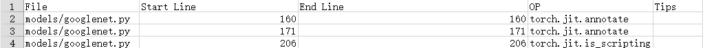
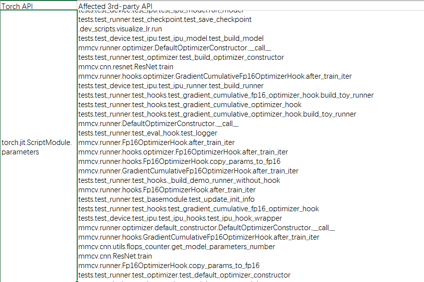
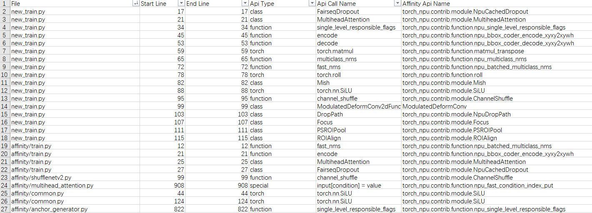
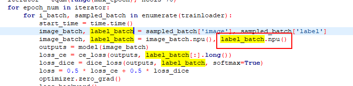
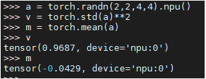
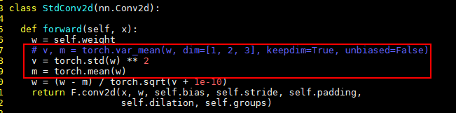

# **分析迁移工具**

## 简介

昇腾NPU是AI算力的后起之秀，但目前训练和在线推理脚本大多是基于GPU的。由于NPU与GPU的架构差异，基于GPU的训练和在线推理脚本不能直接在NPU上使用。

分析迁移工具（msfmktransplt，MindStudio Analysis and Migration Tool）提供PyTorch训练脚本一键式迁移至昇腾NPU的功能，开发者可做到少量代码修改或零代码完成迁移。该工具提供PyTorch Analyse功能，帮助用户分析PyTorch训练脚本的API、第三方库API、亲和API分析以及动态shape的支持情况。同时提供了自动迁移和PyTorch GPU2Ascend工具两种迁移方式，将基于GPU的脚本迁移为基于NPU的脚本，这种自动化方法节省了人工手动进行脚本迁移的学习成本与工作量，大幅提升了迁移效率。

- （推荐）自动迁移：修改内容少，只需在训练脚本中导入库代码，迁移后直接在昇腾NPU平台上运行。
- PyTorch GPU2Ascend工具迁移：迁移过程会生成分析文件，支持用户查看API支持度分析报告和迁移过程中对原训练脚本的修改内容，并支持单卡脚本迁移为多卡脚本。

> [!NOTE] 说明  
> 使用分析迁移工具迁移前，请用户自行确认原工程内各参数的正确性，需在原工程运行成功的基础上使用工具进行迁移。

## 使用前准备 

**环境准备**

该工具功能的实际执行仅依赖CPU，且需提前安装以下必选依赖：

```shell
pip3 install pandas         # 必选，pandas版本号需大于或等于1.2.4
pip3 install libcst         # 必选，语义分析库，用于解析Python文件
pip3 install prettytable    # 必选，将数据可视化为图表形式
pip3 install jedi           # 必选，用于跨文件解析
```

迁移功能执行完成后，若需在NPU上运行迁移后的训练脚本，还需完成以下额外依赖的安装：

- 安装配套版本的CANN Toolkit开发套件包和ops算子包，请参见《[CANN 软件安装指南](https://www.hiascend.com/document/detail/zh/canncommercial/850/softwareinst/instg/instg_0000.html?Mode=PmIns&InstallType=netconda&OS=openEuler)》。
- 配置环境变量。

    安装CANN软件后，使用CANN运行用户进行编译、运行时，需要以CANN运行用户登录环境，执行`source $_{install_path}_set_env.sh`命令设置环境变量。其中${install_path}为CANN软件的安装目录，例如：/usr/local/Ascend/cann。

    > [!NOTE] 说明
    >   
    > 上述环境变量只在当前窗口生效，用户可以将上述命令写入~.bashrc文件，使其永久生效，操作如下：
    > 1. 以安装用户在任意目录下执行`vi ~.bashrc`，打开.bashrc文件，并在该文件最后添加上述环境变量。
    > 2. 执行`:wq!`命令，保存文件并退出。
    > 3. 执行`source ~.bashrc`命令，使环境变量生效。

**约束**

- 分析和迁移工具当前支持PyTorch2.1.0、2.6.0、2.7.1、2.8.0版本训练脚本的分析和迁移。
- 原脚本需要在GPU环境下且基于Python3.7及以上能够运行成功。
- 分析迁移后的执行逻辑与迁移前需保持一致。
- 若原始代码中调用了第三方库，迁移过程可能会存在适配问题。在迁移原始代码前，用户需要根据已调用的第三方库，自行安装昇腾已适配的第三方库版本，已适配的第三方库信息和使用指南请参考《[Ascend Extension for PyTorch 套件与三方库支持清单](https://www.hiascend.com/document/detail/zh/Pytorch/730/modthirdparty/modparts/thirdpart_0003.html)》。
- APEX中使用的FusedAdam优化器不支持使用自动迁移和PyTorch GPU2Ascend工具进行迁移，若原始代码中包含该优化器，用户需自行修改。
- 当前分析工具不支持对原生函数self.dropout()、nn.functional.softmax()、torch.add、bboexs_diou()、bboexs_giou()、LabelSmoothingCrossEntropy()或ColorJitter进行亲和API分析，若原训练脚本涉及以上原生函数，请参考《[Ascend Extension for PyTorch 自定义API参考](https://www.hiascend.com/document/detail/zh/Pytorch/730/apiref/torchnpuCustomsapi/context/overview.md)》中“Python接口 > torch_npu.contrib”节点进行分析和替换。
- 若用户训练脚本中包含昇腾NPU平台不支持的**amp_C**模块，需要用户手动删除import amp_C相关代码内容后，再进行训练。
- 由于转换后的脚本与原始脚本平台不一致，迁移后的脚本在调试运行过程中可能会由于算子差异等原因而抛出异常，导致进程终止，该类异常需要用户根据异常信息进一步调试解决。

**安全注意事项**

- 在Linux环境使用工具时，出于安全性及权限最小化角度考虑，本工具不应使用root等高权限账户进行操作，建议使用普通用户权限安装执行。
- 在Linux环境使用工具时，请确保使用前执行用户的umask值大于等于0027，否则可能会造成工具生成的数据文件和目录权限过大。
- 在Linux环境使用工具时，用户须自行保证使用最小权限原则，如给工具输入的文件要求other用户不可写，在一些对安全要求更严格的功能场景下还需确保输入的文件group用户不可写。
- 由于本工具依赖CANN，为保证安全，应使用同一低权限用户默认安装的CANN包，source命令执行后请不要随意修改set_env.sh中涉及的环境变量。
- 本工具为开发调测工具，不建议在生产环境使用。

## 快速入门

**概述**

分析迁移工具可将基于GPU的训练脚本迁移为支持NPU的脚本，大幅度提高脚本迁移速度，降低开发者的工作量。本样例可以让开发者快速体验自动迁移（推荐）和PyTorch GPU2Ascend工具的迁移效率。

本样例选用ResNet50模型，数据集为ImageNet。

**环境准备**

- 准备一台基于Atlas训练系列产品的训练服务器，并安装对应的驱动和固件。驱动和固件的安装请参考《[CANN 软件安装指南](https://www.hiascend.com/document/detail/zh/canncommercial/850/softwareinst/instg/instg_0000.html?Mode=PmIns&InstallType=netconda&OS=openEuler)》中的“[安装NPU驱动固件](https://www.hiascend.com/document/detail/zh/canncommercial/850/softwareinst/instg/instg_0005.html?Mode=PmIns&InstallType=local&OS=openEuler)”章节。
- 安装开发套件包Ascend-cann-toolkit及ops算子包，具体请参考《[CANN 软件安装指南](https://www.hiascend.com/document/detail/zh/canncommercial/850/softwareinst/instg/instg_0000.html?Mode=PmIns&InstallType=netconda&OS=openEuler)》的“[安装CANN](https://www.hiascend.com/document/detail/zh/canncommercial/850/softwareinst/instg/instg_0008.html?Mode=PmIns&InstallType=local&OS=openEuler)”节点。
- 以安装PyTorch 2.1.0版本为例，具体操作请参考《[Ascend Extension for PyTorch 软件安装指南](https://www.hiascend.com/document/detail/zh/Pytorch/730/configandinstg/instg/insg_0004.html)》的“[安装PyTorch](https://www.hiascend.com/document/detail/zh/Pytorch/730/configandinstg/instg/docs/zh/installation_guide/installation_via_binary_package.md)”章节，完成PyTorch框架和torch_npu插件的安装。

- 下载[main.py](https://gitee.com/ascend/mstt/blob/master/sample/transfer_to_npu/main.py)文件，将获得ResNet50模型放到用户自定义路径下（如/home/user）。

**自动迁移（推荐）**

修改内容少，只需在训练脚本中导入库代码，迁移后直接在昇腾NPU平台上运行。

1. 在训练脚本[main.py](https://gitee.com/ascend/mstt/blob/master/sample/transfer_to_npu/main.py)文件中导入自动迁移的库代码。

    ```python
    from torch.utils.data import Subset
    import torch_npu 
    from torch_npu.contrib import transfer_to_npu   
    .....
    ```

2. 切换目录至迁移完成后的训练脚本所在路径（以/home/user为例），执行以下命令使用虚拟数据集进行训练，迁移完成后的训练脚本可在NPU上正常运行。

    开始打印迭代日志，说明训练功能迁移成功。

    ```shell
    cd /home/user
    python main.py -a resnet50 --gpu 1 --epochs 1 --dummy  # --gpu 1表示使用卡1，--epochs 1是指迭代次数为1
    ```

3. 迁移工具自动保存权重成功，说明迁移成功。

**使用PyTorch GPU2Ascend工具迁移**

1. 进入迁移工具所在路径。

    ```shell
    cd msfmktransplt/src/ms_fmk_transplt/  
    ```

2. 执行脚本迁移任务，参考[**表 6** 参数说明](#参数说明)配置信息。

    ```shell
    bash pytorch_gpu2npu.sh -i /home/user -o /home/out -v 2.1.0  
    ```
    /home/user为原始脚本路径， /home/out为脚本迁移结果输出路径，2.1.0为原始脚本的PyTorch框架版本。

3. 切换目录至迁移完成后的训练脚本所在路径（以/home/user为例），执行以下命令使用虚拟数据集进行训练，迁移完成后的训练脚本可在NPU上正常运行。

    开始打印迭代日志，说明训练功能迁移成功。

    ```shell
    cd /home/user
    python main.py -a resnet50 --gpu 1 --epochs 1 --dummy  # --gpu 1表示使用卡1，--epochs 1是指迭代次数为1
    ```

4. 完成脚本迁移，进入脚本迁移结果的输出路径查看结果件。

    > [!NOTE] 说明  
    > 脚本迁移过程中会启动迁移分析，默认使用torch_apis和affinity_apis的分析模式，可参见[输出结果文件说明](#输出结果文件说明)查看对应的结果件。

5. 迁移工具自动保存权重成功，说明迁移成功。

## 迁移分析

**功能说明**  

PyTorch Analyse工具提供分析脚本，帮助用户在执行迁移操作前，分析基于GPU平台的PyTorch训练脚本中API、第三方库套件、亲和API分析以及动态shape的支持情况，具体请参见[**表 1**  分析模式介绍](#分析模式介绍)。

分析脚本所在路径为：msfmktransplt/src/ms_fmk_transplt/pytorch_analyse.sh。

**表 1** 分析模式介绍 <a id="分析模式介绍"></a>  

|分析模式|分析脚本|分析结果|调优建议
|--|--|--|--
|第三方库套件分析模式|需用户提供待分析的第三方库套件源码。|可快速获得源码中不支持的第三方库API和CUDA信息。</br>说明：第三方库API是指在第三方库代码中的函数，如果某函数的函数体内使用了不支持的torch算子或者CUDA自定义算子，则此函数就是第三方库不支持的API。如果第三方库中其他函数调用了这些不支持的API，则这些调用函数也为不支持的API。|	-
|API支持情况分析模式|需用户提供待分析的PyTorch训练脚本。|可快速获得训练脚本中不支持的torch API和CUDA API信息。|输出训练脚本中API精度和性能调优的专家建议。
|动态shape分析模式|需用户提供待分析的PyTorch训练脚本。|可快速获得训练脚本中包含的动态shape信息。|-	
|亲和API分析模式 |需用户提供待分析的PyTorch训练脚本。|可快速获得训练脚本中可替换的亲和API信息。|-	


**命令格式**

```shell
bash pytorch_analyse.sh -i <input> -o <output> -v <version> [-m <mode>] [-env <env_path>] [-api <api_files>]
```

其中“[]”表示可选参数，实际使用可不用添加；“<>”表示变量。

**参数说明**

**表 2**  参数说明<a id="参数说明1"></a>

|参数| 可选/必选 |参数说明 
|--|:-:|--|
|-i或--input|必选|待分析脚本文件所在文件夹或第三方库套件源码所在文件夹路径。
|-o或--output|必选|分析结果文件的输出路径。会在该路径下生成xxxx_analysis文件夹。用户需确保分析结果文件的输出路径在运行前存在，否则分析迁移工具会提示error。
|-v或--version|必选|待分析脚本或第三方库套件源码的PyTorch版本。
|-m或--mode|可选|分析的模式。默认值为torch_apis。取值为：<ul><li>torch_apis：API支持情况分析</li><li>third_party：第三方库套件分析</li><li> affinity_apis：亲和API分析</li><li>dynamic_shape：动态shape分析</li><ul>
|-env或--env-path|可选|分析时需要增加的PYTHONPATH环境变量路径，仅安装jedi后该参数才生效。</br>指定的第三方库待分析的路径，分析当前脚本中不支持的第三方库的API列表。
|-api或--api-files|可选|第三方库不支持API的分析结果文件。</br>若第三方库存在不支持的API，且自定义函数调用了不支持的torch API，可使用分析torch API的功能。
|-h或--help|可选|打印帮助信息。

**使用示例（API支持情况分析）**

1. 进入分析工具所在路径。

    ```shell
    cd msfmktransplt/src/ms_fmk_transplt
    ```

2. 启动分析任务。

    参考[表2 参数说明](#参数说明1)配置信息，执行如下命令启动分析任务。

    ```shell
    bash pytorch_analyse.sh -i /home/xxx/analysis -o /home/xxx/analysis_output -v 2.1.0    
    ```

    其中/home/xxx/analysis为待分析脚本路径，/home/xxx/analysis_output为分析结果输出路径，2.1.0为待分析脚本框架版本。
      
    若`-m`参数指定的分析模式为dynamic_shape，分析任务完成后需参考[训练配置](#训练配置)对训练脚本进行修改，才能获取动态shape分析报告。


3.  分析完成后，进入脚本分析结果输出路径，查看分析报告，具体请参见[输出结果文件说明](#输出结果文件说明)。


**使用示例（不支持迁移的第三方库API信息分析）**

1. 进入分析工具所在路径。

    ```shell
    cd msfmktransplt/src/ms_fmk_transplt
    ```

2. 使用-m参数的third_party第三方库套件分析功能，获得第三方库中不支持迁移的API列表（csv文件）。

    ```shell
    bash pytorch_analyse.sh -i third_party_input_path -o third_party_output_path -v 2.1.0 -m third_party  
    ```
    third_party_input_path为第三方库文件夹路径，third_party_output_path为结果输出路径，2.1.0为待分析脚本框架版本。

    该命令执行完成后，在third_party_output_path目录下生成第三方库中不支持迁移的API列表，即framework_unsupported_op.csv文件。

3.  将上述步骤中获取的csv文件传入-api，获取当前训练脚本中不支持迁移的三方库API信息。
    ```shell
    bash pytorch_analyse.sh -i input_path -o output_path -v 2.1.0 -api third_party_output_path/framework_unsupported_op.csv
    ```
    input_path为模型脚本文件夹路径，output_path为结果输出路径。


4. 分析完成后，进入脚本分析结果输出路径，查看分析报告，具体请参见[输出结果文件说明](#输出结果文件说明)。

**输出结果文件说明**<a id="输出结果文件说明"></a>

- 分析模式为“torch_apis“时，分析结果如下所示：

    ```tex
    ├── xxxx_analysis     // 分析结果输出目录
    │   ├── cuda_op_list.csv             // CUDA API列表
    │   ├── unknown_api.csv              // 支持存疑的API列表
    │   ├── unsupported_api.csv          // 不支持的API列表
    │   ├── api_precision_advice.csv    // API精度调优的专家建议
    │   ├── api_performance_advice.csv  // API性能调优的专家建议
    │   ├── pytorch_analysis.txt         // 分析过程日志
    ```

    **表 3** “torch_apis“模式csv文件介绍

    |文件名|简介|
    |--|--|
    |unsupported_api.csv|当前框架不支持的API列表，可以在昇腾开源社区寻求帮助。具体可参见[图1 不支持的API列表示例](#不支持的API列表示例)。|
    |cuda_op_list.csv|当前训练脚本包含的CUDA API信息。|
    |unknown_api.csv|支持存疑的API列表，具体的PyTorch API信息请参见[表4 PyTorch API接口信息](#PyTorchAPI接口信息)。如果训练失败，可以到[昇腾开源社区](https://gitcode.com/Ascend/pytorch)求助。|
    |api_precision_advice.csv|当前训练脚本中可以进行精度调优的专家建议，除此之外，还可以使用[msProbe](https://gitcode.com/Ascend/msprobe)工具进行调优。|
    |api_performance_advice.csv|当前训练脚本中可以进行性能调优的专家建议和指导措施，除此之外，还可以使用[Ascend PyTorch Profiler](https://gitcode.com/Ascend/pytorch/blob/v2.7.1/docs/zh/ascend_pytorch_profiler/ascend_pytorch_profiler_user_guide.md)工具进行调优。分析结果基于原生PyTorch框架的API接口信息，具体请参见[表4 PyTorch API接口信息](#PyTorchAPI接口信息 )。|

    **图1** 不支持的API列表示例<a id="不支持的API列表示例"></a>

    **表 4**  PyTorch API接口信息<a id="PyTorchAPI接口信息"></a>
    
   <a name="zh-cn_topic_0000001774027073_table8304143215317"></a>
    <table><thead align="left"><tr id="zh-cn_topic_0000001774027073_row0305173213319"><th class="cellrowborder" valign="top" width="17%" id="mcps1.2.5.1.1"><p id="zh-cn_topic_0000001774027073_p7305432183113"><a name="zh-cn_topic_0000001774027073_p7305432183113"></a><a name="zh-cn_topic_0000001774027073_p7305432183113"></a>PyTorch框架版本</p>
    </th>
    <th class="cellrowborder" valign="top" width="22.2%" id="mcps1.2.5.1.2"><p id="p235583355616"><a name="p235583355616"></a><a name="p235583355616"></a>API信息参考链接</p>
    </th>
    <th class="cellrowborder" valign="top" width="25.230000000000004%" id="mcps1.2.5.1.3"><p id="zh-cn_topic_0000001774027073_p2725034161614"><a name="zh-cn_topic_0000001774027073_p2725034161614"></a><a name="zh-cn_topic_0000001774027073_p2725034161614"></a><span id="ph4892155445110"><a name="ph4892155445110"></a><a name="ph4892155445110"></a>Ascend Extension for PyTorch</span>版本</p>
    </th>
    <th class="cellrowborder" valign="top" width="35.57%" id="mcps1.2.5.1.4"><p id="p19979202325211"><a name="p19979202325211"></a><a name="p19979202325211"></a>CANN版本</p>
    </th>
    </tr>
    </thead>
    <tbody><tr id="row07711219123911"><td class="cellrowborder" valign="top" width="17%" headers="mcps1.2.5.1.1 "><p id="p14771191916397"><a name="p14771191916397"></a><a name="p14771191916397"></a>2.8.0</p>
    </td>
    <td class="cellrowborder" valign="top" width="22.2%" headers="mcps1.2.5.1.2 "><p id="p6771141983910"><a name="p6771141983910"></a><a name="p6771141983910"></a><a href="https://www.hiascend.com/document/detail/zh/Pytorch/720/apiref/PyTorchNativeapi/ptaoplist_000003.html" target="_blank" rel="noopener noreferrer">PyTorch2.8.0</a></p>
    </td>
    <td class="cellrowborder" rowspan="2" valign="top" width="25.230000000000004%" headers="mcps1.2.5.1.3 "><p id="p18771719123914"><a name="p18771719123914"></a><a name="p18771719123914"></a><a href="https://www.hiascend.com/developer/download/commercial/result?module=pt" target="_blank" rel="noopener noreferrer">7.2.0</a></p>
    </td>
    <td class="cellrowborder" rowspan="2" valign="top" width="35.57%" headers="mcps1.2.5.1.4 "><p id="p3771171916395"><a name="p3771171916395"></a><a name="p3771171916395"></a>商用版：<a href="https://www.hiascend.com/developer/download/commercial/result?module=pt" target="_blank" rel="noopener noreferrer">8.3.RC1</a></p>
    <p id="p09011133123818"><a name="p09011133123818"></a><a name="p09011133123818"></a>社区版：<a href="https://www.hiascend.com/developer/download/community/result?module=cann&amp;cann=8.3.RC1" target="_blank" rel="noopener noreferrer">8.3.RC1</a></p>
    </td>
    </tr>
    <tr id="row191956546308"><td class="cellrowborder" valign="top" headers="mcps1.2.5.1.1 "><p id="p16196554163016"><a name="p16196554163016"></a><a name="p16196554163016"></a>2.7.1</p>
    </td>
    <td class="cellrowborder" valign="top" headers="mcps1.2.5.1.2 "><p id="p719616546306"><a name="p719616546306"></a><a name="p719616546306"></a><a href="https://www.hiascend.com/document/detail/zh/Pytorch/720/apiref/PyTorchNativeapi/ptaoplist_000078.html" target="_blank" rel="noopener noreferrer">PyTorch2.7.1</a></p>
    </td>
    </tr>
    <tr id="row10762821104"><td class="cellrowborder" valign="top" width="17%" headers="mcps1.2.5.1.1 "><p id="p02441615143"><a name="p02441615143"></a><a name="p02441615143"></a>2.6.0</p>
    </td>
    <td class="cellrowborder" valign="top" width="22.2%" headers="mcps1.2.5.1.2 "><p id="p1254520271339"><a name="p1254520271339"></a><a name="p1254520271339"></a><a href="https://www.hiascend.com/document/detail/zh/Pytorch/710/apiref/PyTorchNativeapi/ptaoplist_000003.html" target="_blank" rel="noopener noreferrer">PyTorch2.6.0</a></p>
    </td>
    <td class="cellrowborder" rowspan="3" valign="top" width="25.230000000000004%" headers="mcps1.2.5.1.3 "><p id="p2402181212017"><a name="p2402181212017"></a><a name="p2402181212017"></a><a href="https://www.hiascend.com/developer/download/commercial/result?product=4&amp;model=8&amp;solution=c5b8ed4e2c804f70906a0cdffee12b9f" target="_blank" rel="noopener noreferrer">7.1.0</a></p>
    </td>
    <td class="cellrowborder" rowspan="3" valign="top" width="35.57%" headers="mcps1.2.5.1.4 "><p id="p2090714577508"><a name="p2090714577508"></a><a name="p2090714577508"></a>商用版：<a href="https://www.hiascend.com/developer/download/commercial/result?product=4&amp;model=8&amp;solution=c5b8ed4e2c804f70906a0cdffee12b9f" target="_blank" rel="noopener noreferrer">8.2.RC1</a></p>
    <p id="p9907135785011"><a name="p9907135785011"></a><a name="p9907135785011"></a>社区版：<a href="https://www.hiascend.com/developer/download/community/result?module=cann&amp;cann=8.2.RC1" target="_blank" rel="noopener noreferrer">8.2.RC1</a></p>
    </td>
    </tr>
    <tr id="row10762142405"><td class="cellrowborder" valign="top" headers="mcps1.2.5.1.1 "><p id="p13244191511411"><a name="p13244191511411"></a><a name="p13244191511411"></a>2.5.1</p>
    </td>
    <td class="cellrowborder" valign="top" headers="mcps1.2.5.1.2 "><p id="p1779315175319"><a name="p1779315175319"></a><a name="p1779315175319"></a><a href="https://www.hiascend.com/document/detail/zh/Pytorch/710/apiref/PyTorchNativeapi/ptaoplist_000077.html" target="_blank" rel="noopener noreferrer">PyTorch2.5.1</a></p>
    </td>
    </tr>
    <tr id="row1076313214011"><td class="cellrowborder" valign="top" headers="mcps1.2.5.1.1 "><p id="p624431516415"><a name="p624431516415"></a><a name="p624431516415"></a>2.3.1</p>
    </td>
    <td class="cellrowborder" valign="top" headers="mcps1.2.5.1.2 "><p id="p0793017139"><a name="p0793017139"></a><a name="p0793017139"></a><a href="https://www.hiascend.com/document/detail/zh/Pytorch/710/apiref/PyTorchNativeapi/ptaoplist_000149.html" target="_blank" rel="noopener noreferrer">PyTorch2.3.1</a></p>
    </td>
    </tr>
    <tr id="row154435045916"><td class="cellrowborder" valign="top" width="17%" headers="mcps1.2.5.1.1 "><p id="p850703718216"><a name="p850703718216"></a><a name="p850703718216"></a>2.5.1</p>
    </td>
    <td class="cellrowborder" valign="top" width="22.2%" headers="mcps1.2.5.1.2 "><p id="p430914367020"><a name="p430914367020"></a><a name="p430914367020"></a><a href="https://www.hiascend.com/document/detail/zh/Pytorch/700/apiref/apilist/ptaoplist_000005.html" target="_blank" rel="noopener noreferrer">PyTorch2.5.1</a></p>
    </td>
    <td class="cellrowborder" rowspan="4" valign="top" width="25.230000000000004%" headers="mcps1.2.5.1.3 "><p id="p1586155815918"><a name="p1586155815918"></a><a name="p1586155815918"></a><a href="https://www.hiascend.com/developer/download/commercial/result?product=4&amp;model=14&amp;solution=95660a4d75cf44a49463373d356c1a78" target="_blank" rel="noopener noreferrer">7.0.0</a></p>
    </td>
    <td class="cellrowborder" rowspan="4" valign="top" width="35.57%" headers="mcps1.2.5.1.4 "><p id="p197476212215"><a name="p197476212215"></a><a name="p197476212215"></a>商用版：<a href="https://www.hiascend.com/developer/download/commercial/result?product=4&amp;model=8&amp;solution=95660a4d75cf44a49463373d356c1a78" target="_blank" rel="noopener noreferrer">8.1.RC1</a></p>
    <p id="p1274716292217"><a name="p1274716292217"></a><a name="p1274716292217"></a>社区版：<a href="https://www.hiascend.com/developer/download/community/result?module=cann&amp;cann=8.1.RC1" target="_blank" rel="noopener noreferrer">8.1.RC1</a></p>
    </td>
    </tr>
    <tr id="row245105019591"><td class="cellrowborder" valign="top" headers="mcps1.2.5.1.1 "><p id="p1850716371927"><a name="p1850716371927"></a><a name="p1850716371927"></a>2.4.0</p>
    </td>
    <td class="cellrowborder" valign="top" headers="mcps1.2.5.1.2 "><p id="p12873421011"><a name="p12873421011"></a><a name="p12873421011"></a><a href="https://www.hiascend.com/document/detail/zh/Pytorch/700/apiref/apilist/ptaoplist_000371.html" target="_blank" rel="noopener noreferrer">PyTorch2.4.0</a></p>
    </td>
    </tr>
    <tr id="row34575015592"><td class="cellrowborder" valign="top" headers="mcps1.2.5.1.1 "><p id="p1507193712218"><a name="p1507193712218"></a><a name="p1507193712218"></a>2.3.1</p>
    </td>
    <td class="cellrowborder" valign="top" headers="mcps1.2.5.1.2 "><p id="p2713181120118"><a name="p2713181120118"></a><a name="p2713181120118"></a><a href="https://www.hiascend.com/document/detail/zh/Pytorch/700/apiref/apilist/ptaoplist_000730.html" target="_blank" rel="noopener noreferrer">PyTorch2.3.1</a></p>
    </td>
    </tr>
    <tr id="row97151748108"><td class="cellrowborder" valign="top" headers="mcps1.2.5.1.1 "><p id="p15079378210"><a name="p15079378210"></a><a name="p15079378210"></a>2.1.0</p>
    </td>
    <td class="cellrowborder" valign="top" headers="mcps1.2.5.1.2 "><p id="p571515481405"><a name="p571515481405"></a><a name="p571515481405"></a><a href="https://www.hiascend.com/document/detail/zh/Pytorch/700/apiref/apilist/ptaoplist_001088.html" target="_blank" rel="noopener noreferrer">PyTorch2.1.0</a></p>
    </td>
    </tr>
    <tr id="row161801542179"><td class="cellrowborder" valign="top" width="17%" headers="mcps1.2.5.1.1 "><p id="p19882151851817"><a name="p19882151851817"></a><a name="p19882151851817"></a>2.1.0</p>
    </td>
    <td class="cellrowborder" valign="top" width="22.2%" headers="mcps1.2.5.1.2 "><p id="p335593318564"><a name="p335593318564"></a><a name="p335593318564"></a><a href="https://www.hiascend.com/document/detail/zh/Pytorch/600/apiref/apilist/ptaoplist_000704.html" target="_blank" rel="noopener noreferrer">PyTorch 2.1.0</a></p>
    </td>
    <td class="cellrowborder" rowspan="3" valign="top" width="25.230000000000004%" headers="mcps1.2.5.1.3 "><p id="p5882131818183"><a name="p5882131818183"></a><a name="p5882131818183"></a><a href="https://www.hiascend.com/developer/download/commercial/result?product=4&amp;model=14&amp;solution=30612d961f7741b1a95f87775a9b2bcb" target="_blank" rel="noopener noreferrer">6.0.0</a></p>
    </td>
    <td class="cellrowborder" rowspan="3" valign="top" width="35.57%" headers="mcps1.2.5.1.4 "><p id="p155231440155011"><a name="p155231440155011"></a><a name="p155231440155011"></a>商用版：<a href="https://www.hiascend.com/developer/download/commercial/result?product=4&amp;model=8&amp;solution=30612d961f7741b1a95f87775a9b2bcb" target="_blank" rel="noopener noreferrer">8.0.0</a></p>
    <p id="p19523840165011"><a name="p19523840165011"></a><a name="p19523840165011"></a>社区版：<a href="https://www.hiascend.com/developer/download/community/result?module=cann&amp;cann=8.0.0.beta1" target="_blank" rel="noopener noreferrer">8.0.0.beta1</a></p>
    </td>
    </tr>
    <tr id="row898493121811"><td class="cellrowborder" valign="top" headers="mcps1.2.5.1.1 "><p id="p688371861817"><a name="p688371861817"></a><a name="p688371861817"></a>2.3.1</p>
    </td>
    <td class="cellrowborder" valign="top" headers="mcps1.2.5.1.2 "><p id="p16355153305620"><a name="p16355153305620"></a><a name="p16355153305620"></a><a href="https://www.hiascend.com/document/detail/zh/Pytorch/600/apiref/apilist/ptaoplist_000355.html" target="_blank" rel="noopener noreferrer">PyTorch 2.3.1</a></p>
    </td>
    </tr>
    <tr id="row164566631818"><td class="cellrowborder" valign="top" headers="mcps1.2.5.1.1 "><p id="p28831118111817"><a name="p28831118111817"></a><a name="p28831118111817"></a>2.4.0</p>
    </td>
    <td class="cellrowborder" valign="top" headers="mcps1.2.5.1.2 "><p id="p10355173314566"><a name="p10355173314566"></a><a name="p10355173314566"></a><a href="https://www.hiascend.com/document/detail/zh/Pytorch/600/apiref/apilist/ptaoplist_000005.html" target="_blank" rel="noopener noreferrer">PyTorch 2.4.0</a></p>
    </td>
    </tr>
    <tr id="row43851220163516"><td class="cellrowborder" valign="top" width="17%" headers="mcps1.2.5.1.1 "><p id="p948611353812"><a name="p948611353812"></a><a name="p948611353812"></a>2.1.0</p>
    </td>
    <td class="cellrowborder" valign="top" width="22.2%" headers="mcps1.2.5.1.2 "><p id="p533985519119"><a name="p533985519119"></a><a name="p533985519119"></a><a href="https://www.hiascend.com/document/detail/zh/Pytorch/60RC3/apiref/apilist/ptaoplist_000701.html" target="_blank" rel="noopener noreferrer">PyTorch 2.1.0</a></p>
    </td>
    <td class="cellrowborder" rowspan="3" valign="top" width="25.230000000000004%" headers="mcps1.2.5.1.3 "><p id="p14532013384"><a name="p14532013384"></a><a name="p14532013384"></a><a href="https://www.hiascend.com/developer/download/commercial/result?product=4&amp;model=14&amp;solution=4f0929885dcb40a7a12be5704f5ccb15" target="_blank" rel="noopener noreferrer">6.0.rc3</a></p>
    </td>
    <td class="cellrowborder" rowspan="3" valign="top" width="35.57%" headers="mcps1.2.5.1.4 "><p id="p8524940105011"><a name="p8524940105011"></a><a name="p8524940105011"></a>商用版：<a href="https://www.hiascend.com/developer/download/commercial/result?product=4&amp;model=8&amp;solution=4f0929885dcb40a7a12be5704f5ccb15" target="_blank" rel="noopener noreferrer">8.0.RC3</a></p>
    <p id="p1652416401501"><a name="p1652416401501"></a><a name="p1652416401501"></a>社区版：<a href="https://www.hiascend.com/developer/download/community/result?module=cann&amp;cann=8.0.RC3.beta1" target="_blank" rel="noopener noreferrer">8.0.RC3.beta1</a></p>
    </td>
    </tr>
    <tr id="row552004618373"><td class="cellrowborder" valign="top" headers="mcps1.2.5.1.1 "><p id="p8520164610371"><a name="p8520164610371"></a><a name="p8520164610371"></a>2.3.1</p>
    </td>
    <td class="cellrowborder" valign="top" headers="mcps1.2.5.1.2 "><p id="p13340855116"><a name="p13340855116"></a><a name="p13340855116"></a><a href="https://www.hiascend.com/document/detail/zh/Pytorch/60RC3/apiref/apilist/ptaoplist_000315.html" target="_blank" rel="noopener noreferrer">PyTorch 2.3.1</a></p>
    </td>
    </tr>
    <tr id="row1789304919370"><td class="cellrowborder" valign="top" headers="mcps1.2.5.1.1 "><p id="p2089324916378"><a name="p2089324916378"></a><a name="p2089324916378"></a>2.4.0</p>
    </td>
    <td class="cellrowborder" valign="top" headers="mcps1.2.5.1.2 "><p id="p183402055417"><a name="p183402055417"></a><a name="p183402055417"></a><a href="https://www.hiascend.com/document/detail/zh/Pytorch/60RC3/apiref/apilist/ptaoplist_000005.html" target="_blank" rel="noopener noreferrer">PyTorch 2.4.0</a></p>
    </td>
    </tr>
    <tr id="row1492312347118"><td class="cellrowborder" valign="top" width="17%" headers="mcps1.2.5.1.1 "><p id="p55046520111"><a name="p55046520111"></a><a name="p55046520111"></a>1.11.0</p>
    </td>
    <td class="cellrowborder" valign="top" width="22.2%" headers="mcps1.2.5.1.2 "><p id="p113403551111"><a name="p113403551111"></a><a name="p113403551111"></a><a href="https://www.hiascend.com/document/detail/zh/Pytorch/60RC2/apiref/apilist/ptaoplist_001028.html" target="_blank" rel="noopener noreferrer">PyTorch 1.11.0</a></p>
    </td>
    <td class="cellrowborder" rowspan="4" valign="top" width="25.230000000000004%" headers="mcps1.2.5.1.3 "><p id="p2504105210118"><a name="p2504105210118"></a><a name="p2504105210118"></a><a href="https://www.hiascend.com/developer/download/commercial/result?product=4&amp;model=14&amp;solution=e61cfe776f1f4a84925d853055ee059c" target="_blank" rel="noopener noreferrer">6.0.rc2</a></p>
    </td>
    <td class="cellrowborder" rowspan="4" valign="top" width="35.57%" headers="mcps1.2.5.1.4 "><p id="p1752494045012"><a name="p1752494045012"></a><a name="p1752494045012"></a>商用版：<a href="https://www.hiascend.com/developer/download/commercial/result?product=4&amp;model=8&amp;solution=e61cfe776f1f4a84925d853055ee059c" target="_blank" rel="noopener noreferrer">8.0.RC2</a></p>
    <p id="p17524154025010"><a name="p17524154025010"></a><a name="p17524154025010"></a>社区版：<a href="https://www.hiascend.com/developer/download/community/result?module=cann&amp;cann=8.0.RC2.beta1" target="_blank" rel="noopener noreferrer">8.0.RC2.beta1</a></p>
    </td>
    </tr>
    <tr id="row125841346619"><td class="cellrowborder" valign="top" headers="mcps1.2.5.1.1 "><p id="p15051152013"><a name="p15051152013"></a><a name="p15051152013"></a>2.1.0</p>
    </td>
    <td class="cellrowborder" valign="top" headers="mcps1.2.5.1.2 "><p id="p163401552113"><a name="p163401552113"></a><a name="p163401552113"></a><a href="https://www.hiascend.com/document/detail/zh/Pytorch/60RC2/apiref/apilist/ptaoplist_000647.html" target="_blank" rel="noopener noreferrer">PyTorch 2.1.0</a></p>
    </td>
    </tr>
    <tr id="row160518382113"><td class="cellrowborder" valign="top" headers="mcps1.2.5.1.1 "><p id="p18505052513"><a name="p18505052513"></a><a name="p18505052513"></a>2.2.0</p>
    </td>
    <td class="cellrowborder" valign="top" headers="mcps1.2.5.1.2 "><p id="p53408556119"><a name="p53408556119"></a><a name="p53408556119"></a><a href="https://www.hiascend.com/document/detail/zh/Pytorch/60RC2/apiref/apilist/ptaoplist_000326.html" target="_blank" rel="noopener noreferrer">PyTorch 2.2.0</a></p>
    </td>
    </tr>
    <tr id="row162978181027"><td class="cellrowborder" valign="top" headers="mcps1.2.5.1.1 "><p id="p16297111819215"><a name="p16297111819215"></a><a name="p16297111819215"></a>2.3.1</p>
    </td>
    <td class="cellrowborder" valign="top" headers="mcps1.2.5.1.2 "><p id="p734010551019"><a name="p734010551019"></a><a name="p734010551019"></a><a href="https://www.hiascend.com/document/detail/zh/Pytorch/60RC2/apiref/apilist/ptaoplist_000004.html" target="_blank" rel="noopener noreferrer">PyTorch 2.3.1</a></p>
    </td>
    </tr>
    <tr id="zh-cn_topic_0000001774027073_row5305032123114"><td class="cellrowborder" valign="top" width="17%" headers="mcps1.2.5.1.1 "><p id="zh-cn_topic_0000001774027073_p1430573223114"><a name="zh-cn_topic_0000001774027073_p1430573223114"></a><a name="zh-cn_topic_0000001774027073_p1430573223114"></a>1.11.0</p>
    </td>
    <td class="cellrowborder" valign="top" width="22.2%" headers="mcps1.2.5.1.2 "><p id="p1134014551516"><a name="p1134014551516"></a><a name="p1134014551516"></a><a href="https://www.hiascend.com/document/detail/zh/Pytorch/60RC1/apiref/apilist/ptaoplist_000625.html" target="_blank" rel="noopener noreferrer">PyTorch 1.11.0</a></p>
    </td>
    <td class="cellrowborder" rowspan="3" valign="top" width="25.230000000000004%" headers="mcps1.2.5.1.3 "><p id="zh-cn_topic_0000001774027073_p712617528323"><a name="zh-cn_topic_0000001774027073_p712617528323"></a><a name="zh-cn_topic_0000001774027073_p712617528323"></a><a href="https://www.hiascend.com/developer/download/commercial/result?product=4&amp;model=14&amp;solution=3b6d40b14b96433a8c5e40ed08e4b83e" target="_blank" rel="noopener noreferrer">6.0.rc1</a></p>
    </td>
    <td class="cellrowborder" rowspan="3" valign="top" width="35.57%" headers="mcps1.2.5.1.4 "><p id="p18524140135020"><a name="p18524140135020"></a><a name="p18524140135020"></a>商用版：<a href="https://www.hiascend.com/developer/download/commercial/result?product=4&amp;model=8&amp;solution=3b6d40b14b96433a8c5e40ed08e4b83e" target="_blank" rel="noopener noreferrer">8.0.RC1</a></p>
    <p id="p1052494085012"><a name="p1052494085012"></a><a name="p1052494085012"></a>社区版：<a href="https://www.hiascend.com/developer/download/community/result?module=cann&amp;cann=8.0.RC1.beta1" target="_blank" rel="noopener noreferrer">8.0.RC1.beta1</a></p>
    </td>
    </tr>
    <tr id="zh-cn_topic_0000001774027073_row230553218315"><td class="cellrowborder" valign="top" headers="mcps1.2.5.1.1 "><p id="zh-cn_topic_0000001774027073_p2030513213119"><a name="zh-cn_topic_0000001774027073_p2030513213119"></a><a name="zh-cn_topic_0000001774027073_p2030513213119"></a>2.1.0</p>
    </td>
    <td class="cellrowborder" valign="top" headers="mcps1.2.5.1.2 "><p id="p20719111981211"><a name="p20719111981211"></a><a name="p20719111981211"></a><a href="https://www.hiascend.com/document/detail/zh/Pytorch/60RC1/apiref/apilist/ptaoplist_000313.html" target="_blank" rel="noopener noreferrer">PyTorch 2.1.0</a></p>
    </td>
    </tr>
    <tr id="row1641611547594"><td class="cellrowborder" valign="top" headers="mcps1.2.5.1.1 "><p id="p18417754115917"><a name="p18417754115917"></a><a name="p18417754115917"></a>2.2.0</p>
    </td>
    <td class="cellrowborder" valign="top" headers="mcps1.2.5.1.2 "><p id="p134010554120"><a name="p134010554120"></a><a name="p134010554120"></a><a href="https://www.hiascend.com/document/detail/zh/Pytorch/60RC1/apiref/apilist/ptaoplist_000005.html" target="_blank" rel="noopener noreferrer">PyTorch 2.2.0</a></p>
    </td>
    </tr>
    </tbody>
    </table>

- 分析模式为“third_party“时，分析结果如下所示：

    ```tex
    ├── xxxx_analysis     // 分析结果输出目录
    │   ├── cuda_op.csv                  // CUDA API列表
    │   ├── framework_unsupported_op.csv // 框架不支持的API列表
    │   ├── full_unsupported_results.csv // 全量不支持的API列表
    │   ├── migration_needed_op.csv      // 待迁移的API列表
    │   ├── unknown_op.csv              // 支持情况存疑的API列表
    │   ├── pytorch_analysis.txt         // 分析过程日志
    ```

    **表 5** “third_party”模式csv文件介绍

    |文件名|简介|
    |--|--|
    |framework_unsupported_op.csv|框架不支持的API列表，查看第三方库源码中当前框架不支持的第三方库API。对于当前框架不支持的API，可以到[昇腾开源社区](https://gitcode.com/Ascend/pytorch)寻求帮助。具体可参见[图2 不支持的API列表示例](#不支持的API列表示例2)。|
    |cuda_op.csv|当前第三方库源码包含的CUDA API信息。|
    |full_unsupported_results.csv|全量不支持的API列表，由于不支持CUDA和PyTorch框架而导致不支持第三方库的API列表。可以在其他调用已分析第三方库源码的训练脚本执行分析操作时，使用`-api`指定，帮助用户快速获得分析结果。|
    |migration_needed_op.csv|待迁移的API列表，列表中的API支持使用迁移工具进行迁移。|
    |unknown_op.csv|支持情况存疑的API列表。如果训练失败，可以到[昇腾开源社区](https://gitcode.com/Ascend/pytorch)求助。|
   
    **图2**  不支持的API列表示例 <a id="不支持的API列表示例2"></a>     
    


- 分析模式为“affinity_apis“时，分析结果如下所示：

    ```
    ├── xxxx_analysis // 分析结果输出目录
    │   ├──  affinity_api_call.csv      // 可替换为亲和API的原生API调用列表
    │   ├──  pytorch_analysis.txt       // 分析过程日志
    ```

    分析报告affinity_api_call.csv包括原生API的调用信息，并将其分为几种类型：class（类）、function（方法）、torch（Pytorch框架API）以及special（特殊表达式）。用户可以根据分析报告，在训练脚本中将原生API手动替换为指定的亲和API，替换后的脚本在昇腾AI处理器上运行时，性能更优。分析报告示例如下。

    **图3**  亲和API分析报告示例  
    

- 分析模式为“dynamic_shape”时，分析结果如下所示：

    ```tex
    ├── xxxx_analysis                   // 分析结果输出目录
    │   ├── 生成脚本文件                 // 与分析前的脚本文件目录结构一致
    │   ├── msft_dynamic_analysis
    │         ├── hook.py              // 包含动态shape分析的功能参数
    │         ├── __init__.py
    ```

    生成动态shape分析结果件后，还需要先修改分析结果输出目录下训练脚本文件中的读取训练数据集的for循环，手动开启动态shape检测，请参考下方示例进行修改。

    修改前：

    ```
    for i, (ings, targets, paths, _) in pbar:
    ```

    修改后：

    ```
    for i, (ings, targets, paths, _) in DETECTOR.start(pbar) :
    ```

    运行分析修改后的训练脚本，将在分析结果件所在的根目录下生成保存动态shape的分析报告msft_dynamic_shape_analysis_report.csv。

    > [!NOTE] 说明
    > 
    > - 动态shape分析得到的模型训练脚本文件建议在GPU上执行。若已完成模型训练脚本文件迁移且需要在NPU上运行时，则存在动态shape的算子运行时间将会较长。
    > - 若生成的msft_dynamic_shape_analysis_report.csv文件内容为空时，表示训练脚本中没使用动态shape。

## 迁移训练

### 自动迁移方式

**功能说明**

本章节将指导用户将PyTorch训练脚本从GPU平台迁移至昇腾NPU平台。自动迁移方式支持PyTorch2.1.0、2.6.0、2.7.1、2.8.0版本的训练脚本的迁移，自动迁移方式较简单，且修改内容最少，只需在训练脚本中导入库代码。

**注意事项**

-   由于自动迁移工具使用了Python的动态特性，但**torch.jit.script**不支持Python的动态语法，因此用户原训练脚本中包含**torch.jit.script**时使用自动迁移功能会产生冲突。目前自动迁移时会屏蔽torch.jit.script功能，若用户脚本中必须使用**torch.jit.script**功能，请使用[PyTorch GPU2Ascend工具迁移方式](#pytorch-gpu2ascend工具迁移方式)进行迁移。
-   自动迁移工具与昇腾已适配的第三方库可能存在功能冲突，若发生冲突，请使用[PyTorch GPU2Ascend工具迁移方式](#pytorch-gpu2ascend工具迁移方式)进行迁移。
-   当前自动迁移暂不支持**channel_last**特性，建议用户使用**contiguous**进行替换。
-   若原脚本中使用的backend为nccl，在init_process_group初始化进程组后，backend已被自动迁移工具替换为hccl。如果后续代码逻辑包含backend是否为nccl的判断，例如assert backend in ['gloo', 'nccl']、if backend == 'nccl'，请手动将字符串nccl改写为hccl。
-   若用户训练脚本中包含昇腾NPU平台不支持的**torch.cuda.default_generators**接口，需要手动修改为**torch_npu.npu.default_generators**接口。

**迁移操作使用示例**

1.  导入自动迁移的库代码。

    在训练入口`.py`文件的首行，插入以下引用内容。例如train.py中的首行插入以下引用内容。

    ```python
    import torch
    import torch_npu
    from torch_npu.contrib import transfer_to_npu   
    .....
    ```

2.  迁移操作完成。请参考[训练配置](#训练配置)及原始脚本提供的训练流程，在昇腾NPU平台直接运行修改后的模型脚本。
3.  训练完成后，迁移工具自动保存权重成功，说明迁移成功。若迁移失败，请参考[迁移异常处理](#迁移异常处理)进行解决。

**迁移异常处理**<a id="迁移异常处理"></a>

-   如果模型包含评估、在线推理功能，也可在对应脚本中导入自动迁移库代码，并通过对比评估推理结果和日志打印情况，判断与GPU、CPU是否一致决定是否迁移成功。
-   若训练过程中提示部分CUDA接口报错，可能是部分API（算子API或框架API）不支持引起，用户可参考以下方案进行解决。
    -   使用分析迁移工具对模型脚本进行分析，获得支持情况存疑的API列表，进入[昇腾开源社区](https://gitcode.com/Ascend/pytorch)提出ISSUE求助。
    -   Ascend C算子请参考《[Ascend Extension for PyTorch](https://www.hiascend.com/document/detail/zh/Pytorch/730/ptmoddevg/Frameworkfeatures/featuresguide_00021.html)》中的“PyTorch框架特性指南 >  自定义算子适配开发 > [基于OpPlugin算子适配开发](https://www.hiascend.com/document/detail/zh/Pytorch/730/ptmoddevg/Frameworkfeatures/docs/zh/framework_feature_guide_pytorch/adaptation_description_opplugin.md)”章节进行算子适配。

### PyTorch GPU2Ascend工具迁移方式

**功能说明**

本章节介绍PyTorch GPU2Ascend工具的迁移方式。

**注意事项**

- 由于转换后的脚本与原始脚本平台不一致，迁移后的脚本在调试运行过程中可能会由于算子差异等原因而出现异常，导致进程终止，该类异常需要用户根据异常信息进一步调试解决。
- 分析迁移后可以参考原始脚本提供的训练流程进行训练。

**命令格式**

```shell
#单卡
bash pytorch_gpu2npu.sh -i <input> -o <output> -v <version> [-s]
#分布式
bash pytorch_gpu2npu.sh -i <input> -o <output> -v <version>  [-s] distributed -m [-t <model>]
```

其中“[]”表示可选参数，实际使用可不用添加；“<>”表示变量。

**参数说明**

 **表 6**  参数说明<a id="参数说明"></a>

|参数|是否必选|参数说明
|--|--|--|
|-i或--input|必选。|要进行迁移的原始脚本文件所在文件夹路径。
|-o或--output|必选。|脚本迁移结果文件输出路径。不开启distributed即迁移至单卡脚本场景下，输出目录名为xxx_msft；开启distributed即迁移至多卡脚本场景下，输出目录名为xxx_msft_multi，xxx为原始脚本所在文件夹名称。
|-v或--version|必选。|待迁移脚本的PyTorch版本。
|-s或--specify-device|可选。|可以通过环境变量DEVICE_ID指定device作为高级特性，但有可能导致原本脚本中分布式功能失效。
|distributed|-m/--main：必选。<br>-t/--target_model：可选。|将GPU单卡脚本迁移为NPU多卡脚本，仅支持[使用torch.utils.data.DataLoader方式加载数据的场景说明](#使用torchutilsdatadataloader方式加载数据的场景说明)。指定此参数后，才可以指定-t/--target_model参数。 <br>-m/--main：训练脚本的入口Python文件。<br>-t/--target_model：待迁移脚本中的实例化模型变量名，默认为“model”，如果变量名不为"model"时，则需要配置此参数，例如"my_model = Model()"，需要配置为-t my_model。
|-h或--help|-|打印帮助信息。

**使用示例**

1. 进入迁移工具所在路径。

    ```shell
    cd msfmktransplt/src/ms_fmk_transplt  
    ```

2. 启动迁移任务。

    参考[**表 6** 参数说明](#参数说明)配置信息，执行如下命令启动迁移任务。

    ```shell
    bash pytorch_gpu2npu.sh -i /home/username/fmktransplt -o /home/username/fmktransplt_output -v 2.1.0 distributed -m /home/train/train.py   
    ```
    其中/home/username/fmktransplt为原始脚本路径，/home/username/fmktransplt_output为脚本迁移结果输出路径，2.1.0为原始脚本框架版本，/home/train/train.py为训练脚本的入口文件，model为目标模型变量名。distributed及其参数-m、-t在语句最后指定。

    参考示例：

    ```shell
    # 单卡
    bash pytorch_gpu2npu.sh -i /home/train/ -o /home/out -v 2.1.0 
    # 分布式
    bash pytorch_gpu2npu.sh -i /home/train/ -o /home/out -v 2.1.0  distributed -m /home/train/train.py 
    ```


3. 完成脚本迁移，进入脚本迁移结果的输出路径查看结果件。

    > [!NOTE] 说明
    >
    > - 脚本迁移过程中会启动迁移分析，默认使用torch_apis和affinity_apis的分析模式，可参见[输出结果文件说明](#输出结果文件说明)查看对应的结果件。
    > - 若迁移时启用了“distributed“参数，可参见[GPU单卡脚本迁移为NPU多卡脚本](#gpu单卡脚本迁移为npu多卡脚本)获取相关结果件。


4. 请参考[训练配置](#训练配置)及原始脚本提供的训练流程，在昇腾NPU平台直接运行修改后的模型脚本。
5. 成功保存权重，说明保存权重功能迁移成功。
6. 训练完成后，迁移工具自动保存权重成功，说明迁移成功。

### 训练配置

**功能说明**

本章节主要介绍在特殊场景中进行模型迁移训练时需要注意的配置事项。


**注意事项**

无。

**使用示例**

- 为了提升模型运行速度，建议开启使用二进制算子，请参考《[CANN 软件安装指南](https://www.hiascend.com/document/detail/zh/canncommercial/850/softwareinst/instg/instg_0000.html?Mode=PmIns&InstallType=local&OS=openEuler)》中的“[安装CANN](https://www.hiascend.com/document/detail/zh/canncommercial/850/softwareinst/instg/instg_0008.html?Mode=PmIns&InstallType=local&OS=openEuler)”章节安装Toolkit开发套件包及ops算子包后，参考如下方式开启：
    - 单卡场景下，修改训练入口文件例如main.py文件，在import torch_npu下方添加如下代码。

        ```python
        import torch
        import torch_npu
        torch_npu.npu.set_compile_mode(jit_compile=False)
        ......
        ```

    - 多卡场景下，如果拉起多卡训练的方式为mp.spawn，则torch_npu.npu.set_compile_mode(jit_compile=False)必须加在进程拉起的主函数中才能使能二进制，否则使能方式与单卡场景相同。

        ```shell
        if is_distributed:
            mp.spawn(main_worker, nprocs=ngpus_per_node, args=(ngpus_per_node, args))
        else:
            main_worker(args.gpu, ngpus_per_node, args)
        def main_worker(gpu, ngpus_per_node, args):
            # 加在进程拉起的主函数中
           torch_npu.npu.set_compile_mode(jit_compile=False)
            ......
        ```

- 用户训练脚本中包含昇腾NPU平台不支持的**torch.nn.DataParallel**接口，需要手动修改为**torch.nn.parallel.DistributedDataParallel**接口执行多卡训练，参考[GPU单卡脚本迁移为NPU多卡脚本](#gpu单卡脚本迁移为npu多卡脚本)进行修改。
- 若用户训练脚本中包含昇腾NPU平台不支持的**amp_C**模块，需要用户手动删除**import amp_C**相关代码内容后，再进行训练。
- 若用户训练脚本中包含**torch.cuda.get_device_capability**接口，迁移后在昇腾NPU平台上运行时，会返回“None”值。

    > [!NOTE] 说明  
    > GPU平台调用**torch.cuda.get_device_capability**接口时，会返回数据类型为Tuple[int, int]的GPU算力值。而NPU平台的**torch.npu.get_device_capability**接口没有相应概念，会返回“None”。若遇报错，需要用户将“None”值手动修改为Tuple[int, int]类型的固定值。

- **torch.cuda.get_device_properties**接口迁移后在昇腾NPU平台上运行时，返回值不包含minor和major属性，建议用户注释掉调用minor和major属性的代码。

## 案例

### 使用torch.utils.data.DataLoader方式加载数据的场景说明

**torch.utils.data.DataLoader**是PyTorch中一个用于数据加载的工具类，主要用于将样本数据划分为多个小批次(batch)，以便进行训练、测试、验证等任务，查看模型脚本中的数据集加载方式是否是通过**torch.utils.data.DataLoader**加载，示例代码如下：

```python
import torch
from torchvision import datasets, transforms
# 定义数据转换
transform = transforms.Compose([
    transforms.ToTensor(),  # 将图像转换为张量
    transforms.Normalize((0.5,), (0.5,))  # 标准化图像
])
# 加载MNIST数据集
train_dataset = datasets.MNIST(root='./data', train=True, download=True, transform=transform)
test_dataset = datasets.MNIST(root='./data', train=False, download=True, transform=transform)
# 创建数据加载器
train_loader = torch.utils.data.DataLoader(train_dataset, batch_size=64, shuffle=True, num_workers=4) 
test_loader = torch.utils.data.DataLoader(test_dataset, batch_size=64, shuffle=False, num_workers=4)
# 使用数据加载器迭代样本
for images, labels in train_loader:
    # 训练模型的代码
    ...
```

### GPU单卡脚本迁移为NPU多卡脚本

如果迁移时启用了“distributed“参数，想将GPU单卡脚本迁移为NPU多卡脚本，需进行如下操作获取结果文件：

> [!NOTE] 说明 
> 将GPU单卡脚本迁移为NPU多卡脚本之后，若原模型训练命令中包含指定卡号进行单卡运行的参数（如--gpu），需要删除该参数，以确保多卡运行不失效。

1. 训练脚本语句替换。

    将执行迁移命令后生成的“run_distributed_npu.sh“文件中的please input your shell script here语句替换成模型原来的训练shell脚本。例如将“**please input your shell script here**”替换为模型训练命令“**bash_model_train_script.sh _--data_path  _data_path_**”。

    “run_distributed_npu.sh“文件如下所示：

    ```shell
    export MASTER_ADDR=127.0.0.1 
    export MASTER_PORT=29688 
    export HCCL_WHITELIST_DISABLE=1    
     
    NPUS=($(seq 0 7)) 
    export RANK_SIZE=${#NPUS[@]} 
    rank=0 
    for i in ${NPUS[@]} 
    do 
        export DEVICE_ID=${i} 
        export RANK_ID=${rank} 
        echo run process ${rank} 
        please input your shell script here > output_npu_${i}.log 2>&1 & 
        let rank++ 
    done
    ```

    **表 7**  run_distributed_npu.sh参数说明

    |参数|说明|
    |--|--|
    |MASTER_ADDR|指定训练服务器的IP。|
    |MASTER_PORT|指定训练服务器的端口。|
    |HCCL_WHITELIST_DISABLE|HCCL通信白名单校验。|
    |NPUS|指定在特定NPU上运行。|
    |RANK_SIZE|指定调用卡的数量。|
    |DEVICE_ID|指定调用的device_id。|
    |RANK_ID|指定调用卡的逻辑ID。|


2. 替换后，执行“run_distributed_npu.sh“文件，会生成指定NPU的log日志。
3. 查看结果文件。

   脚本迁移完成后，进入结果输出路径查看结果文件。以GPU单卡脚本迁移为NPU多卡脚本为例，结果文件包含以下内容：

    ```tex
    ├── xxx_msft/xxx_msft_multi         // 脚本迁移结果输出目录
    │   ├── 生成脚本文件                 // 与迁移前的脚本文件目录结构一致
    │   ├── msFmkTranspltlog.txt        // 脚本迁移过程日志文件,日志文件限制大小为1M,若超过限制将分多个文件进行存储,最多不会超过10个
    │   ├── cuda_op_list.csv            // 分析出的CUDA算子列表
    │   ├── unknown_api.csv             // 支持情况存疑的API列表
    │   ├── unsupported_api.csv         // 不支持的API列表
    │   ├── change_list.csv              // 修改记录文件
    │   ├── run_distributed_npu.sh       // 多卡启动shell脚本
    ```

4. 查看迁移后的py脚本，可以看到脚本中的CUDA侧API被替换成NPU侧的API。

    ```python
    def main():
        args = parser.parse_args()
     
        if args.seed is not None:
            random.seed(args.seed)
            torch.manual_seed(args.seed)
            cudnn.deterministic = True
            cudnn.benchmark = False
            warnings.warn('You have chosen to seed training. '
                          'This will turn on the CUDNN deterministic setting, '
                          'which can slow down your training considerably! '
                          'You may see unexpected behavior when restarting '
                          'from checkpoints.')
     
        if args.gpu is not None:
            warnings.warn('You have chosen a specific GPU. This will completely '
                          'disable data parallelism.')
     
        if args.dist_url == "env://" and args.world_size == -1:
            args.world_size = int(os.environ["WORLD_SIZE"])
     
        args.distributed = args.world_size > 1 or args.multiprocessing_distributed
     
        if torch_npu.npu.is_available():
            ngpus_per_node = torch_npu.npu.device_count()
        else:
            ngpus_per_node = 1
        if args.multiprocessing_distributed:
            # Since we have ngpus_per_node processes per node, the total world_size
            # needs to be adjusted accordingly
            args.world_size = ngpus_per_node * args.world_size
            # Use torch.multiprocessing.spawn to launch distributed processes: the
            # main_worker process function
            mp.spawn(main_worker, nprocs=ngpus_per_node, args=(ngpus_per_node, args))
        else:
            # Simply call main_worker function
            main_worker(args.gpu, ngpus_per_node, args)
    ```

## FAQ

### “Segmentation fault”错误

**问题现象**

运行转换后代码无报错，仅提示“Segmentation fault”信息。

**原因分析**

 - 可能原因一：

    代码中引用了TensorBoard或第三方库中包含TensorBoard，以下为已知的引用TensorBoard的第三方库。

    - wandb：若该库仅用来打log，可以删除该库的调用。
    - transformers：该库深度绑定TensorFlow、TensorBoard。

- 可能原因二：

    训练脚本中包含两个0维Tensor在不同设备上进行比较的代码，当前该比较不支持在torch_npu上运行。

**解决方案**

- 原因一解决方案：

    注释掉相关的Summary、Writer调用即可规避该错误。Summary、Writer多用于记录日志和绘图，不影响网络跑通和精度收敛。

- 原因二解决方案：

    在脚本启动命令前添加**python -X faulthandler**打印线程信息，定位到具体的报错位置，进行pdb调试。来定位脚本中是否存在两个0维Tensor在不同设备上进行比较的代码，需要用户手动修改为在同一设备上进行比较，示例如下：

    修改前，在CPU和NPU上进行比较：

    ```python
    a = torch.tensor(123)
    b = torch.tensor(456).npu()
    print(a == b)
    ```

    修改后，添加如下信息，修改为同在NPU上进行比较：

    ```python
    a = torch.tensor(123).npu()
    b = torch.tensor(456).npu()
    print(a == b)
    ```

### 引用库找不到的问题

引用库找不到的问题，有可能是以下三种情况，请根据实际情况进行排查：

**问题现象一**  
当前目录或子目录中存在的文件夹或者文件找不到引用库。

**解决方案一**   
只需将该目录的父目录加到PYTHONPATH环境变量中即可。

**问题现象二**  
找不到的引用库为requirements.txt中说明需要pip安装的包。

**解决方案二**  
可以使用**pip install 包名**进行安装，若安装失败可以git clone安装包，使用python3 setup.py install安装。

**问题现象三**  
找不到的引用库为readme.md中说明需要通过git clone下载安装的安装包。

**解决方案三**  
请按照要求下载并安装。

### Muls算子不支持int64
**问题现象**



**解决方案**  
如上图所示，将label_batch.npu()改成label_batch.int().npu()，即把当前报错行的变量类型改成int32，规避此类Muls算子不支持int64的问题。

### 对于报错“No supported Ops kernel and engine are found for [ReduceStdV2A], optype [ReduceStdV2A]”，算子ReduceStdV2A不支持的问题

**问题现象**

报错“No supported Ops kernel and engine are found for [ReduceStdV2A], optype [ReduceStdV2A]”，算子ReduceStdV2A不支持。

**解决方案**  
可以通过用std求标准差再平方得到var，均值单独调用mean接口求来规避问题例如：



具体到代码中修改：



### 常见运行报错

**表 8**  常见运行报错

|报错信息|解决措施|
|--|--|
|运行报错：RuntimeError: Attempting to deserialize object on a CUDA device but torch.cuda.is_available() is False. If you are running on a CPU-only machine, please use torch.load with map_location=torch.device(‘cpu’) to map your storages to the CPU.|一般在报错代码行加入参数map_location=torch.device(‘cpu’)即可规避此问题。|
|运行报错：Unsupport data type: at::ScalarType::Double.|在报错代码行前添加数据类型转换语句即可规避此问题。如报错代码行为pos = label.data.eq(1).nonzero(as_tuple =False).squeeze().npu()不支持数据类型，在代码上一行加上label = label.cpu().float().npu()进行数据类型转换。|
|运行报错：IndexError: invalid index of a 0-dim tensor. Use tensor.item() in Python or tensor.item<T>() in C++ to convert a 0-dim tensor to a number.|遇到类似错误直接将代码中.data[0]改成.item()。例如将：`M = (d_loss_real + torch.abs(diff)).data[0]`改为：`M = (d_loss_real + torch.abs(diff)).item()`|
|运行报错：Could not run ‘aten::empty_with_format’ with arguments from the ‘CPUTensorId’ backend. ‘aten::empty_with_format’ is only available for these backend "CUDA、NPU".|需要将Tensor放到NPU上，类似input = input.npu()。|
|运行报错：options.device().type() == DeviceType::NPU INTERNAL ASSERT FAILED xxx:|需要将Tensor放到NPU上，类似input = input.npu()。|
|运行报错：Attempting to deserialize object on a CUDA device but torch.cuda.is_available() is False.|此错误一般是torch.load()接口导致的，需要加关键字参数map_location，如map_location='npu’或map_location=‘cpu’。|
|运行报错：RuntimeError: Incoming model is an instance of torch.nn.parallel.DistributedDataParallel. Parallel wrappers should only be applied to the model(s) AFTER.|此错误是由于torch.nn.parallel.DistributedDataParallel接口在apex.amp.initial接口之前调用导致的，需要手动将torch.nn.parallel.DistributedDataParallel接口的调用移到apex.amp.initial接口调用之后即可。|


