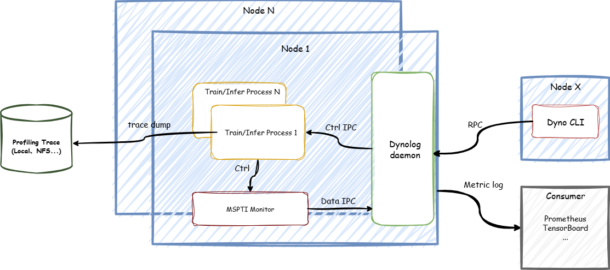

# msMonitor

## 📌 简介
msMonitor是MindStudio推出的一站式在线监控工具，提供用户在集群场景性能监控定位端到端能力。msMonitor基于[dynolog](https://github.com/facebookincubator/dynolog)开发，结合AI框架（[Ascend PyTorch Profiler](https://www.hiascend.com/document/detail/zh/mindstudio/81RC1/T&ITools/Profiling/atlasprofiling_16_0090.html#ZH-CN_TOPIC_0000002353635602__zh-cn_topic_0000002370275077_section17272160135118)、[MindSpore Profiler](https://www.hiascend.com/document/detail/zh/mindstudio/81RC1/T&ITools/Profiling/atlasprofiling_16_0087.html#ZH-CN_TOPIC_0000002353475766__zh-cn_topic_0000002370195177_section0157845102716)）的动态采集能力和[MSPTI](https://www.hiascend.com/document/detail/zh/mindstudio/81RC1/T&ITools/Profiling/atlasprofiling_16_0021.html)，为用户提供**nputrace**和**npumonitor**功能：
1. **npumonitor功能**：轻量常驻后台，监控关键算子耗时
2. **nputrace功能**：获取到框架、CANN以及device的详细性能数据

  

如上图所示msMonitor分为三部分： 
1. **Dynolog daemon**：dynolog守护进程，每个节点只有一个守护进程，负责接收dyno CLI的RPC请求、触发nputrace和npumonitor功能、上报数据的处理以及最终数据的展示。
2. **Dyno CLI**：dyno客户端，为用户提供nputrace和npumonitor子命令，任意节点都可以安装。
3. **MSPTI Monitor**：基于MSPTI实现的监控子模块，通过调用MSPTI的API获取性能数据，并上报给Dynolog daemon。


## 💻 版本说明
msMonitor由三个文件组成，其中dyno和dynolog可以被打包为deb包或者rpm包。最新的预编译安装包和版本依赖请查看[msMonitor release](./docs/release_notes.md)。目前msMonitor支持在[PyTorch](https://gitcode.com/Ascend/pytorch)框架和[MindSpore](https://www.mindspore.cn/)框架上运行。 

| 文件名                                                                                                  | 用途                                                                                                                | 
|------------------------------------------------------------------------------------------------------|-------------------------------------------------------------------------------------------------------------------|
| dyno                                                                                                 | dyno客户端二进制文件                                                                                                      |
| dynolog                                                                                              | dynolog服务端二进制文件                                                                                                   |
| msmonitor_plugin-{mindstudio_version}-cp{python_version}-cp{python_version}-linux_{system_architecture}.whl | MSPTI Monitor、IPC等公共能力工具包，{mindstudio_version}表示mindstudio版本号，{python_version}表示python版本号，{system_architecture}表示CPU架构系统 |

## 🚀 快速上手
### Step 1: 安装
请参见[msMonitor安装手册](./docs/install.md)，安装msMonitor工具，推荐使用下载软件包安装。

### Step 2: 运行
npumonitor和nputrace功能详细说明请参考[特性介绍](#-特性介绍)章节，下面介绍msMonitor常见的使用场景：
1. 先使用npumonitor功能获取关键算子耗时
2. 当发现监控到关键算子耗时劣化，使用nputrace功能采集详细性能数据做分析

**操作步骤**
1. 拉起dynolog daemon进程，详细介绍请参考[dynolog介绍](./docs/dynolog.md)

- 示例
```bash
# 命令行方式开启dynolog daemon
dynolog --enable-ipc-monitor --certs-dir /home/server_certs

# 如需使用Tensorboard展示数据，传入参数--metric_log_dir用于指定Tensorboard文件落盘路径
# 例如：
dynolog --enable-ipc-monitor --certs-dir /home/server_certs --metric_log_dir /tmp/metric_log_dir # dynolog daemon的日志路径为：/var/log/dynolog.log
```

2. 使能msMonitor环境变量
```bash
export MSMONITOR_USE_DAEMON=1
```

3. 设置LD_PRELOAD使能MSPTI（使能npumonitor功能设置）
```bash
# 默认路径示例：export LD_PRELOAD=/usr/local/Ascend/ascend-toolkit/latest/lib64/libmspti.so
export LD_PRELOAD=<CANN toolkit安装路径>/ascend-toolkit/latest/lib64/libmspti.so
```
4. 拉起训练/推理任务
```bash
bash run_ai_task.sh
```
5. 使用dyno命令行触发npumonitor监控关键算子耗时
```bash
# 开启npu-monitor，上报周期30s, 上报数据类型为Kernel
dyno --certs-dir /home/client_certs npu-monitor --npu-monitor-start --report-interval-s 30 --mspti-activity-kind Kernel
```
```bash
# 关闭npu-monitor
dyno --certs-dir /home/client_certs npu-monitor --npu-monitor-stop
```
6. 使用dyno命令行触发nputrace采集详细trace数据（需要关闭npumonitor功能才能触发nputrace功能）
```bash
# 从第10个step开始采集，采集2个step，采集框架、CANN和device数据，同时采集完后自动解析以及解析完成不做数据精简，落盘路径为/tmp/profile_data
dyno --certs-dir /home/client_certs nputrace --start-step 10 --iterations 2 --activities CPU,NPU --analyse --data-simplification false --log-file /tmp/profile_data
```

## 📖 特性介绍
⚠️ 由于底层资源限制，npumonitor功能和nputrace不能同时开启。

1. 执行 dyno 命令后，响应结果里有一个 ‘response’ 的json字符串。该字符串中的 ‘commandStatus’ 字段用于标识命令是否生效：‘effective’ 表示命令会生效，‘ineffective’ 表示命令无效。其他字段均为 dynolog 的原生字段(仅状态为‘effective’时存在)。

### 📈 npumonitor特性
npumonitor特性为用户提供轻量化监控关键指标的能力，npumonitor基于[MSPTI](https://www.hiascend.com/document/detail/zh/mindstudio/81RC1/T&ITools/Profiling/atlasprofiling_16_0021.html)开发，用户可以通过npumonitor查看模型运行时的计算、通信算子执行耗时。
具体使用方式请参考[npumonitor使用方式](./docs/npumonitor.md)，MindSpore框架下使用方式请参考[MindSpore框架下msMonitor的使用方法](./docs/mindspore_adapter.md)。

### 📊 nputrace特性
nputrace特性为用户提供动态触发AI框架（[Ascend PyTorch Profiler](https://www.hiascend.com/document/detail/zh/mindstudio/81RC1/T&ITools/Profiling/atlasprofiling_16_0090.html)、[MindSpore Profiler](https://www.hiascend.com/document/detail/zh/mindstudio/81RC1/T&ITools/Profiling/atlasprofiling_16_0087.html)）采集解析的能力，即实现模型拉起后不需要中断模型运行，可多次触发不同配置Profiler采集解析。采集的性能数据可以使用[MindStudio Insight](https://www.hiascend.com/document/detail/zh/mindstudio/81RC1/GUI_baseddevelopmenttool/msascendinsightug/Insight_userguide_0002.html)进行可视化，效果图如下。
具体使用方式请参考[nputrace使用方式](./docs/nputrace.md)，MindSpore框架下使用方式请参考[MindSpore框架下msMonitor的使用方法](./docs/mindspore_adapter.md)


## 🔒 安全声明
[mstt安全声明](../security_statement/mstt安全声明.md)
## ❓ FAQ
[msMonitor FAQ](./docs/faq.md)