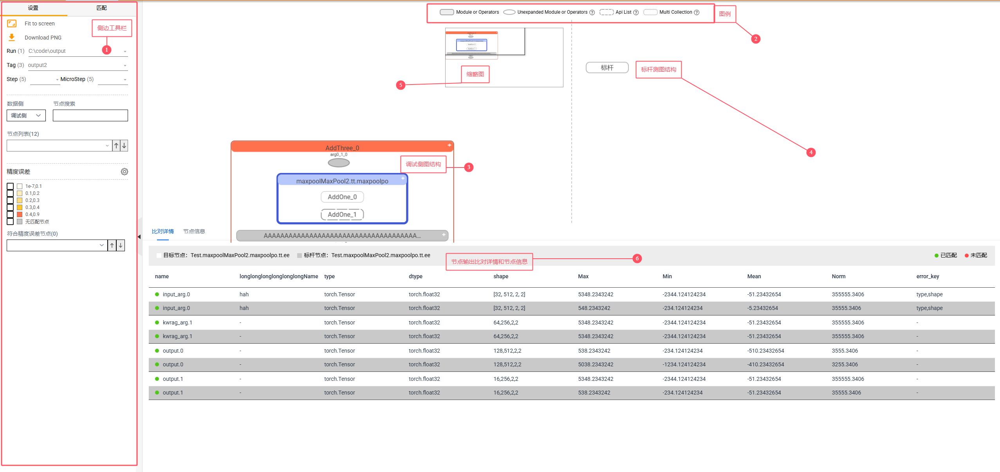
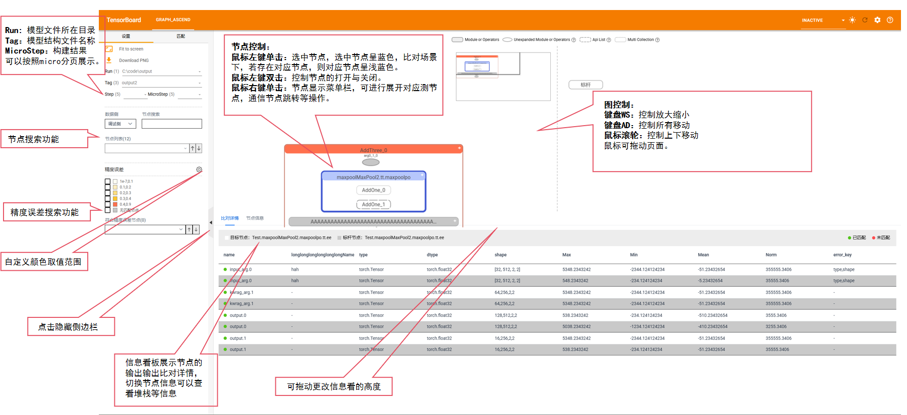
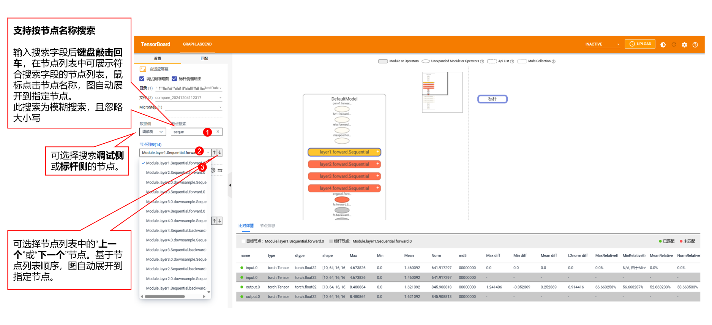
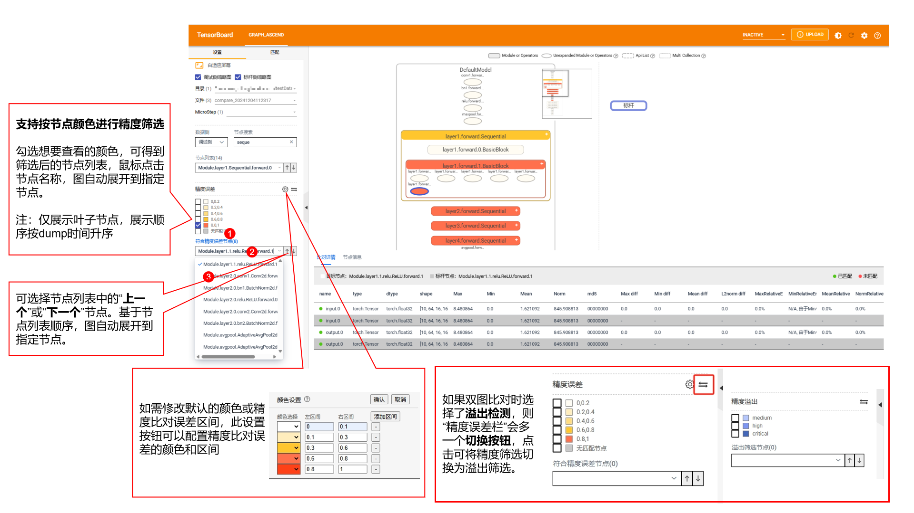
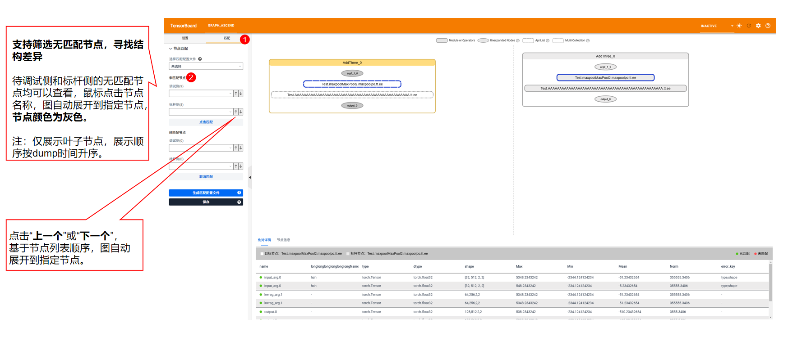
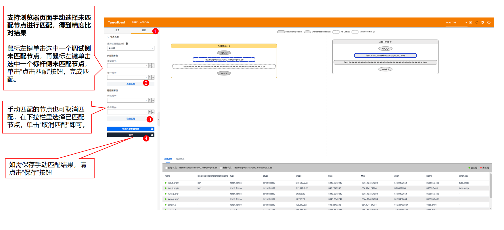

# tb-graph-ascend

## 一、 介绍

此工具是将模型结构进行分级可视化展示的 Tensorboard 插件。可将模型的层级关系、精度性能数据进行可视化，并支持将调试模型和标杆模型进行分视图展示和关联比对，方便用户快速定位精度问题。

## 二、快速安装

### 1. 相关依赖

  `python >= 3.7 ，tensorboard >= 2.11.2，numpy <= 1.26.3`

### 2. 安装方式

#### 2.1 pip 安装（推荐）

  - 现本插件已经上传到 pypi 社区，用户可在 python 环境下直接通过以下 pip 指令进行安装：
    ```
    pip install tb-graph-ascend
    ```
  - 也可在 pypi 社区上下载离线 whl 包，传输到无法访问公网的环境上离线安装使用。访问[下载链接](https://pypi.org/project/tb-graph-ascend/#files)选择 whl 包进行下载，之后便可使用指令安装（此处{version}为 whl 包实际版本）
    ```
    pip install tb-graph_ascend_{version}-py3-none-any.whl
    ```

#### 2.2 从源代码安装

1. 从仓库下载源码并切换到 master 分支:

    ```
    git clone https://gitee.com/ascend/mstt.git -b master
    ```

2. 进入目录 `plugins/tensorboard-plugins/tb_graph_ascend` 下
3. 编译前端代码，根据操作系统选取不同指令

    ```
    cd fe
    // Windows系统
    npm run buildWin
    // 其他可使用cp指令的系统，如Linux或Mac
    npm run buildLinux
    ```

    **注意**: 此步骤需要安装 Node.js 环境

4. 回到上级目录直接安装:
    ```
    cd ../
    python setup.py develop
    ```
  - 或： 构建 whl 包安装
    ```
    python setup.py bdist_wheel
    ```
    在 `plugins/tensorboard-plugins/tb_graph_ascend/dist` 目录下取出 whl 包，使用以下指令安装（此处{version}为 whl 包实际版本）
    ```
    pip install tb-graph_ascend_{version}-py3-none-any.whl
    ```

### 3. 解析数据说明

  将通过[msprobe](https://gitee.com/ascend/mstt/tree/master/debug/accuracy_tools/msprobe#10-%E5%88%86%E7%BA%A7%E5%8F%AF%E8%A7%86%E5%8C%96%E6%9E%84%E5%9B%BE%E6%AF%94%E5%AF%B9)工具构图功能采集得到的文件后缀为.vis 的模型结构文件（文件本身为 json 格式）放置于某个文件夹中，路径名称下文称之为 `out_path` 
  - E.g. \
  `---output_path` \
  `-----output.vis` \
  `-----output2.vis`

### 4. 启动方式

1. 启动 TensorBoard

   ```
   tensorboard --logdir output_path
   ```

   如果网络浏览器与启动 TensorBoard 的机器不在同一台机器上，则需要在尾部加上`--bind_all`命令，如：

   ```
   tensorboard --logdir output_path --bind_all
   ```

   注意：确保默认端口 6006 对浏览器的主机打开。

   如果需要切换端口号需要在尾部加上指定的端口号，如`--port=6007`

   ```
   tensorboard --logdir output_path --port=6007
   ```

2. 在浏览器上打开 tensorboard

   在浏览器中打开 URL： `http://localhost:6006`。
   如果 tensorboard 启动命令使用`--bind_all`, 则需将主机名由`localhost`替换为主机的 ip 地址。

   注意：如果`--logdir` 指定目录下的文件太大或太多，请等候，刷新浏览器查看加载结果。

## 三、浏览器查看

### 3.1 主界面




### 3.2 操作方式：

-  **节点双击打开，单击选中。**
-  **选中的节点边框呈现蓝色，比对场景下若其存在对应节点，则对应节点边框为浅蓝色。**
-  **键盘 WS 根据鼠标位置放大缩小，AD 左右移动。**
-  **鼠标滚轮上下移动，鼠标可拖动页面。**
-  **比对场景鼠标右键可选中节点，并可展开至对应侧的节点并选中。**


### 3.3 名称搜索

### 3.4 精度筛选/溢出筛选
注意：单图场景不存在精度筛选和溢出筛选，下图为双图比对场景。<br>


### 3.5 未匹配节点筛选
参考匹配说明 ，不符合匹配规则的节点为无匹配节点，颜色标灰。适用于排查两个模型结构差异的场景。<br>


### 3.6 手动选择节点匹配
可通过浏览器界面，通过鼠标选择两个待匹配的灰色节点进行匹配。当前暂不支持真实数据模式。<br>




### 附录

[公网地址说明](./doc/公网地址说明.csv)

