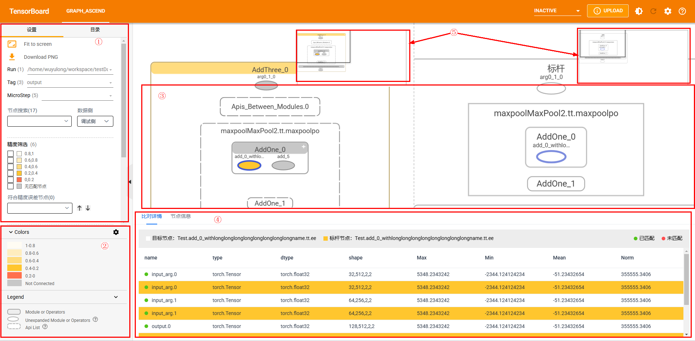
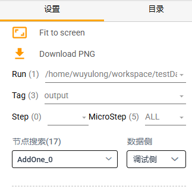
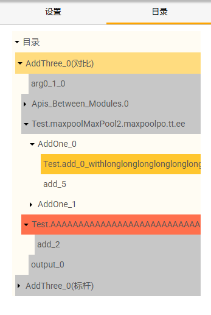
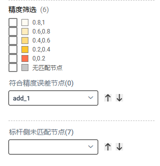
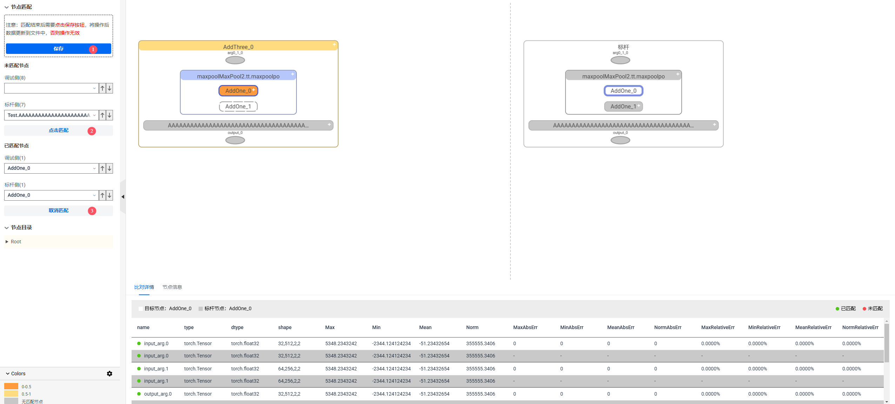
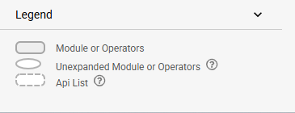
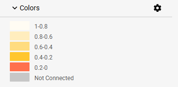
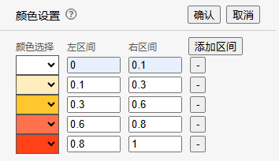
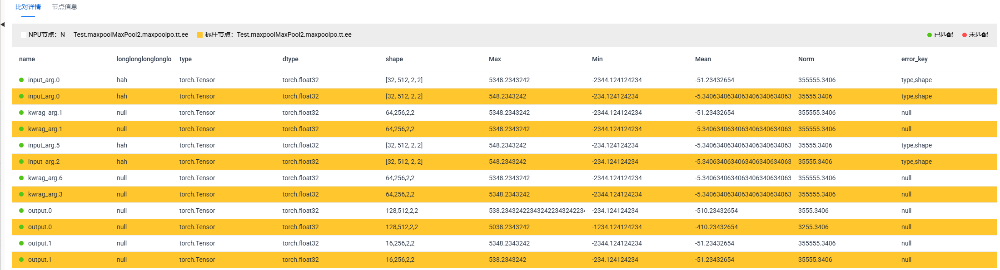
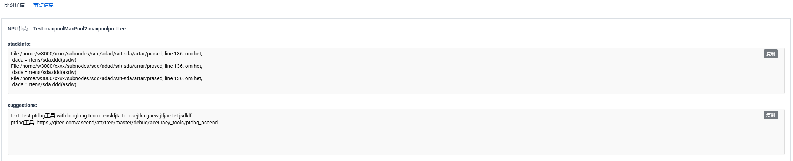

# tb-graph-ascend

### 介绍

此工具是将模型结构进行分级可视化展示的 Tensorboard 插件。可将模型的层级关系、精度性能数据进行可视化，并支持将调试模型和标杆模型进行分视图展示和关联比对，方便用户快速定位精度问题。

### 快速安装说明

- 相关依赖：

  `python >= 3.7 ，tensorboard >= 2.11.2，numpy <= 1.26.3`

- 安装方式

  1. pip 安装（推荐）

  - 现本插件已经上传到 pypi 社区，用户可在 python 环境下直接通过以下 pip 指令进行安装：
    ```
    pip install tb-graph-ascend
    ```
  - 也可在 pypi 社区上下载离线 whl 包，传输到无法访问公网的环境上离线安装使用。访问[下载链接](https://pypi.org/project/tb-graph-ascend/#files)选择 whl 包进行下载，之后便可使用指令安装（此处{version}为 whl 包实际版本）
    ```
    pip install tb-graph_ascend_{version}-py3-none-any.whl
    ```

  2. 从源代码安装

     - 从仓库下载源码并切换到 poc 分支:

       ```
       git clone https://gitee.com/ascend/mstt.git -b poc
       ```

     - 进入目录 `plugins/tensorboard-plugins/tb_graph_ascend` 下
     - 编译前端代码，根据操作系统选取不同指令

       ```
       cd fe
       // Windows系统
       npm run buildWin
       // 其他可使用cp指令的系统，如Linux或Mac
       npm run buildLinux
       ```

       **注意**: 此步骤需要安装 Node.js 环境

     - 回到上级目录直接安装:
       ```
       cd ../
       python setup.py develop
       ```
     - 或： 构建 whl 包安装
       ```
       python setup.py bdist_wheel
       ```
       在 `plugins/tensorboard-plugins/tb_graph_ascend/dist` 目录下取出 whl 包，使用以下指令安装（此处{version}为 whl 包实际版本）
       ```
       pip install tb-graph_ascend_{version}-py3-none-any.whl
       ```

### 解析数据说明

- 准备数据

  将通过[msprobe](https://gitee.com/ascend/mstt/tree/master/debug/accuracy_tools/msprobe#10-%E5%88%86%E7%BA%A7%E5%8F%AF%E8%A7%86%E5%8C%96%E6%9E%84%E5%9B%BE%E6%AF%94%E5%AF%B9)工具构图功能采集得到的文件后缀为.vis 的模型结构文件（文件本身为 json 格式）放置于某个文件夹中，路径名称下文称之为 `out_path` \
  E.g. \
  `---output_path` \
  `-----output.vis` \
  `-----output2.vis`

### 启动方式

1. 启动 TensorBoard

   ```
   tensorboard --logdir output_path
   ```

   如果网络浏览器与启动 TensorBoard 的机器不在同一台机器上，则需要在尾部加上`--bind_all`命令，如：

   ```
   tensorboard --logdir output_path --bind_all
   ```

   注意：确保默认端口 6006 对浏览器的主机打开。

   如果需要切换端口号需要在尾部加上指定的端口号，如`--port=6007`

   ```
   tensorboard --logdir output_path --port=6007
   ```

2. 在浏览器上打开 tensorboard

   在浏览器中打开 URL： `http://localhost:6006`。
   如果 tensorboard 启动命令使用`--bind_all`, 则需将主机名由`localhost`替换为主机的 ip 地址。

   注意：如果`--logdir` 指定目录下的文件太大或太多，请等候，刷新浏览器查看加载结果。

### 前端主体

#### 页面展示说明

① 设置栏
② 图例
③ 图结构
④ 节点信息和比对详情
⑤ 缩略图


#### 操作方式：

1. 节点双击打开，单击选中。
2. 选中的节点边框呈现蓝色，比对场景下若其存在对应节点，则对应节点边框为浅蓝色
3. 键盘 WS 根据鼠标位置放大缩小，AD 左右移动，
4. 鼠标滚轮上下移动，鼠标可拖动页面
5. 比对场景鼠标右键可选中节点，并可展开至对应侧的节点并选中

### 设置栏

#### 1.设置


| 字段 | 含义 |
|------|------|
| Fit to screen | 根据浏览器窗口的大小和比例，自动缩放图表，完整显示整个模型结构 |
| Download PNG | 以PNG的形式下载当前展开的模型结构 |
| Run | 模型结构文件所在目录 |
| Tag | 模型结构文件名称 |
| MicroStep | 展示模型结构文件某个MicroStep（若未按MicroStep采集则不会出现） |
| Step | 展示模型结构文件某个Step（若未按Step采集则不会出现） |
| 节点搜索 | 通过节点名称快速定位到节点，支持模糊搜索，括号内显示某侧节点总数 |
| 数据侧 | 选择在调试侧或标杆侧搜索节点节点 |

#### 2.目录



1. 目录中的节点名称、层级信息、颜色、是否可以展开与图中的对应节点一致。

2. 若存在箭头则代表节点可展开，若不存在则代表其不存在子节点。

3. 单击目录中的节点时，若可以展开，则图中相应的节点会展开并被选中，否则仅选中。

4. 单击目录中已展开的节点时，目录和图中的结构都会收缩，若图中结构已经收缩，则仅选中。

5. 如果图中该节点已经展开，则仅会选中该节点，而不会收缩。

#### 3.精度筛选


| 字段             | 含义                                                                                                                               |
| ---------------- | ---------------------------------------------------------------------------------------------------------------------------------- |
| 精度筛选         | 勾选想要查看的颜色，可得到筛选后的节点列表，鼠标点击列表中节点名称，图自动展开到指定节点（仅展示叶子节点，展示顺序按 dump 时间序） |
| 标杆侧未匹配节点（比对场景特有） | 展示标杆侧未匹配节点，可通过列表或搜索上/下一个按钮来切换展示的节点                                                                |

#### 4.匹配（比对场景特有）


| 功能       | 说明                                                                                                                                                                      |
| ---------- | ------------------------------------------------------------------------------------------------------------------------------------------------------------------------------- |
| 保存 | 匹配过程中，所有的操作只会在内存中进行，并不会持久化到文件中，因此匹配结束后需要点击保存按钮，将操作后数据更新到文件中，否则下次刷新页面，之前的操作将不会保留 
| 未匹配节点 | 会展示 NPU 侧和标杆侧的未匹配节点，点击列表节点会自动展开至对应层并选中该节，点击图中选中未匹配节点也会在列表自动选中                                                                       |
| 点击匹配   | 根据数据模式（md5 模式/统计值模式/tensor 模式）对未匹配两侧的各一个节点进行匹配，若不能匹配则给出原因，若能匹配成功则该对节点移入已匹配节点中，匹配结果将在原始文件中持久化记录 |
| 已匹配节点 | 展示已匹配成功节点，点击列表节点会自动展开至对应层并选中该节点，并且会在另个列表中自动选中对应的节点                                                                                  |
| 取消匹配   | 将两个节点的所有属性还原至未匹配之前的状态，匹配列表中也会减去这两个节点                                                                                                        |


#### 5.图例

##### 5.1节点图例



| 图例名称                       | 说明                                          |
| ------------------------------ | --------------------------------------------- |
| Module or Operators            | 模块或者计算单元                              |
| Unexpanded Module or Operators | 无法展开的模块或者计算单元                    |
| Api List                       | 模块间游离的 API 的集合，只会在首层节点中出现 |

##### 5.2颜色图例:



展示颜色及对应的精度区间，支持用户自定义配置，若未配置则使用默认配置，用户可自定义配置颜色区间和颜色。



点击齿轮图标可进入配置界面，点击**添加区间**按钮可增加区间，点击某条配置后的减号按钮可删除此区间，最大支持配置5个区间，区间可选择颜色和输入精度区间范围。配置完成后点击确认即可全局生效，且该配置会对同目录下其他同次采集生成的模型结构文件生效。

### 图结构

#### 1.模型层级结构

图中结构为模型层级结构，为顺序执行序，顺序为从上到下，从左到右 
* 若为对比图，节点的颜色代表这个节点的精度误差 
* 节点单击选中，展示节点信息，若可展开双击展开，右键若为对比图可进行跳转功能

#### 2.缩略图

展示整个模型计算图的缩略图和当前视窗所在位置，可以通过在缩率图中点击和拖动视窗快速查看模型的不同部分。

### 信息栏
用户鼠标放在分割线，鼠标变为可拖拽标识，按下鼠标移动可以改变信息栏高度，方便用户查看节点信息

#### 1.节点详情
对于单图构建，以表格的形式展示模型中各节点在目标侧的input和output参数信息。

#### 2.比对详情
对于多图比较，以表格的形式展示模型中各节点在目标侧和标杆侧的input和output参数信息，使用不同的颜色区分目标节点和匹配节点数据，如果不存在匹配节点，则只展示当前选中节点数据。

采用从前到后的顺序匹配策略，对于已经匹配的数据，目标节点和匹配节点的数据间隔展示，表格第一列添加绿色标识，如果目标侧节点数据和匹配侧节点数据长度不一致，则会存在未匹配的数据，未匹配的数据会以红色标识，并且全量添加到表格尾部，方便用户查看。

表头支持横向拖拽，更改每一列的宽度，方便查看过长的数据，鼠标悬停也会展示全部数据，方便用户查看。

 

##### 3.节点信息
展示除了input和output以外的信息，目前主要用来展示节点的stackInfo数据，表格共两列分别展示目标侧和匹配侧的stackInfo数据，如果不存在匹配节点，则只展示当前选中节点的数据，对于stackInfo数据支持一键复制，方便用户在其他编辑器查看数据。表头支持横向拖拽，更改每一列的宽度，方便用户查看过长的数据。

 

### 附录

[公网地址说明](./doc/公网地址说明.csv)

