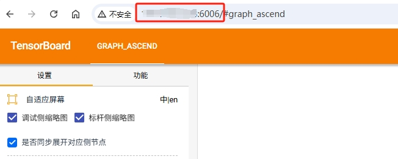
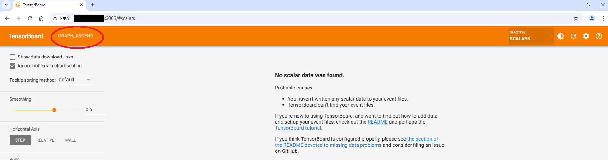
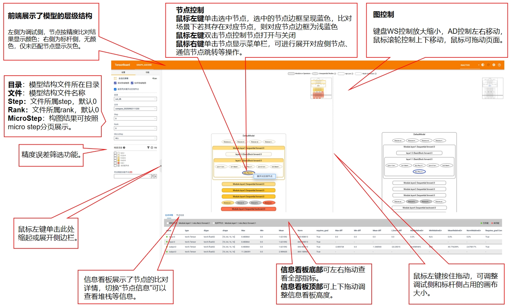
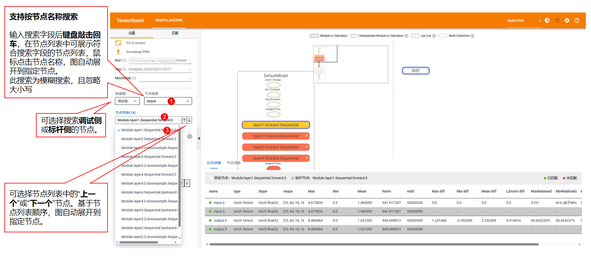
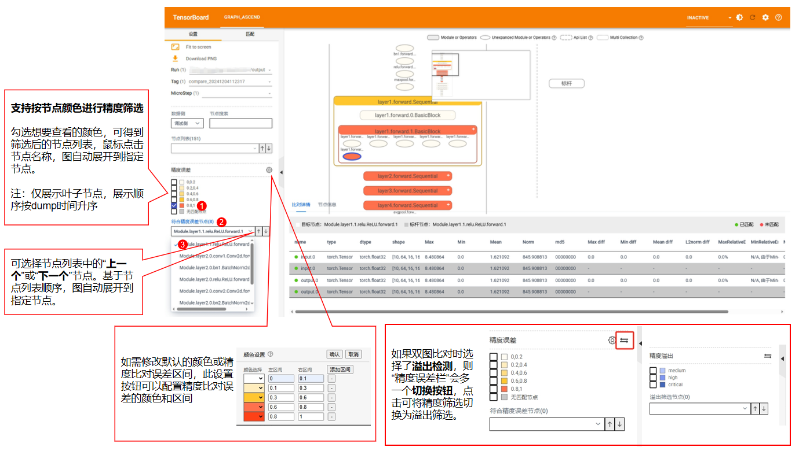
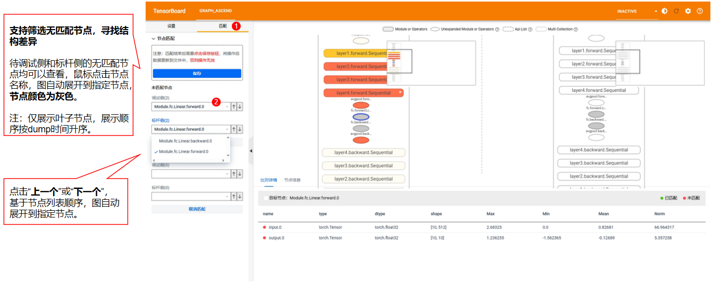
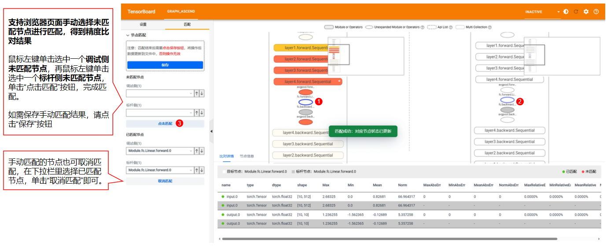
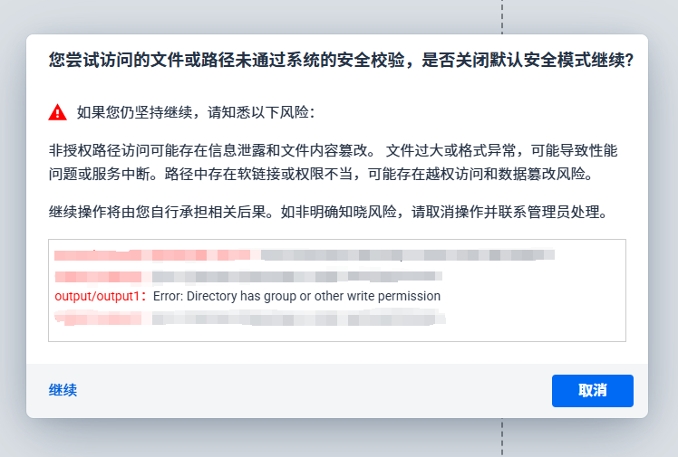

# tb-graph-ascend

## 一、 介绍

此工具是将模型结构进行分级可视化展示的 Tensorboard 插件。可将模型的层级关系、精度数据进行可视化，并支持将调试模型和标杆模型进行分视图展示和关联比对，方便用户快速定位精度问题。

## 二、快速安装

### 1. 相关依赖

`python >= 3.8 ，tensorboard >= 2.11.2

### 2. 安装方式

#### 2.1 pip 安装（推荐）

- 现本插件已经上传到 pypi 社区，用户可在 python 环境下直接通过以下 pip 指令进行安装：
  ```
  pip install tb-graph-ascend
  ```
- 也可在 pypi 社区上下载离线 whl 包，传输到无法访问公网的环境上离线安装使用。访问[下载链接](https://pypi.org/project/tb-graph-ascend/#files)选择 whl 包进行下载，之后便可使用指令安装（此处{version}为 whl 包实际版本）
  ```
  pip install tb-graph_ascend_{version}-py3-none-any.whl
  ```

#### 2.2 从源代码安装

1. 从仓库下载源码并切换到 master 分支:

   ```
   git clone https://gitcode.com/Ascend/mstt.git -b master
   ```

2. 进入目录 `plugins/tensorboard-plugins/tb_graph_ascend` 下
3. 编译前端代码，根据操作系统选取不同指令

   ```
   cd fe
   // 安装前端依赖
   npm install --force
   // Windows系统
   npm run buildWin
   // 其他可使用cp指令的系统，如Linux或Mac
   npm run buildLinux
   ```

   **注意**: 此步骤需要安装 [Node.js](https://nodejs.org/zh-cn/download) 环境

4. 回到上级目录直接安装:
   ```
   cd ../
   python setup.py develop
   ```

- 或： 构建 whl 包安装 用户应确保在安全的环境下进行whl包的构建
  ```
  python secure_build.py
  ```
  在 `plugins/tensorboard-plugins/tb_graph_ascend/dist` 目录下取出 whl 包，使用以下指令安装（此处{version}为 whl 包实际版本）
  ```
  pip install tb-graph_ascend_{version}-py3-none-any.whl
  ```

### 3. 解析数据说明

将通过[msprobe](https://gitcode.com/Ascend/mstt/blob/master/debug/accuracy_tools/msprobe/README.md#3-%E5%88%86%E7%BA%A7%E5%8F%AF%E8%A7%86%E5%8C%96%E6%9E%84%E5%9B%BE%E6%AF%94%E5%AF%B9)工具构图功能采集得到的文件后缀为.vis.db 的模型结构文件放置于某个文件夹中，路径名称下文称之为 `output_path`

图构建：

```
├── output_path
|    ├── build_{timestamp}.vis.db
```

图比对：

```
├── output_path
|    ├── compare_{timestamp}.vis.db
```

## 4.启动 tensorboard

### 4.1 可直连的服务器

将生成 vis 文件的路径**out_path**传入--logdir

```
tensorboard --logdir out_path --bind_all --port [可选，端口号]
```

启动后会打印日志:


ubuntu 是机器地址，6008 是端口号。

**注意，ubuntu 需要替换为真实的服务器地址，例如真实的服务器地址为 10.123.456.78，则需要在浏览器窗口输入http://10.123.456.78:6008**

### 4.2 不可直连的服务器

**如果链接打不开，可以尝试以下方法，选择其一即可：**

1.本地电脑网络手动设置代理，例如 Windows10 系统，在【手动设置代理】中添加服务器地址（例如 10.123.456.78）


然后，在服务器中输入：

```
tensorboard --logdir out_path --bind_all --port 6008[可选，端口号]
```

最后，在浏览器窗口输入http://10.123.456.78:6008

**注意，如果当前服务器开启了防火墙，则此方法无效，需要关闭防火墙，或者尝试后续方法**

2.或者使用 vscode 连接服务器，在 vscode 终端输入：

```
tensorboard --logdir out_path
```


按住 CTRL 点击链接即可

3.或者将构图结果件 vis 文件从服务器传输至本地电脑，在本地电脑中安装 tb_graph_ascend 插件查看构图结果

电脑终端输入：

```
tensorboard --logdir out_path
```

按住 CTRL 点击链接即可

## 5.浏览器查看

### 5.1 浏览器打开图

推荐使用谷歌浏览器，在浏览器中输入机器地址+端口号回车，出现 TensorBoard 页面，其中/#graph_ascend 会自动拼接。



如果您切换了 TensorBoard 的其他功能，此时想回到模型分级可视化页面，可以点击左上方的**GRAPH_ASCEND**



### 5.2 查看图



MicroStep 是指在一次完整的权重更新前执行的多次前向和反向传播过程，一次完整的训练迭代（step）可以进一步细分为多个更小的步骤（micro step）。其中分级可视化工具通过识别模型首层结构中一次完整的前反向作为一次 micro step。

### 5.3 名称搜索



### 5.4 精度筛选



### 5.5 未匹配节点筛选

不符合匹配规则的节点为无匹配节点，颜色标灰。适用于排查两个模型结构差异的场景。



### 5.6 手动选择节点匹配

可通过浏览器界面，通过鼠标选择两个待匹配的灰色节点进行匹配。当前暂不支持真实数据模式。



## 6.图比对说明

### 6.1 颜色

颜色越深，精度比对差异越大，越可疑，具体信息可见浏览器页面左下角颜色图例。

#### 6.1.1 真实数据模式

节点中所有输入的最小双千指标和所有输出的最小双千分之一指标的差值，反映了双千指标的下降情况，**该数值越大，表明两组模型的精度差异越大，在图中标注的对应颜色会更深**。

`One Thousandth Err Ratio（双千分之一）精度指标：Tensor中的元素逐个与对应的标杆数据对比，相对误差小于千分之一的比例占总元素个数的比例，比例越接近1越好`

如果调试侧（NPU）节点的 output 指标中的最大值（MAX）或最小值（MIN）中存在 nan/inf/-inf，直接标记为最深颜色。

#### 6.1.2 统计信息模式

节点中输出的统计量相对误差，**该数值越大，表明两组模型的精度差异越大，在图中标注的对应颜色会更深**。

`相对误差：abs（(npu统计值 - bench统计值) / bench统计值)`

如果调试侧（NPU）节点的 output 指标中的最大值（MAX）或最小值（MIN）中存在 nan/inf/-inf，直接标记为最深颜色。

#### 6.1.3 md5 模式

节点中任意输入输出的 md5 值不同。

### 6.2 指标说明

精度比对从三个层面评估 API 的精度，依次是：真实数据模式、统计数据模式和 MD5 模式。比对结果分别有不同的指标。

**公共指标**：

- name: 参数名称，例如 input.0
- type: 类型，例如 torch.Tensor
- dtype: 数据类型，例如 torch.float32
- shape: 张量形状，例如[32, 1, 32]
- Max: 最大值
- Min: 最小值
- Mean: 平均值
- Norm: L2-范数

**真实数据模式指标**：

- Cosine: tensor 余弦相似度
- EucDist: tensor 欧式距离
- MaxAbsErr: tensor 最大绝对误差
- MaxRelativeErr: tensor 最大相对误差
- One Thousandth Err Ratio: tensor 相对误差小于千分之一的比例（双千分之一）
- Five Thousandth Err Ratio: tensor 相对误差小于千分之五的比例（双千分之五）

**统计数据模式指标**

- (Max, Min, Mean, Norm) diff: 统计量绝对误差
- (Max, Min, Mean, Norm) RelativeErr: 统计量相对误差

**MD5 模式指标**

- md5: CRC-32 值

## 四、附录

### 4.1 安全加固建议

#### 4.1.1 免责声明

本工具为基于 TensorBoard 底座开发的插件，使用本插件需要基于 TensorBoard 运行，请自行关注 TensorBoard 相关安全配置和安全风险。

打开本工具时，本工具会对 logdir 目录下的 vis 文件以及其父目录进行安全检查，如果存在安全风险，本工具会展示如下提示信息，询问用户是否继续执行，用户选择继续执行后，可以操作未通过安全检查的文件和目录，用户需要自行承担操作风险。如果用户选择不继续执行，则用户只能操作通过安全检查的文件。



#### 4.1.2 TensorBoard 版本说明

满足[相关依赖](#1-相关依赖)中要求的 TensorBoard 版本皆可正常使用本插件功能，但为 TensorBoard 本身安全风险考虑，建议使用最新版本 TensorBoard 。

#### 4.1.3 远程查看数据

如果网络浏览器与启动 TensorBoard 的机器不在同一台机器上， TensorBoard 提供了远程查看数据的指令启动方式，但此种方式会将服务器对应端口在局域网内公开（全零监听），请用户自行关注安全风险。

- 在启动指令尾部加上`--bind_all`或`--host={服务器IP}`参数启用远程查看方式，如：

```

tensorboard --logdir output_path --port=6006 --host=xxx.xxx.xxx.xxx
或
tensorboard --logdir output_path --port=6006 --bind_all

```

- 在打开浏览器访问界面时，需将 URL 内主机名由`localhost`替换为主机的 ip 地址，如`http://xxx.xxx.xxx.xxx:6006`

### 4.2 通信矩阵

| 序号 | 代码仓              | 功能                       | 源设备                          | 源 IP                              | 源端口 | 目的设备                 | 目的 IP                         | 目的端口<br/>（侦听） | 协议 | 端口说明             | 端口配置 | 侦听端口是否可更改 | 所属平面 | 版本     | 特殊场景 | 备注 |
| :--- | :------------------ | :------------------------- | :------------------------------ | :--------------------------------- | :----- | :----------------------- | :------------------------------ | :-------------------- | :--- | :------------------- | :------- | :----------------- | :------- | :------- | :------- | :--- |
| 1    | tensorboard-plugins | TensorBoard 底座前后端通信 | 访问 TensorBoard 浏览器所在机器 | 访问 TensorBoard 浏览器所在机器 ip |        | TensorBoard 服务所在机器 | TensorBoard 服务所在服务器的 ip | 6006                  | HTTP | tensorboard 服务通信 | `--port` | 可修改             | 业务面   | 所有版本 | 无       |      |

### 4.3 公网地址说明

[公网地址说明](./doc/公网地址说明.csv)
