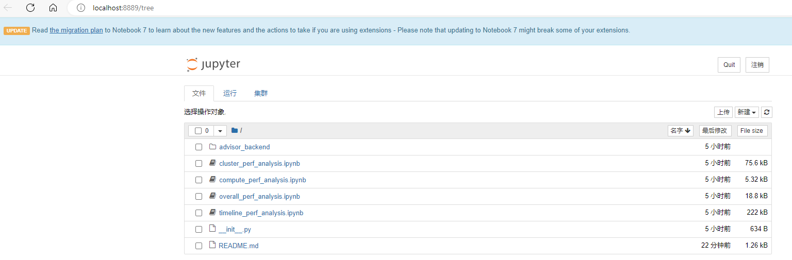

# advisor

msprof-analyze的advisor功能是将Ascend PyTorch Profiler或者msprof采集的PyThon场景性能数据进行分析，并输出性能调优建议（当前暂不支持对db格式文件分析）。

## 工具使用（命令行方式方式）

1. 参见《[性能工具](../README.md)》完成工具安装。建议安装最新版本。

2. 执行分析。

   - 总体性能瓶颈

     ```bash
     msprof-analyze advisor all -d [待分析性能数据文件所在路径] -bp [基准性能数据文件所在路径]
     ```

   - 计算瓶颈

     ```bash
     msprof-analyze advisor computation -d [待分析性能数据文件所在路径]
     ```

   - 调度瓶颈

     ```bash
     msprof-analyze advisor schedule -d [待分析性能数据文件所在路径]
     ```


   -d（必选）：待分析性能数据文件所在路径。

   -bp（可选）：基准性能数据文件所在路径。

   单卡场景需要指定到性能数据文件`*_ascend_pt`目录；多卡或集群场景需要指定到`*_ascend_pt`目录的父目录层级。

3. 查看结果。

   分析结果打屏展示并生成html和csv文件。

## 工具使用（Jupyter Notebook方式）

Jupyter Notebook使用方式如下：

下列以Windows环境下执行为例介绍。

1. 在环境下安装Jupyter Notebook工具。

   ```bash
   pip install jupyter notebook
   ```

   Jupyter Notebook工具的具体安装和使用指导请至Jupyter Notebook工具官网查找。

2. 在环境下安装ATT工具。

   ```
   git clone https://gitee.com/ascend/att.git
   ```

   安装环境下保存Ascend PyTorch Profiler采集的性能数据。

3. 进入att\profiler\advisor目录执行如下命令启动Jupyter Notebook工具。

   ```bash
   jupyter notebook
   ```

   执行成功则自动启动浏览器读取att\profiler\advisor目录，如下示例：

   

   若在Linux环境下则回显打印URL地址，即是打开Jupyter Notebook工具页面的地址，需要复制URL，并使用浏览器访问（若为远端服务器则需要将域名“**localhost**”替换为远端服务器的IP），进入Jupyter Notebook工具页面。

4. 每个.ipynb文件为一项性能数据分析任务，选择需要的.ipynb打开，并在*_path参数下拷贝保存Ascend PyTorch Profiler采集的性能数据的路径。如下示例：

   

5. 单击运行按钮执行性能数据分析。

   分析结果详细内容会在.ipynb页面下展示。
