# advisor

msprof-analyze的advisor功能是将Ascend PyTorch Profiler或者msprof采集的PyThon场景性能数据进行分析，并输出性能调优建议（当前暂不支持对db格式文件分析）。

性能数据采集方法请参见《[性能分析工具](https://www.hiascend.com/document/detail/zh/mindstudio/70RC1/mscommandtoolug/mscommandug/atlasprofiling_16_0001.html)》。

## 工具使用（命令行方式方式）

### 操作步骤

1. 参见《[性能工具](../README.md)》完成工具安装。建议安装最新版本。

2. 执行分析。

   - 总体性能瓶颈

     ```bash
     msprof-analyze advisor all -d $HOME/profiling_data/
     ```

   - 计算瓶颈

     ```bash
     msprof-analyze advisor computation -d $HOME/profiling_data/
     ```

   - 调度瓶颈

     ```bash
     msprof-analyze advisor schedule -d $HOME/profiling_data/
     ```

   以上命令更多参数介绍请参见“**命令详解**”。

   单卡场景需要指定到性能数据文件`*_ascend_pt`目录；多卡或集群场景需要指定到`*_ascend_pt`目录的父目录层级。

3. 查看结果。

   分析结果输出相关简略建议到执行终端中，并生成`mstt_advisor_{timestamp}.html`和`mstt_advisor_{timestamp}.xlsx`文件供用户预览。
   
   `mstt_advisor_{timestamp}.xlsx`文件内容与执行终端输出一致。
   
   `mstt_advisor_{timestamp}.html`文件分析详见“**报告解析**”。
   
   执行终端输出示例如下：
   
   总体性能瓶颈
   
   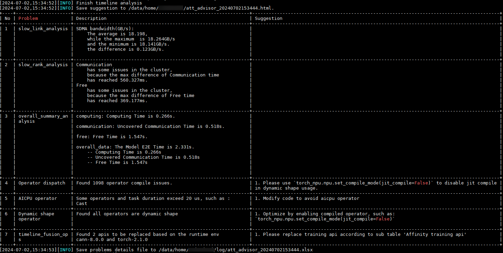
   
   计算瓶颈
   
   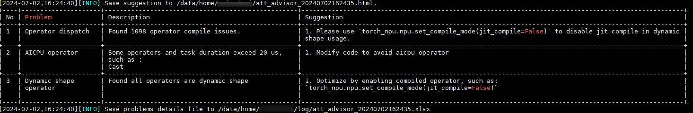
   
   调度瓶颈
   
   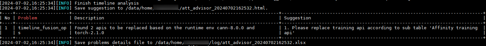
   
   

### 命令详解

#### 命令功能介绍

| dimension  | mode                                  | 参数释义                             |
| ---------- |---------------------------------------| ------------------------------------ |
| overall    | overall_summary                       | 计算、通信、空闲等维度对性能数据进行拆解 |
| cluster    | slow_rank                             | 慢卡识别                             |
|            | slow_link                             | 慢链路识别                           |
|            | communication_retransmission_analysis |通信重传检测                          |
| computing  | aicpu                                 | AI CPU调优                           |
|            | dynamic_shape_analysis                | 识别动态Shape算子                    |
|            | block_dim_analysis                    | block dim算子调优                    |
|            | operator_no_bound_analysis            | operator no bound                    |
|            | graph                                 | 融合算子图调优                        |
|            | freq_analysis                         | AI Core算子降频分析                  |
|communication| packet_analysis                       |通信小包检测                          |
| scheduling | timeline_fusion_ops                   | 亲和API替换调优                      |
|            | timeline_op_dispatch                  | 识别算子下发问题(路径3/路径5)            |

- all

  总体性能瓶颈：包含上表中所有功能。

- computation

  计算瓶颈：包含上表中computing功能。

- schedule

  调度瓶颈：包含上表中scheduling功能。

#### 命令格式

- 总体性能瓶颈

  ```bash
  msprof-analyze advisor all -d {profiling_path} [-bp benchmark_profiling_path] [-cv cann_version] [-tv torch_version] [-pt profiling_type] [--debug] [-h]
  ```

- 计算瓶颈

  ```bash
  msprof-analyze advisor computation -d {profiling_path} [-cv cann_version] [-tv torch_version] [-pt profiling_type] [--debug] [-h]
  ```

- 调度瓶颈

  ```bash
  msprof-analyze advisor schedule -d {profiling_path} [-cv cann_version] [-tv torch_version] [--debug] [-h]
  ```

#### 参数介绍

| 参数                               | 说明                                                         | 是否必选 |
| ---------------------------------- | ------------------------------------------------------------ | -------- |
| -d<br>--profiling_path             | 性能数据文件或目录所在路径，Ascend PyTorch Profiler采集场景指定为`*_ascend_pt`性能数据结果目录，其他场景指定为`PROF_XXX`性能数据结果目录。建议通过Ascend PyTorch Profiler获取性能数据。<br/>advisor依赖Profiling工具解析后的timeline数据（.json）、summary（.csv）数据以及info.json*文件，请确保指定的“profiling_path”目录下存在以上文件。 | 是       |
| -bp<br/>--benchmark_profiling_path | 基准性能数据所在目录，用于性能比对。性能数据通过Profiling工具采集获取。<br>**computation和schedule不支持该参数。** | 否       |
| -cv<br/>--cann_version             | 使用Profiling工具采集时对应的CANN软件版本，可通过在环境中执行如下命令获取其version字段，目前配套的兼容版本为“6.3.RC2”，“7.0.RC1”、“7.0.0”、“8.0.RC1”，此字段不填默认按“8.0.RC1”版本数据进行处理，其余版本采集的Profiling数据在分析时可能会导致不可知问题：`cat /usr/local/Ascend/ascend-toolkit/latest/aarch64-linux/ascend_toolkit_install.info` | 否       |
| -tv<br/>--torch_version            | 运行环境的torch版本，默认为1.11.0，支持torch1.11.0和torch2.1.0，当运行环境torch版本为其他版本如torch1.11.3时，可以忽略小版本号差异选择相近的torch版本如1.11.0。 | 否       |
| -pt<br/>--profiling_type           | 配置性能数据采集使用的Profiling工具类型。可取值：<br>        ascend_pytorch_profiler：使用Ascend PyThon Profiler接口方式采集的性能数据时配置，默认值。<br/>        msprof：使用msprof命令行方式采集的性能数据时配置。功能完善中，暂不建议使用。<br/>        mslite：使用[Benchmark](https://gitee.com/ascend/tools/tree/master/ais-bench_workload/tool/ais_bench)工具采集的性能数据时配置。不建议使用。<br>**schedule不支持该参数。** | 否       |
| --debug                            | 工具执行报错时可打开此开关，将会展示详细保存堆栈信息。       | 否       |
| -h，-H<br/>--help                  | 在需要查询当前命令附属子命令或相关参数时，给出帮助建议。     | 否       |

### 报告解析

如下图所示，工具会从集群、单卡性能拆解、调度和计算等维度进行问题诊断并给出相应的调优建议。

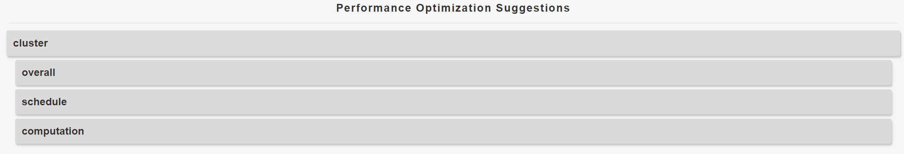

cluster模块的分析
1. 包含快慢卡和快慢链路分析，仅识别问题，不提供调优建议。
2. 通信重传检测分析，识别发生重传的通信域并提供调优建议。  
如下图示例，识别到当前训练任务的通信和下发（free较多说明存在任务下发存在问题）存在问题。

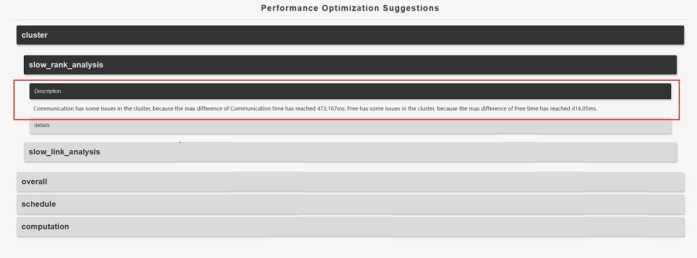
如下图所示，识别到当前训练任务存在通信重传问题，并提供调优建议
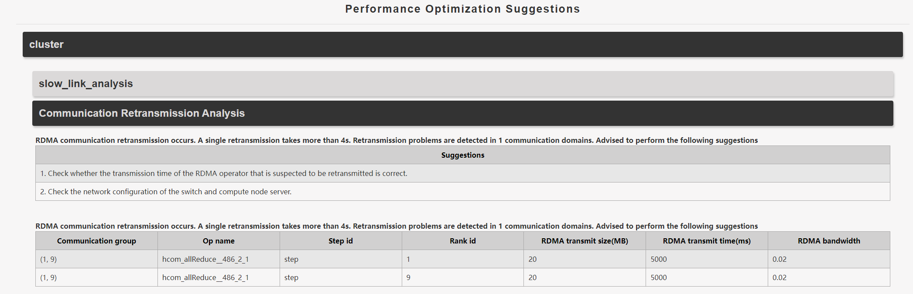
overall模块的分析包含当前训练任务慢卡的性能拆解，按照计算、通信和下发三个维度进行耗时的统计，可以基于该分析识别到训练性能瓶颈是计算、通信还是下发问题，同样不提供调优建议。

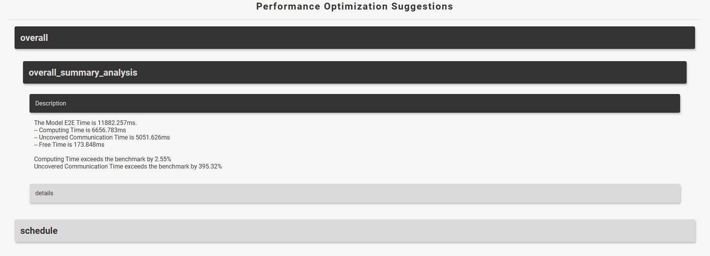

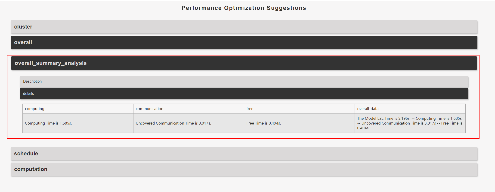

schedule模块包含亲和API、aclOpCompile、syncBatchNorm、SynchronizeStream等多项检测。
如下图示例，Operator Dispatch Issues提示需要在运行脚本的最开头添加如下代码用于消除aclOpCompile：

```python
torch_npu.npu.set_compile_mode(jit_compile=False);
torch_npu.npu.config.allow_internal_format = False
```

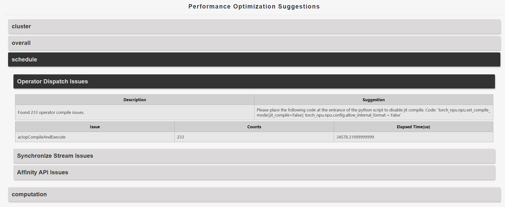

如下图示例，Synchronize Stream Issues提示存在耗时较多的同步流，并给出触发同步流的堆栈，需要根据堆栈来修改对应代码消除同步流。

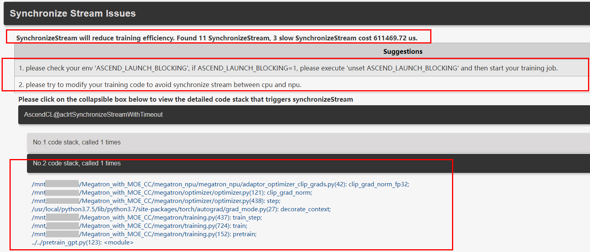

如下图示例，Affinity API Issues提示存在可以替换的亲和API并给出对应的堆栈，用户可以根据堆栈找到需要修改的代码，并给出修改案例（API instruction超链接）。

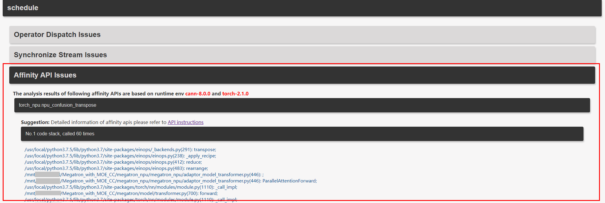

computation模块从device计算性能维度进行分析，能够识别AI CPU、计算bound、动态Shape、AI Core算子降频分析等问题并给出相应建议。此处不再详细展开，按照报告进行调优即可。

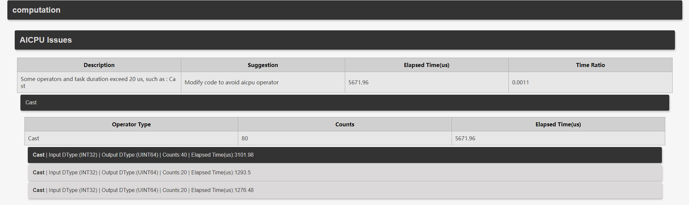

communication模块从通信维度进行分析，目前支持通信小算子检测。
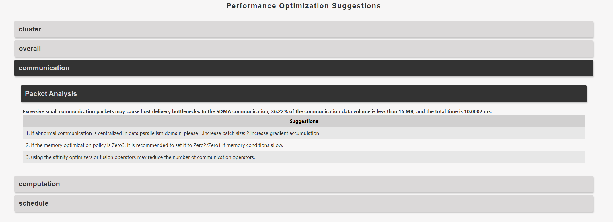

## 工具使用（Jupyter Notebook方式）

Jupyter Notebook使用方式如下：

下列以Windows环境下执行为例介绍。

1. 在环境下安装Jupyter Notebook工具。

   ```bash
   pip install jupyter notebook
   ```

   Jupyter Notebook工具的具体安装和使用指导请至Jupyter Notebook工具官网查找。

2. 在环境下安装mstt工具。

   ```
   git clone https://gitee.com/ascend/mstt.git
   ```

   安装环境下保存Ascend PyTorch Profiler采集的性能数据。

3. 进入mstt\profiler\advisor目录执行如下命令启动Jupyter Notebook工具。

   ```bash
   jupyter notebook
   ```

   执行成功则自动启动浏览器读取mstt\profiler\advisor目录，如下示例：

   

   若在Linux环境下则回显打印URL地址，即是打开Jupyter Notebook工具页面的地址，需要复制URL，并使用浏览器访问（若为远端服务器则需要将域名“**localhost**”替换为远端服务器的IP），进入Jupyter Notebook工具页面。

4. 每个.ipynb文件为一项性能数据分析任务，选择需要的.ipynb打开，并在*_path参数下拷贝保存Ascend PyTorch Profiler采集的性能数据的路径。如下示例：

   

5. 单击运行按钮执行性能数据分析。

   分析结果详细内容会在.ipynb页面下展示。
