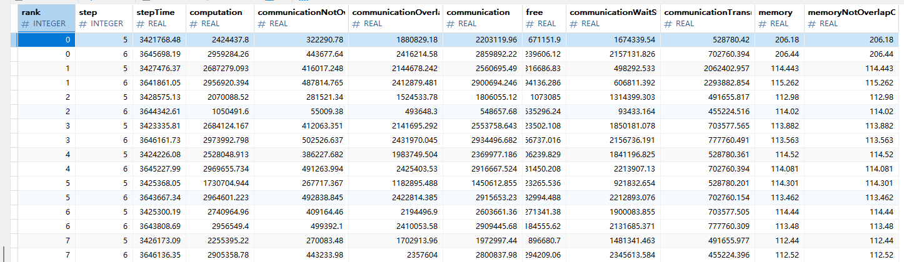

# cluster_time_summary 集群性能数据细粒度拆解

## 背景与挑战
1、 大集群场景涉及多个计算节点，数据量大，单卡维度的性能数据统计与分析不能评估整体集群运行情况。
2、 原有的cluster_step_trace_time。csv交付件没有单独的执行命令，导致用户使用不直观，且不能涵盖内存拷贝等指标项，需要增强。

## 功能介绍

* cluster_time_summary 提供了集群训练过程中迭代耗时拆解，包括计算、通信和内存拷贝等各部分的时间消耗，帮助用户找到性能瓶颈。

**使用方法**

```
msprof-analyze -m cluster_time_summary -d ./cluster_data
```
**参数说明：**  
* `-m`设置为cluster_time_summary 使能集群耗时细粒度拆解能力
* `-d`集群性能数据文件夹路径
* 其余参数：与msprof-analyze参数一致

**输出数据：**  
* 存储位置：cluster_analysis_output/cluster_analysis.db  
* 数据表名：ClusterTimeSummary  


**字段说明：**

| 字段名称                                  | 类型     | 说明                     |
|-------------------------------------------|----------|------------------------|
| rank                                      | INTEGER  | 卡号                     |
| step                                      | INTEGER  | 迭代编号                   |
| stepTime                                  | REAL     | 迭代总耗时                  |
| computation                               | REAL     | NPU上算子的计算总时间           |
| communicationNotOverlapComputation        | REAL     | 未被计算掩盖的通信耗时            |
| communicationOverlapComputation           | REAL     | 计算和通信重叠的时间             |
| communication                            | REAL     | NPU上算子的通信总时间           |
| free                                      | REAL     | 空闲时间，迭代总时间减去计算、通信、拷贝时间 |
| communicationWaitStageTime               | REAL     | 通信中的总等待耗时              |
| communicationTransmitStageTime           | REAL     | 通信中的总传输耗时              |
| memory                                   | REAL     | 拷贝耗时                   |
| memoryNotOverlapComputationCommunication | REAL     | 未被计算、通信掩盖的拷贝耗时         |

备注：表中时间相关字段，统一使用微秒（us）

**输出结果分析：**
* 通过分析计算、通信、内存拷贝、空闲时间占比，找到性能瓶颈。
* 通过比较集群内各卡耗时指标差异，定界性能问题。例如，computing计算耗时波动显著，通常表明存在卡间不同步、计算卡性能不均的情况，而通信传输耗时差异过大时，则需优先排查参数面网络是否存在拥塞或配置异常。
* 配合使用cluster_time_compare_summary功能，可有效定位集群性能劣化根因。